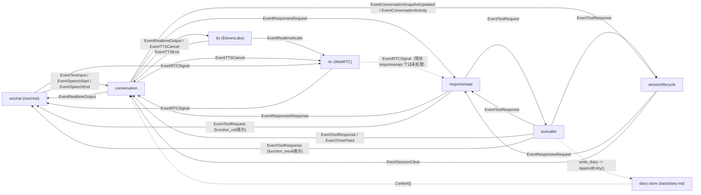

# Smart Speaker (Go) + WebSocket 音声 I/O

補足の設計資料や学習用ドキュメントは `docs/` 配下で管理しています。

## 前提
- Go 1.25 以降
- Node 20 以降（フロント開発用）  
  ※ `npm install` でローカルに Vite が入ります（グローバルインストール不要）

## 環境変数
- `OPENAI_API_KEY`（必須）
- `ELEVENLABS_API_KEY` / `ELEVENLABS_VOICE_ID`（テキスト→音声を ElevenLabs で生成するために必須）
- `ELEVENLABS_MODEL_ID`（任意、デフォルト `eleven_v3`）
- `RTC_ICE_HOST_IPS`（任意、Docker で WebRTC を使う場合にホストIPを指定。カンマ区切り）
- `WEB_DIST_DIR`（任意、フロントの配信ディレクトリ。デフォルト `web/dist`）
- `WS_ADDR`（任意、デフォルト `:8081`。ブラウザとサーバーの音声 WS 用）
- SwitchBot を使う場合: `SWITCHBOT_TOKEN` / `SWITCHBOT_SECRET` / `SWITCHBOT_DEVICE_MAP`
- Google Calendar を使う場合:
  - `GOOGLE_CLIENT_ID`
  - `GOOGLE_CLIENT_SECRET`
  - `GOOGLE_REDIRECT_URL`（任意、デフォルト `http://localhost:8081/oauth/google/callback`）
  - `GOOGLE_OAUTH_SCOPE`（任意、デフォルト `https://www.googleapis.com/auth/calendar.events`）
  - `GOOGLE_OAUTH_TOKEN_PATH`（任意、OAuthトークン保存先。デフォルト `data/google_oauth_token.json`）

## サーバー（Go）起動
```sh
go run ./cmd/smart-speaker
```
デフォルトで `WS_ADDR=:8081` で `/ws/chat` を開きます。OpenAI からはテキストのみ受信し、ElevenLabs TTS（stream-input）で音声生成→ WebRTC で返送します。`ELEVENLABS_API_KEY` / `ELEVENLABS_VOICE_ID` 未設定の場合は起動時にエラーになります。

## Google Calendar OAuth 認証
Google Calendar を利用するには OAuth トークンが必要です。フロントの `Google認証` ボタン、または以下のURLで認証します。

```sh
http://localhost:8081/oauth/google/start
```

認証が完了するとトークンは永続ファイルに保存されます。  
デフォルトの保存先は `data/google_oauth_token.json` です。必要であれば `GOOGLE_OAUTH_TOKEN_PATH` で変更できます。

このトークンファイルを残したままなら、サーバープロセスの再起動・コンテナ再作成・通常のデプロイ後も再認証は不要です。

再認証が必要になるのは主に以下の場合です。
- `data/google_oauth_token.json` を削除した
- `GOOGLE_OAUTH_TOKEN_PATH` を別の空ファイルパスへ変更した
- Google 側で refresh token が失効・取り消しされた

初回認証の流れ:
1. `GOOGLE_CLIENT_ID` / `GOOGLE_CLIENT_SECRET` / `GOOGLE_REDIRECT_URL` を設定する
2. `http://localhost:8081/oauth/google/start` を開いて認証する
3. `data/google_oauth_token.json` が作成されたら完了

（Docker で実行する場合）
1. `docker-compose.yml` で `GOOGLE_CLIENT_ID` / `GOOGLE_CLIENT_SECRET` / `GOOGLE_REDIRECT_URL` を渡す
2. `GOOGLE_REDIRECT_URL` は `http://localhost:8081/oauth/google/callback`（または本番URL）に合わせる
3. `http://localhost:8081/oauth/google/start` にブラウザでアクセスして認証
4. デフォルト設定では `data/google_oauth_token.json` は `/app/data/google_oauth_token.json` として永続化される

## AI PR 自動化
GitHub Actions で issue 作成時に Draft PR を作り、`<AI主導開発>` ラベル付きの PR に対する通常コメントで Codex を起動する簡易自動化を入れています。
初回の依頼文は issue 側の内容を PR コメントに転記し、やりとりの本文は PR コメント、補助メモや一時ファイルは GitHub Artifacts に保存します。

### Codex 認証の更新
CI では `CODEX_AUTH_JSON_B64` を GitHub Secret として使います。認証が切れたら、trusted machine で `codex login` をやり直してから Secret を更新してください。

```sh
AUTH_FILE="${CODEX_HOME:-$HOME/.codex}/auth.json"
base64 < "$AUTH_FILE" | tr -d '\n' | gh secret set CODEX_AUTH_JSON_B64
```

`CODEX_AUTH_JSON_B64` が未設定の場合、AI 実行時に認証未設定のコメントが返ります。

### Codex 用スキルの配置
このリポジトリでは Codex 用スキルを `.codex/skills/` に置き、実行時に `$CODEX_HOME/skills/` へ同期しています。

### Docker（開発）
開発時は `docker-compose.override.yml` を使って `go run` で起動します（コードは bind mount）。

初回のみビルド:
```sh
docker compose build
```
起動（通常はビルド不要）:
```sh
docker compose up
```
依存更新や Dockerfile 更新時だけ `docker compose build` してください。

Docker で WebRTC を使う場合、`RTC_ICE_HOST_IPS` にホストの IP を指定してください。
UDP のポート範囲は 50000-50100 を公開する必要があります。

### Docker（本番）
本番は `runtime` ターゲットのイメージを使います。
```sh
docker compose -f docker-compose.yml up --build
```
`npm run build` で生成される `web/dist` はイメージ内に取り込まれ、Go サーバーが `/` で配信します。

日記は `internal/diary/store.go` を通して `data/diary.md` に永続化されます。  
本番でこのファイルをホスト側に残すため、デプロイ前に以下を実行してください。
```sh
sudo mkdir -p /var/lib/smart-speaker/data
sudo chown root:root /var/lib/smart-speaker/data
sudo chmod 755 /var/lib/smart-speaker/data
```

#### 本番デプロイ（SSH Docker Context）
開発機から SSH 経由で本番サーバーの Docker を操作してデプロイします。
ビルドと起動は本番サーバー側で行われます。

事前準備:
-本番サーバーに SSH と Docker を導入
- 開発機で Docker Context を作成（1回だけ）
  ```sh
  docker context create production --docker "host=ssh://<user>@<本番サーバーのIP>"
  ```

実行手順:
```sh
./scripts/deploy.sh
```

補足:
- `scripts/deploy.sh` は `production` Context を使う前提です
- 環境変数は開発機側の設定が使われます
- ログの確認方法：`docker --context production compose logs -f --tail=200`

### 依存ライブラリ
- Opus エンコード/デコードに libopus / libopusfile を利用します  
  https://github.com/hraban/opus

## フロント（Web）開発
`web` サービスが `npm install` → `npm run dev` を実行します。
```sh
docker compose up web
```
ポートは `http://localhost:5173/` です。依存は `node_modules` ボリュームに保持されます。
ブラウザは getUserMedia のマイク音声を WebRTC でサーバーに送信します。文字起こしはサーバー側で行い、TTS 音声は WebRTC で受信して再生します。

## 構成図（ステージ接続）


- HTTP サーバー起動は `main` が直接担当し、`ServeMux` に `wschat` と Web UI をぶら下げる
- `rtc` が WebRTC 音声入出力（TTS 再生用）を担当
- 文字起こしはサーバー側で実施
- diary は generic な shared state ではなく、`internal/diary/store.go` が担当する

## diary の永続化
- `conversation` は system context 付与時に `diary store` から diary 本文を読む
- `write_diary` ツールは `diary store` に追記する
- `main` で `diary store` を 1 回生成し、`conversation` と `write_diary` の両方に注入する
- 旧 `internal/state` パッケージは削除済み

### チャット用 WebSocket
- エンドポイント: `ws://<WS_ADDR>/ws/chat`
- 配信内容（例）:
  - 人間/AI: `{"type":"message","role":"user|assistant|system","text":"...","response_id":"...","final":false}`
  - Function Call: `{"type":"function_call","tool_call_id":"...","name":"...","arguments":{...}}`
  - Function Result: `{"type":"function_result","tool_call_id":"...","output":{...}}`
  - WebRTC offer/answer/ice: `{"type":"webrtc.offer|webrtc.answer|webrtc.ice","sdp":"...","candidate":{...}}`

## 備考
- 旧 PortAudio ベースのマイク/再生は WS 入出力に置き換え済みです
- ハウリング対策は getUserMedia の `echoCancellation` を利用します  
  https://developer.mozilla.org/en-US/docs/Web/API/MediaTrackConstraints/echoCancellation
