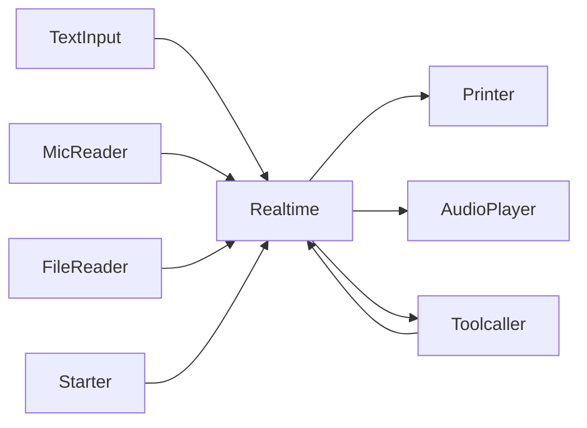

## 開発環境構築手順

```sh
brew install portaudio
```

## 実行方法

```sh
go run ./cmd/smart-speaker
```

## コンポーネント構成



## SwitchBot 連携設定

SwitchBot のクラウド API を使う場合は以下の環境変数を設定してください。

- `SWITCHBOT_TOKEN`: SwitchBot アプリから取得したトークン
- `SWITCHBOT_SECRET`: SwitchBot アプリから取得したシークレット
- `SWITCHBOT_DEVICE_MAP` (任意): 操作しやすいエイリアス名とデバイス ID のマッピングを JSON で指定します
  例: `{\"living_light\":\"01-202201010000-12345678\",\"ac\":\"01-202201010000-87654321\"}`

Realtime API の function calling から `switchbot_control_device` が呼ばれると、これらの情報を用いて SwitchBot API にコマンドを送信します。
