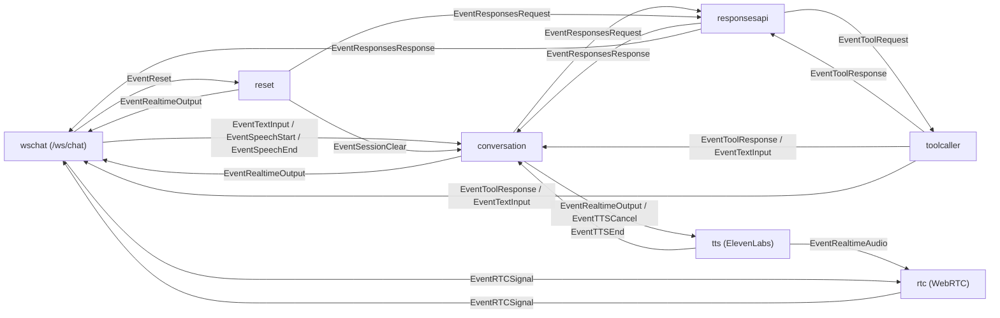

# Smart Speaker (Go) + WebSocket 音声 I/O

## 前提
- Go 1.24 以降
- Node 20 以降（フロント開発用）  
  ※ `npm install` でローカルに Vite が入ります（グローバルインストール不要）

## 環境変数
- `OPENAI_API_KEY`（必須）
- `ELEVENLABS_API_KEY` / `ELEVENLABS_VOICE_ID`（テキスト→音声を ElevenLabs で生成するために必須）
- `ELEVENLABS_MODEL_ID`（任意、デフォルト `eleven_v3`）
- `RTC_ICE_HOST_IPS`（任意、Docker で WebRTC を使う場合にホストIPを指定。カンマ区切り）
- `WEB_DIST_DIR`（任意、フロントの配信ディレクトリ。デフォルト `web/dist`）
- `WS_ADDR`（任意、デフォルト `:8081`。ブラウザとサーバーの音声 WS 用）
- SwitchBot を使う場合: `SWITCHBOT_TOKEN` / `SWITCHBOT_SECRET` / `SWITCHBOT_DEVICE_MAP`
- Google Calendar を使う場合:
  - `GOOGLE_CLIENT_ID`
  - `GOOGLE_CLIENT_SECRET`
  - `GOOGLE_REDIRECT_URL`（任意、デフォルト `http://localhost:3939/google/callback`）
  - `GOOGLE_OAUTH_SCOPE`（任意、デフォルト `https://www.googleapis.com/auth/calendar.events`）

## サーバー（Go）起動
```sh
go run ./cmd/smart-speaker
```
デフォルトで `WS_ADDR=:8081` で `/ws/chat` を開きます。OpenAI からはテキストのみ受信し、ElevenLabs TTS（stream-input）で音声生成→ WebRTC で返送します。`ELEVENLABS_API_KEY` / `ELEVENLABS_VOICE_ID` 未設定の場合は起動時にエラーになります。

## Google Calendar OAuth 認証
Google Calendar を利用するには OAuth トークンが必要です。以下の CLI を使って取得します。

```sh
go run ./cmd/googlecalendar-oauth
```

表示されたURLをブラウザで開き、認証が完了すると `tmp/googlecalendar_oauth_token.json` にトークンが保存されます。

（Docker で実行する場合）
1. `docker-compose.yml` で `GOOGLE_CLIENT_ID` / `GOOGLE_CLIENT_SECRET` / `GOOGLE_REDIRECT_URL` を渡す
2. `GOOGLE_REDIRECT_URL` は `http://localhost:3939/google/callback` に合わせる
3. `go run ./cmd/googlecalendar-oauth -addr 0.0.0.0:3939` を実行
4. ブラウザで表示されたURLにアクセスして認証

### Docker（開発）
開発時は `docker-compose.override.yml` を使って `go run` で起動します（コードは bind mount）。

初回のみビルド:
```sh
docker compose build
```
起動（通常はビルド不要）:
```sh
RTC_ICE_HOST_IPS=$(ipconfig getifaddr en0) docker compose up
```
依存更新や Dockerfile 更新時だけ `docker compose build` してください。

Docker で WebRTC を使う場合、`RTC_ICE_HOST_IPS` にホストの IP を指定してください。
UDP のポート範囲は 50000-50100 を公開する必要があります。

### Docker（本番）
本番は `runtime` ターゲットのイメージを使います。
```sh
docker compose -f docker-compose.yml up --build
```
`npm run build` で生成される `web/dist` はイメージ内に取り込まれ、Go サーバーが `/` で配信します。

#### 本番デプロイ（SSH Docker Context）
開発機から SSH 経由で本番サーバーの Docker を操作してデプロイします。
ビルドと起動は本番サーバー側で行われます。

事前準備:
-本番サーバーに SSH と Docker を導入
- 開発機で Docker Context を作成（1回だけ）
  ```sh
  docker context create production --docker "host=ssh://<user>@<本番サーバーのIP>"
  ```

実行手順:
```sh
./scripts/deploy.sh
```

補足:
- `scripts/deploy.sh` は `production` Context を使う前提です
- 環境変数は開発機側の設定が使われます
- ログの確認方法：`docker --context production compose logs -f --tail=200`

### 依存ライブラリ
- Opus エンコード/デコードに libopus / libopusfile を利用します  
  https://github.com/hraban/opus

## フロント（Web）開発
`web` サービスが `npm install` → `npm run dev` を実行します。
```sh
docker compose up web
```
ポートは `http://localhost:5173/` です。依存は `node_modules` ボリュームに保持されます。
ブラウザは getUserMedia のマイク音声を Web Speech API で文字起こしし、/ws/chat に送信します。TTS 音声は WebRTC で受信して再生します。

## 構成図（ステージ接続）


- `rtc` が WebRTC 音声入出力（TTS 再生用）を担当
- 文字起こしはブラウザの Web Speech API で実施

### チャット用 WebSocket
- エンドポイント: `ws://<WS_ADDR>/ws/chat`
- 配信内容（例）:
  - 人間/AI: `{"type":"message","role":"user|assistant|system","text":"...","response_id":"...","final":false}`
  - Function Call: `{"type":"function_call","tool_call_id":"...","name":"...","arguments":{...}}`
  - Function Result: `{"type":"function_result","tool_call_id":"...","output":{...}}`
  - WebRTC offer/answer/ice: `{"type":"webrtc.offer|webrtc.answer|webrtc.ice","sdp":"...","candidate":{...}}`

## 備考
- 旧 PortAudio ベースのマイク/再生は WS 入出力に置き換え済みです
- ハウリング対策は getUserMedia の `echoCancellation` を利用します  
  https://developer.mozilla.org/en-US/docs/Web/API/MediaTrackConstraints/echoCancellation
