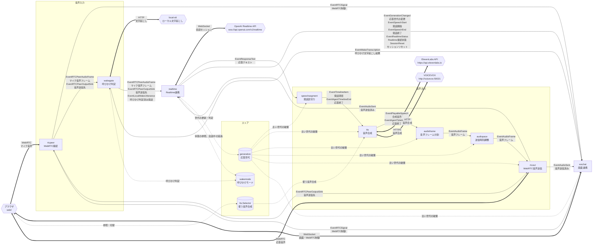
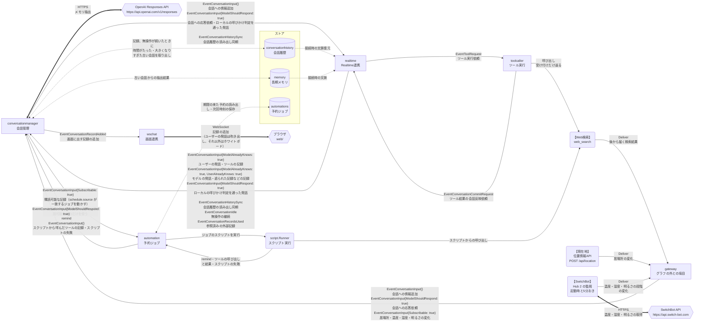
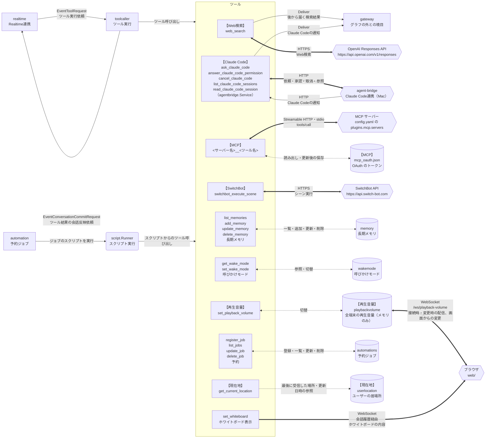
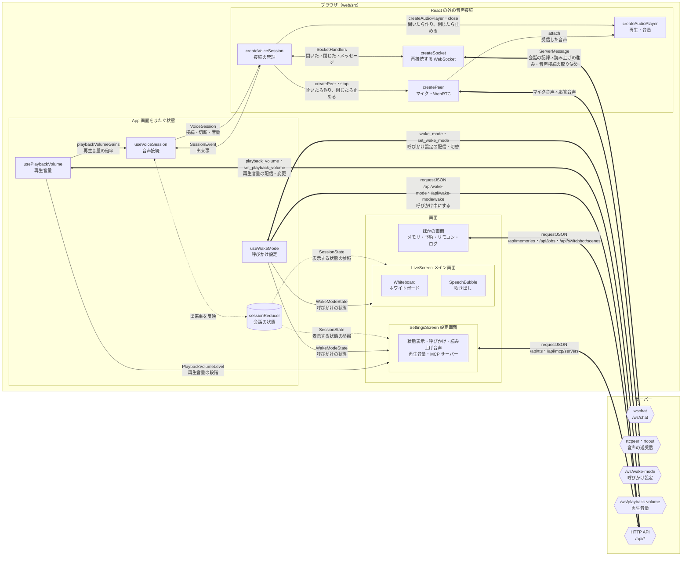

# smart-speaker

スマートフォンのブラウザを音声入力・音声再生の端末として使う、Web ベースのスマートスピーカーです。

ブラウザのマイク音声を WebRTC で Go サーバーへ送り、サーバーが OpenAI の Realtime API と会話します。
返答のテキストは VOICEVOX（または ElevenLabs）で音声にして、WebRTC でブラウザへ返して再生します。

## 主な機能

- 音声での会話。話しはじめると、読み上げ中の返答を止めて聞き取ります
- ホワイトボード：調べた結果や補足を画面に書き出します
- 外部サービスの操作：SwitchBot での家電操作、Web 検索、設定ファイルに登録した MCP サーバーのツール（Google Calendar の予定の確認・登録など）
- 長期メモリ：会話から覚えておくことを抽出し、次の会話で使います。「覚えて」「忘れて」と頼むか、AIの提案に了承すると、その場で追加・変更・削除します（画面からも確認・編集できます）
- 予約ジョブ：「10分後に起こして」「平日8時に〜して」などと会話から登録できます
- 呼びかけ必須モード：「起きて」などの呼びかけで始まる発話だけに反応します
- 手元の Mac の Claude Code に、調べものや文章作成などの作業を頼めます

## すぐに起動する

```sh
cp config.sample.yaml config.yaml
export OPENAI_API_KEY=...
docker compose up --build
```

`http://localhost:5173` を開きます。
設定や外部サービスとの連携は、下の手順書を参照してください。

## 手順書

- [セットアップとローカル起動](docs/setup.md)：設定、起動、テスト、外部サービス連携の設定
- [本番環境へのデプロイ](docs/deploy.md)
- [agent-bridge](services/agent-bridge/README.md)：Claude Code 連携のために Mac で常駐させるブリッジ

設定の全項目と既定値は [config.sample.yaml](config.sample.yaml) にあります。

## ディレクトリ構成

| パス | 内容 |
|---|---|
| `cmd/smart-speaker` | サーバーの起動処理と部品をつなぐ配線、読み上げ音声の選択などの HTTP API |
| `cmd/local-verify-realtime` | 外部 API を使わずに動かす確認用のサーバー |
| `internal/` | 会話処理（`components/realtime` など）、ツールの登録と実行（`tools/`）、会話の状態の保存（`states/`） |
| `internal/features/<名前>` | 本体に組み込む機能（長期メモリ・呼びかけ・予約ジョブ・ホワイトボード）。ストア・ツール・HTTP など 1 つの機能の部品を 1 つのディレクトリにまとめ、`cmd/smart-speaker` が直接つなぐ |
| `internal/plugin`、`internal/plugins/<名前>` | プラグインの受け口と、各プラグイン（config で有効にし、Plugin interface だけで本体とつながる機能） |
| `web/` | ブラウザの画面（React）。`web/src` を、画面の切り替えと配線（`app/`）、本体の機能（`features/<名前>`）、任意機能（`plugins/<名前>`）、機能に依存しない土台（`shared/`）に分ける。依存は `app/` → `features/`・`plugins/` → `shared/` の一方向にする |
| `services/local-stt` | 呼びかけ判定に使うローカルの文字起こし（faster-whisper） |
| `services/agent-bridge` | Claude Code 連携のブリッジ |
| `scripts/` | デプロイなどのスクリプト |

## コンポーネントとデータの流れ

細い実線はイベントと、gateway とグラフの外との受け渡し（Deliver）、太線は外部との通信、点線はストアの読み書きを表します。
名前の上の【】は、その部品が属するプラグインです。

### 音声の流れ


```mermaid
flowchart LR
    browser{{"ブラウザ<br/>web/"}}
    chat["wschat<br/>画面連携"]
    localStt{{"local-stt<br/>ローカル文字起こし"}}
    rt["realtime<br/>Realtime連携"]
    openaiRealtime{{"OpenAI Realtime API<br/>wss://api.openai.com/v1/realtime"}}
    elevenLabs{{"ElevenLabs API<br/>https://api.elevenlabs.io"}}
    voicevox{{"VOICEVOX<br/>http://voicevox:50021"}}

    subgraph g0["音声入力"]
        peer["rtcpeer<br/>WebRTC接続"]
        wake["wakegate<br/>呼びかけ判定"]
    end

    subgraph g1["音声出力"]
        segment["speechsegment<br/>発話区切り"]
        ttsNode["tts<br/>音声合成"]
        frame["audioframe<br/>音声フレーム分割"]
        pace["audiopace<br/>送信時刻調整"]
        output["rtcout<br/>WebRTC音声送信"]
    end

    subgraph g2["ストア"]
        generationStore[("generation<br/>応答世代")]
        wakeModeStore[("wakemode<br/>呼びかけモード")]
        ttsSelectionStore[("tts.Selector<br/>使う音声合成")]
    end

    browser ==>|"WebRTC<br/>マイク音声"| peer
    browser <==>|"WebSocket<br/>画面・WebRTC制御"| chat
    output ==>|"WebRTC<br/>応答音声"| browser
    wake <==>|"HTTP<br/>文字起こし"| localStt
    rt <==>|"WebSocket<br/>会話セッション"| openaiRealtime
    chat -->|"EventRTCSignal<br/>WebRTC制御"| peer
    peer -->|"EventRTCSignal<br/>WebRTC制御"| chat
    peer -->|"EventRTCPeerAudioFrame<br/>マイク音声フレーム<br/>EventRTCPeerOutputSink<br/>音声送信先"| wake
    peer -->|"EventRTCPeerOutputSink<br/>音声送信先"| output
    wake -->|"EventRTCPeerAudioFrame<br/>マイク音声フレーム<br/>EventRTCPeerOutputSink<br/>音声送信先<br/>EventLocalWakeUtterance<br/>呼びかけ判定済み発話"| rt
    wake -->|"EventWakeTranscription<br/>呼びかけ文字起こし結果"| chat
    rt -->|"EventResponseText<br/>応答テキスト"| segment
    segment -->|"EventTimelineItem<br/>発話項目<br/>EventAgentTimelineEnd<br/>応答終了"| ttsNode
    ttsNode -->|"EventPlayableSpeech<br/>合成音声<br/>EventAgentTimelineEnd<br/>応答終了"| frame
    frame -->|"EventAudioFrame<br/>音声フレーム"| pace
    pace -->|"EventAudioFrame<br/>音声フレーム"| output
    output -->|"EventAudioSent<br/>音声送信済み"| rt
    output -->|"EventAudioSent<br/>音声送信済み"| chat
    rt -->|"EventGenerationChanged<br/>応答世代の変更<br/>EventSpeechStart<br/>発話開始<br/>EventSpeechEnd<br/>発話終了<br/>EventRealtimeStatus<br/>Realtime接続状態<br/>SessionReset<br/>セッションリセット"| chat
    ttsNode <==>|"HTTPS<br/>音声合成"| elevenLabs
    ttsNode <==>|"HTTP<br/>音声合成"| voicevox
    rt <-.->|"世代の更新・判定"| generationStore
    generationStore -.->|"古い世代の破棄"| segment
    generationStore -.->|"古い世代の破棄"| ttsNode
    generationStore -.->|"古い世代の破棄"| frame
    generationStore -.->|"古い世代の破棄"| pace
    generationStore -.->|"古い世代の破棄"| output
    generationStore -.->|"古い世代の破棄"| chat
    wake <-.->|"呼びかけ判定"| wakeModeStore
    rt <-.->|"状態の参照、会話中の延長"| wakeModeStore
    ttsSelectionStore -.->|"使う音声合成"| ttsNode
    browser <-.->|"参照・切替"| ttsSelectionStore
```

### 会話


```mermaid
flowchart LR
    manager["conversationmanager<br/>会話管理"]
    openaiResponses{{"OpenAI Responses API<br/>https://api.openai.com/v1/responses"}}
    rt["realtime<br/>Realtime連携"]
    tool["toolcaller<br/>ツール実行"]
    webSearchTool("【Web検索】<br/>web_search")
    scheduler["automation<br/>予約ジョブ"]
    runner("script.Runner<br/>スクリプト実行")
    gateway["gateway<br/>グラフの外との境目"]
    locationAPI("【現在地】<br/>位置情報API<br/>POST /api/location")
    hub2Watcher("【SwitchBot】<br/>Hub 2 の監視<br/>起動時と5分おき")
    switchBot{{"SwitchBot API<br/>https://api.switch-bot.com"}}
    chat["wschat<br/>画面連携"]
    browser{{"ブラウザ<br/>web/"}}

    subgraph g0["ストア"]
        historyStore[("conversationhistory<br/>会話履歴")]
        memoryStore[("memory<br/>長期メモリ")]
        automationStore[("automations<br/>予約ジョブ")]
    end

    manager <==>|"HTTPS<br/>メモリ抽出"| openaiResponses
    rt -->|"EventConversationInput{ModelAlreadyKnows: true}<br/>ユーザーの発話・ツールの記録<br/>EventConversationInput{ModelAlreadyKnows: true, UserAlreadyKnows: true}<br/>モデルの発話・遮られた記録などの記録<br/>EventConversationInput{ModelShouldRespond: true}<br/>ローカルの呼びかけ判定を通った発話<br/><br/>EventConversationHistorySync<br/>会話履歴の読み出し同期<br/>EventConversationIdle<br/>無操作の継続<br/>EventConversationRecordsUsed<br/>参照済みの外部記録"| manager
    manager --->|"EventConversationInput{}<br/>会話への情報追加<br/>EventConversationInput{ModelShouldRespond: true}<br/>会話への応答依頼・ローカルの呼びかけ判定を通った発話<br/><br/>EventConversationHistorySync<br/>会話履歴の読み出し同期"| rt
    rt -->|"EventToolRequest<br/>ツール実行依頼"| tool
    tool --->|"EventConversationCommitRequest<br/>ツール結果の会話反映依頼"| rt
    manager -->|"EventConversationInput{Subscribable: true}<br/>購読可能な記録（schedule.source が一致するジョブを動かす）<br/>※会話に入れた記録はすべて流れ、購読可能なものだけを使う"| scheduler
    scheduler -->|"ジョブのスクリプトを実行"| runner
    runner -->|"remind・ツールの呼び出しと結果・スクリプトの失敗"| scheduler
    scheduler -->|"EventConversationInput{ModelShouldRespond: true}<br/>remind<br/>EventConversationInput{}<br/>スクリプトから呼んだツールの記録・スクリプトの失敗"| manager
    tool -->|"呼び出し<br/>受け付けだけ返る"| webSearchTool
    runner -->|"スクリプトからの呼び出し"| webSearchTool
    webSearchTool -->|"Deliver<br/>後から届く検索結果"| gateway
    locationAPI -->|"Deliver<br/>居場所の変化"| gateway
    hub2Watcher <==>|"HTTPS<br/>温度・湿度・明るさの取得"| switchBot
    hub2Watcher -->|"Deliver<br/>温度・湿度・明るさの段階の変化"| gateway
    gateway -->|"EventConversationInput{}<br/>会話への情報追加<br/>EventConversationInput{ModelShouldRespond: true}<br/>会話への応答依頼<br/>EventConversationInput{Subscribable: true}<br/>居場所・温度・湿度・明るさの変化"| manager
    manager <-.->|"記録、無操作が続いたときに<br/>時間がたった・大きくなりすぎた古い会話を取り出し"| historyStore
    historyStore -.->|"接続時の文脈復元"| rt
    memoryStore -.->|"接続時の文脈"| rt
    manager <-.->|"古い会話からの抽出結果"| memoryStore
    manager -->|"EventConversationRecordAdded<br/>画面に出す記録の追加"| chat
    chat ==>|"WebSocket<br/>記録の追加<br/>（ユーザーの発話は吹き出し、それ以外はホワイトボード）"| browser
    scheduler <-.->|"期限の来た予約の読み出し・次回時刻の保存"| automationStore
```

### ツール


```mermaid
flowchart LR
    rt["realtime<br/>Realtime連携"]
    tool["toolcaller<br/>ツール実行"]
    scheduler["automation<br/>予約ジョブ"]
    runner("script.Runner<br/>スクリプト実行")
    gateway["gateway<br/>グラフの外との境目"]

    subgraph toolset["ツール"]
        webSearchTool["【Web検索】<br/>web_search"]
        claudeCodeTool["【Claude Code】<br/>ask_claude_code<br/>answer_claude_code_permission<br/>cancel_claude_code<br/>list_claude_code_sessions<br/>read_claude_code_session<br/>（agentbridge.Service）"]
        mcpTool["【MCP】<br/>&lt;サーバー名&gt;__&lt;ツール名&gt;"]
        switchBotTool["【SwitchBot】<br/>switchbot_execute_scene"]
        memoryTool["list_memories<br/>add_memory<br/>update_memory<br/>delete_memory<br/>長期メモリ"]
        wakeModeTool["get_wake_mode<br/>set_wake_mode<br/>呼びかけモード"]
        volumeTool["【再生音量】<br/>set_playback_volume"]
        automationTool["register_job<br/>list_jobs<br/>update_job<br/>delete_job<br/>予約"]
        whiteboardTool["set_whiteboard<br/>ホワイトボード表示"]
        locationTool["【現在地】<br/>get_current_location"]
    end


    openaiResponses{{"OpenAI Responses API<br/>https://api.openai.com/v1/responses"}}
    agentBridge{{"agent-bridge<br/>Claude Code連携（Mac）"}}
    mcpServer{{"MCP サーバー<br/>config.yaml の plugins.mcp.servers"}}
    mcpTokenStore[("【MCP】<br/>mcp_oauth.json<br/>OAuth のトークン")]
    switchBot{{"SwitchBot API<br/>https://api.switch-bot.com"}}
    memoryStore[("memory<br/>長期メモリ")]
    wakeModeStore[("wakemode<br/>呼びかけモード")]
    volumeStore[("【再生音量】<br/>playbackvolume<br/>全端末の再生音量（メモリのみ）")]
    automationStore[("automations<br/>予約ジョブ")]
    locationStore[("【現在地】<br/>userlocation<br/>ユーザーの居場所")]
    browser{{"ブラウザ<br/>web/"}}

    rt -->|"EventToolRequest<br/>ツール実行依頼"| tool
    tool -->|"EventConversationCommitRequest<br/>ツール結果の会話反映依頼"| rt
    tool -->|"ツール呼び出し"| toolset
    scheduler -->|"ジョブのスクリプトを実行"| runner
    runner -->|"スクリプトからのツール呼び出し"| toolset

    webSearchTool <==>|"HTTPS<br/>Web検索"| openaiResponses
    webSearchTool -->|"Deliver<br/>後から届く検索結果"| gateway
    claudeCodeTool <==>|"HTTP<br/>依頼・承認・取消・参照"| agentBridge
    agentBridge -->|"HTTP<br/>Claude Codeの通知"| claudeCodeTool
    claudeCodeTool -->|"Deliver<br/>Claude Codeの通知"| gateway
    mcpTool <==>|"Streamable HTTP・stdio<br/>tools/call"| mcpServer
    mcpTool <-.->|"読み出し・更新後の保存"| mcpTokenStore
    switchBotTool <==>|"HTTPS<br/>シーン実行"| switchBot
    memoryTool <-.->|"一覧・追加・更新・削除"| memoryStore
    wakeModeTool <-.->|"参照・切替"| wakeModeStore
    volumeTool <-.->|"切替"| volumeStore
    volumeStore <==>|"WebSocket<br/>/ws/playback-volume<br/>接続時・変更時の配信、画面からの変更"| browser
    automationTool <-.->|"登録・一覧・更新・削除"| automationStore
    locationTool -.->|"最後に受信した場所・更新日時の参照"| locationStore
    whiteboardTool ==>|"WebSocket<br/>会話履歴経由<br/>ホワイトボードの内容"| browser
```

### 画面（web/）

画面の部品と、サーバーとのやり取りです。画面が使うサーバーの API は、この図にまとめています。
細い実線は値の受け渡し、太線はサーバーとの通信、点線は会話の状態の読み書きを表します。
矢印のラベルは、1行目に関数名・型名・API のパス・メッセージの種類を、その下に説明を書きます。


```mermaid
flowchart LR
    subgraph web["ブラウザ（web/src）"]
        subgraph app["App 画面をまたぐ状態"]
            voice["useVoiceSession<br/>音声接続"]
            wake["useWakeMode<br/>呼びかけ設定"]
            volume["usePlaybackVolume<br/>再生音量"]
            state[("sessionReducer<br/>会話の状態")]
        end
        subgraph io["React の外の音声接続"]
            session["createVoiceSession<br/>接続の管理"]
            socket["createSocket<br/>再接続する WebSocket"]
            peer["createPeer<br/>マイク・WebRTC"]
            player["createAudioPlayer<br/>再生・音量"]
        end
        subgraph screens["画面"]
            subgraph live["LiveScreen メイン画面"]
                whiteboard["Whiteboard<br/>ホワイトボード"]
                bubble["SpeechBubble<br/>吹き出し"]
            end
            subgraph settings["SettingsScreen 設定画面"]
                parts["状態表示・呼びかけ・読み上げ音声<br/>再生音量・MCP サーバー"]
            end
            pages["ほかの画面<br/>メモリ・予約・リモコン・ログ"]
        end
    end

    subgraph server["サーバー"]
        chat{{"wschat<br/>/ws/chat"}}
        rtc{{"rtcpeer・rtcout<br/>音声の送受信"}}
        wsWake{{"/ws/wake-mode<br/>呼びかけ設定"}}
        wsVolume{{"/ws/playback-volume<br/>再生音量"}}
        httpAPI{{"HTTP API<br/>/api/*"}}
    end

    voice -->|"VoiceSession<br/>接続・切断・音量"| session
    session -->|"SessionEvent<br/>出来事"| voice
    session -->|"createPeer・stop<br/>開いたら作り、閉じたら止める"| peer
    session -->|"createAudioPlayer・close<br/>開いたら作り、閉じたら止める"| player
    session <-->|"SocketHandlers<br/>開いた・閉じた・メッセージ"| socket
    peer -->|"attach<br/>受信した音声"| player
    voice <-.->|"出来事を反映"| state
    state -.->|"SessionState<br/>表示する状態の参照"| live & settings
    wake -->|"WakeModeState<br/>呼びかけの状態"| live & settings
    volume -->|"PlaybackVolumeLevel<br/>再生音量の段階"| settings
    volume -->|"playbackVolumeGains<br/>再生音量の倍率"| voice

    socket <==>|"ServerMessage<br/>会話の記録・読み上げの進み・音声接続の取り決め"| chat
    peer <==>|"マイク音声・応答音声"| rtc
    wake <==>|"wake_mode・set_wake_mode<br/>呼びかけ設定の配信・切替"| wsWake
    wake ==>|"requestJSON<br/>/api/wake-mode・/api/wake-mode/wake<br/>呼びかけ中にする"| httpAPI
    volume <==>|"playback_volume・set_playback_volume<br/>再生音量の配信・変更"| wsVolume
    settings <==>|"requestJSON<br/>/api/tts・/api/mcp/servers"| httpAPI
    pages <==>|"requestJSON<br/>/api/memories・/api/jobs・/api/switchbot/scenes"| httpAPI
```
