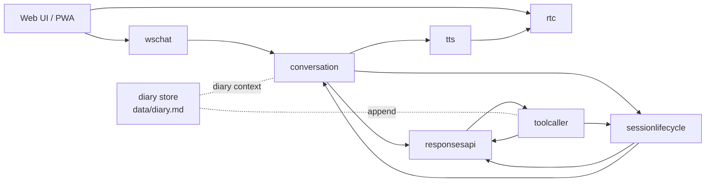

# 1. 全体アーキテクチャとイベントグラフ

元ページ: https://www.notion.so/31db3ffbf12e810a9b87c38c652d5e04

## 1. ビジネスコンテキスト
- **目的**: ブラウザからの音声対話、LLM 応答、ツール実行、日記化、継続記憶を、1つの event graph で統合する。
- **価値**: 単なる chat UI ではなく、音声入出力、会話制御、ツール実行、継続記憶まで含めたスマートスピーカー体験を構成できる。
- **現在の設計方針**: 外側は `graph.Stage` による疎結合な event graph を保ち、複雑な状態遷移は各 component 内に閉じ込める。特に `conversation` は内部 state machine、`session lifecycle policy` は時間ベースの監督役として分ける。日記は generic な shared state ではなく、専用の `diary store` として扱う。

## 2. 全体像
システムは大きく 6 つの層でできている。
- Web UI / PWA
- WebSocket + WebRTC 境界
- 会話オーケストレーション
- session lifecycle policy
- LLM / tool execution
- 音声入出力 / 記憶補助

## 3. 主要コンポーネント
### `wschat`
ブラウザとのテキスト / 状態イベント境界。
- `/ws/chat` を提供する
- user text を `EventTextInput` に変換する
- assistant message / function result / speech 状態 / whiteboard 更新 / WebRTC signaling をブラウザへ返す
- 複数接続を同時に扱う

### `rtc`
音声 transport の境界。
- マイク音声を WebRTC で受ける
- 動的 VAD と Google STT を行う
- assistant PCM を Opus にしてクライアントへ返す

### `conversation`
会話の進行役。
- 人の割り込み
- user 発話の履歴反映
- LLM 応答の timeline 化
- assistant 発話の順次進行
- tool result の会話文脈反映
- TTS 完了後の継続
- `ConversationSnapshotUpdated` / `ConversationActivity` の emit
現在は内部を `Signal / SessionState / Rule / Effect / Runtime` に分けて整理している。

### `sessionlifecycle`
時間ベースの会話ポリシー。
- `conversation` から流れてくる snapshot と activity を内部保持する
- 無操作が続いたら `write_diary` 強制の `EventResponsesRequest` を出す
- `write_diary` 完了後に `EventSessionClear` を出す

### `responsesapi`
OpenAI Responses API との通信境界。
- 通常応答生成
- function call 抽出
- tool output 再投入

### `toolcaller`
function call の実行ランタイム。
- name で tool handler を lookup する
- JSON 引数を decode して `Run` を呼ぶ
- 結果を `ToolResponse` にして返す

### `tts`
assistant テキストを ElevenLabs で音声化する。

### `diary store`
diary の永続化境界。
- `data/diary.md` の読み書きを担当する
- 旧 `tmp/diary/*.md` からの移行を担当する
- `conversation` と `write_diary` の両方から注入されて使われる

## 4. イベントグラフという見方
### `graph.Stage` の責務
`graph` 自体は業務ロジックを持たない。
- 各 Stage を起動する
- `Downstream` から出た event を接続先 `Upstream` に転送する
- 転送ログを残す
つまり graph は配送レイヤであり、意味のある判断は各 Stage の内部にある。

### なぜこの構成か
このシステムには 2 種類の複雑さがある。
- component 間連携の複雑さ
- component 内部状態の複雑さ
前者には event graph が効く。後者、とくに `conversation` のような会話制御には component 内部の状態機械が効く。さらに、無操作時の session 管理は `sessionlifecycle` に分離し、`conversation` 本体の責務を増やしすぎないようにしている。日記は state 共有ではなく store として切り出し、依存を `main` から注入する。

## 5. 主要なデータフロー
### シナリオ: ユーザーが話して assistant が返す
1. ブラウザが WebSocket / WebRTC でサーバーへ接続する
2. `rtc` がマイク音声を受け、動的 VAD と server STT で user 発話を確定する
3. `wschat` が `EventTextInput` を graph に流す
4. `conversation` が会話 state を更新し `EventResponsesRequest` を発行する
5. `responsesapi` が OpenAI を呼ぶ
6. 応答テキストまたは tool call が返る
7. `conversation` が assistant timeline を進める
8. `tts` が assistant 文を音声化する
9. `rtc` が WebRTC でブラウザへ返す

### シナリオ: tool call が入る
1. `responsesapi` が `ToolRequest` を出す
2. `toolcaller` が handler を実行する
3. `ToolResponse` が `responsesapi`、`conversation`、`wschat`、`sessionlifecycle` に流れる
4. `responsesapi` は OpenAI へ再投入する
5. `conversation` は必要なら tool result を会話履歴へ積む
6. `wschat` は `function_result` として UI にも流す

### シナリオ: 無操作で session を閉じる
1. `conversation` が `ConversationSnapshotUpdated` と `ConversationActivity` を流す
2. `sessionlifecycle` がそれを保持し、idle timer を張り直す
3. 一定時間無操作なら `write_diary` 強制の `EventResponsesRequest` を出す
4. `write_diary` の `ToolResponse` が返ると `EventSessionClear` を出す
5. `conversation` が内部 state を初期化する

### シナリオ: 次回会話で diary を使う
1. `runtime` が `ResponsesRequest` 発行時に `contextProvider` を通す
2. `contextProvider` が注入された `diary store` から diary を読む
3. diary を system message として会話先頭へ付与する
4. assistant は過去会話の要約を参照しながら応答する

## 6. Web フロントの現在位置づけ
Web フロントは 1 つの React アプリで、表示モードだけを切り替える。
- 管理画面
  - 接続、認証、pipeline 状態、function result の生表示
- アプリ画面
  - 吹き出し、whiteboard、簡易ステータス、ミニキャラ枠
この 2 画面は内部ロジックを共有しているため、表示切替で接続を落とさない。また PWA 対応により、ホーム画面から standalone 起動できる。

## 7. 現在の設計上の重要ポイント
- graph は薄く、意味のある判断は各 component 内にある
- `conversation` は system の中核だが、内部をさらに `core / runtime / Rule` に分けている
- idle timeout と日記化 orchestration は `sessionlifecycle` に分離している
- generic な shared projection state は廃止し、必要な共有は domain event で流す
- diary は永続記憶であり、会話正本 state とは別の `store` である
- `diary store` は `main` で 1 回生成し、`conversation` と `write_diary` に注入する
- UI は app/admin の二画面を同一 state 上で切り替える

## 8. 参照実装
- `cmd/smart-speaker/main.go`
- `internal/graph/graph.go`
- `internal/graph/stage.go`
- `internal/graph/eventlog.go`
- `internal/components/wschat/wschat.go`
- `internal/components/rtc/rtc.go`
- `internal/components/rtc/signaling.go`
- `internal/components/rtc/input.go`
- `internal/components/rtc/output.go`
- `internal/components/conversation/conversation.go`
- `internal/components/conversation/core.go`
- `internal/components/conversation/rule_*.go`
- `internal/components/conversation/runtime_*.go`
- `internal/components/conversation/response_contract.go`
- `internal/components/conversation/context_provider.go`
- `internal/components/conversation/context_calendar_format.go`
- `internal/components/sessionlifecycle/sessionlifecycle.go`
- `internal/components/responsesapi/runner.go`
- `internal/components/toolcaller/toolcaller.go`
- `internal/components/tts/elevenlabs.go`
- `internal/diary/store.go`
- `web/src/main.tsx`
