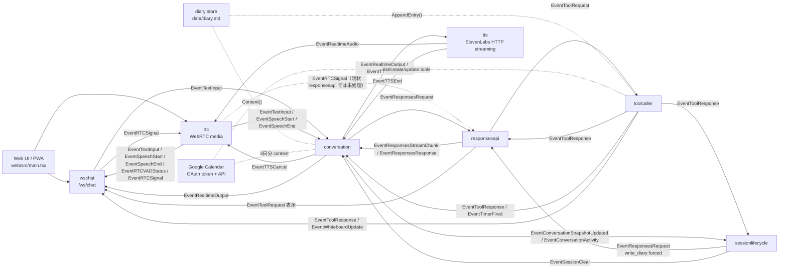

# 1. 全体アーキテクチャとイベントグラフ

## 1. ビジネスコンテキスト
- **目的**: ブラウザからの音声対話、LLM 応答、ツール実行、日記化、Google Calendar context、継続記憶を、1つの event graph で統合する。
- **価値**: 単なる chat UI ではなく、WebRTC 音声入出力、サーバー側 VAD / STT、会話制御、function calling、タイマー / whiteboard / Google Calendar / SwitchBot、継続記憶まで含めたスマートスピーカー体験を構成できる。
- **現在の設計方針**: 外側は `graph.Stage` による疎結合な event graph を保ち、複雑な状態遷移は各 component 内に閉じ込める。特に `conversation` は `Signal / sessionState / Rule / effect / runner` による内部 state machine、`sessionlifecycle` は時間ベースの監督役として分ける。日記は generic な shared state ではなく、専用の `diary store` として扱う。参照実装: `cmd/smart-speaker/main.go`, `internal/graph/graph.go`, `internal/components/conversation/*`, `internal/components/sessionlifecycle/sessionlifecycle.go`, `internal/diary/store.go`

## 2. 全体像
システムは大きく以下の層でできている。
- Web UI / PWA
- WebSocket + WebRTC 境界
- 会話オーケストレーション
- session lifecycle policy
- LLM / streaming response / tool execution
- 音声入出力
- diary / Google Calendar などの context・外部連携

この接続は `cmd/smart-speaker/main.go` の `wireGraph` が定義している。HTTP サーバーは同じ `ServeMux` に Web UI、Google OAuth handler、`/ws/chat` を登録する。参照実装: `cmd/smart-speaker/main.go`, `internal/components/wschat/wschat.go`, `internal/oauth/googlecalendar/*`

## 3. 主要コンポーネント
### `wschat`
ブラウザとの JSON WebSocket 境界。
- `/ws/chat` を提供する
- ブラウザの text message を `EventTextInput` に変換する
- WebRTC の offer / answer / ice を `EventRTCSignal` として中継し、接続ごとの `ClientID` を付ける
- assistant message / user STT message / function call / function result / speech 状態 / VAD 状態 / whiteboard 更新 / WebRTC signaling をブラウザへ返す
- 複数接続を `connHolder` で同時に扱い、signaling は対象 `ClientID` があれば個別送信、それ以外は broadcast する
参照実装: `internal/components/wschat/wschat.go`

### `rtc`
音声 transport とサーバー側音声認識の境界。
- WebRTC offer / answer / ice を処理し、Pion WebRTC の peer と Opus track を管理する
- マイク音声を WebRTC で受け、Opus を PCM に decode して mono 化する
- 直近の背景音量から adaptive VAD し、`EventSpeechStart` / `EventSpeechEnd` / `EventRTCVADStatus` を emit する
- Google Speech-to-Text v2 streaming に PCM を送り、final transcript を `EventTextInput` として emit する
- ElevenLabs 由来の PCM base64 を受け、48kHz に upsample して Opus で各 peer に返す
- `EventTTSCancel` で再生バッファを破棄する
参照実装: `internal/components/rtc/rtc.go`, `internal/components/rtc/signaling.go`, `internal/components/rtc/input.go`, `internal/components/rtc/output.go`

### `conversation`
会話の進行役。
- 確定した user text で進行中の assistant 発話・保留 request・timeline を中断する
- user / assistant / tool の発話履歴を `sessionState` に保持する
- `EventResponsesRequest` 発行時に diary と Google Calendar context を system message として前置する
- Responses streaming の NDJSON chunk を `speech` / `wait` timeline に変換し、assistant 発話を順次進行する
- assistant text を `EventRealtimeOutput` として UI / TTS へ流し、同じ `ResponseID` の final marker も出す
- TTS 完了後に次の `wait` / `speech` を進め、完了時に `ConversationSnapshotUpdated` を emit する
- tool result は `write_diary` を除き system message として会話文脈へ積む
- timer firing は assistant 表示用の `EventRealtimeOutput` に変換する
- `ConversationActivity` を user turn / assistant turn の開始時に emit する
- `data/conversation.jsonl` に会話ログを追記する
現在は内部を `Signal / sessionState / Rule / effect / runner` に分けて整理している。参照実装: `internal/components/conversation/conversation.go`, `internal/components/conversation/core.go`, `internal/components/conversation/state.go`, `internal/components/conversation/rule_*.go`, `internal/components/conversation/runtime_*.go`, `internal/components/conversation/response_contract.go`, `internal/components/conversation/context_provider.go`, `internal/components/conversation/context_calendar_format.go`

### `sessionlifecycle`
時間ベースの会話ポリシー。
- `conversation` から流れてくる snapshot と activity を内部保持する
- activity ごとに idle timer を張り直す
- 既定では 60 分無操作が続いたら、保持 snapshot を使って `write_diary` 強制の `EventResponsesRequest` を出す
- 会話量に応じて日記の長さ指示を 1 行 / 2〜3 行 / 3〜5 行に変える
- 日記化 request は通常 system prompt を空にし、`ToolChoice` で `write_diary` を指定し、`Tools` は `write_diary` 定義だけにする
- `write_diary` の `EventToolResponse` が返ると state を reset し、`EventSessionClear` を出す
参照実装: `internal/components/sessionlifecycle/sessionlifecycle.go`, `cmd/smart-speaker/main.go`

### `responsesapi`
OpenAI Responses API との通信境界。
- `EventResponsesRequest` を受け、通常 request は streaming (`stream: true`) で OpenAI Responses API を呼ぶ
- system prompt には現在日付と現在時刻を追記する
- streaming delta は改行ごとに `EventResponsesStreamChunk` として流す
- response 完了時、tool call がなければ `Done=true` の `EventResponsesStreamChunk` を流す
- tool call があれば `EventResponsesResponse` と `EventToolRequest` を流す
- `EventToolResponse` は `previous_response_id` と `function_call_output` で OpenAI へ再投入し、次の `EventResponsesResponse` / `EventToolRequest` に変換する
参照実装: `internal/components/responsesapi/client.go`, `internal/components/responsesapi/runner.go`

### `toolcaller`
function call の実行ランタイム。
- name で tool handler を lookup する
- JSON 引数を `map[string]any` に decode して `Run` を呼ぶ
- 各 tool call は goroutine で実行する
- `ContextAware` tool に graph の context を渡し、`EventEmitterAware` tool に `toolcaller` の downstream emitter を渡す
- 結果またはエラーを JSON 化し、`ToolResponse` にして返す
- 現行 registry は SwitchBot scene / Hub2、timer、whiteboard、write_diary、Google Calendar list/create/update、Responses API 向け `web_search` 定義を登録する。ただし `web_search` はローカル handler を持たない tools 定義である
参照実装: `internal/components/toolcaller/toolcaller.go`, `internal/tools/interfaces.go`, `internal/tools/registry/registry.go`, `internal/tools/functions/*`

### `tts`
assistant テキストを ElevenLabs の HTTP streaming endpoint で音声化する。
- `EventRealtimeOutput` の assistant text だけを読む
- final marker や空 text は無視する
- 進行中の stream は新しい発話開始時または `EventTTSCancel` で cancel する
- ElevenLabs から受けた PCM 24kHz を base64 化して `EventRealtimeAudio` として流す
- 読み切り後に PCM byte 数から再生秒数を推定し、`EventTTSEnd` を emit する
参照実装: `internal/components/tts/elevenlabs.go`

### `diary store`
diary の永続化境界。
- 既定では `data/diary.md` の読み書きを担当する
- 初回作成時に旧 `tmp/diary/*.md` をファイル名順に読み、`data/diary.md` へ移行する
- `Content()` は diary 全文を trim して返す
- `AppendEntry()` は `# YYYY-MM-DD HH:MM` 見出し付きで追記する
- `main` で 1 回生成され、`conversation` の context provider と `write_diary` tool の両方へ注入される
参照実装: `internal/diary/store.go`, `cmd/smart-speaker/main.go`, `internal/tools/functions/diary/tool.go`

## 4. イベントグラフという見方
### `graph.Stage` の責務
`graph` 自体は業務ロジックを持たない。
- 各 Stage を起動する
- `Downstream` から出た event を接続先 `Upstream` に転送する
- 転送ログを残す。ただし `EventRTCVADStatus` と `EventRealtimeAudio` は標準で forward log を抑制する
- Stage の `CloseFn` を逆順に呼ぶ
つまり graph は配送レイヤであり、意味のある判断は各 Stage の内部にある。参照実装: `internal/graph/graph.go`, `internal/graph/stage.go`, `internal/graph/eventlog.go`

### なぜこの構成か
このシステムには 2 種類の複雑さがある。
- component 間連携の複雑さ
- component 内部状態の複雑さ
前者には event graph が効く。後者、とくに `conversation` のような会話制御には component 内部の状態機械が効く。さらに、無操作時の session 管理は `sessionlifecycle` に分離し、`conversation` 本体の責務を増やしすぎないようにしている。日記は state 共有ではなく store として切り出し、依存を `main` から注入する。Google Calendar は context provider と tool の両方から同じ client を使うが、OAuth token の有無に応じて context 付与を静かに skip できる。

## 5. 主要なデータフロー
### シナリオ: ユーザーが話して assistant が返す
1. ブラウザが `/ws/chat` で制御用 WebSocket に接続し、WebRTC offer を送る
2. `wschat` が `EventRTCSignal` を `rtc` に渡し、`rtc` が answer / ice を返す
3. ブラウザのマイク音声が WebRTC で `rtc` に届く
4. `rtc` が adaptive VAD で発話開始・終了を検出し、Google STT の final transcript を `EventTextInput` として graph に流す
5. `conversation` が user 発話を履歴へ反映し、diary / calendar context を前置した `EventResponsesRequest` を発行する
6. `responsesapi` が OpenAI Responses API を streaming で呼び、NDJSON 行を `EventResponsesStreamChunk` として返す
7. `conversation` が `speech` / `wait` timeline を逐次進め、assistant text を `EventRealtimeOutput` として出す
8. `wschat` が assistant text を UI に表示し、`tts` が同じ text を ElevenLabs で音声化する
9. `tts` の `EventRealtimeAudio` を `rtc` が WebRTC 音声としてブラウザへ返す
参照実装: `internal/components/rtc/input.go`, `internal/components/conversation/rule_human_text.go`, `internal/components/conversation/runtime_request.go`, `internal/components/responsesapi/runner.go`, `internal/components/conversation/rule_responses_stream.go`, `internal/components/tts/elevenlabs.go`

### シナリオ: tool call が入る
1. `responsesapi` が Responses API の `function_call` を `EventToolRequest` として出す
2. `toolcaller` が name に対応する handler を goroutine で実行する
3. `EventToolResponse` が `responsesapi`、`conversation`、`wschat`、`sessionlifecycle` に流れる
4. `responsesapi` は `previous_response_id` と `function_call_output` で OpenAI へ再投入する
5. `conversation` は `write_diary` 以外の tool result を system message として会話履歴へ積み、snapshot を更新する
6. `wschat` は `function_call` / `function_result` として UI に流す
7. timer tool や whiteboard tool のような `EventEmitterAware` tool は、tool response とは別に `EventTimerFired` や `EventWhiteboardUpdate` を emit できる
参照実装: `internal/components/responsesapi/client.go`, `internal/components/responsesapi/runner.go`, `internal/components/toolcaller/toolcaller.go`, `internal/components/conversation/rule_tool_response.go`, `internal/tools/functions/timer/tool.go`, `internal/tools/functions/whiteboard/tool.go`

### シナリオ: 無操作で session を閉じる
1. `conversation` が `ConversationSnapshotUpdated` と `ConversationActivity` を流す
2. `sessionlifecycle` が snapshot と最終 activity 時刻を保持し、idle timer を張り直す
3. 既定の 60 分を過ぎると、snapshot と会話量別の日記指示を使って `write_diary` 強制の `EventResponsesRequest` を出す
4. `responsesapi` が `write_diary` tool call を出し、`toolcaller` が `diary store` に追記する
5. `write_diary` の `ToolResponse` が返ると `sessionlifecycle` が `EventSessionClear` を出す
6. `conversation` が発話 state、pending request、timeline を初期化し、空 snapshot を emit する
参照実装: `internal/components/sessionlifecycle/sessionlifecycle.go`, `internal/components/conversation/rule_session_clear.go`, `internal/tools/functions/diary/tool.go`, `internal/diary/store.go`

### シナリオ: 次回会話で diary を使う
1. `conversation` の `runner` が `ResponsesRequest` 発行時に `contextProvider` を通す
2. `contextProvider` が Google OAuth token を確認し、取得できる場合だけ今日から 3 日分の primary calendar を system message 化する
3. `contextProvider` が注入された `diary store` から diary を読む
4. diary を system message として会話先頭へ付与する
5. assistant はカレンダー情報と過去会話の日記を参照しながら応答する
参照実装: `internal/components/conversation/runtime_request.go`, `internal/components/conversation/context_provider.go`, `internal/components/conversation/context_calendar_format.go`, `internal/diary/store.go`

## 6. Web フロントの現在位置づけ
Web フロントは 1 つの React アプリで、表示モードだけを切り替える。
- 管理画面
  - 接続、Google OAuth 開始、pipeline 状態、function call / result の生表示、テキスト入力
- アプリ画面
  - 吹き出し、whiteboard、接続 / マイク / 認識ステータス、VAD 音量・しきい値、再生音量、ミニキャラ枠
この 2 画面は内部ロジックを共有しているため、表示切替で WebSocket / WebRTC 接続を落とさない。`?ui=admin` または `/admin` で管理画面に入り、通常は app 画面を表示する。PWA 対応として service worker を登録し、ホーム画面から standalone 起動できる。参照実装: `web/src/main.tsx`, `web/src/ws.ts`, `web/public/sw.js`, `cmd/smart-speaker/main.go`

## 7. 現在の設計上の重要ポイント
- graph は薄く、意味のある判断は各 component 内にある
- `conversation` は system の中核だが、内部を `Signal / sessionState / Rule / effect / runner` に分けている
- LLM 応答は NDJSON の `speech` / `wait` contract として扱い、streaming chunk でも同じ contract を検証する
- idle timeout と日記化 orchestration は `sessionlifecycle` に分離している
- 通常の Responses API tools から `write_diary` は除外し、session lifecycle の強制日記化時だけ `write_diary` 定義を渡す
- generic な shared projection state は廃止し、必要な共有は domain event で流す
- diary は永続記憶であり、会話正本 state とは別の `store` である
- `diary store` は `main` で 1 回生成し、`conversation` と `write_diary` に注入する
- Google Calendar は context provider と tools の両方で利用されるが、OAuth token がない場合も会話自体は継続できる
- UI は app/admin の二画面を同一 React state 上で切り替える

## 8. 参照実装
- `README.md`
- `cmd/smart-speaker/main.go`
- `internal/app/config.go`
- `internal/graph/graph.go`
- `internal/graph/stage.go`
- `internal/graph/eventlog.go`
- `internal/types/event.go`
- `internal/types/types.go`
- `internal/components/wschat/wschat.go`
- `internal/components/rtc/rtc.go`
- `internal/components/rtc/signaling.go`
- `internal/components/rtc/input.go`
- `internal/components/rtc/output.go`
- `internal/components/conversation/conversation.go`
- `internal/components/conversation/core.go`
- `internal/components/conversation/state.go`
- `internal/components/conversation/signal.go`
- `internal/components/conversation/effect.go`
- `internal/components/conversation/rule_*.go`
- `internal/components/conversation/runtime_*.go`
- `internal/components/conversation/response_contract.go`
- `internal/components/conversation/context_provider.go`
- `internal/components/conversation/context_calendar_format.go`
- `internal/components/sessionlifecycle/sessionlifecycle.go`
- `internal/components/responsesapi/client.go`
- `internal/components/responsesapi/runner.go`
- `internal/components/toolcaller/toolcaller.go`
- `internal/components/tts/elevenlabs.go`
- `internal/tools/interfaces.go`
- `internal/tools/registry/registry.go`
- `internal/tools/functions/*`
- `internal/diary/store.go`
- `web/src/main.tsx`
- `web/src/ws.ts`
- `web/public/sw.js`
