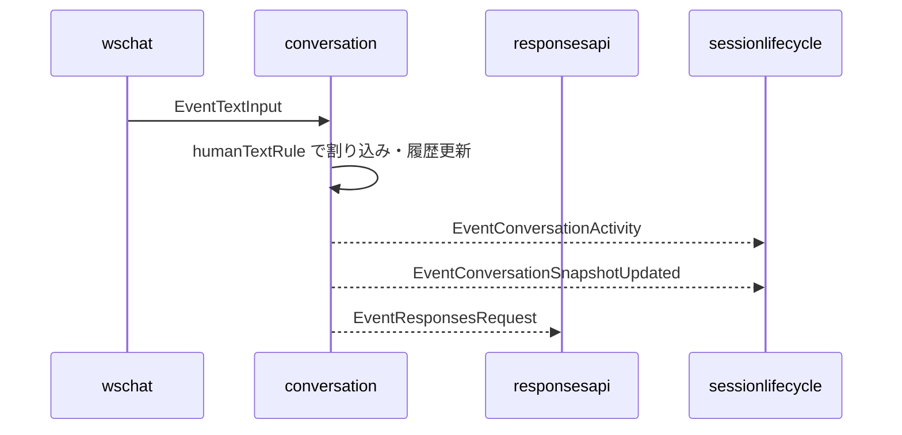
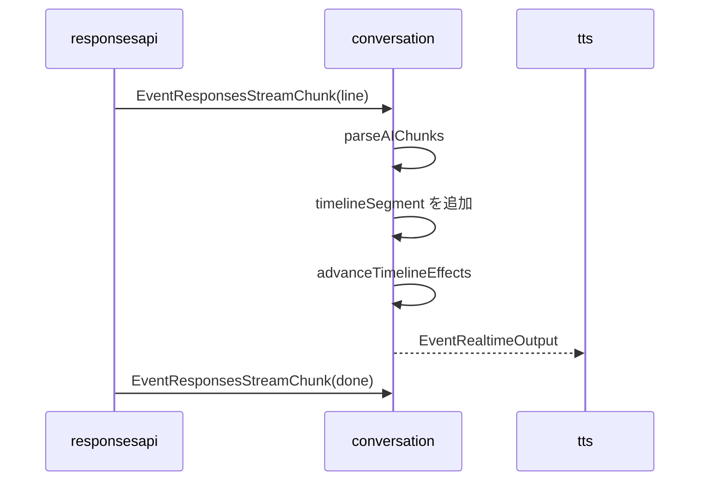
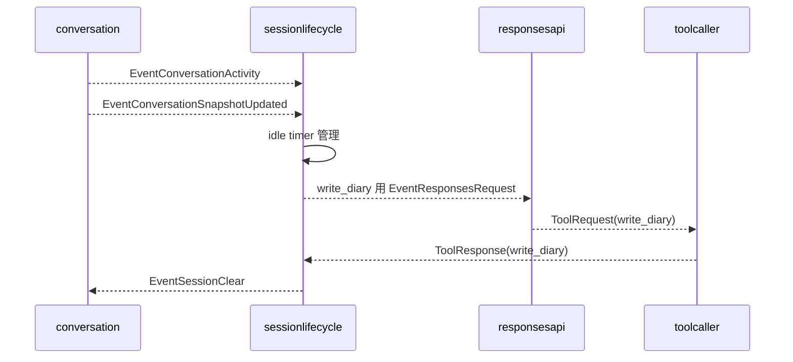

# 2. 会話オーケストレーション

元ページ: https://www.notion.so/31db3ffbf12e8163abc0db0e94672db8

## 1. ビジネスコンテキスト
- **解決する課題**: 音声会話では、LLM から文章を受け取るだけでは足りない。人の確定発話による割り込み、assistant の複数発話と待機、streaming chunk 到着時点での即時発話開始、tool 実行後の継続、TTS 完了後の次発話開始、一定時間無操作後のセッション終了までを一貫して制御する必要がある。
- **ターゲットユーザー**: スマートスピーカー利用者、会話制御の実装を保守する開発者、音声入出力や session lifecycle を調整する開発者。
- **価値定義**: `conversation` を「assistant 文面の配送場所」ではなく、会話進行の正本として理解できる。新しい会話規則や tool 連携を追加するときに、どこへ状態を置き、どこで副作用を起こすべきか判断しやすくなる。
- **現在の設計方針**: 外側は `graph.Stage` ベースの event graph を維持しつつ、会話制御の複雑さは `conversation` component 内へ閉じ込める。内部は package を分けず、`rule_*` / `runtime_*` / `response_contract` / `context_*` / `core/state/signal` の責務単位でファイル分割する。通常応答は speech / wait の NDJSON 契約に絞り、whiteboard は tool 側の `EventWhiteboardUpdate` に寄せる。無操作時の日記化と session clear は `sessionlifecycle` に切り出し、diary は generic な state ではなく専用 store から読む。

## 2. 論理構造・機能俯瞰
**主要なモデル・コンポーネント**
- **`conversation.go`**
  - `graph.Stage` との接着層。
  - `runner` を持ち、event の受信、core の呼び出し、runtime の実行を束ねる。
- **`runtime_loop.go`**
  - upstream event と conversation 内 timer を select で受ける実行ループ。
  - `signalFromEvent` で変換できる event だけを core へ渡す。
- **`signal.go`**
  - `types.Event` を `conversation` 内部の `signal` へ正規化する。
  - 外の event graph と内部 state machine の境界を担当する。
  - `EventResponsesStreamChunk` も `responsesStreamChunkSignal` として扱う。
- **`state.go`**
  - 会話の正本 state を持つ。
  - 会話履歴、現在再生中 utterance、pending request、retry 状態、`pendingTimeline []timelineSegment`、streaming 中の進行状態を管理する。
- **`core.go`**
  - 会話の状態遷移本体。
  - `Handle` で rule を順に適用し、`effect` 列を返す。
  - timeline の進行、assistant 発話開始、invalid response retry の組み立てを持つ。
- **`rule_*.go`**
  - 会話規則の集合。
  - 人の確定発話、speech start、通常 LLM 応答、streaming LLM chunk、tool response、TTS 完了、session clear、timer 発火を個別 rule として持つ。
- **`effect.go`** と **`runtime_*.go`**
  - `effect` は core が返す副作用命令。
  - runtime 側が event emit、timer 制御、Responses API 要求、ログ出力を実行する。
- **`response_contract.go`**
  - LLM 応答の speech / wait NDJSON 契約を検証する。
  - 1 行 1 JSON object、または複数行 NDJSON を `aiChunk` として読み、内部集約用の `aiOutput` へ変換する。
  - `{"timeline":[...]}` 形式や `whiteboard` chunk、plain text は無効として扱う。
- **`context_provider.go`** と **`context_calendar_format.go`**
  - diary / calendar を system context として `ResponsesRequest.Messages` の先頭側へ付与する。
  - invalid response retry の重要 system message が先頭にある場合は、それを最優先に残す。
  - calendar 取得は shared `CalendarClient` に委譲し、calendar 文面整形だけを `conversation` 側で行う。
- **`session lifecycle policy`**
  - `conversation` の外にある時間ベースの監督役。
  - `ConversationSnapshotUpdated` と `ConversationActivity` を受け、idle timeout 時に `write_diary` を強制し、その完了後に `EventSessionClear` を返す。

**境界の考え方**
- `conversation` の正本は内部 `sessionState` であり、generic な shared state へ投影しない。
- 他 component へ共有したい情報は `EventConversationSnapshotUpdated` と `EventConversationActivity` の 2 種類で流す。
- LLM の通常応答は `aiChunk` として受け取り、`responsesRule` / `responsesStreamRule` が正規化済み `timelineSegment` へ変換してから内部 state に積む。
- `EventResponsesResponse` に tool call が含まれる場合、`conversation` は発話として処理しない。tool 実行と Responses API への tool output 再投入は `responsesapi` / `toolcaller` の責務である。
- diary / calendar / logging のような外部境界は `runtime` や provider/store に寄せ、会話ルール本体から分離する。

## 3. 主要なデータフロー
### シナリオ: 人の発話が確定し、assistant 応答が始まるまで
1. **入力受付**: `wschat` などから `EventTextInput` が流れ、`signalFromEvent` が空白除去後の `humanTextSignal` へ変換する。
2. **会話中断**: `humanTextRule` が現在の assistant 進行を止め、conversation 内 timer、pending timeline、pending request をキャンセルする。再生中 utterance があれば `EventTTSCancel` も emit する。
3. **履歴更新**: user utterance を `sessionState` に `played` として追加し、会話履歴を再構築する。`EventSpeechStart` だけでは中断せず、確定文字起こしである `EventTextInput` を待つ。
4. **共有イベント発火**: `EventConversationActivity(source=human_turn_committed)` と `EventConversationSnapshotUpdated` を emit する。
5. **LLM 要求**: `requestResponseEffect` が `EventResponsesRequest` を作り、runtime が `contextProvider` を通して diary / calendar などの system context を付与して downstream へ流す。

### シナリオ: LLM 応答を受け取り、timeline を進めるまで
1. **streaming 応答受信**: `responsesapi` は Responses API を `stream=true` で呼び、`response.output_text.delta` を改行単位に復元して `EventResponsesStreamChunk` を emit する。
2. **request 照合**: `responsesStreamRule` が `RequestID` を照合し、キャンセル済み request の chunk は捨てる。
3. **契約検証**: `parseAIChunks` が speech / wait の NDJSON 契約を検証する。未知 type、`timeline` object、plain text、必須 field 欠落は invalid response とする。
4. **内部表現へ変換**: streaming chunk ごとに `timelineSegment` を追加する。
  - speech の URL / citation 除去。
  - wait の 0..5 秒正規化。
5. **逐次進行**: 現在再生中 utterance がなく、wait timer 待ちでもなければ、chunk 到着時点で `advanceTimelineEffects` が進行する。`wait` なら timer、`speech` なら assistant 発話開始 effect を返す。
6. **stream 完了処理**: `Done` chunk までに speech が一度もなければ invalid response retry を行う。すでに speech が始まっていれば、完了時点では必要に応じて snapshot を更新する。
7. **non streaming 応答**: `EventResponsesResponse` も `responsesRule` が同じ NDJSON 契約で解釈できる。ただし tool call を含む response や本文なし response は会話発話としては処理しない。
8. **白板更新**: ホワイトボード表示は通常応答ではなく、`set_whiteboard` tool が `EventWhiteboardUpdate` を emit する。

### シナリオ: TTS 完了後に次の発話へ進むまで
1. **TTS 完了通知**: `tts` は assistant text の `EventRealtimeOutput` を音声化し、再生完了時に `EventTTSEnd` を返す。`conversation` 側では `ttsEndRule` が受ける。
2. **utterance 完了反映**: `ResponseID` に対応する assistant utterance を `played` にし、`DurationSeconds` を保存する。
3. **後続 speech なし**: pending speech が無ければ snapshot を emit する。streaming request がまだ完了していない場合は timeline を閉じず、後続 chunk を待つ。
4. **待機区間消費**: 後続 speech がある場合、`state.consumeLeadingWaitSeconds` が先頭の wait 群を合算する。
5. **次アクション決定**: `estimateWaitDuration` が TTS の `AudioStartAt` と `DurationSeconds` から実再生終了までの残り時間を見積もり、合算 wait を加えた timer を張る。
6. **履歴共有**: 最新会話履歴を `EventConversationSnapshotUpdated` として emit する。

### シナリオ: tool 実行結果が返るまで
1. **tool request 生成**: Responses API の completed response に function call が含まれると、`responsesapi` が `EventToolRequest` を emit する。
2. **tool 実行**: `toolcaller` が該当 handler を実行し、`EventToolResponse` を返す。`set_whiteboard` のような tool は実行中に独自 event を emit できる。
3. **Responses API への再投入**: `responsesapi` は `ToolResponse` を `previous_response_id` 付きで `SubmitToolOutput` し、次の `EventResponsesResponse` または追加 tool request へつなげる。
4. **conversation 履歴反映**: `toolResponseRule` も同じ `EventToolResponse` を受け、`write_diary` 以外で output が空でない場合は `SpeakerTool` の utterance として会話履歴へ追加する。
5. **履歴共有**: tool 結果を含む最新履歴を `EventConversationSnapshotUpdated` として emit する。

### シナリオ: idle timeout で session を閉じるまで
1. **活動監視**: `sessionlifecycle` が `ConversationActivity` を受けるたびに最終活動時刻を更新し、idle timer を張り直す。`ConversationSnapshotUpdated` は日記化に使う snapshot として保持する。
2. **日記化要求**: 一定時間無操作になると、保持している snapshot と `WriteDiaryTools` を使って `write_diary` 強制の `EventResponsesRequest` を出す。会話量に応じて短め、中程度、長めの日記指示を追加する。
3. **tool 完了検知**: `ToolResponse(name=write_diary)` が返ると、日記化が in-flight の場合だけ `sessionlifecycle` が `EventSessionClear` を emit する。日記化中に新しい activity が来た場合、古い完了通知は session clear に使わない。
4. **会話初期化**: `conversation` が `sessionClearRule` で進行中会話を中断し、`sessionState` を初期化し、空の `EventConversationSnapshotUpdated` を emit する。

## 4. 詳細設計
### クラス設計
- `internal/`
  - `components/`
    - `conversation/`
      - `conversation.go`: stage の接着層。`runner` と `Config` を持つ。
        - `NewStage`: core / provider / logger を組み立てて `graph.Stage` を返す。
      - `runtime_loop.go`: runner の event loop。
        - `run`: context を作り consume goroutine を起動する。
        - `consume`: upstream event と conversation 内 timer を処理する。
        - `handleEvent`: event を signal へ変換して core に渡す。
      - `signal.go`: `types.Event` から `signal` への変換。
        - `signalFromEvent`: 外部 event を internal signal へ正規化する。
      - `state.go`: `sessionState` と `timelineSegment` の定義。
        - `buildConversationMessages`: 再送用の会話履歴を構築する。
        - `consumeLeadingWaitSeconds`: 先頭 wait 群を消費する。
        - `resetConversation`: session clear 時に内部 state を初期化する。
      - `core.go`: 会話状態遷移の本体。
        - `Handle`: rule を順に適用して effect を返す。
        - `advanceTimelineEffects`: pending timeline から次の副作用を決める。
        - `playUtteranceEffects`: assistant 発話開始時の effect を組み立てる。
        - `retryInvalidResponseEffects`: invalid response 再試行を組み立てる。
      - `rule_human_text.go`: 人の確定発話を扱う rule。
        - `Apply`: 割り込み、履歴更新、snapshot/activity emit、LLM request を行う。
      - `rule_responses.go`: non streaming の LLM 応答を扱う rule。
        - `Apply`: 応答契約の検証、timeline 反映を行う。
        - `buildTimelineSegments`: `aiOutput` を正規化済み `timelineSegment` に変換する。
      - `rule_responses_stream.go`: streaming の LLM chunk を扱う rule。
        - `Apply`: chunk 単位で speech / wait を検証し、timeline へ追加して進行する。
        - `failStream`: streaming invalid 時のログ、retry、状態クリアを行う。
        - `completeStream`: done chunk 到着時の retry 判定と snapshot 更新を行う。
      - `rule_tts_end.go`: TTS 完了を扱う rule。
        - `Apply`: utterance 完了反映、wait 消費、次の進行を行う。
        - `estimateWaitDuration`: TTS 実再生時間を踏まえて次の待機時間を計算する。
      - `rule_tool_response.go`: tool response を会話履歴へ反映する rule。
        - `Apply`: `write_diary` を除く tool 結果を utterance 化する。
      - `rule_session_clear.go`: session clear を扱う rule。
        - `Apply`: 会話 state を初期化し、空 snapshot を emit する。
      - `rule_speech_start.go`: 人の発話開始を扱う rule。現行実装では検知だけでは中断しない。
      - `rule_timer_elapsed.go`: conversation 内 timer 満了を扱う rule。
      - `rule_timer_fired.go`: `schedule_timer` の発火通知を assistant message へ変換する rule。
      - `rule_registry.go`: rule の適用順序を定義する。
      - `effect.go`: core と runtime の間でやり取りする副作用命令の型。
      - `runtime_apply.go`: effect dispatcher。
        - `applyEffects`: effect の種類に応じて実処理を呼び分ける。
      - `runtime_emit.go`: downstream event emit。
        - `emit`: `types.Event` を downstream へ流す。
      - `runtime_timer.go`: conversation 内 timer 制御。
        - `startTimer`: 次の wait 区間や timer elapsed を扱う。
        - `stopTimer`: timer を停止する。
      - `runtime_request.go`: Responses API 要求の実行。
        - `applyRequestResponseEffect`: context 付与後に `EventResponsesRequest` を emit する。
      - `runtime_log.go`: runtime 側 logging の適用。
      - `runtime_effect_builders.go`: snapshot/activity 用 event builder。
      - `runtime_logger.go`: 会話ログ JSONL の永続化。
        - `Write`: 1 行分の会話ログを書き出す。
        - `Close`: writer/file を閉じる。
      - `response_contract.go`: LLM 応答 NDJSON の DTO と契約検証。
        - `parseAIOutput`: non streaming 応答全体を speech / wait NDJSON として検証する。
        - `parseAIChunks`: streaming chunk または NDJSON 行群を検証する。
      - `context_provider.go`: diary / calendar の system context 付与。
        - `WithSystemContexts`: request に diary と calendar を先頭側へ追加する。
        - `buildCalendarContext`: shared `CalendarClient` から直近予定を組み立てる。
      - `context_calendar_format.go`: calendar prompt 整形補助。
        - `formatCalendarPrompt`: `[今日] / [明日] / [明後日]` 形式へ整形する。
      - `conversation_integration_test.go`: stage 境界の統合テスト。
      - `response_contract_test.go`: 応答契約と timeline 正規化の単体テスト。
      - `context_provider_test.go`: diary context 付与の単体テスト。
    - `responsesapi/`
      - `runner.go`: `EventResponsesRequest` と `EventToolResponse` を受け、Responses API 呼び出しを管理する。
        - `handleRequest`: streaming request を発行し、line chunk / done chunk を emit する。
        - `handleToolResponse`: tool output を `previous_response_id` 付きで再投入する。
      - `client.go`: Responses API HTTP client。
        - `CreateResponseStream`: SSE を読み、出力 text delta を改行単位の NDJSON chunk として callback へ渡す。
        - `SubmitToolOutput`: function call result を Responses API へ返す。
    - `toolcaller/`
      - `toolcaller.go`: `EventToolRequest` を handler に dispatch し、`EventToolResponse` を返す。
    - `sessionlifecycle/`
      - `sessionlifecycle.go`: idle timeout を監督する component。
        - `handleActivity`: 最終活動時刻を更新し idle timer を張り直す。
        - `handleIdleTimeout`: `write_diary` 専用 request を出す。
        - `handleToolResponse`: `write_diary` 完了を受けて session clear を出す。
    - `tts/`
      - `elevenlabs.go`: assistant text を音声化し、完了時に `EventTTSEnd` を返す。
        - `startStream`: response ID ごとに音声 stream を開始する。
        - `handleCancel`: `EventTTSCancel` により再生中 stream を中断する。
  - `types/`
    - `event.go`: event graph で流れる `EventKind` と payload 型の入口。
    - `types.go`: `OutputLine`, `ConversationSnapshot`, `ConversationActivity`, `ResponsesRequest`, `ResponsesResponse`, `ResponsesStreamChunk` などの共通 DTO。

### イベント設計
- `EventTextInput`: user 発話確定の入口。
- `EventSpeechStart`: 人の発話開始の通知。現行 `conversation` はこの通知だけでは中断しない。
- `EventTimerFired`: `schedule_timer` 発火の入口。
- `EventResponsesRequest`: Responses API 呼び出し要求。
- `EventResponsesStreamChunk`: Responses API streaming から復元された NDJSON line、done、error の通知。
- `EventResponsesResponse`: non streaming 応答、または tool call を含む completed response の通知。
- `EventToolRequest`: function call 実行要求。
- `EventToolResponse`: tool 実行結果受信。
- `EventConversationSnapshotUpdated`: 最新会話履歴の共有。
- `EventConversationActivity`: 会話活動の共有。
- `EventWhiteboardUpdate`: app 画面 whiteboard の更新。
- `EventRealtimeOutput`: assistant text と final marker の出力。
- `EventTTSEnd`: assistant 音声再生完了。
- `EventTTSCancel`: 再生中 TTS の中断依頼。
- `EventSessionClear`: session lifecycle から会話初期化を依頼するイベント。

### 設計上の重要ポイント
- **外部入力 DTO と内部 state を分ける**: `aiChunk` / `aiOutput` は NDJSON 契約専用、`timelineSegment` は内部実行専用。
- **通常応答契約は NDJSON**: `{"type":"speech","text":"..."}` と `{"type":"wait","sec":n}` だけを受け入れる。`timeline` object、whiteboard chunk、plain text は invalid response として扱う。
- **正規化は受け入れ時に 1 回だけ**: speech / wait の正規化は `responsesRule` / `responsesStreamRule` の timeline 追加時に集約し、core/state 側で再正規化しない。
- **streaming は逐次進行する**: speech chunk が届いた時点で、再生中発話や wait timer がなければ TTS へ流す。done を待ってからまとめて再生する設計ではない。
- **retry は 1 回だけ**: invalid response では重要 system message を先頭に付けて再要求する。すでに streaming speech を開始した後の invalid chunk は、利用者に提示済みの発話を巻き戻さないため retry しない。
- **共有は event で行う**: generic な shared state を持たず、snapshot/activity の domain event だけを外へ流す。
- **副作用は runtime に寄せる**: event emit、timer、request、logging は runtime 側で実行し、rule/core は何を起こすかだけを決める。

## 5. 参照実装
- `internal/components/conversation/conversation.go`
- `internal/components/conversation/runtime_loop.go`
- `internal/components/conversation/signal.go`
- `internal/components/conversation/state.go`
- `internal/components/conversation/core.go`
- `internal/components/conversation/rule_*.go`
- `internal/components/conversation/effect.go`
- `internal/components/conversation/runtime_*.go`
- `internal/components/conversation/response_contract.go`
- `internal/components/conversation/context_provider.go`
- `internal/components/conversation/context_calendar_format.go`
- `internal/components/conversation/conversation_integration_test.go`
- `internal/components/conversation/response_contract_test.go`
- `internal/components/conversation/context_provider_test.go`
- `internal/components/responsesapi/client.go`
- `internal/components/responsesapi/runner.go`
- `internal/components/toolcaller/toolcaller.go`
- `internal/components/sessionlifecycle/sessionlifecycle.go`
- `internal/components/tts/elevenlabs.go`
- `internal/types/event.go`
- `internal/types/types.go`
