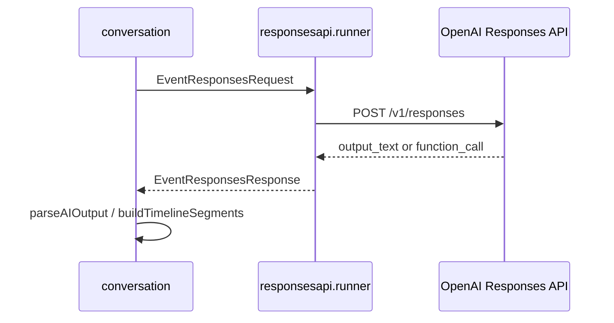
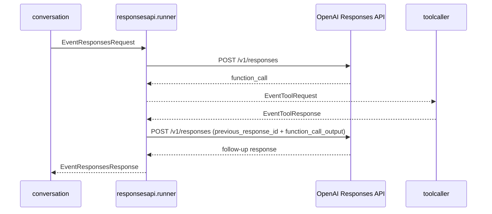

# 3. LLM連携と出力契約

元ページ: https://www.notion.so/31db3ffbf12e81a999edd516ceca0f6b

## 1. ビジネスコンテキスト
- **解決する課題**: 音声会話向け assistant 応答では、自由文をそのまま返すだけでは制御しづらい。待機、短い連続発話、tool call、whiteboard 表示、tool 実行後の継続をアプリ側で安定して扱うためには、LLM 出力に明確な契約が必要になる。
- **ターゲットユーザー**: スマートスピーカー利用者、OpenAI Responses API 連携を保守する開発者、会話契約や tool 追加を行う開発者。
- **価値定義**: LLM の生成能力を使いつつ、会話進行はアプリ側で制御できる。通常応答、tool call、tool result 後の follow-up を一貫して扱える。
- **現在の設計方針**: OpenAI Responses API を使い、通常応答は `timeline + optional whiteboard` の JSON を返させる。外部操作が必要なときだけ function call を使う。JSON 契約は API の `response_format` ではなく system prompt により強制し、invalid response は `conversation` 側で 1 回だけ retry する。

## 2. 論理構造・機能俯瞰
**主要なモデル・コンポーネント**
- **`system_prompt.txt`**
  - assistant の会話スタイルと JSON 出力契約を定義する。
  - `timeline` / `whiteboard` の形式、speech / wait の使い分け、tool 利用方針を指示する。
- **`responsesapi.Client`**
  - OpenAI Responses API への HTTP 通信を行う。
  - `CreateResponse` と `SubmitToolOutput` を持つ。
- **`responsesapi.runner`**
  - `ResponsesRequest` と `ToolResponse` を受け、OpenAI 呼び出しへ変換する stage。
  - tool 継続に必要な `previous_response_id` / `call_id` の対応を内部保持する。
- **`types.ResponsesRequest / ResponsesResponse`**
  - `conversation` と `responsesapi` の間でやり取りする内部 DTO。
  - 通常会話、tool 強制実行、tool 継続応答の共通入力/出力になる。
- **`conversation`**
  - JSON 契約の検証、timeline 化、whiteboard event emit、invalid retry を担当する。
  - LLM が返した `aiSegment` を正規化済み `timelineSegment` に変換して internal state へ積む。
- **`toolcaller`**
  - `ToolRequest` を受けてローカル handler を実行し、`ToolResponse` を返す。
- **`sessionlifecycle`**
  - idle timeout 時に `write_diary` 強制 request を出す。
  - `write_diary` は通常会話用 tools からは除外される。

**責務境界の考え方**
- LLM は「何を返すか」を決める。
- `conversation` は「どう解釈し、どう進行させるか」を決める。
- `toolcaller` は「どう実行するか」を担当する。
- つまり、生成・解釈・実行の三者を分離している。

## 3. 主要なデータフロー
### シナリオ: 通常応答を生成して会話へ戻すまで
1. **会話要求生成**: `conversation` が `ResponsesRequest` を作る。
  - 会話履歴、system context、利用可能 tool 定義がここに乗る。
2. **API 呼び出し**: `responsesapi.runner` が system prompt を付加し、`Client.CreateResponse` を呼ぶ。
3. **応答抽出**: `Client` が Responses API の `output` 配列から text と function call を抽出する。
4. **内部イベント化**: `runner` が `EventResponsesResponse` を `conversation` へ返す。
5. **契約検証**: `conversation` が `parseAIOutput` で `timeline + optional whiteboard` を検証する。
6. **会話進行反映**: valid なら timeline を internal state に積み、whiteboard があれば `EventWhiteboardUpdate` を emit する。



### シナリオ: tool call を挟んで follow-up 応答を返すまで
1. **function call 抽出**: OpenAI が `function_call` を返す。
2. **tool 実行要求**: `responsesapi.runner` が `ToolRequest` を emit する。
3. **ローカル実行**: `toolcaller` が handler を実行し、`ToolResponse` を返す。
4. **tool output 再投入**: `responsesapi.runner` が `previous_response_id` と `call_id` を使って `Client.SubmitToolOutput` を呼ぶ。
5. **follow-up 応答受信**: OpenAI が tool 結果を踏まえた次の応答を返す。
6. **会話継続**: `runner` が `EventResponsesResponse` として `conversation` に戻す。



### シナリオ: idle timeout 時に `write_diary` を強制するまで
1. **activity 蓄積**: `conversation` が `ConversationSnapshotUpdated` / `ConversationActivity` を流す。
2. **session policy 発火**: `sessionlifecycle` が idle timeout で `write_diary` 専用の `ResponsesRequest` を出す。
3. **tool choice 固定**: `ToolChoice` が `write_diary` に固定されたまま Responses API を呼ぶ。
4. **tool 実行**: `toolcaller` が `write_diary` を実行し、`ToolResponse` を返す。
5. **会話終了**: `sessionlifecycle` が `EventSessionClear` を返す。

## 4. 詳細設計
### クラス設計
- `system_prompt.txt`: assistant の出力契約と会話スタイルを定義する。
- `internal/`
  - `components/`
    - `responsesapi/`
      - `client.go`: OpenAI Responses API の HTTP client。
        - `CreateResponse`: 通常応答を生成する。
        - `SubmitToolOutput`: tool result を再投入して follow-up 応答を取得する。
      - `runner.go`: Responses API 連携 stage。
        - `handleRequest`: `ResponsesRequest` を OpenAI 呼び出しへ変換する。
        - `handleToolResponse`: tool result を follow-up 応答取得へ変換する。
        - `handleResponsesResponse`: text / tool call を内部 event に変換する。
    - `toolcaller/`
      - `toolcaller.go`: `ToolRequest` を実行し `ToolResponse` を返す。
        - `dispatchTool`: tool 実行 goroutine を起動する。
        - `executeTool`: 引数 decode、handler 実行、結果 encode を行う。
    - `conversation/`
      - `response_contract.go`: LLM 応答 JSON の DTO と妥当性検証。
        - `parseAIOutput`: `timeline + optional whiteboard` 契約を検証する。
      - `rule_responses.go`: LLM 応答を会話 state へ反映する rule。
        - `Apply`: invalid retry、whiteboard emit、timeline 反映を行う。
        - `buildTimelineSegments`: `aiSegment` を正規化済み internal timeline へ変換する。
    - `sessionlifecycle/`
      - `sessionlifecycle.go`: idle timeout 時に `write_diary` 専用 request を生成する。
  - `types/`
    - `types.go`: `ResponsesRequest`, `ResponsesResponse`, `ChatMessage`, `WhiteboardUpdate` などの内部 DTO。
    - `event.go`: `ToolRequest`, `ToolResponse` など event graph の payload 定義。

### API設計
- `POST https://api.openai.com/v1/responses`: 通常応答生成、および tool output を含む継続応答生成。
  - リクエスト: `{ "model": "...", "input": [...], "tools": [...], "tool_choice": any, "previous_response_id": "..." }`
  - レスポンス利用箇所:
    - `id`: `ResponseID` として保持する。
    - `output[]`: `output_text` / `message` / `function_call` を抽出する。
- **補足**: 現在の実装は `response_format` や JSON schema ではなく、`system_prompt.txt` の指示で JSON 契約を強制している。

### 出力契約
**通常応答**
```json
{
  "timeline": [
    {"type":"wait","sec":1},
    {"type":"speech","text":"こんにちは"}
  ],
  "whiteboard": {
    "content": "- 10:00 会議"
  }
}
```
- `timeline` は必須。
- `whiteboard` は任意。
- `speech` は読み上げる本文。
- `wait` は会話の間。
- `whiteboard` はアプリ画面の補助表示であり、tool call ではない。

**tool call**
- OpenAI Responses API の `function_call` として返る。
- `responsesapi.Client.extractToolCalls` が `ToolRequest` へ変換する。

**tool result 継続**
- `toolcaller` が返した `ToolResponse.Output` を `function_call_output` として再投入する。

### 設計上の重要ポイント
- **通常応答は JSON 契約で扱う**: 自由文ではなく `timeline` を返させることで、会話の間と短文発話をアプリ側で制御できる。
- **whiteboard は通常応答の一部**: `set_whiteboard` のような tool ではなく、通常応答 JSON の optional field になっている。
- **tool call は必要時だけ使う**: 外部状態の変更や外部取得が必要なときだけ function call を使う。
- **invalid response の回復は conversation 側で行う**: Responses API 側ではなく `conversation` 側が 1 回だけ retry する。
- **`write_diary` は通常会話から分離する**: idle timeout の会話終了処理としてだけ使い、通常会話用 tool 定義からは除外する。

## 5. 参照実装
- `system_prompt.txt`
- `internal/components/responsesapi/client.go`
- `internal/components/responsesapi/runner.go`
- `internal/components/toolcaller/toolcaller.go`
- `internal/components/conversation/response_contract.go`
- `internal/components/conversation/rule_responses.go`
- `internal/components/sessionlifecycle/sessionlifecycle.go`
- `internal/tools/registry/registry.go`
- `internal/tools/functions/diary/tool.go`
- `internal/tools/functions/googlecalendar/tool.go`
- `internal/types/event.go`
- `internal/types/types.go`
