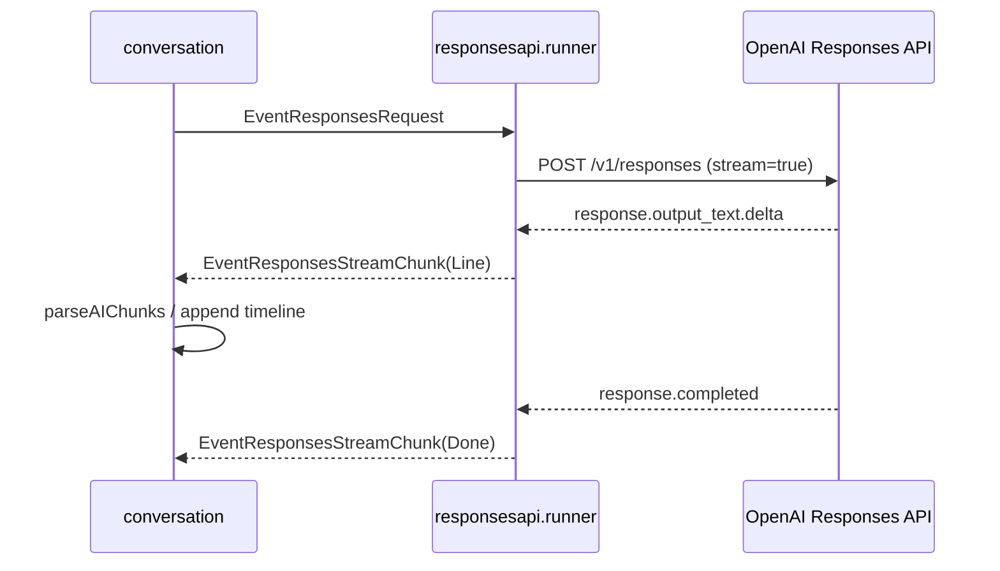
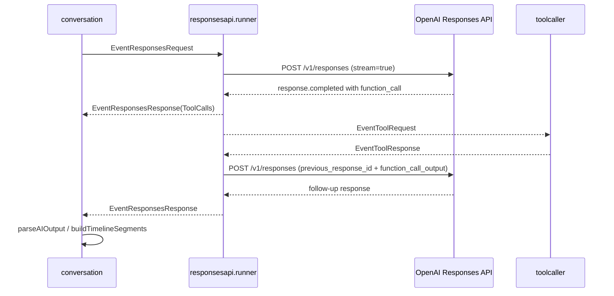

# 3. LLM連携と出力契約

元ページ: https://www.notion.so/31db3ffbf12e81a999edd516ceca0f6b

## 1. ビジネスコンテキスト
- **解決する課題**: 音声会話向け assistant 応答では、自由文をそのまま返すだけでは制御しづらい。短い発話、待機、streaming 中の逐次読み上げ、tool call、whiteboard 表示、tool 実行後の継続をアプリ側で安定して扱うためには、LLM 出力に明確な契約が必要になる。
- **ターゲットユーザー**: スマートスピーカー利用者、OpenAI Responses API 連携を保守する開発者、会話契約や tool 追加を行う開発者。
- **価値定義**: LLM の生成能力を使いつつ、会話進行はアプリ側で制御できる。通常応答、stream chunk、tool call、tool result 後の follow-up を一貫して扱える。
- **現在の設計方針**: OpenAI Responses API を使い、通常応答は streaming で受け取った `response.output_text.delta` から 1 行 1 JSON object の NDJSON chunk を復元する。whiteboard 更新や外部操作が必要なときは Responses API の function call を使う。JSON 契約は API の `response_format` ではなく `system_prompt.txt` により強制し、invalid response は `conversation` 側で条件付きで 1 回だけ retry する。

## 2. 論理構造・機能俯瞰
**主要なモデル・コンポーネント**
- **`system_prompt.txt`**
  - assistant の会話スタイルと NDJSON 出力契約を定義する。
  - `speech` / `wait` の形式、streaming 前提の出力順序、tool 利用方針を指示する。
- **`responsesapi.Client`**
  - OpenAI Responses API への HTTP 通信を行う。
  - `CreateResponseStream`、`CreateResponse`、`SubmitToolOutput` を持つ。
  - streaming では SSE の `response.output_text.delta` / `response.completed` / `response.failed` を処理する。
- **`responsesapi.runner`**
  - `ResponsesRequest` と `ToolResponse` を受け、OpenAI 呼び出しへ変換する stage。
  - 通常要求では `CreateResponseStream` を呼び、復元済み NDJSON 行を `EventResponsesStreamChunk` として流す。
  - tool 継続に必要な `previous_response_id` / `call_id` と元 request ID の対応を内部保持する。
- **`types.ResponsesRequest / ResponsesResponse / ResponsesStreamChunk`**
  - `conversation` と `responsesapi` の間でやり取りする内部 DTO。
  - 通常会話、stream chunk、tool 強制実行、tool 継続応答の共通入力/出力になる。
- **`conversation`**
  - NDJSON 契約の検証、timeline 化、stream chunk の逐次反映、invalid retry を担当する。
  - LLM が返した `speech` / `wait` chunk を正規化済み `timelineSegment` に変換して internal state へ積む。
- **`toolcaller`**
  - `ToolRequest` を受けてローカル handler を goroutine で実行し、JSON object の `ToolResponse` を返す。
- **`sessionlifecycle`**
  - idle timeout 時に `write_diary` 強制 request を出す。
  - `write_diary` は通常会話用 tools からは除外され、idle timeout の日記保存専用 tool として渡される。

**責務境界の考え方**
- LLM は「何を返すか」を決める。
- `responsesapi` は「OpenAI の response / stream / function_call を内部 event に変換する」ことを担当する。
- `conversation` は「どう解釈し、どう進行させるか」を決める。
- `toolcaller` は「どう実行するか」を担当する。
- つまり、生成・API 変換・解釈・実行の責務を分離している。

## 3. 主要なデータフロー
### シナリオ: 通常応答を生成して会話へ戻すまで
1. **会話要求生成**: `conversation` が `ResponsesRequest` を作る。
  - 会話履歴、system context、利用可能 tool 定義がここに乗る。
2. **API 呼び出し**: `responsesapi.runner` が system prompt に現在日時を追記し、`Client.CreateResponseStream` を呼ぶ。
3. **stream event 処理**: `Client` が SSE の `response.output_text.delta` を結合し、改行ごとに復元済み NDJSON 行を callback へ渡す。
4. **内部イベント化**: `runner` が各行を `EventResponsesStreamChunk` として `conversation` へ返す。
5. **逐次契約検証**: `conversation` が `parseAIChunks` で `speech` / `wait` の NDJSON chunk を検証する。
6. **会話進行反映**: valid な chunk は `timelineSegment` に正規化され、読み上げ可能になったものから timeline に積まれる。
7. **完了通知**: `response.completed` から response ID を取得できた場合、tool call がなければ `Done=true` の `EventResponsesStreamChunk` を返す。



### シナリオ: tool call を挟んで follow-up 応答を返すまで
1. **function call 抽出**: `response.completed.response.output[]` に `function_call` が含まれていた場合、`Client.extractToolCalls` が `ToolRequest` へ変換する。
2. **tool 実行要求**: `responsesapi.runner` が `EventResponsesResponse` を emit した後、`EventToolRequest` を emit する。
  - `conversation` は `ToolCalls` を含む `EventResponsesResponse` を会話本文としては処理しない。
3. **ローカル実行**: `toolcaller` が handler を実行し、結果 map を JSON object に encode して `ToolResponse.Output` に入れる。
4. **tool output 再投入**: `responsesapi.runner` が `previous_response_id` と `call_id` を使って `Client.SubmitToolOutput` を呼ぶ。
5. **follow-up 応答受信**: OpenAI が tool 結果を踏まえた次の response を返す。
  - 現行実装では tool result 継続は非 streaming の `SubmitToolOutput` で取得する。
6. **会話継続**: `runner` が follow-up を `EventResponsesResponse` として `conversation` に戻す。text があり tool call がなければ `parseAIOutput` で NDJSON 契約を検証し、timeline に反映する。



### シナリオ: idle timeout 時に `write_diary` を強制するまで
1. **activity 蓄積**: `conversation` が `ConversationSnapshotUpdated` / `ConversationActivity` を流す。
2. **session policy 発火**: `sessionlifecycle` が idle timeout で `write_diary` 専用の `ResponsesRequest` を出す。
3. **tool choice 固定**: `ToolChoice` が `{"type":"function","name":"write_diary"}` に固定されたまま Responses API を呼ぶ。
  - `SystemPrompt` は空文字に上書きされ、`Tools` には `write_diary` 定義だけが渡される。
4. **tool 実行**: `toolcaller` が `write_diary` を実行し、`ToolResponse` を返す。
5. **会話終了**: `sessionlifecycle` が `write_diary` の `ToolResponse` を受けると `EventSessionClear` を返す。

## 4. 詳細設計
### クラス設計
- `system_prompt.txt`: assistant の NDJSON 出力契約と会話スタイルを定義する。
- `internal/`
  - `components/`
    - `responsesapi/`
      - `client.go`: OpenAI Responses API の HTTP client。
        - `CreateResponse`: 非 streaming の通常応答を生成する。現行 runner の通常会話経路では使われていない。
        - `CreateResponseStream`: `stream=true` で応答を生成し、`response.output_text.delta` から NDJSON 行を復元する。
        - `SubmitToolOutput`: `function_call_output` を再投入して follow-up 応答を取得する。
        - `readResponseStream`: SSE の `data:` 行を読み、`response.output_text.delta` / `response.completed` / `response.failed` を処理する。
        - `extractToolCalls`: completed response の `output[]` から `function_call` を抽出する。
      - `runner.go`: Responses API 連携 stage。
        - `handleRequest`: `ResponsesRequest` を streaming OpenAI 呼び出しへ変換する。
        - `handleToolResponse`: tool result を follow-up 応答取得へ変換する。
        - `handleResponsesResponse`: text / tool call を内部 event に変換する。
    - `toolcaller/`
      - `toolcaller.go`: `ToolRequest` を実行し `ToolResponse` を返す。
        - `dispatchTool`: tool 実行 goroutine を起動する。
        - `executeTool`: 引数 decode、handler 実行、結果 encode を行う。
    - `conversation/`
      - `response_contract.go`: LLM 応答 JSON の DTO と妥当性検証。
        - `parseAIChunk`: 1 行の `speech` / `wait` chunk を検証する。
        - `parseAIChunks`: 1 行または複数行の NDJSON chunk を検証する。
        - `parseAIOutput`: 非 streaming response 全体を NDJSON として検証する。
      - `rule_responses_stream.go`: streaming chunk を会話 state へ反映する rule。
        - `Apply`: chunk 単位の契約検証、逐次 timeline 反映、stream 完了処理を行う。
        - `failStream`: invalid chunk や stream error の回復処理を行う。
        - `completeStream`: stream 完了時に no speech を検出し、必要なら retry する。
      - `rule_responses.go`: 非 streaming の LLM 応答を会話 state へ反映する rule。
        - `Apply`: tool call 応答の無視、invalid retry、timeline 反映を行う。
        - `buildTimelineSegments`: `aiSegment` を正規化済み internal timeline へ変換する。
      - `runtime_request.go`: `requestResponseEffect` から `EventResponsesRequest` を emit する。
    - `sessionlifecycle/`
      - `sessionlifecycle.go`: idle timeout 時に `write_diary` 専用 request を生成する。
  - `types/`
    - `types.go`: `ResponsesRequest`, `ResponsesResponse`, `ResponsesStreamChunk`, `ChatMessage`, `WhiteboardUpdate` などの内部 DTO。
    - `event.go`: `ToolRequest`, `ToolResponse` など event graph の payload 定義。

### API設計
- `POST https://api.openai.com/v1/responses`: 通常応答生成、および tool output を含む継続応答生成。
  - 通常 streaming request: `{ "model": "...", "input": [...], "stream": true, "tools": [...], "tool_choice": ... }`
  - tool 継続 request: `{ "model": "...", "input": [{"type":"function_call_output","call_id":"...","output":"..."}], "previous_response_id": "...", "tools": [...] }`
  - `input` には `system` role の prompt と `ChatMessage` の履歴を入れる。
  - `tools` は request ごとの `Tools` が nil でなければそれを優先し、nil の場合は client 初期化時の default tools を使う。
  - 通常会話の default tools は `write_diary` を除外した registry 定義で、`web_search` も tools 配列に含まれる。
  - レスポンス利用箇所:
    - `id`: `ResponseID` として保持する。
    - `output[]`: 非 streaming text 抽出、および completed response からの `function_call` 抽出に使う。
    - SSE `response.output_text.delta`: streaming 中の NDJSON 行復元に使う。
    - SSE `response.completed`: response ID と tool call 抽出に使う。
    - SSE `response.failed`: stream error として扱う。
- **補足**: 現在の実装は `response_format` や JSON schema ではなく、`system_prompt.txt` と invalid retry hint で NDJSON 契約を強制している。

### 出力契約
**通常応答**
```json
{"type":"wait","sec":1}
{"type":"speech","text":"こんにちは"}
```
- 通常応答は 1 行 1 JSON object の NDJSON。
- top-level の `{"timeline":[...]}` object、JSON array、plain text、Markdown コードブロック、説明文は無効。
- `speech` は読み上げる本文で、空文字は無効。
- `wait` は会話の間で、`sec` は整数必須。
- 実装上は `wait.sec` を 0〜5 秒に正規化する。system prompt 上は 1〜5 秒を指示している。
- 非 streaming response 全体を扱う `parseAIOutput` は少なくとも 1 つの `speech` を要求する。streaming では chunk ごとの `parseAIChunks` ではなく、`completeStream` が stream 全体の no speech を検出する。
- `speech.text` は timeline 化時に URL、Markdown link、citation 表記を除去する。
- whiteboard は通常応答に含めず、`set_whiteboard` tool call で更新する。

**stream event**
- OpenAI SSE の `response.output_text.delta` を文字列として蓄積し、改行が現れた時点で 1 行分の NDJSON chunk として `EventResponsesStreamChunk.Line` に流す。
- stream 終了時に改行なしの残バッファがあれば 1 chunk として flush する。
- `response.completed` は completed response を保持し、response ID と tool call 抽出に使う。
- `response.failed` は `EventResponsesStreamChunk.Err` 相当の失敗として `conversation` に伝わる。
- `conversation` は chunk ごとに `parseAIChunks` で検証し、valid な `speech` / `wait` をすぐ timeline に積む。
- stream 中に invalid chunk が出た場合、まだ `speech` を開始していなければ invalid retry 対象になる。すでに `speech` を開始していた場合は retry せず、pending timeline を破棄して終了する。
- stream が完了しても `speech` が 1 つもなければ invalid response として retry 対象になる。

**tool call**
- OpenAI Responses API の completed response `output[]` 内の `function_call` として返る。
- `responsesapi.Client.extractToolCalls` が `name`, `call_id`, `arguments` を `ToolRequest` へ変換する。
- `arguments` が空の場合は `{}` に補正する。`call_id` がない function call は無視する。
- `responsesapi.runner` は `ToolCallID` ごとに元の `ResponseID` と `RequestID` を保持し、tool result 継続時に使う。

**tool result 継続**
- `toolcaller` が返した `ToolResponse.Output` を `function_call_output` として再投入する。
- 再投入時の `call_id` は `ToolResponse.ToolCallID` を使い、`previous_response_id` は元 response の `ResponseID` を使う。
- follow-up response が text を返した場合は `EventResponsesResponse` として `conversation` に渡され、通常応答と同じ NDJSON 契約で検証される。
- follow-up response がさらに tool call を返した場合は、同じ `handleResponsesResponse` 経路で追加の `EventToolRequest` が発行される。

### 設計上の重要ポイント
- **通常応答は streaming NDJSON 契約で扱う**: 自由文ではなく `speech` / `wait` chunk を返させ、`response.output_text.delta` から改行単位で復元することで、会話の間と短文発話をアプリ側で逐次制御できる。
- **streaming と tool 継続で処理経路が異なる**: 通常会話は `CreateResponseStream` と `EventResponsesStreamChunk`、tool result 後は `SubmitToolOutput` と `EventResponsesResponse` を使う。
- **whiteboard は tool**: `set_whiteboard` の function call で更新し、通常応答 JSON には含めない。
- **tool call は completed response から抽出する**: 現行実装は streaming 中の function call delta ではなく、`response.completed.response.output[]` の `function_call` を内部 `ToolRequest` に変換する。
- **tool call は必要時だけ使う**: 外部状態の変更、外部取得、画面表示更新が必要なときだけ function call を使う。
- **invalid response の回復は conversation 側で行う**: Responses API 側ではなく `conversation` 側が 1 回だけ retry する。streaming では発話開始前の invalid chunk と no speech 完了が retry 対象で、発話開始後の invalid chunk は retry しない。
- **`write_diary` は通常会話から分離する**: idle timeout の会話終了処理としてだけ使い、通常会話用 tool 定義からは除外する。

## 5. 参照実装
- `system_prompt.txt`
- `cmd/smart-speaker/main.go`
- `internal/components/responsesapi/client.go`
- `internal/components/responsesapi/runner.go`
- `internal/components/responsesapi/client_test.go`
- `internal/components/toolcaller/toolcaller.go`
- `internal/components/conversation/response_contract.go`
- `internal/components/conversation/response_contract_test.go`
- `internal/components/conversation/rule_responses.go`
- `internal/components/conversation/rule_responses_stream.go`
- `internal/components/conversation/runtime_request.go`
- `internal/components/conversation/core.go`
- `internal/components/conversation/rule_tool_response.go`
- `internal/components/sessionlifecycle/sessionlifecycle.go`
- `internal/tools/interfaces.go`
- `internal/tools/registry/registry.go`
- `internal/tools/functions/diary/tool.go`
- `internal/tools/functions/googlecalendar/tool.go`
- `internal/tools/functions/timer/tool.go`
- `internal/tools/functions/whiteboard/tool.go`
- `internal/types/event.go`
- `internal/types/types.go`
