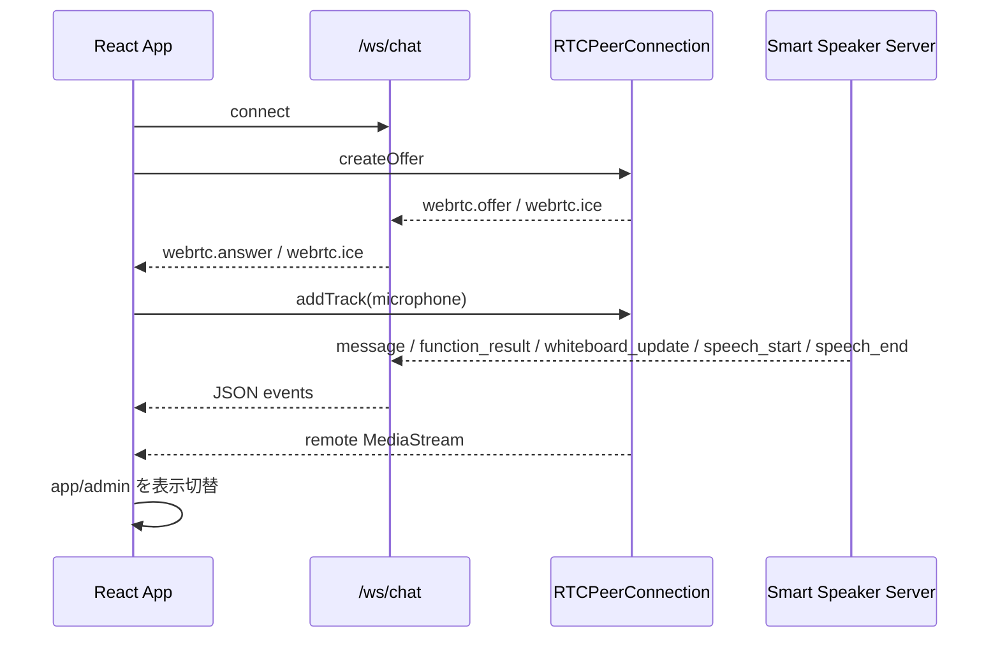

# 4. Webフロントと接続ライフサイクル

元ページ: https://www.notion.so/31db3ffbf12e813e9f87ef756871d095

## 1. ビジネスコンテキスト
- **目的**: 利用者がブラウザだけで、接続、音声入出力、状態確認、会話の閲覧を行えるようにする。
- **価値**: 専用ネイティブアプリ無しで、スマートスピーカー体験をそのまま Web に載せられる。
- **現在の設計方針**: 1つの React アプリの中に **管理画面** と **アプリ画面** を持ち、内部ロジックは共有しつつ表示だけを切り替える。

## 2. 現在の UI 構成
### 管理画面
管理画面はデバッグと運用のための画面である。
- 接続 / 切断
- Google 認証開始
- pipeline 状態の詳細表示
- メッセージ一覧
- function call / function result の生表示
- テキスト送信
- アプリ画面への切り替え

### アプリ画面
アプリ画面は実運用向けのシンプル画面である。
- 接続トグル
- 管理画面への遷移ボタン
- 最低限の状態表示
  - 接続
  - マイク
  - 認識
- assistant の直近発話を出す吹き出し
- whiteboard 表示領域
- ミニキャラ配置用のプレースホルダ
重要なのは、**管理画面とアプリ画面でロジックを分けていない** 点である。両方を同じ React state の上で描画し、表示だけを切り替えるため、画面切替で WebSocket や WebRTC を落とさずに済む。

## 3. 表示モードの設計
- `?ui=admin` または `/admin` 相当の URL で管理画面を出す
- 未指定時はアプリ画面を出す
- 実装上は両画面とも DOM 上に残し、`display` だけを切り替える
この構成にしている理由:
- 画面切替のたびに `<audio>` や `RTCPeerConnection` を作り直したくない
- 接続状態を UI ごとに二重管理したくない
- 実運用画面とデバッグ画面を同時に保守しやすい

## 4. 論理構造・機能俯瞰
**主要なモデル・コンポーネント**
- **`App`**
  - 画面全体のロジック本体
  - WebSocket、WebRTC、メッセージ一覧、接続状態、STT 状態、ボード内容、再生音量を持つ
- **`LiveView`**
  - アプリ画面の表示専用コンポーネント
  - 吹き出し、whiteboard、接続トグル、簡易ステータスを描画する
- **`createWS`**
  - `/ws/chat` 向け WebSocket ラッパー
- **`RTCPeerConnection`** 管理
  - マイク音声 uplink と assistant 音声 downlink を担当する
- **`audio`** 要素
  - WebRTC で受けた MediaStream の再生先
- **service worker / manifest**
  - PWA としてホーム画面追加し、standalone 起動を可能にする

## 5. 主要なデータフロー
### シナリオ: 接続開始
1. 管理画面またはアプリ画面から接続操作を行う
2. WebSocket を `/ws/chat` に接続する
3. `startRTC` が `RTCPeerConnection` を作る
4. `getUserMedia` でマイクを取得し、audio track を peer に載せる
5. offer / answer / ICE を WebSocket 経由でやり取りする
6. assistant 音声の remote stream を `<audio>` にアタッチする

### シナリオ: サーバーからのイベント反映
1. `message` を受けたらメッセージ一覧へ追加する
2. `speech_start` / `speech_end` を受けたら STT 状態を更新する
3. `whiteboard_update` を受けたらボード表示を更新する
4. `function_result` のうち `set_volume` は再生音量 state に反映する
5. WebRTC signaling (`webrtc.answer`, `webrtc.ice`) を peer に反映する

### シナリオ: 画面切替
1. URL パラメータを書き換える
2. `uiMode` を切り替える
3. DOM は維持したまま表示だけ切り替える
4. 接続状態、メッセージ、音声再生は継続する

## 6. 画面状態の意味
### 接続系
- `connected`
  - WebSocket 接続が張れているか
- `rtcStatus`
  - WebRTC の接続状態
- `audioSendStatus`
  - マイクの outbound RTP が実際に流れているか

### 音声認識系
- `speechDetectStatus`
  - サーバー VAD が現在発話を検知しているか
- `sttStatus`
  - Google STT が待機中 / 認識中 / 最終結果待ち / 完了のどこにいるか

### UI 反映系
- `playbackVolumePercent`
  - `set_volume` の結果を受けて更新される
- `boardText`
  - `whiteboard_update` を受けて更新される
- `lastAssistantMessage`
  - アプリ画面の吹き出しに出す直近 assistant 発話

## 7. 詳細設計
### クラス設計
- `web/src/main.tsx`
  - 画面本体
  - `connect`
    - WebSocket と WebRTC を起動する
  - `disconnect`
    - 接続を明示的に閉じる
  - `handleChatMessage`
    - サーバーイベントを UI state に反映する
  - `handleVolumeToolResult`
    - `set_volume` の結果を音量 state と `<audio>` に反映する
  - `setMode`
    - 管理画面 / アプリ画面の表示切替を行う
- `web/src/ws.ts`
  - WebSocket ラッパー
- `web/index.html`
  - `manifest.webmanifest` を読み込む
- `web/public/manifest.webmanifest`
  - PWA manifest
- `web/public/sw.js`
  - service worker

### API設計
- `GET /ws/chat`
  - WebSocket 接続先
  - 送信:
    - `message`
    - `webrtc.offer`
    - `webrtc.ice`
  - 受信:
    - `message`
    - `function_call`
    - `function_result`
    - `whiteboard_update`
    - `speech_start`
    - `speech_end`
    - `webrtc.answer`
    - `webrtc.ice`
- `GET /oauth/google/start`
  - Google OAuth 開始
- `GET /oauth/google/status`
  - Google OAuth 認証状態確認

## 8. 現在の設計上の重要ポイント
- **reset UI は廃止済み**
  - 以前の `おやすみ` ボタンと `reset` メッセージ送信は削除されている
- **UI 切替で音声を切らない**
  - app/admin を別ページではなく、同一 state 上の別表示として扱う
- **PWA 対応済み**
  - `display: standalone` でホーム画面起動時にブラウザ UI を薄くできる
- **whiteboard は tool result ではなく専用イベントで更新する**
  - 現在は `function_result(set_whiteboard)` ではなく、通常応答から派生した `whiteboard_update` を受ける
- **文字起こしはサーバー側**
  - ブラウザの Web Speech API ではなく、サーバー側 Google STT を使う

## 9. 参照実装
- `web/src/main.tsx`
- `web/src/ws.ts`
- `web/index.html`
- `web/public/manifest.webmanifest`
- `web/public/sw.js`
- `internal/components/wschat/wschat.go`
- `README.md`
