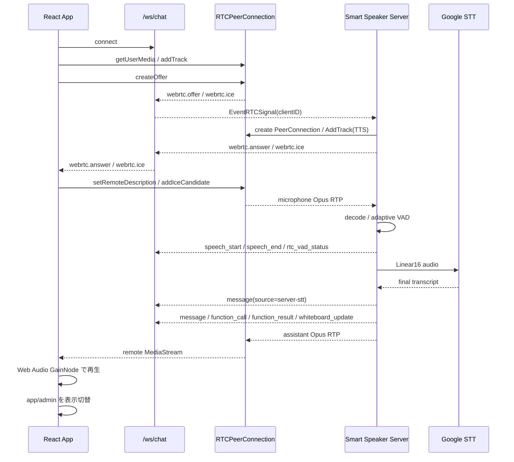

# 4. Webフロントと接続ライフサイクル

元ページ: https://www.notion.so/31db3ffbf12e813e9f87ef756871d095

## 1. ビジネスコンテキスト
- **目的**: 利用者がブラウザだけで、接続、音声入出力、状態確認、会話の閲覧を行えるようにする。
- **価値**: 専用ネイティブアプリ無しで、スマートスピーカー体験を Web に載せられる。
- **現在の設計方針**: 1つの React アプリの中に **アプリ画面** と **管理画面** を持ち、WebSocket、WebRTC、会話、音声、状態表示の state は共有し、表示だけを切り替える。
- **接続の前提**: UI は HTTP サーバーが配信する SPA として動き、WebSocket は `/ws/chat`、Google OAuth は `/oauth/google/*`、WebRTC signaling は WebSocket 上の JSON メッセージとして扱う。

## 2. 現在の UI 構成
### 管理画面
管理画面はデバッグと運用のための画面である。`?ui=admin` または `/admin` で表示される。
- 接続 / 切断
- Google 認証開始
- アプリ画面への切り替え
- pipeline 状態の詳細表示
  - WebRTC接続
  - マイクストリーム送信
  - サーバー発話検知
  - Google文字起こし
- 音声エラーと文字起こしエラーの表示
- 現在の再生音量プリセット表示
- メッセージ一覧
  - user / assistant / system
  - `function_call`
  - `function_result`
- テキスト送信

### アプリ画面
アプリ画面は実運用向けのシンプル画面である。URL 指定がなければこちらを表示する。
- 接続トグル
- 管理画面への遷移ボタン
- VAD 状態の簡易表示
  - 入力音量
  - しきい値
- 最低限の状態表示
  - 接続
  - マイク
  - 認識
- 再生音量スライダー
  - `quiet`
  - `low`
  - `normal`
  - `boost`
- whiteboard 表示領域
- 直近 user 発話と直近 assistant 発話の吹き出し
- キャラクターエリアとミニキャラ配置用の空領域

重要なのは、**管理画面とアプリ画面で接続ロジックを分けていない** 点である。両方を同じ React state の上で描画し、表示だけを切り替えるため、画面切替で WebSocket、RTCPeerConnection、マイク、remote stream、Web Audio の再生グラフを落とさずに済む。

## 3. 表示モードの設計
- `?ui=admin` または `/admin` で管理画面を出す。
- 未指定時はアプリ画面を出す。
- 実装上は両画面とも DOM 上に残し、ラッパーの `display` だけを切り替える。
- `setMode` は `history.pushState` で URL を `/?ui=admin` または `/` に更新し、`popstate` でも現在 URL から `uiMode` を復元する。
- `/admin` はサーバー側の SPA fallback によって `index.html` が返る。フロントは `pathname.startsWith('/admin')` を見て管理画面に入る。

この構成にしている理由:
- 画面切替のたびに `RTCPeerConnection`、マイクトラック、remote stream、Web Audio graph を作り直したくない。
- 接続状態を UI ごとに二重管理したくない。
- 実運用画面とデバッグ画面を同時に保守しやすい。
- PWA の standalone 起動時も、アプリ画面を既定表示にして操作を単純にできる。

## 4. 論理構造・機能俯瞰
**主要なモデル・コンポーネント**
- **`App`**
  - 画面全体のロジック本体
  - WebSocket、WebRTC、メッセージ一覧、接続状態、STT 状態、VAD 状態、whiteboard、再生音量プリセットを持つ
- **`LiveView`**
  - アプリ画面の表示専用コンポーネント
  - 接続トグル、管理画面ボタン、VAD 数値、簡易ステータス、音量スライダー、whiteboard、吹き出し、キャラクター領域を描画する
  - 22:00 から 06:00 までは1分ごとに夜間テーマへ切り替える
- **`createWS`**
  - `/ws/chat` 向け WebSocket ラッパー
  - JSON parse / stringify と open / close / send を薄く包む
- **`RTCPeerConnection` 管理**
  - ブラウザのマイク音声 uplink と assistant 音声 downlink を担当する
  - ブラウザが offer を作り、サーバーが answer を返す
  - ICE candidate は WebSocket 経由で交換する
- **Web Audio 再生グラフ**
  - WebRTC の remote stream を `AudioContext.createMediaStreamSource` につなぐ
  - `GainNode` で UI の再生音量プリセットを反映し、`AudioContext.destination` へ出力する
  - 現行 UI は `<audio>` 要素では再生していない
- **service worker / manifest**
  - PWA としてホーム画面追加し、standalone 起動を可能にする
  - service worker は `skipWaiting` と `clients.claim` のみで、fetch キャッシュは行っていない
- **server-side WebRTC / STT / TTS**
  - `internal/components/rtc` が signaling、マイク入力デコード、VAD、Google STT、assistant 音声の Opus downlink を担当する
  - TTS から来る base64 PCM を 48kHz にアップサンプリングし、Opus にエンコードして WebRTC track へ送る

## 5. 主要なデータフロー
### シナリオ: 接続開始
1. 管理画面またはアプリ画面から接続操作を行う。
2. `connect` が手動切断フラグと再接続カウンタを初期化し、`openConnection(false)` を呼ぶ。
3. WebSocket を `/ws/chat` に接続する。
4. WebSocket 接続後、`startRTC` が `RTCPeerConnection` を作る。
5. `getUserMedia` でマイクを取得し、音声 track を peer に載せる。
6. ブラウザが offer を作成し、`webrtc.offer` を WebSocket で送る。
7. サーバーは offer を受けて PeerConnection を作り、assistant 音声用の local track を追加し、answer を返す。
8. `webrtc.answer` と `webrtc.ice` を WebSocket 経由でやり取りし、双方の PeerConnection に反映する。
9. サーバーからの remote track を受けたら remote stream を Web Audio graph に接続し、GainNode 経由で再生する。
10. ブラウザは 1秒ごとに `getStats()` を見て outbound RTP の audio bytesSent を確認し、マイク送信状態を `確認中` / `待機中` / `送信中` / `確認失敗` に更新する。

### シナリオ: サーバーからのイベント反映
1. `message` を受けたら role に応じてメッセージ一覧へ追加する。
2. `message` が `source: "server-stt"` かつ user role の場合、STT 状態を `完了`、発話検知を `待機中` に戻す。
3. `speech_start` を受けたら発話検知を `検知中`、STT 状態を `認識中` にする。
4. `speech_end` を受けたら発話検知を `待機中`、STT 状態を `最終結果待ち` にする。
5. `rtc_vad_status` を受けたら入力音量としきい値を更新する。
6. `whiteboard_update` を受けたら空文字でない `content` を trim して whiteboard に反映する。
7. `function_call` / `function_result` は管理画面のメッセージ一覧に生表示する。
8. `webrtc.answer` / `webrtc.ice` はメッセージ一覧には出さず、PeerConnection に反映する。remote description 未設定時の ICE は一時キューに積む。

### シナリオ: 画面切替
1. 管理画面ボタンまたはアプリ画面ボタンを押す。
2. `setMode` が URL パラメータを更新する。
3. `uiMode` を切り替える。
4. DOM は維持したまま表示だけ切り替える。
5. 接続状態、WebSocket、RTCPeerConnection、マイクトラック、remote stream、Web Audio graph、メッセージ、whiteboard、再生音量は継続する。

## 6. 画面状態の意味
### 接続系
- `connected`
  - WebSocket 接続が張れているか。
  - UI 上のオンライン / オフライン表示の主判定であり、WebRTC 単体の状態ではない。
- `busy`
  - 接続処理中か。
  - 二重接続を防ぐ。
- `rtcStatus`
  - WebRTC の `connectionState` を UI 向け文字列にしたもの。
  - `停止中` / `接続中` / `接続済み` / `切断` / `失敗`
- `rtcError`
  - RTC、マイク、Web Audio graph、RTC stats で発生したエラーの表示用文字列。
- `audioSendStatus`
  - マイクの outbound RTP が実際に流れているか。
  - `getStats()` の audio `bytesSent` 差分で `確認中` / `待機中` / `送信中` / `確認失敗` を決める。

### 音声認識系
- `speechDetectStatus`
  - サーバー VAD が現在発話を検知しているか。
  - `speech_start` で `検知中`、`speech_end` または STT final message で `待機中` になる。
- `sttStatus`
  - Google STT が待機中 / 認識中 / 最終結果待ち / 完了 / エラーのどこにいるか。
  - マイク取得失敗やマイク track なしの場合は `エラー` になる。
- `sttError`
  - マイク取得失敗など、STT 入力に到達する前のエラーも含めて表示する。
- `inputLevel`
  - サーバー側 VAD が計測した現在フレームの平均振幅。
- `speechThreshold`
  - サーバー側 VAD の現在しきい値。

### UI 反映系
- `playbackVolumeLevel`
  - 再生音量プリセット。
  - `quiet` = 0.3倍、`low` = 0.6倍、`normal` = 1.0倍、`boost` = 1.5倍。
  - 現行実装では tool 結果ではなく、アプリ画面のスライダー操作で更新される。
- `boardText`
  - `whiteboard_update` を受けて更新される。
- `lastAssistantMessage`
  - アプリ画面の吹き出しに出す直近 assistant 発話。
- `lastUserMessage`
  - アプリ画面の吹き出しに併記する直近 user 発話。
- `messages`
  - 管理画面のログ表示と `lastAssistantMessage` / `lastUserMessage` の元データ。

## 7. 詳細設計
### クラス設計
- `web/src/main.tsx`
  - 画面本体。
  - `connect`
    - 手動切断フラグを解除し、再接続カウンタとタイマーを初期化して WebSocket と WebRTC を起動する。
  - `openConnection`
    - WebSocket 接続、受信ハンドラ登録、close 時の RTC 停止、自動再接続、初回接続メッセージ追加を担当する。
  - `disconnect`
    - 手動切断フラグを立て、再接続を止め、RTC と WebSocket を閉じる。
  - `scheduleReconnect`
    - 手動切断でない WebSocket close に対して、最大10回、1秒開始の指数バックオフで再接続する。
  - `startRTC`
    - PeerConnection を作り、マイク track を追加し、offer を送信する。
  - `stopRTC`
    - PeerConnection、マイク track、remote stream、Web Audio graph、pending ICE、RTC/STT/VAD 状態を破棄または初期化する。
  - `handleChatMessage`
    - サーバーイベントを UI state に反映する。
  - `handleRTCSignal`
    - `webrtc.answer` / `webrtc.ice` を PeerConnection に反映する。
  - `connectRemoteStreamToAudioGraph`
    - remote stream を `MediaStreamAudioSourceNode`、`GainNode`、`AudioContext.destination` に接続する。
  - `setMode`
    - 管理画面 / アプリ画面の表示切替を行う。
  - `LiveView`
    - アプリ画面の表示を担当する。
- `web/src/ws.ts`
  - WebSocket ラッパー。
  - `connect` は open で resolve、error で reject、message で JSON parse、close で callback を呼ぶ。
  - `send` は socket が open のときだけ JSON を送る。
- `web/src/audio.ts`
  - base64 PCM を Web Audio API で順次再生する helper。
  - 現行の `main.tsx` からは import されておらず、現在のブラウザ再生経路は WebRTC remote stream である。
- `web/public/manifest.webmanifest`
  - PWA manifest。
  - `display: "standalone"`、`start_url: "/"`、SVG icon を定義する。
- `web/public/sw.js`
  - service worker。
  - install で `skipWaiting`、activate で `clients.claim` を行う。
  - fetch handler は空で、offline cache は提供しない。
- `internal/components/wschat/wschat.go`
  - `/ws/chat` を登録する。
  - 接続ごとに `ws-N` の client ID を付与し、signaling event は対象 client にだけ返す。
  - 通常イベントは接続中の全 client に broadcast する。
- `internal/components/rtc/*`
  - `signaling.go`
    - offer / answer / ICE の処理、PeerConnection 作成、assistant 音声用 track 追加、client 別 peer state 管理を担当する。
  - `input.go`
    - ブラウザマイクの Opus RTP を decode し、mono PCM に変換し、adaptive VAD と Google STT へ渡す。
  - `output.go`
    - TTS の base64 PCM を decode し、48kHz にアップサンプリングして Opus RTP として各 peer へ送る。
  - `rtc.go`
    - graph stage として RTC signal、TTS 音声、TTS cancel を受け、RTC / STT event を下流に出す。
- `cmd/smart-speaker/main.go`
  - HTTP server、Web UI、OAuth handler、wschat、rtc、tts、conversation、responses、tool、session lifecycle の stage を構築して graph に接続する。
  - Web UI は `web/dist` を配信し、静的ファイルが存在しない拡張子なし path は SPA fallback として `index.html` を返す。

### API設計
- `GET /ws/chat`
  - WebSocket 接続先。
  - クライアント送信:
    - `message`
      - `role`
      - `text`
    - `webrtc.offer`
      - `sdp`
    - `webrtc.ice`
      - `candidate`
    - `webrtc.answer`
      - サーバー側 handler は存在するが、現行ブラウザ UI の通常フローでは送らない。
  - サーバー受信後の内部 event:
    - `message` は `EventTextInput`
    - `webrtc.*` は `EventRTCSignal`
  - サーバー送信:
    - `message`
      - `role`
      - `text`
      - `response_id`
      - `final`
      - `source`
    - `function_call`
      - `tool_call_id`
      - `name`
      - `arguments`
      - `response_id`
    - `function_result`
      - `tool_call_id`
      - `name`
      - `output`
    - `speech_start`
      - `source`
      - `captured_at`
    - `speech_end`
      - `source`
      - `captured_at`
    - `rtc_vad_status`
      - `input_level`
      - `threshold`
      - `captured_at`
    - `whiteboard_update`
      - `content`
    - `webrtc.answer`
      - `sdp`
    - `webrtc.ice`
      - `candidate`
- `GET /oauth/google/start`
  - Google OAuth 開始。
  - フロントの Google 認証ボタンはこの URL を別タブで開く。ポップアップがブロックされた場合は同じ window に遷移する。
- `GET /oauth/google/callback`
  - OAuth callback。
  - `cmd/smart-speaker/main.go` で OAuth handler として登録される。
- `GET /oauth/google/status`
  - Google OAuth 認証状態確認。
  - handler は登録されているが、現行 `main.tsx` はこの endpoint を呼んでいない。
- `GET /`, `GET /admin`, `GET /?ui=admin`
  - Web UI 配信。
  - `/assets/*` と拡張子付き path は存在しなければ 404。
  - それ以外の SPA path は `index.html` に fallback する。

## 8. 現在の設計上の重要ポイント
- **reset UI は廃止済み**
  - 以前の `おやすみ` ボタンと `reset` メッセージ送信は削除されている。
- **UI 切替で音声を切らない**
  - app/admin を別ページではなく、同一 state 上の別表示として扱う。
  - DOM を残して `display` だけ切り替えるため、接続と音声再生は継続する。
- **PWA 対応済み。ただし offline cache は未実装**
  - `manifest.webmanifest` は `display: standalone` を指定する。
  - `sw.js` は lifecycle 制御のみで、fetch cache は行わない。
- **assistant 音声は WebRTC downlink で再生する**
  - TTS の PCM はサーバー側で Opus 化され、WebRTC track としてブラウザへ届く。
  - ブラウザは remote stream を Web Audio graph へつなぎ、GainNode で再生音量を変える。
- **マイク音声は WebRTC uplink でサーバーへ送る**
  - ブラウザは `getUserMedia` の audio track を PeerConnection に追加する。
  - サーバーは Opus を decode し、adaptive VAD と Google STT に渡す。
- **VAD はサーバー側**
  - 入力音量としきい値は `rtc_vad_status` として UI に返る。
  - 現行実装では過去1分の背景音量履歴からしきい値を調整し、最低しきい値は 50、しきい値 offset は 50 である。
- **文字起こしはサーバー側**
  - ブラウザの Web Speech API ではなく、サーバー側 Google STT を使う。
  - STT は final result のみを `EventTextInput` として出し、`source: "server-stt"` の user message として UI に戻る。
- **whiteboard は専用イベントで更新する**
  - `EventWhiteboardUpdate` が WebSocket の `whiteboard_update` になり、フロントは空でない `content` を whiteboard に反映する。
- **`set_volume` tool 連携は現行 UI にはない**
  - 再生音量は `function_result` ではなく、アプリ画面のスライダーで `playbackVolumeLevel` を変え、Web Audio の GainNode に反映する。
- **WebSocket close 時は自動再接続する**
  - 手動切断でない close では RTC を止め、`connected` を false にし、最大10回の指数バックオフ再接続を行う。
  - 手動切断時は再接続タイマーを止める。
- **複数 WebSocket 接続は扱えるが、発話処理は active speaker を1つに制限する**
  - wschat は接続ごとの client ID で signaling を戻す。
  - RTC stage は同時発話時に `activeSpeakerID` を使い、処理対象の speaker を制御する。

## 9. 参照実装
- `web/src/main.tsx`
- `web/src/ws.ts`
- `web/src/audio.ts`
- `web/public/manifest.webmanifest`
- `web/public/sw.js`
- `web/public/icons/icon-192.svg`
- `web/public/icons/icon-512.svg`
- `internal/components/wschat/wschat.go`
- `internal/components/rtc/rtc.go`
- `internal/components/rtc/signaling.go`
- `internal/components/rtc/input.go`
- `internal/components/rtc/output.go`
- `internal/types/event.go`
- `internal/types/types.go`
- `cmd/smart-speaker/main.go`
