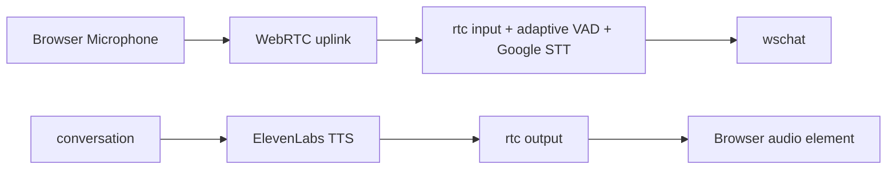

# 5. 音声パイプライン

元ページ: https://www.notion.so/31db3ffbf12e818c82b9d10a66f21e29

## 1. ビジネスコンテキスト
- **目的**: ユーザーの音声をテキスト化し、assistant のテキスト応答を再び音声に戻して自然な対話を成立させる。
- **価値**: 音声入力と音声出力を別責務で分離しつつ、会話体験としては一連の流れに見せられる。
- **設計意図**: STT はサーバー、TTS もサーバー、再生配送は WebRTC に分離している。サーバー側 VAD は静かな環境でも小声を拾いやすいよう、固定しきい値ではなく直近 1 分の音量分布から動的にしきい値を決める。

## 2. 論理構造・機能俯瞰
**主要なモデル・コンポーネント**
- **RTC Stage**
  - `rtc.go` は stage の入口と共通設定を持つ。
  - `signaling.go` は WebRTC signaling、PeerConnection、peer ごとの状態を管理する。
  - `input.go` は incoming track の復号、動的 VAD、Google STT への送信、確定文字起こしの `EventTextInput` 化を担う。
  - `output.go` は assistant PCM の 48kHz 化、Opus エンコード、WebRTC track 送信を担う。
- **TTS Stage (`tts/elevenlabs.go`)**
  - assistant テキストを ElevenLabs に送り、PCM ストリームとして受ける。
- **`wschat`**
  - server STT の状態イベントと WebRTC signaling をやり取りする橋渡しをする。

## 3. 主要なデータフロー
### シナリオ: 音声入力から text input になるまで
1. **マイク取得**: フロントが `getUserMedia` で音声トラックを取得する。
2. **WebRTC 送信**: 取得した音声トラックを `RTCPeerConnection` に載せてサーバーへ送る。
3. **音量計測**: `rtc/input.go` が Opus を PCM に戻し、20ms ごとの平均絶対振幅を `frameEnergy` として計測する。
4. **動的 VAD**: peer ごとに直近 1 分の background energy 履歴を持ち、中央値の 1.5 倍を現在の speech しきい値とする。最低しきい値は 30 を下限にする。
5. **発話開始/終了判定**: `vadStartThreshold=200ms`, `vadEndThreshold=500ms` の時間ヒステリシスで `speech_start` / `speech_end` を判定する。
6. **STT 実行**: 発話中の PCM を Google Speech-to-Text に送り、確定した認識結果を user message として流す。

### シナリオ: assistant text から音声再生まで
1. **テキスト受領**: `conversation` が assistant の `EventRealtimeOutput` を送る。
2. **TTS 変換**: `tts` が ElevenLabs の stream API を呼び、PCM 24000Hz のバイト列を読む。
3. **PCM 中継**: PCM は base64 化され `EventRealtimeAudio` として `rtc` に渡る。
4. **サンプル変換**: `rtc` が 24000Hz モノラル PCM を 48000Hz にアップサンプリングし、必要に応じてステレオ化する。
5. **Opus 送信**: 20ms ごとに Opus フレームへエンコードし、WebRTC トラックへ書き込む。
6. **再生完了通知**: `tts` が `EventTTSEnd` を返し、`conversation` が次の待機や speech を進める。

## 4. 詳細設計
### クラス設計
- `internal/components/tts/`
  - `elevenlabs.go`: assistant text を PCM 音声へ変換する。
    - `startStream`: 応答単位で TTS ストリームを開始する。
    - `streamRequest`: ElevenLabs HTTP リクエストを送る。
    - `readStream`: PCM を読み出し、`EventRealtimeAudio` と `EventTTSEnd` を送る。
    - `handleCancel`: 再生中断時の stream cancel を行う。
- `internal/components/rtc/`
  - `rtc.go`: stage の入口、共有定数、ライフサイクルを持つ。
  - `signaling.go`: WebRTC signaling と peer 状態を管理する。
    - `handleOffer`: Offer を受けて answer と track を作る。
    - `resetPeer`: PeerConnection と VAD/STT 状態を初期化する。
  - `input.go`: マイク入力処理と STT 連携を持つ。
    - `handleIncomingTrack`: マイク音声を受け、動的 VAD と STT 送信を行う。
    - `measureFrameEnergy`: 20ms フレームの平均絶対振幅を計算する。
    - `computeAdaptiveSpeechThreshold`: 直近 1 分の履歴から現在の speech しきい値を計算する。
    - `startSpeechStream`: Google STT のストリームを開始する。
    - `consumeSpeechResponses`: Google STT の確定結果を `EventTextInput` に変換する。
  - `output.go`: assistant 音声再生処理を持つ。
    - `handleTTSAudio`: PCM をデコードし内部バッファへ積む。
    - `sendOpusFrame`: 20ms 単位で Opus エンコードして track に書く。
    - `handleTTSCancel`: バッファを破棄して再生を止める。

### API設計
- `POST https://api.elevenlabs.io/v1/text-to-speech/{voice_id}/stream?output_format=pcm_24000`
  - 用途: assistant テキストから PCM ストリームを取得する。
  - 主な入力: `text`, `model_id`, `language_code`, `voice_settings`
- `StreamingRecognize` (Google Speech-to-Text)
  - 用途: マイク音声をサーバー側で文字起こしする。
- WebRTC signaling on `/ws/chat`
  - `webrtc.offer`
  - `webrtc.answer`
  - `webrtc.ice`

### 補足設計
- TTS は `line.Final == false` の assistant テキストだけを読むため、終端マーカー自体は音声化されない。
- ElevenLabs 側の音声長はバイト数から推定し、次の wait 時間の補正に使う。
- RTC 側は UDP 50000-50100 を利用する前提で `SettingEngine` を組んでいる。
- 動的 VAD は Google 側の voice activity events に依存せず、ローカルの energy VAD を改善する形で実装している。

### 参照実装
- `internal/components/tts/elevenlabs.go`
- `internal/components/rtc/rtc.go`
- `internal/components/rtc/signaling.go`
- `internal/components/rtc/input.go`
- `internal/components/rtc/output.go`
- `internal/components/rtc/input_test.go`
- `internal/components/wschat/wschat.go`
- `README.md`
