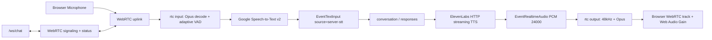

# 5. 音声パイプライン

## 1. ビジネスコンテキスト
- **目的**: ブラウザのマイク音声を WebRTC でサーバーへ送り、サーバー側 VAD と Google Speech-to-Text でユーザー発話をテキスト化する。assistant のテキスト応答は ElevenLabs で PCM 音声へ変換し、WebRTC の下り音声トラックとしてブラウザへ返す。
- **価値**: 音声入力、発話検知、STT、TTS、音声配送を分離しながら、ユーザーには「話しかけると音声で返る」一連の体験として提供できる。
- **設計意図**: STT はサーバー側に集約し、ブラウザはマイク送信と WebRTC 受信に集中する。TTS は ElevenLabs の HTTP streaming で PCM 24000Hz を受け取り、RTC stage が 48000Hz Opus へ変換して配信する。VAD は Google の voice activity events ではなく、サーバーで復号した PCM の直近 1 分の音量履歴から動的なしきい値を作る。

## 2. 論理構造・機能俯瞰
**主要なモデル・コンポーネント**
- **Browser UI (`web/src/main.tsx`)**
  - `/ws/chat` に WebSocket 接続し、WebRTC signaling と通常の chat message を送受信する。
  - `getUserMedia` で取得したマイク音声を `RTCPeerConnection` に載せてサーバーへ送る。
  - サーバーから返る WebRTC 音声トラックを `MediaStreamAudioSourceNode -> GainNode -> destination` へ接続して再生する。
- **RTC Stage**
  - `rtc.go` は stage の入口、Speech-to-Text 設定、VAD/STT/Opus の共通定数を持つ。
  - `signaling.go` は `webrtc.offer` / `webrtc.ice` の処理、PeerConnection、peer ごとの状態、下り音声 track を管理する。
  - `input.go` は incoming Opus track の復号、モノラル化、動的 VAD、Google Speech-to-Text streaming、確定文字起こしの `EventTextInput` 化を担う。
  - `output.go` は ElevenLabs PCM の 48kHz 化、必要に応じたステレオ化、Opus エンコード、WebRTC track 書き込みを担う。
- **TTS Stage (`tts/elevenlabs.go`)**
  - assistant の非 final テキストを ElevenLabs の HTTP streaming API に送り、PCM 24000Hz の chunk を `EventRealtimeAudio` として流す。
  - ストリーム完了時に、バイト数から推定した音声長を `EventTTSEnd` として返す。
- **`wschat`**
  - `/ws/chat` を提供し、ブラウザと graph の間で message、speech event、VAD status、WebRTC signaling を橋渡しする。
  - WebSocket 接続ごとに `ws-N` の client ID を割り当て、RTC signaling の宛先制御に使う。
- **`web/src/audio.ts`**
  - base64 PCM 24000Hz を Web Audio で直接再生する補助ユーティリティ。現行の主経路は `main.tsx` の WebRTC downlink 再生であり、このファイルは主パイプラインでは使われていない。

## 3. 主要なデータフロー
### シナリオ: 音声入力から text input になるまで
1. **接続開始**: フロントが `/ws/chat` に接続し、`RTCPeerConnection` を作成する。
2. **マイク取得**: `getUserMedia` で `echoCancellation`, `noiseSuppression`, `autoGainControl` を有効にした音声トラックを取得し、peer に `addTrack` する。
3. **WebRTC signaling**: ブラウザが `webrtc.offer` と ICE candidate を WebSocket 経由で送り、サーバーが answer と ICE candidate を同じ接続 ID 宛てに返す。
4. **Opus 復号**: `rtc/input.go` が incoming track の codec 情報から Opus decoder を作り、RTP payload を PCM に戻す。複数 channel の場合は平均してモノラル化する。
5. **音量計測**: PCM frame の平均絶対振幅を `frameEnergy` として計測し、同時に 3 秒分の prebuffer に PCM bytes を保持する。
6. **動的 VAD**: peer ごとに直近 1 分の `frameEnergy` 履歴を保持し、1 秒ごとに中央値 + 50 を speech しきい値として更新する。しきい値の下限は 50。
7. **発話開始/終了判定**: `vadStartThreshold=200ms` 以上しきい値超過が続くと `speech_start`、`vadEndThreshold=500ms` 以上しきい値未満が続くと `speech_end` を出す。VAD status は 250ms ごとに `rtc_vad_status` として送る。
8. **STT 開始**: 発話開始時に active speaker を確保し、Google Speech-to-Text v2 の `StreamingRecognize` を開始する。直前 3 秒の prebuffer も STT に送る。
9. **音声送信**: 発話中の Linear16 PCM を 25600 bytes ごとに STT stream へ送る。発話終了時は追加待ちなしで `CloseSend` する。
10. **確定結果送出**: Google STT の final result だけを採用し、trim 後の transcript を `Role=user`, `Source=server-stt` の `EventTextInput` として graph に流す。

### シナリオ: assistant text から音声再生まで
1. **テキスト受領**: `conversation` が assistant の `EventRealtimeOutput` を送る。TTS は `Role` が空または `assistant` で、`Final == false` かつ空文字でない行だけを読む。
2. **TTS 変換**: `tts` が ElevenLabs の `POST /v1/text-to-speech/{voice_id}/stream?output_format=pcm_24000` を呼び、PCM 24000Hz mono 16-bit little-endian の stream を読む。
3. **PCM 中継**: `readStream` が受信 chunk を base64 化し、`EventRealtimeAudio{Role=assistant}` として `rtc` に渡す。
4. **再生完了通知**: ElevenLabs stream が EOF になると、TTS は受信総 byte 数から音声長を推定し、`EventTTSEnd` を `conversation` に返す。
5. **サンプル変換**: `rtc/output.go` が base64 PCM を int16 に戻し、線形補間で 24000Hz から 48000Hz へ 2 倍アップサンプリングする。peer が stereo Opus を要求している場合は同じ PCM を左右に複製する。
6. **Opus 送信**: `sendLoop` が 20ms ごとに peer の buffer から 48000Hz PCM を取り出し、Opus `AppVoIP` でエンコードして WebRTC track へ書き込む。
7. **ブラウザ再生**: ブラウザの `ontrack` が下り音声 stream を受け取り、Web Audio の `GainNode` 経由で出力する。UI の再生音量は gain 0.3 / 0.6 / 1.0 / 1.5 から選択する。
8. **中断**: `EventTTSCancel` は TTS の HTTP stream をキャンセルし、RTC 側では全 peer の再生 buffer を破棄する。

## 4. 詳細設計
### クラス設計
- `internal/components/tts/`
  - `elevenlabs.go`: assistant text を PCM 音声へ変換する。
    - `NewStage`: API key と voice id を必須にし、model 未指定時は `eleven_v3` を使う。
    - `startStream`: response ID ごとに既存 stream をキャンセルして新しい TTS stream を開始する。
    - `streamRequest`: ElevenLabs HTTP streaming リクエストを送る。payload は `text`, `model_id`, `language_code=ja`, `voice_settings`。
    - `readStream`: PCM chunk を base64 化して `EventRealtimeAudio` を出し、完了時に `EventTTSEnd` を送る。
    - `handleCancel`: response ID が一致する場合、または cancel 側の response ID が空の場合に active stream を止める。
- `internal/components/rtc/`
  - `rtc.go`: stage の入口、Speech-to-Text 設定、VAD/STT/Opus の共通定数、stage ライフサイクルを持つ。
  - `signaling.go`: WebRTC signaling と peer 状態を管理する。
    - `handleOffer`: Offer を受けて PeerConnection、下り音声 track、Opus encoder を作り、answer を返す。
    - `handleICE`: remote description 前の ICE candidate を `pendingICE` に積み、peer 作成後に追加する。
    - `resetPeer`: PeerConnection、再生 buffer、prebuffer、VAD/STT 状態を初期化する。
  - `input.go`: マイク入力処理と STT 連携を持つ。
    - `handleIncomingTrack`: incoming Opus を PCM へ復号し、動的 VAD と STT 送信を行う。
    - `measureFrameEnergy`: PCM frame の平均絶対振幅を計算する。
    - `computeAdaptiveSpeechThreshold`: 直近 1 分の energy 中央値 + 50 を下限 50 で丸める。
    - `startSpeechStream`: Google STT v2 の stream を開始し、prebuffer を送る。
    - `consumeSpeechResponses`: STT の final result を `EventTextInput` に変換する。
    - `pcmRingBuffer`: 発話開始直前の 3 秒分 PCM を保持する。
  - `output.go`: assistant 音声再生処理を持つ。
    - `handleTTSAudio`: PCM をデコードし、48kHz 化して各 peer の内部 buffer へ積む。
    - `sendOpusFrame`: 20ms 単位で Opus エンコードして track に書く。
    - `handleTTSCancel`: 全 peer の再生 buffer を破棄して再生を止める。
- `internal/components/wschat/wschat.go`
  - `/ws/chat` を登録し、ブラウザからの `message` を `EventTextInput`、`webrtc.*` を `EventRTCSignal` として graph に流す。
  - graph からの `EventRTCSignal`、`EventSpeechStart`、`EventSpeechEnd`、`EventRTCVADStatus`、assistant/user message を JSON にしてブラウザへ送る。
- `web/src/main.tsx`
  - WebSocket 接続、WebRTC offer/ICE 送信、マイク track 送信、下り音声 track の Web Audio 再生、VAD/STT 状態表示を持つ。

### API設計
- `POST https://api.elevenlabs.io/v1/text-to-speech/{voice_id}/stream?output_format=pcm_24000`
  - 用途: assistant テキストから PCM 24000Hz mono stream を取得する。
  - 主な入力: `text`, `model_id`, `language_code`, `voice_settings`
  - 主な header: `Content-Type: application/json`, `xi-api-key`
- `StreamingRecognize` (Google Speech-to-Text v2)
  - 用途: サーバー側でマイク音声を文字起こしする。
  - endpoint: `asia-northeast1-speech.googleapis.com:443`
  - recognizer: `projects/{GOOGLE_CLOUD_PROJECT}/locations/asia-northeast1/recognizers/{GOOGLE_RECOGNIZER}`
  - 主な設定: `model=chirp_3`, `language_codes=[GOOGLE_LANGUAGE or ja-JP]`, `encoding=LINEAR16`, `sample_rate_hertz=入力 track の sample rate`, `audio_channel_count=1`
- WebRTC signaling on `/ws/chat`
  - `webrtc.offer`: ブラウザからサーバーへ SDP offer を送る。
  - `webrtc.answer`: サーバーから同じ WebSocket 接続 ID 宛てに SDP answer を返す。
  - `webrtc.ice`: 双方向に ICE candidate を送る。
- `/ws/chat` の音声関連 status event
  - `speech_start`, `speech_end`: サーバー側 VAD の発話開始/終了。
  - `rtc_vad_status`: 現在の input level、speech threshold、captured_at。
  - `message` with `source=server-stt`: Google STT の final transcript。

### 補足設計
- `GOOGLE_CLOUD_PROJECT` が空の場合、RTC は speech event までは出すが、Google STT stream は開始せず server-side STT は無効になる。
- 同時発話は `activeSpeakerID` で 1 peer に制限される。active speaker 以外の peer の音声は処理対象外になる。
- VAD の履歴は「無音だけ」ではなく、実装上は受信した直近 1 分の `frameEnergy` 全体から作る。
- TTS は `line.Final == false` の assistant テキストだけを読むため、final marker や空行は音声化されない。
- ElevenLabs の音声長は `24000Hz * 2 bytes * 1 channel` でバイト数から推定し、`EventTTSEnd` の `DurationSeconds` に入れる。
- RTC 側は UDP 50000-50100 を利用する前提で `SettingEngine` を組み、`RTCIceHostIPs` が設定されている場合は host candidate 用の NAT 1:1 IP として使う。
- サーバー側 VAD は Google 側の voice activity events に依存しない。STT stream の終了はサーバー側の `speech_end` 後、追加遅延なしで `CloseSend` する。

### 参照実装
- `internal/components/rtc/rtc.go`
- `internal/components/rtc/signaling.go`
- `internal/components/rtc/input.go`
- `internal/components/rtc/output.go`
- `internal/components/rtc/input_test.go`
- `internal/components/tts/elevenlabs.go`
- `internal/components/wschat/wschat.go`
- `web/src/audio.ts`
- `web/src/main.tsx`
- `internal/types/event.go`
- `internal/types/types.go`
- `cmd/smart-speaker/main.go`
