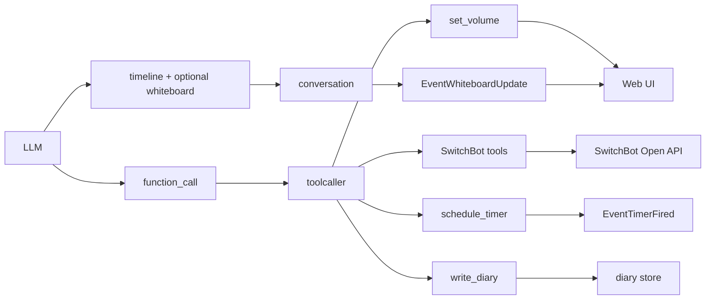

# 8. 生活操作ツール群

元ページ: https://www.notion.so/31db3ffbf12e8196bc85c296895c1945

## 1. ビジネスコンテキスト
- **目的**: 音声会話の中で、家庭内の操作や表示更新を assistant が実行できるようにする。
- **価値**: assistant が単に答えるだけでなく、生活支援の実行主体になれる。
- **現在の設計方針**: 家電操作系、時間予約系、再生制御系を tool として統一し、LLM から選択可能にしている。一方、whiteboard のような「返答の補助表示」はツールではなく通常応答契約で扱う。`write_diary` も通常会話の副作用ツールではなく、session lifecycle からだけ使う特別な永続化ツールとして扱う。

## 2. 現在のツール群の全体像
### 家電・環境系
- `aircon_control`
- `light_control`
- `blind_control`
- `hub2_get_environment`

### 時間系
- `schedule_timer`

### UI / 再生制御系
- `set_volume`

### 補助系
- `write_diary`
  - 通常会話からは除外される特別用途
  - diary store へ追記する

### 別ドキュメントで扱う系
- Google Calendar 系ツール
  - `google_calendar_list`
  - `google_calendar_create`
  - `google_calendar_update`

## 3. 設計の考え方
このツール群には 2 種類ある。

### 3-1. 実世界へ副作用を起こすツール
例:
- aircon / light / blind
- timer
これらはサーバー側で副作用を実行する。

### 3-2. UI や再生状態に影響するツール
例:
- `set_volume`
これはサーバー自身が OS 音量を変えるのではなく、**function result をフロントへ返し、その結果を見たフロントが `<audio>` の volume を更新する**。
ここで重要なのは、whiteboard はこのカテゴリにも含めないことだ。whiteboard はツールではなく、通常応答 JSON に含まれる `whiteboard.content` から `EventWhiteboardUpdate` へ変換される。

## 4. 主要なデータフロー
### シナリオ: 家電操作ツール
1. LLM が tool name を選ぶ
2. `toolcaller` が handler を見つける
3. SwitchBot client が device alias を device ID に解決する
4. Open API へ command を送る
5. 結果 JSON を `ToolResponse` として返す
6. UI と conversation 文脈に tool result が流れる

### シナリオ: `set_volume`
1. LLM が `volume_percent` を 1〜100 の整数で指定する
2. `set_volume` が値を検証して返す
3. フロントが `function_result` を受ける
4. `<audio>` 要素の `volume` と UI state を更新する

### シナリオ: whiteboard 更新
1. LLM が通常応答 JSON の `whiteboard.content` に表示したい内容を書く
2. `conversation` がこれを解釈する
3. `EventWhiteboardUpdate` を emit する
4. `wschat` が `whiteboard_update` としてフロントへ流す
5. アプリ画面のボード内容を上書きする

### シナリオ: `write_diary`
1. `sessionlifecycle` が idle timeout 時に `write_diary` 専用の request を作る
2. `responsesapi` が `write_diary` の function call を受ける
3. `toolcaller` が `write_diary` handler を実行する
4. `write_diary` は注入された `diary store` へ追記する
5. `ToolResponse(write_diary)` は `sessionlifecycle` が受け、`EventSessionClear` の契機に使う
6. `conversation` は `write_diary` の result を会話文脈には積まない

## 5. 各ツールの役割
### `aircon_control`
エアコン操作のショートカット。
- 暖房 / 冷房 / オフのような利用頻度の高い操作を固定引数で扱いやすくする
- 汎用 command 指定より LLM にとって安全で選びやすい

### `light_control`
照明操作のショートカット。
- 強 / 中 / 弱 / オフのような preset 操作を提供する
- 実装上は SwitchBot Open API コマンドへ変換される

### `blind_control`
ブラインド操作のショートカット。
- 開閉や傾き制御を簡潔な引数で指定できる

### `hub2_get_environment`
Hub 2 の状態取得。
- 温度
- 湿度
- 照度
照度は「家にいるか / ライトが点いているか」を推定する用途にも使える。

### `schedule_timer`
一定時間後にリマインドを返す。
- 直接 assistant の文を生成するのではなく `EventTimerFired` を発火する
- その後の assistant 表示は会話系コンポーネント側が行う

### `set_volume`
再生音量の UI 指示ツール。
- 引数は `volume_percent`
- 1〜100 の整数のみ受け付ける
- フロントの初期値は 50%

### `write_diary`
会話の要約を diary ファイルへ残す。
- 通常会話からは除外される
- `sessionlifecycle` が idle timeout 時にだけ強制する
- 実際の永続化は `internal/diary/store.go` に委譲する
- 保存先は `data/diary.md`
- 見出し時刻は `time.Now()` を使う

## 6. 実装構造
### クラス設計
- `internal/tools/functions/switchbot/`
  - `switchbot.go`
    - SwitchBot Open API client
    - 署名生成、alias 解決、status 取得、command 実行
  - `aircon.go`
  - `light.go`
  - `blind_tilt.go`
  - `hub2.go`
- `internal/tools/functions/timer/tool.go`
  - timer ツール本体
- `internal/tools/functions/volume/tool.go`
  - `set_volume` 本体
- `internal/tools/functions/diary/tool.go`
  - `write_diary` 本体
  - `DiaryAppender` を受け取り、自前では file path を持たない
- `internal/diary/store.go`
  - diary の読み書きと旧形式からの移行
- `internal/components/conversation/rules.go`
  - 通常応答の `whiteboard` を `EventWhiteboardUpdate` へ変換する
- `web/src/main.tsx`
  - `function_result(set_volume)` を受けて UI state を更新する
  - `whiteboard_update` を受けてボードを更新する

### API設計
- `POST https://api.switch-bot.com/v1.1/devices/{deviceId}/commands`
  - 家電操作 command 送信
- `GET https://api.switch-bot.com/v1.1/devices/{deviceId}/status`
  - Hub 2 などの状態取得
- `set_volume`
  - リクエスト: `{ "volume_percent": 50 }`
  - レスポンス: `{ "volume_percent": 50 }`

## 7. 現在の設計上の重要ポイント
- **`shutdown_mode` は廃止済み**
  - 以前あった「フロントを休止状態にするツール」は削除された
- **音量ツールは preset ではなく整数指定**
  - `small / normal / large` ではなく `1..100` の `volume_percent`
- **whiteboard はツールではない**
  - assistant の通常応答に含まれる補助表示データとして扱う
- **`set_volume` は server side の実世界副作用ではなく、フロントへの指示** として働く
- **`write_diary` は generic state を更新しない**
  - 直接 `diary store` へ永続化する
- 同じ `ToolResponse` でも、conversation にとっては文脈情報、フロントにとっては UI 更新トリガになりうる

## 8. 参照実装
- `internal/tools/functions/switchbot/switchbot.go`
- `internal/tools/functions/switchbot/aircon.go`
- `internal/tools/functions/switchbot/light.go`
- `internal/tools/functions/switchbot/blind_tilt.go`
- `internal/tools/functions/switchbot/hub2.go`
- `internal/tools/functions/timer/tool.go`
- `internal/tools/functions/volume/tool.go`
- `internal/tools/functions/diary/tool.go`
- `internal/diary/store.go`
- `internal/components/conversation/rules.go`
- `web/src/main.tsx`
- `internal/tools/registry/registry.go`
