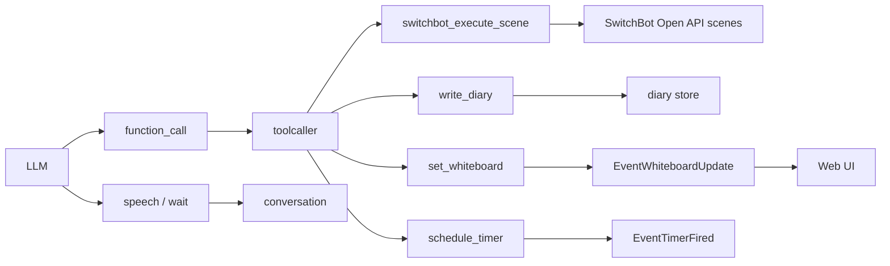

# 8. 生活操作ツール群

元ページ: https://www.notion.so/31db3ffbf12e8196bc85c296895c1945

## 1. ビジネスコンテキスト
- **目的**: 音声会話の中で、家庭内の操作や表示更新を assistant が実行できるようにする。
- **価値**: assistant が単に答えるだけでなく、生活支援の実行主体になれる。
- **現在の設計方針**: 家電操作系は個別デバイス操作ではなく、起動時に取得した SwitchBot シーンを `switchbot_execute_scene` として LLM に公開する。時間予約系は `schedule_timer`、UI 表示更新系は `set_whiteboard` として扱う。`write_diary` は通常会話の副作用ツールではなく、session lifecycle からだけ使う特別な永続化ツールとして扱う。

## 2. 現在のツール群の全体像
### 家電・環境系
- `switchbot_execute_scene`
  - SwitchBot に登録済みのシーンを実行する
  - `SwitchBotScenes` が空の場合は登録されない
- `hub2_get_environment`
  - Hub 2 の温度・湿度・照度を取得する

### 時間系
- `schedule_timer`
  - 指定秒数後に timer event を発火する

### UI / 再生制御系
- `set_whiteboard`
  - アプリ画面のホワイトボード表示を更新する
  - 現行 registry には `set_volume` は登録されていない

### 補助系
- `write_diary`
  - 通常会話からは除外される特別用途
  - diary store へ追記する

### 別ドキュメントで扱う系
- Google Calendar 系ツール
  - `google_calendar_list`
  - `google_calendar_create`
  - `google_calendar_update`
  - registry には登録されるが、この文書では詳細を扱わない

## 3. 設計の考え方
このツール群には 2 種類ある。

### 3-1. 実世界へ副作用を起こすツール
例:
- `switchbot_execute_scene`
- `schedule_timer`
これらはサーバー側で副作用を実行する。

### 3-2. UI や再生状態に影響するツール
例:
- `set_whiteboard`
`set_whiteboard` は tool 実行時にサーバー側で `EventWhiteboardUpdate` を発火し、既存の `whiteboard_update` 経路でフロントのボード表示を更新する。
過去に存在した `set_volume` は現行 registry では登録されていないため、生活操作ツール群の現行 UI ツールには含めない。

## 4. 主要なデータフロー
### シナリオ: 家電操作ツール
1. 起動時に `main` が SwitchBot Open API から scene 一覧を取得する
2. `registry` が scene 一覧を持つ場合だけ `switchbot_execute_scene` を登録する
3. LLM が `scene_name` を完全一致で指定する
4. `toolcaller` が `switchbot_execute_scene` handler を実行する
5. SwitchBot client が `/v1.1/scenes/{sceneId}/execute` へ POST する
6. 結果 JSON を `ToolResponse` として返す
7. `write_diary` 以外の tool result として conversation 文脈に流れる

### シナリオ: `set_volume`
1. 現行 registry には `set_volume` 定義も handler も登録されない
2. Responses API の通常 tools にも含まれない
3. そのため LLM から音量変更 tool として呼び出す経路は存在しない

### シナリオ: whiteboard 更新
1. LLM が `set_whiteboard` tool を呼び、表示したい内容を `content` に指定する
2. `toolcaller` が `set_whiteboard` handler を実行する
3. handler が `content` を trim し、文字列内の `\n` を改行に戻す
4. handler が `EventWhiteboardUpdate` を emit する
5. `wschat` が `whiteboard_update` としてフロントへ流す
6. アプリ画面のボード内容を上書きする

### シナリオ: `write_diary`
1. `sessionlifecycle` が idle timeout 時に `write_diary` 専用の request を作る
2. `responsesapi` が `write_diary` の function call を受ける
3. `toolcaller` が `write_diary` handler を実行する
4. `write_diary` は注入された `diary store` へ追記する
5. `ToolResponse(write_diary)` は `sessionlifecycle` が受け、`EventSessionClear` の契機に使う
6. `conversation` は `write_diary` の result を会話文脈には積まない

## 5. 各ツールの役割
### `aircon_control`
現行 registry には登録されていない。
- エアコン操作が必要な場合は、SwitchBot アプリ側に登録済みのシーンを `switchbot_execute_scene` から実行する
- `registry` のテストでも `aircon_control` は未登録であることを確認している

### `light_control`
現行 registry には登録されていない。
- 照明操作が必要な場合は、SwitchBot アプリ側に登録済みのシーンを `switchbot_execute_scene` から実行する
- `registry` のテストでも `light_control` は未登録であることを確認している

### `blind_control`
現行 registry には登録されていない。
- ブラインド操作が必要な場合は、SwitchBot アプリ側に登録済みのシーンを `switchbot_execute_scene` から実行する
- `registry` のテストでも `blind_control` は未登録であることを確認している

### `hub2_get_environment`
Hub 2 の状態取得。
- 温度
- 湿度
- 照度
- 引数は取らない
- device alias は固定で `hub2`
- 取得できない値は `"取得不可"` として返す
照度は「ライトが点いているか」などを推定する補助情報として使えるが、推定ロジック自体はこの tool には含まれない。

### `schedule_timer`
一定時間後にリマインドを返す。
- 直接 assistant の文を生成するのではなく `EventTimerFired` を発火する
- その後の assistant 表示は会話系コンポーネント側が行う
- 引数は `seconds` と `reminder_text`
- `seconds` は正の整数のみ受け付ける
- 発火時の payload は `TimerFiredEvent{ReminderText: "タイマーが発火しました: ..."}` になる

### `set_volume`
現行 registry には登録されていない。
- `registry` のテストでも `set_volume` 定義と handler が存在しないことを確認している
- 音量変更を function calling で行う実装は、現行の生活操作ツール群には含まれない

### `set_whiteboard`
ホワイトボード表示の UI 指示ツール。
- 引数は `content`
- 空文字は受け付けない
- 前後空白を trim する
- 文字列内の `\n` は実改行へ変換する
- tool 実行時に `EventWhiteboardUpdate` を発火する
- 戻り値は `{ "content": "...", "updated": true }`
- tool 定義では URL やリンク付きテキストを含めず、7行程度を目安にするよう説明している

### `write_diary`
会話の要約を diary ファイルへ残す。
- 通常会話からは除外される
- `sessionlifecycle` が idle timeout 時にだけ強制する
- 実際の永続化は `internal/diary/store.go` に委譲する
- 保存先は `data/diary.md`
- 見出し時刻は `time.Now()` を使う

## 6. 実装構造
### クラス設計
- `internal/tools/functions/switchbot/`
  - `switchbot.go`
    - SwitchBot Open API client
    - 署名生成、alias 解決、status 取得、scene 一覧取得、scene 実行、診断カテゴリ付きエラー生成
  - `scene.go`
    - `switchbot_execute_scene` 本体
    - 起動時に取得した scene 名を完全一致で受け取り、対応する scene ID を実行する
  - `hub2.go`
    - `hub2_get_environment` 本体
    - alias `hub2` の status から temperature / humidity / lightLevel を返す
- `internal/tools/functions/timer/tool.go`
  - timer ツール本体
  - `EventTimerFired` を非同期 emit する
- `internal/tools/functions/whiteboard/tool.go`
  - `set_whiteboard` 本体
  - `EventWhiteboardUpdate` を emit する
- `internal/tools/functions/diary/tool.go`
  - `write_diary` 本体
  - `DiaryAppender` を受け取り、自前では file path を持たない
- `internal/diary/store.go`
  - diary の読み書きと旧形式からの移行
- `internal/tools/registry/registry.go`
  - tool 定義と handler を登録する
  - `SwitchBotScenes` が空でない場合だけ `switchbot_execute_scene` を追加する
  - 通常 Responses API tools からは `write_diary` を除外できる
- `internal/components/toolcaller/toolcaller.go`
  - `EventToolRequest` を受け、handler を非同期実行して `EventToolResponse` を返す
  - `ContextAware` と `EventEmitterAware` を tool に注入する
- `internal/types/event.go`
  - `EventTimerFired` / `EventToolRequest` / `EventToolResponse` / `EventWhiteboardUpdate` を定義する
- `internal/types/types.go`
  - `TimerFiredEvent` / `WhiteboardUpdate` / `ResponsesRequest` などの payload 型を定義する
- `internal/components/wschat/wschat.go`
  - `EventWhiteboardUpdate` を `whiteboard_update` として WebSocket へ流す
- Google Calendar 系と `web_search` も registry に含まれるが、この文書では詳細化しない

### API設計
- `GET https://api.switch-bot.com/v1.1/scenes`
  - 起動時に SwitchBot scene 一覧を取得する
- `POST https://api.switch-bot.com/v1.1/scenes/{sceneId}/execute`
  - `switchbot_execute_scene` から scene を実行する
- `GET https://api.switch-bot.com/v1.1/devices/{deviceId}/status`
  - Hub 2 などの状態取得
- `schedule_timer`
  - リクエスト: `{ "seconds": 300, "reminder_text": "お茶を入れるよう伝える" }`
  - レスポンス: `{ "scheduled_for": "...", "seconds": 300 }`
- `set_whiteboard`
  - リクエスト: `{ "content": "..." }`
  - レスポンス: `{ "content": "...", "updated": true }`
- `write_diary`
  - リクエスト: `{ "content": "..." }`
  - レスポンス: `{ "path": "data/diary.md", "timestamp": "..." }`

## 7. 現在の設計上の重要ポイント
- **`shutdown_mode` は廃止済み**
  - 以前あった「フロントを休止状態にするツール」は削除された
- **個別デバイス操作ツールは廃止済み**
  - `aircon_control` / `light_control` / `blind_control` / `switchbot_control_device` は registry に登録されない
- **SwitchBot 操作は scene 実行に寄せている**
  - `switchbot_execute_scene` は `SwitchBotScenes` がある場合だけ登録され、`scene_name` は起動時に取得した scene 名の完全一致で指定する
- **音量ツールは現行 registry に存在しない**
  - `set_volume` 定義も handler も登録されない
- **whiteboard は `set_whiteboard` tool で更新する**
  - assistant の通常応答には含めず、tool 実行時の `EventWhiteboardUpdate` として扱う
- **`write_diary` は generic state を更新しない**
  - 直接 `diary store` へ永続化する
- **`write_diary` は通常 Responses API tools から除外される**
  - idle timeout 時の `sessionlifecycle` だけが `tool_choice=write_diary` と `write_diary` 定義を渡す
- 同じ `ToolResponse` でも、conversation にとっては文脈情報、フロントにとっては UI 更新トリガになりうる

## 8. 参照実装
- `internal/tools/functions/switchbot/switchbot.go`
- `internal/tools/functions/switchbot/scene.go`
- `internal/tools/functions/switchbot/hub2.go`
- `internal/tools/functions/timer/tool.go`
- `internal/tools/functions/whiteboard/tool.go`
- `internal/tools/functions/diary/tool.go`
- `internal/diary/store.go`
- `internal/tools/registry/registry.go`
- `internal/tools/interfaces.go`
- `internal/components/toolcaller/toolcaller.go`
- `internal/components/sessionlifecycle/sessionlifecycle.go`
- `internal/components/conversation/rule_tool_response.go`
- `internal/components/wschat/wschat.go`
- `internal/types/event.go`
- `internal/types/types.go`
