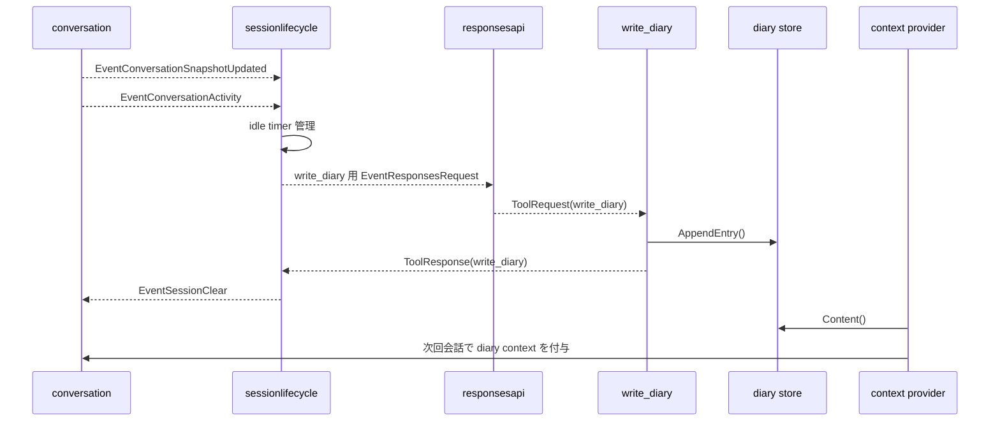

# 9. タイマー・日記・自動リセット

元ページ: https://www.notion.so/31db3ffbf12e8146a751c223724de3fa

## 1. ビジネスコンテキスト
- **目的**: 会話中に後で思い出すべきことを予約し、会話が終わったら内容を要約して記録し、次回会話へ引き継ぐ。
- **価値**: 一回限りの会話ではなく、時間経過と継続記憶を扱える。
- **現在の設計方針**: timer、diary、session lifecycle を別責務に分けつつ、generic な shared state ではなく event と永続化で接続する。diary 永続化は `diary store` に集約する。

## 2. このドメインの3機能
### timer
- 会話中に「あとで知らせる」を実現する
- 指定秒後に `EventTimerFired` を発火する

### diary
- 会話の内容を後から参照できるように Markdown へ保存する
- 次回会話時には diary を system context として活用する

### session lifecycle
- 一定時間無操作なら、その会話を締めて次へ進む
- 日記化 request と session clear を順番に行う

## 3. 論理構造・機能俯瞰
**主要なモデル・コンポーネント**
- **`schedule_timer`**
  - 指定秒後に `EventTimerFired` を出す tool
- **`write_diary`**
  - diary を `diary store` へ追記する tool
- **`sessionlifecycle` Stage**
  - 会話 snapshot と最終活動を持ち、idle timeout 時に日記化と session clear を行う
- **`diary store`**
  - diary 本文の永続化を扱う
- **`conversation context provider`**
  - diary を system context として会話へ差し込む
以前あった `reset` Stage と `state.diary_status` は、現在の実装では使っていない。

## 4. 主要なデータフロー
### シナリオ: timer をセットして発火する
1. LLM が `schedule_timer` を呼ぶ
2. timer tool が goroutine で待機する
3. 時刻到達で `EventTimerFired` を発火する
4. `conversation` 側が assistant message として UI に流す

### シナリオ: 無操作で session を閉じる
1. `conversation` が `ConversationSnapshotUpdated` と `ConversationActivity` を流す
2. `sessionlifecycle` がそれを内部 state として保持し、idle timer を張り直す
3. 一定時間以上無操作なら `write_diary` 専用の `EventResponsesRequest` を送る
4. `write_diary` の `ToolResponse` が返る
5. `sessionlifecycle` が `EventSessionClear` を送る
6. `conversation` が内部会話 state を初期化する

### シナリオ: 次回会話で diary を使う
1. 次の `ResponsesRequest` 発行時に context provider が diary を読む
2. diary を system message として会話先頭へ付与する
3. assistant は過去の会話要約を参照しながら応答する

## 5. timer の役割
`schedule_timer` は assistant の文面を直接生成しない。
- 待機する
- `EventTimerFired` を出す
- `reminder_text` を payload に乗せる
その後の「assistant message としてどう見せるか」は conversation 側の責務である。
この分離により、timer 自体は単純な「未来のイベント発火装置」で済む。

## 6. diary の役割
`write_diary` は会話ログそのものではなく、**会話の要約を次回へ残すための記憶装置** である。
現在の挙動:
- 保存先は `data/diary.md`
- 既存 diary の末尾へ追記する
- 旧 `tmp/diary/*.md` があれば初回に移行する
- 次回会話時に system context として再利用する
- 見出し時刻は `time.Now()` を使う
重要なのは、tool result として diary 本文を会話文脈に混ぜず、永続記憶として別管理している点である。さらに、その永続化境界は `internal/diary/store.go` に閉じ込め、generic な `state` 概念を経由しない。

## 7. session lifecycle の役割
`sessionlifecycle` Stage は「会話を締める orchestration」である。
担当内容:
- `ConversationSnapshotUpdated` を受けて最新会話を保持する
- `ConversationActivity` を受けて最終活動時刻を更新する
- idle timer を張り直す
- timeout 時に `write_diary` 専用 request を出す
- `write_diary` 完了後に `EventSessionClear` を流す
ここで重要なのは、session lifecycle 自体は会話本文を理解しないことだ。会話内容の要約は LLM に委譲し、session lifecycle はその orchestration だけを行う。

## 8. 現在の設計上の重要ポイント
- `write_diary` は通常会話 tool から除外されている
- diary は会話の内部正本 state ではなく、専用 `store` として外にある
- 次回会話への diary 注入は `conversation` の context provider が担う
- idle timeout の制御は polling ではなく timer で行う
- snapshot / activity は generic な shared projection state ではなく event として流している
- `diary store` は `main` で 1 回生成し、`conversation` と `write_diary` に注入する

## 9. 詳細設計
### クラス設計
- `internal/tools/functions/timer/tool.go`
  - timer tool 本体
  - `Run`
    - 引数検証と待機開始
  - `schedule`
    - 非同期で待機し `EventTimerFired` を発火する
- `internal/tools/functions/diary/tool.go`
  - diary 書き出し tool
  - `DiaryAppender` を通して store に書く
- `internal/diary/store.go`
  - diary の読み書きと旧形式からの移行
  - `Content`
    - diary 全文を返す
  - `AppendEntry`
    - diary 末尾へ 1 エントリ追加する
- `internal/components/sessionlifecycle/sessionlifecycle.go`
  - idle session orchestrator
  - `handleActivity`
    - 最終活動時刻を更新し idle timer を張り直す
  - `handleIdleTimeout`
    - diary request を出す
  - `handleToolResponse`
    - `write_diary` 完了を受けて session clear を出す
- `internal/components/conversation/context_provider.go`
  - diary を会話文脈へ注入する
  - 注入された `DiaryReader` を通して読む

### API設計
- 外部 HTTP API は持たない
- 主な内部イベント:
  - `EventTimerFired`
  - `EventConversationSnapshotUpdated`
  - `EventConversationActivity`
  - `EventSessionClear`
  - `EventResponsesRequest` with `tool_choice=write_diary`

## 10. 参照実装
- `internal/tools/functions/timer/tool.go`
- `internal/tools/functions/diary/tool.go`
- `internal/diary/store.go`
- `internal/components/sessionlifecycle/sessionlifecycle.go`
- `internal/components/conversation/context_provider.go`
- `internal/components/conversation/rule_*.go`
