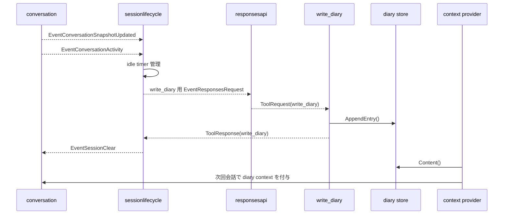

# 9. タイマー・日記・自動リセット

元ページ: https://www.notion.so/31db3ffbf12e8146a751c223724de3fa

## 1. ビジネスコンテキスト
- **目的**: 会話中に後で思い出すべきことを予約し、会話が終わったら内容を要約して記録し、次回会話へ引き継ぐ。
- **価値**: 一回限りの会話ではなく、時間経過と継続記憶を扱える。
- **現在の設計方針**: timer、diary、session lifecycle を別責務に分けつつ、generic な shared state ではなく event と永続化で接続する。diary 永続化は `diary store` に集約する。

## 2. このドメインの3機能
### timer
- 会話中に「あとで知らせる」を実現する
- `reminder_text` と正の整数 `seconds` を受け取り、指定秒後に `EventTimerFired` を発火する
- 発火 payload には、conversation がそのまま表示できる通知文を入れる

### diary
- 会話の内容を後から参照できるように Markdown へ保存する
- 次回会話時には diary を system context として活用する
- `write_diary` の tool response は通常の会話履歴には混ぜない

### session lifecycle
- 一定時間無操作なら、その会話を締めて次へ進む
- 日記化 request と session clear を順番に行う
- 会話量に応じて日記の文量指示を変える

## 3. 論理構造・機能俯瞰
**主要なモデル・コンポーネント**
- **`schedule_timer`**
  - 正の整数秒で指定された待機後に `EventTimerFired` を出す tool
- **`write_diary`**
  - diary を `diary store` へ追記する tool
- **`sessionlifecycle` Stage**
  - 会話 snapshot、最終活動時刻、日記化中フラグを持ち、idle timeout 時に日記化と session clear を行う
- **`diary store`**
  - `data/diary.md` の読み書きと旧 `tmp/diary/*.md` からの初回移行を扱う
- **`conversation context provider`**
  - calendar context と diary context を system message として会話へ差し込む
以前あった `reset` Stage と `state.diary_status` は、現在の実装では使っていない。

## 4. 主要なデータフロー
### シナリオ: timer をセットして発火する
1. LLM が `schedule_timer` を呼ぶ
2. timer tool が `reminder_text` と `seconds` を検証し、`scheduled_for` と `seconds` を tool result として返す
3. timer tool が goroutine で待機する
4. 時刻到達で `EventTimerFired` を発火する
5. payload の `ReminderText` は `タイマーが発火しました: {reminder_text}` という通知文になる
6. `conversation` 側が `EventRealtimeOutput` の assistant message として UI に流す

### シナリオ: 無操作で session を閉じる
1. `conversation` が `ConversationSnapshotUpdated` と `ConversationActivity` を流す
2. `sessionlifecycle` がそれを内部 state として保持し、idle timer を張り直す
3. 一定時間以上無操作、かつ snapshot と `write_diary` tool 定義がある場合だけ `write_diary` 専用の `EventResponsesRequest` を送る
4. `write_diary` の `ToolResponse` が返る
5. `sessionlifecycle` が内部 state と idle timer をリセットし、`EventSessionClear` を送る
6. `conversation` が進行中の応答を中断し、内部会話 state を初期化し、空 snapshot を流す

### シナリオ: 次回会話で diary を使う
1. 次の通常会話の `ResponsesRequest` 発行時に context provider が diary を読む
2. diary が空でなければ `以下は過去の会話をまとめた日記です。参考として扱ってください。` という prefix 付き system message として会話先頭へ付与する
3. 先頭に重要 retry system message がある場合は、その message を diary/calendar context より前に維持する
4. assistant は過去の会話要約を参照しながら応答する

## 5. timer の役割
`schedule_timer` は assistant の文面を直接生成しない。
- `reminder_text` が空でないことを検証する
- `seconds` が正の整数であることを検証する
- `scheduled_for` を `time.RFC3339` 文字列として tool result に返す
- goroutine で待機する
- context cancel 時は発火せず終了する
- `EventTimerFired` を出す
- `タイマーが発火しました: {reminder_text}` を payload の `ReminderText` に乗せる
その後の「assistant message としてどう見せるか」は conversation 側の責務である。
この分離により、timer 自体は単純な「未来のイベント発火装置」で済む。
現在の conversation は `TimerFiredEvent.ReminderText` を trim し、空でなければ `EventRealtimeOutput` として `Role=assistant`, `Source=timer` で流す。

## 6. diary の役割
`write_diary` は会話ログそのものではなく、**会話の要約を次回へ残すための記憶装置** である。
現在の挙動:
- 保存先は `data/diary.md`
- 既存 diary の末尾へ追記する
- `data/diary.md` がまだない場合、旧 `tmp/diary/*.md` をファイル名順に読み、空でない内容だけを初回に移行する
- 次回会話時に system context として再利用する
- 見出し時刻は `time.Now()` を使う
- 各エントリは `# 2006-01-02 15:04` 形式の見出しと本文で保存する
- `content` 内の文字列 `\n` は実改行へ変換する
- tool result は保存先 `path` と `timestamp` を返す
重要なのは、`write_diary` の tool result として diary 本文を会話文脈に混ぜず、永続記憶として別管理している点である。conversation も `write_diary` の `ToolResponse` は会話履歴へ追加しない。さらに、その永続化境界は `internal/diary/store.go` に閉じ込め、generic な `state` 概念を経由しない。

## 7. session lifecycle の役割
`sessionlifecycle` Stage は「会話を締める orchestration」である。
担当内容:
- `ConversationSnapshotUpdated` を受けて最新会話を保持する
- `ConversationActivity` を受けて最終活動時刻を更新する
- idle timer を張り直す
- timeout 時に `write_diary` 専用 request を出す
- 日記化 request には snapshot の clone、`tool_choice=write_diary`、`write_diary` の tool 定義、空の `SystemPrompt` を入れる
- 会話内の user/assistant message 数に応じて、日記を 1行、2〜3行、3〜5行程度にする追加指示を入れる
- `write_diary` 完了後に `EventSessionClear` を流す
ただし、snapshot が空、`write_diary` tool 定義が空、最終活動時刻が未設定、または日記化中の場合は timeout しても request を出さない。
日記化中に新しい `ConversationActivity` が来た場合は `diaryInFlight` を false に戻して timer を張り直すため、古い `write_diary` 完了通知では session clear しない。
ここで重要なのは、session lifecycle 自体は会話本文を理解しないことだ。会話内容の要約は LLM に委譲し、session lifecycle はその orchestration だけを行う。

## 8. 現在の設計上の重要ポイント
- `write_diary` は通常会話 tool から除外されている
- `write_diary` の tool 定義だけを `sessionlifecycle` に渡し、idle timeout 時の強制 tool choice に使う
- diary は会話の内部正本 state ではなく、専用 `store` として外にある
- 次回会話への diary 注入は `conversation` の context provider が担う
- idle timeout の制御は polling ではなく timer で行う
- snapshot / activity は generic な shared projection state ではなく event として流している
- `diary store` は `main` で 1 回生成し、`conversation` と `write_diary` に注入する
- `EventSessionClear` は conversation の state reset と空 snapshot 発行を行う
- `schedule_timer` は `EventTimerFired` を出すだけで、発話表示は conversation の `timerFiredRule` が担当する

## 9. 詳細設計
### クラス設計
- `internal/tools/functions/timer/tool.go`
  - timer tool 本体
  - `Run`
    - `reminder_text` と `seconds` の検証、`scheduled_for` / `seconds` の返却、待機開始
  - `schedule`
    - 非同期で待機し、context cancel がなければ `EventTimerFired` を発火する
- `internal/tools/functions/diary/tool.go`
  - diary 書き出し tool
  - `DiaryAppender` を通して store に書く
  - `Run`
    - `content` の `\n` エスケープを実改行へ戻し、空文字を拒否し、保存結果を返す
- `internal/diary/store.go`
  - diary の読み書きと旧形式からの移行
  - `Content`
    - 必要なら diary ファイルを作成・移行し、trim 済みの diary 全文を返す
  - `AppendEntry`
    - diary 末尾へ 1 エントリ追加する
  - `ensureFile`
    - `data/diary.md` がなければディレクトリを作り、旧 `tmp/diary/*.md` を移行する
- `internal/components/sessionlifecycle/sessionlifecycle.go`
  - idle session orchestrator
  - `handleActivity`
    - 最終活動時刻を更新し idle timer を張り直す
  - `handleIdleTimeout`
    - 条件を満たす場合だけ diary request を出す
  - `handleToolResponse`
    - `write_diary` 完了を受けて session clear を出す
  - `buildDiaryPrompt`
    - 会話量に応じた日記文量指示を追加する
- `internal/components/conversation/context_provider.go`
  - calendar と diary を会話文脈へ注入する
  - 注入された `DiaryReader` を通して読む
- `internal/components/conversation/rule_timer_fired.go`
  - `EventTimerFired` を assistant の `EventRealtimeOutput` に変換する
- `internal/components/conversation/rule_session_clear.go`
  - 進行中の会話を中断し、内部会話 state を reset し、空 snapshot を流す
- `internal/components/conversation/runtime_timer.go`
  - conversation 内部の timeline timer を管理し、期限到達時に `timerElapsedSignal` を処理する

### API設計
- 外部 HTTP API は持たない
- 主な内部イベント:
  - `EventTimerFired`
  - `EventConversationSnapshotUpdated`
  - `EventConversationActivity`
  - `EventSessionClear`
  - `EventResponsesRequest` with `tool_choice=write_diary`
- `write_diary` 用 `EventResponsesRequest`:
  - `Role` は `system`
  - `Text` は日記化 prompt と会話量別の文量指示
  - `Messages` は idle 時点の conversation snapshot
  - `SystemPrompt` は空文字ポインタ
  - `Tools` は `write_diary` の定義のみ
- 通常会話の `EventResponsesRequest`:
  - `conversation` の context provider が calendar context、diary context、元の messages を前から順に合成する
  - 先頭の重要 retry system message は context provider が前方に保持する

## 10. 参照実装
- `internal/tools/functions/timer/tool.go`
- `internal/tools/functions/diary/tool.go`
- `internal/tools/functions/diary/tool_test.go`
- `internal/diary/store.go`
- `internal/diary/store_test.go`
- `internal/components/sessionlifecycle/sessionlifecycle.go`
- `internal/components/sessionlifecycle/sessionlifecycle_test.go`
- `internal/components/conversation/context_provider.go`
- `internal/components/conversation/rule_timer_fired.go`
- `internal/components/conversation/rule_timer_elapsed.go`
- `internal/components/conversation/rule_session_clear.go`
- `internal/components/conversation/runtime_timer.go`
- `cmd/smart-speaker/main.go`
