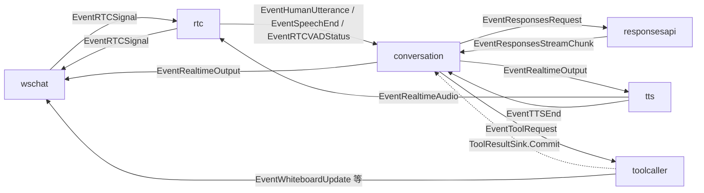

# Smart Speaker アーキテクチャ

## 全体像
このシステムは、ブラウザ音声入力を `rtc` で STT し、`conversation` が会話履歴・世代・応答タイムラインを管理し、`responsesapi` が LLM stream を取得し、`tts` と `toolcaller` が後段処理を担当する event graph です。



## 主要 component
- `wschat`: WebSocket 境界。会話表示、whiteboard 更新、WebRTC signaling を扱う。tool call / result は表示しない。
- `rtc`: WebRTC 音声入出力、VAD、STT、TTS 音声返送を扱う。
- `conversation`: 会話履歴 store と世代 store を持ち、LLM request、NDJSON 契約検証、speech / wait / tool timeline の進行を扱う。
- `responsesapi`: OpenAI Responses API を streaming で呼び、改行単位の chunk を返す。OpenAI tools / function calling は使わない。
- `toolcaller`: NDJSON tool chunk 由来の `EventToolRequest` を受け、local handler を実行して `ToolResultSink` へ結果を commit する。
- `tts`: assistant text を ElevenLabs で音声化し、完了時に `EventTTSEnd` を返す。

## 会話フロー
1. `rtc` が final transcript を `EventHumanUtterance` として出す。
2. `conversation` が世代 id を進め、human 発話を履歴に保存し、`EventResponsesRequest` を出す。
3. `responsesapi` が LLM stream を呼び、NDJSON 1 行ごとに `EventResponsesStreamChunk` を返す。
4. `conversation` が `speech` / `wait` / `tool` を timeline に積む。
5. `speech` は `EventRealtimeOutput` として UI / TTS に流れる。
6. `wait` は timer として扱われる。
7. `tool` は順序が来た時点で `EventToolRequest` として `toolcaller` に流れる。
8. `toolcaller` は tool を実行し、結果を `ToolResultSink.Commit` で conversation に戻す。
9. `conversation` は tool result を履歴に保存し、必要な stale 情報を含めて次の LLM request を出す。

## 世代と順序
- 新しい human 発話ごとに `conversation` 内の世代 id を単調増加させる。
- LLM request と timeline item には世代 id を付ける。
- 古い世代の LLM chunk は `conversation` 内で破棄する。
- すでに TTS / PLAY に渡した音声は止めない。まだ timeline に残っている後続予定だけを新しい入力で差し替える。
- tool result は事実として扱うため世代で破棄しない。古い世代なら stale 情報を履歴に入れ、LLM に判断させる。

## NDJSON 契約
LLM は通常テキストとして以下の NDJSON だけを返します。

```json
{"type":"speech","text":"..."}
{"type":"wait","sec":1}
{"type":"tool","name":"...","args":{}}
```

- `tool` は 1 回の応答の末尾に最大 1 件だけ置ける。
- `tool` の後に `speech` / `wait` / `tool` を続ける応答は契約違反。
- 複数 tool が必要な場合は、1 件ずつ呼び、結果を履歴に戻してから次の LLM 応答で続ける。

## 参照元
- `cmd/smart-speaker/main.go`
- `internal/components/conversation/`
- `internal/components/responsesapi/`
- `internal/components/toolcaller/`
- `internal/components/tts/`
- `internal/components/rtc/`
- `internal/components/wschat/`
- `internal/types/`
