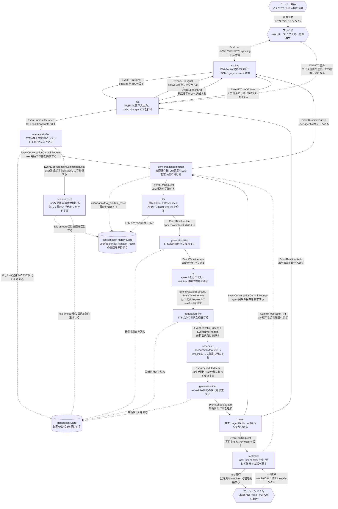

# Smart Speaker アーキテクチャ

この文書は `smart-speaker` の現在の会話 pipeline を説明する。
会話制御は旧 `conversation` component に集約せず、責務ごとの component と `internal/states/` 配下の共有Storeで構成する。

## 全体像

## 主要な責務

- `utterancebuffer` は STT 由来の文字起こしを短時間バッファし、1つの user 発話にまとめて世代idを進める。
- `sessionreset` は user 発話の commit request を監視し、一定時間新しい user 発話がなければ hook を実行してから会話履歴をクリアし、世代idを前進させる。
- `conversationcommitter` は user / agent / tool_call / tool_result を会話履歴Storeへ保存し、保存後に LLM や UI へ振り分ける。
- `llm` は会話履歴Storeの snapshot を使って OpenAI Responses API を呼び、Structured Outputs の JSON timeline を `speech` / `wait` / `tool` として検証する。
- `generationfilter` は世代id付き event のうち最新世代だけを下流へ通す。
- `tts` は `speech` item を ElevenLabs で音声化し、`wait` / `tool` item は順序維持のためそのまま通す。
- `scheduler` は `speech` / `wait` / `tool` を同じ timeline として扱い、speech の再生時間や wait 秒数に従って次 item へ進む。
- `router` は実行タイミングが来た item を PLAY、会話コミッター、toolcaller へ振り分ける。
- `toolcaller` は local tool を実行し、結果を downstream event ではなく `CommitToolResult` API で会話コミッターへ戻す。

## Tool 呼び出し

OpenAI Responses API の function calling は使わない。
LLM には `{"items":[{"type":"tool","name":"...","args":{...}}]}` 形式の JSON timeline を出力させる。
tool は1回の LLM 応答の末尾に最大1件だけ許可し、tool の後に `speech` / `wait` / `tool` が続いた場合は契約違反として LLM component が最大10回 retry する。
10回失敗した場合はログに出して、その応答は捨てる。

`web_search` もこの local tool 経路で扱う。LLM は `web_search` を JSON timeline の `tool` item として呼び出し、`toolcaller` が local handler を実行する。handler 内部では OpenAI Responses API の hosted `web_search` を別 request で使うが、会話 pipeline 上は通常の local tool result と同じく `conversationcommitter` へ戻る。引数は `query` のみ、戻り値は `result` のみとする。

## 世代と履歴

世代idは `internal/states/generation` が保持する。
新しい確定 user 発話ごとに世代idを単調増加させ、古い LLM chunk や古い scheduler item は generationfilter で落とす。
また、長時間 user 発話がない場合は `sessionreset` が世代idをさらに前進させ、reset 前の古い event が後続へ反映されないようにする。

会話履歴は `internal/states/conversationhistory` が保持する。
LLM request は必ず保存済みの履歴 snapshot から作る。
古い世代の tool result は実行済みの事実として保存し、`stale` metadata を付ける。
`sessionreset` は idle timeout 到達時に `conversationhistory.Store.Reset()` を呼び、次の user 発話で古い会話文脈を LLM に渡さない。

## セッションリセット

`CONVERSATION_IDLE_TIMEOUT_SECONDS` で指定した秒数だけ user 発話がない場合、`sessionreset` がリセットを実行する。
未設定時は 600 秒、`0` は無効化、不正値や負値は既定値として扱う。

リセット時は登録済み hook の `Exec(context.Context) error` を順番に同期実行し、その後に会話履歴を空にして世代idを進める。
hook が error を返してもログに残して後続 hook とリセット処理を継続する。
graph 上に reset 用 event は流さず、`sessionreset` の downstream は会話 pipeline へ接続しない。

## 参照元

- `cmd/smart-speaker/main.go`
- `internal/graph/graph.go`
- `internal/types/event.go`
- `internal/types/timeline_item.go`
- `internal/states/generation/store.go`
- `internal/states/conversationhistory/store.go`
- `internal/components/utterancebuffer/stage.go`
- `internal/components/sessionreset/stage.go`
- `internal/components/conversationcommitter/stage.go`
- `internal/components/llm/stage.go`
- `internal/components/generationfilter/stage.go`
- `internal/components/tts/elevenlabs.go`
- `internal/components/scheduler/stage.go`
- `internal/components/router/stage.go`
- `internal/components/toolcaller/toolcaller.go`
