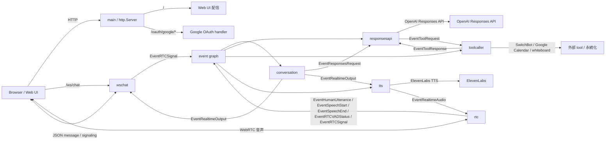
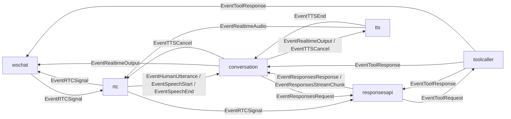

# Smart Speaker アーキテクチャ

この文書は `smart-speaker` のシステム全体像を共有するための再設計メモです。対象は HTTP / WebSocket / WebRTC / LLM / tool をまたぐ接続関係とイベントグラフであり、個別 component の詳細実装には踏み込みません。不明な点は本書では補完せず、不明と扱います。

## 全体像

このシステムは、ブラウザを起点にした音声対話を、Go の event graph 上で会話制御・LLM 呼び出し・tool 実行・音声合成へ分解して構成している。`cmd/smart-speaker/main.go` が HTTP サーバーと各 stage を組み立て、`internal/graph` が stage 間のイベント配送を担当する。

主要な役割分担は以下のとおりです。

- `wschat`: ブラウザとの WebSocket 境界。function call / result 表示、WebRTC signaling の中継を担当する。
- `rtc`: WebRTC 音声入出力の境界。ブラウザ音声の受信、VAD、サーバー側 STT、TTS 音声の返送を担当する。
- `conversation`: 会話進行の中心。会話履歴を持ち、LLM へのリクエスト生成、応答ストリームの解釈、TTS 再生順序の制御を担当する。
- `responsesapi`: OpenAI Responses API との通信境界。LLM 応答の streaming と tool call の橋渡しを担当する。
- `toolcaller`: tool 実行ランタイム。関数名に対応する handler を起動し、結果をイベントとして返す。
- `tts`: ElevenLabs を用いた音声合成境界。assistant のテキストを音声へ変換する。

## 主要 component の関係

システムの接続は `wireGraph` で明示されており、構成上は「ブラウザ境界」「会話制御」「LLM / tool」「音声処理」の 4 つに整理できる。

補足:

- HTTP は `main` が直接持ち、同じ `ServeMux` に Web UI、Google OAuth、`/ws/chat` を登録する。
- WebSocket は制御チャネルであり、音声本体は WebRTC を通る。
- `responsesapi` と `toolcaller` は OpenAI の function calling を event 化して接続している。
- `conversation` は Google Calendar を system context として前置してから LLM を呼ぶ。
- `rtc` から `responsesapi` への接続は graph 上には存在するが、現時点で `responsesapi` 側が処理しているイベントは `EventResponsesRequest` と `EventToolResponse` である。

## イベントグラフ

このシステムの中心は request/response ではなく event graph である。`graph` 自体は業務判断を持たず、各 stage の `Downstream` から出たイベントを接続先 `Upstream` に配送する。判断は各 component 内に閉じている。

イベントの流れは概ね次の順序になる。

1. ブラウザが `/ws/chat` へ接続し、WebRTC signaling を送る。
2. `rtc` はマイク音声から VAD と STT を行い、確定テキストを `EventHumanUtterance` として graph に流す。
3. `conversation` は会話履歴を更新し、必要な system context を付与して `EventResponsesRequest` を出す。
4. `responsesapi` は OpenAI Responses API を呼び、streaming chunk を `EventResponsesStreamChunk` として返す。tool call があれば `EventToolRequest` も出す。
5. `conversation` は応答契約を解釈し、assistant テキストを `EventRealtimeOutput` として UI と TTS に流す。
6. `tts` は音声を生成し、`rtc` が WebRTC 経由でブラウザへ返す。
7. `toolcaller` は tool 実行結果を `EventToolResponse` として返し、`responsesapi` はその結果を使って OpenAI へ再投入する。

## プロトコル間のつながり

- HTTP: Web UI 配信、Google OAuth 開始/コールバック、`/ws/chat` の公開を担当する。
- WebSocket: ブラウザ UI とサーバー間の制御プレーン。会話表示用 message、function call / result、VAD 状態、WebRTC signaling を運ぶ。
- WebRTC: ブラウザのマイク音声送信と assistant 音声再生のメディアプレーン。
- LLM: `responsesapi` が OpenAI Responses API を streaming で呼び出し、tool call を event graph に変換する。
- tool: `toolcaller` が SwitchBot、Google Calendar、whiteboard などを実行する。tool 定義には `web_search` も含まれるが、ローカル handler を持つかどうかは tool ごとに異なる。

この分離により、UI 制御、音声 transport、会話制御、外部 API 呼び出しを個別の stage に閉じ込めつつ、全体は event graph で接続する形になっている。

## 代表的なシナリオ

### 音声入力から音声応答まで

1. ブラウザが WebRTC でマイク音声を `rtc` に送る。
2. `rtc` が VAD と STT を行い、確定テキストを `EventHumanUtterance` として出す。
3. `conversation` が会話履歴を基に `EventResponsesRequest` を作る。
4. `responsesapi` が OpenAI Responses API を呼び、応答ストリームを返す。
5. `conversation` が assistant 発話へ変換し、`wschat` と `tts` に出す。
6. `tts` が ElevenLabs で音声化し、`rtc` が WebRTC でブラウザへ返送する。

### tool call を含む応答

1. `responsesapi` が tool call を `EventToolRequest` として出す。
2. `toolcaller` が該当 tool を実行し、`EventToolResponse` を返す。
3. `responsesapi` がその結果を `previous_response_id` 付きで OpenAI に再投入する。
4. `conversation` は必要に応じて tool 実行結果を会話文脈に取り込む。

## 参照元

- `README.md`
- `cmd/smart-speaker/main.go`
- `internal/graph/graph.go`
- `internal/types/event.go`
- `internal/components/wschat/wschat.go`
- `internal/components/rtc/rtc.go`
- `internal/components/rtc/signaling.go`
- `internal/components/rtc/input.go`
- `internal/components/rtc/output.go`
- `internal/components/conversation/conversation.go`
- `internal/components/conversation/core.go`
- `internal/components/conversation/state.go`
- `internal/components/conversation/runtime_loop.go`
- `internal/components/conversation/runtime_request.go`
- `internal/components/conversation/context_provider.go`
- `internal/components/conversation/response_contract.go`
- `internal/components/conversation/rule_human_text.go`
- `internal/components/conversation/rule_responses.go`
- `internal/components/conversation/rule_responses_stream.go`
- `internal/components/conversation/rule_tool_response.go`
- `internal/components/conversation/rule_tts_end.go`
- `internal/components/responsesapi/client.go`
- `internal/components/responsesapi/runner.go`
- `internal/components/toolcaller/toolcaller.go`
- `internal/components/tts/elevenlabs.go`
- `internal/tools/registry/registry.go`
- 旧資料: `git show HEAD^:docs/1.全体アーキテクチャとイベントグラフ.md`
