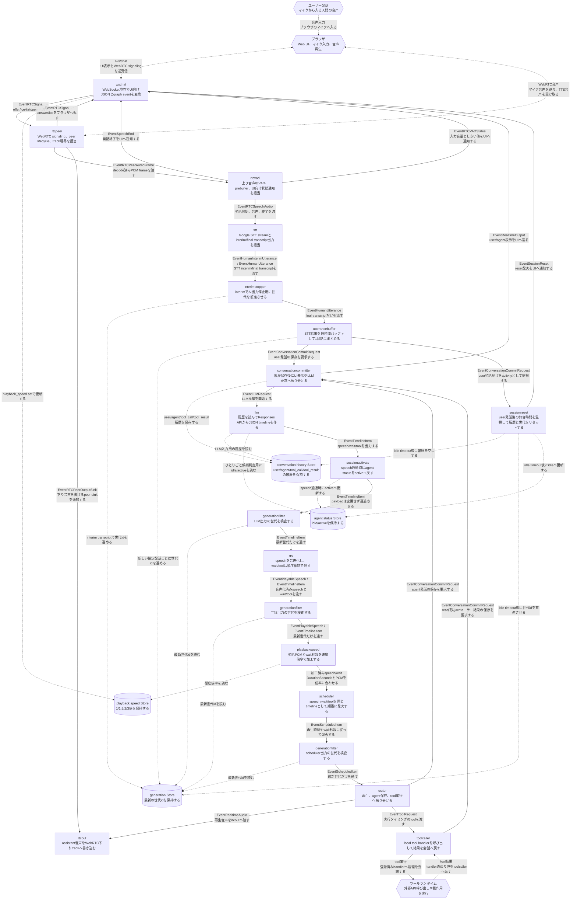

# Smart Speaker アーキテクチャ

この文書は `smart-speaker` の現在の会話 pipeline を説明する。
会話制御は旧 `conversation` component に集約せず、責務ごとの component と `internal/states/` 配下の共有Storeで構成する。

## 全体像

## 主要な責務

- `interimstopper` は STT 由来の interim transcript で世代idを前進させ、古いAI出力を既存の generationfilter で止める。interim は履歴やLLM入力へ流さない。
- `utterancebuffer` は STT 由来の final transcript を短時間バッファし、1つの user 発話にまとめて世代idを進める。
- `rtcpeer` は WebRTC signaling、peer lifecycle、remote track decode、下り音声 sink 通知を担当する。
- `rtcvad` は decode済みPCMの server VAD、prebuffer、active speaker 制御、UI向け状態通知を担当する。
- `stt` は Google Speech-to-Text v2 の streaming recognition と interim/final transcript 出力を担当する。
- `rtcout` は agent 音声を WebRTC の下り audio track へ書き込む。
- `sessionreset` は user 発話の commit request を監視し、一定時間新しい user 発話がなければ hook を実行してから会話履歴をクリアし、世代idを前進させ、agent status を idle に戻し、reset発火をUIへ通知する。
- `conversationcommitter` は user / agent / tool_call / tool_result を会話履歴Storeへ保存し、保存後に LLM や UI へ振り分ける。
- `llm` は会話履歴Storeの snapshot と agent status を使って OpenAI Responses API を呼び、Structured Outputs の JSON timeline を `speech` / `wait` / `tool` として検証する。
- `sessionactivate` は LLM 出力を payload 変更なしで通過させ、`speech` item が通過したときに agent status を active に更新する。
- `generationfilter` は世代id付き event のうち最新世代だけを下流へ通す。
- `playbackspeed` は共有 Store の倍率に従い、`PlayableSpeech` の PCM・`DurationSeconds` と `wait` の `Sec` を加工する。
- `tts` は `speech` item を ElevenLabs で音声化し、`wait` / `tool` item は順序維持のためそのまま通す。
- `scheduler` は `speech` / `wait` / `tool` を同じ timeline として扱い、speech の再生時間や wait 秒数に従って次 item へ進む。
- `router` は実行タイミングが来た item を PLAY、会話コミッター、toolcaller へ振り分ける。
- `toolcaller` は local tool を実行し、read 系 tool の結果や write 系 tool のエラー結果を `EventConversationCommitRequest` として会話コミッターへ戻す。write 系 tool の成功結果は commit しない。

## Tool 呼び出し

OpenAI Responses API の function calling は使わない。
LLM には `{"items":[{"type":"tool","name":"...","args":{...}}]}` 形式の JSON timeline を出力させる。
1回の LLM 応答に複数の tool item を出せる。system prompt では get 系 tool を末尾に置き、tool 前の speech は最小限とする。

各 tool 定義には `x_tool_mode: "read" | "write"` メタデータを持つ。
write 系 tool の成功結果は `toolcaller` が会話履歴へ commit せず、LLM への再投入も行わない。
read 系 tool の成功結果と、write 系 tool のエラー結果は従来どおり `conversationcommitter` 経由で履歴保存し LLM へ再投入する。

`web_search` もこの local tool 経路で扱う。LLM は `web_search` を JSON timeline の `tool` item として呼び出し、`toolcaller` が local handler を実行する。handler 内部では OpenAI Responses API の hosted `web_search` を別 request で使うが、会話 pipeline 上は read 系 local tool と同じく成功結果を `conversationcommitter` へ戻す。引数は `query` のみ、戻り値は `result` のみとする。

## 世代と履歴

世代idは `internal/states/generation` が保持する。
interim transcript 到着時と新しい確定 user 発話ごとに世代idを単調増加させ、古い LLM chunk や古い scheduler item は generationfilter で落とす。
interim transcript による世代更新はAI出力停止専用であり、会話履歴やLLM入力には反映しない。
また、長時間 user 発話がない場合は `sessionreset` が世代idをさらに前進させ、reset 前の古い event が後続へ反映されないようにする。

会話履歴は `internal/states/conversationhistory` が保持する。
LLM request は必ず保存済みの履歴 snapshot から作る。
古い世代の tool result は実行済みの事実として保存し、`stale` metadata を付ける。
`sessionreset` は idle timeout 到達時に `conversationhistory.Store.Reset()` を呼び、次の user 発話で古い会話文脈を LLM に渡さない。

agent status は `internal/states/agentstatus` が保持する。
起動直後は `idle` で、`llm` は request ごとにこの状態を read する。
`idle` かつ現在発話が明示依頼・疑問文ではない場合、LLM には「長期間無音だった」後のひとりごと候補として `{"items":[]}` を返してよいことを追加指示する。
`sessionreset` は idle timeout 到達時に `idle` を write し、`sessionactivate` は `speech` timeline item 通過時に `active` を write する。
LLM が `{"items":[]}` を返した場合は timeline event が発行されないため、agent status は `idle` のまま維持される。

メモリは `internal/states/memory` が保持する。
メモリStoreは、メモリ本文、関連タグ、embedding、作成更新時刻を JSON file に永続化する。
検索用文字列は保存せず、必要な場面で `Content` と `Tags` から組み立てる。
`memory.Store.Upsert()` は content 完全一致、タグ集合一致、embedding の cosine similarity による近似一致で既存メモリを更新し、該当がなければ新規作成する。
`memory.Store.Search()` は query embedding と保存済み embedding の cosine similarity を計算し、閾値、最大件数、類似度降順 sort を適用して返す。
現時点では Store の土台だけがあり、session reset hook、LLM context 注入、embedding 生成呼び出し、production graph への接続は後続の変更対象である。

## セッションリセット

`CONVERSATION_IDLE_TIMEOUT_SECONDS` で指定した秒数だけ user 発話がない場合、`sessionreset` がリセットを実行する。
未設定時は 300 秒、`0` は無効化、不正値や負値は既定値として扱う。

リセット時は登録済み hook の `Exec(context.Context) error` を順番に同期実行し、その後に会話履歴を空にして世代idを進め、agent status を `idle` に更新する。
hook が error を返してもログに残して後続 hook とリセット処理を継続する。
その後、`sessionreset` は `EventSessionReset` を `wschat` へ流し、`wschat` が WebSocket の `session_reset` message としてブラウザUIへ配信する。
UIは `session_reset` を受けると通常画面の直近会話吹き出しを非表示にし、次の `stt` または `server-stt` 由来 user message で再表示する。

## 参照元

- `cmd/smart-speaker/main.go`
- `internal/graph/graph.go`
- `internal/types/event.go`
- `internal/types/timeline_item.go`
- `internal/states/generation/store.go`
- `internal/states/agentstatus/store.go`
- `internal/states/conversationhistory/store.go`
- `internal/states/memory/record.go`
- `internal/states/memory/store.go`
- `internal/states/memory/similarity.go`
- `internal/components/utterancebuffer/stage.go`
- `internal/components/interimstopper/stage.go`
- `internal/components/sessionreset/stage.go`
- `internal/components/conversationcommitter/stage.go`
- `internal/components/llm/stage.go`
- `internal/components/sessionactivate/stage.go`
- `internal/components/generationfilter/stage.go`
- `internal/components/tts/elevenlabs.go`
- `internal/components/scheduler/stage.go`
- `internal/components/router/stage.go`
- `internal/components/toolcaller/toolcaller.go`
- `internal/components/rtcpeer/`
- `internal/components/rtcvad/`
- `internal/components/stt/`
- `internal/components/rtcout/`
