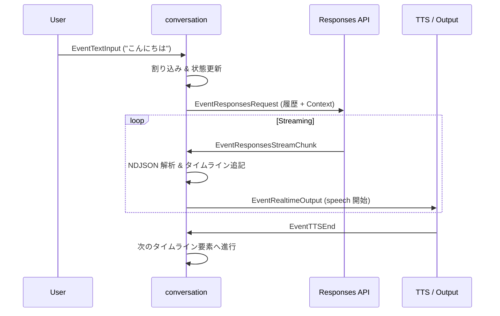
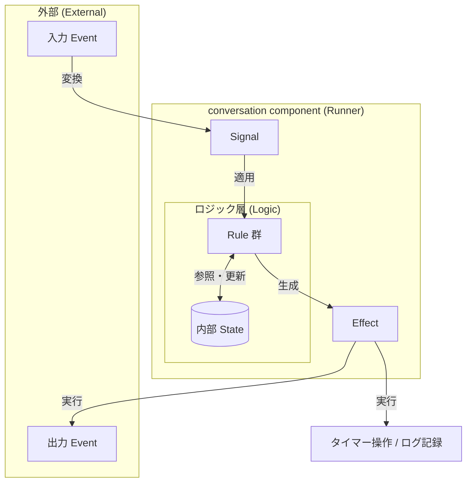

# conversation component 概要理解ドキュメント

## 1. ビジネスコンテキスト

音声対話システムにおいて、ユーザーの発話、アシスタントの応答生成（ストリーミング含む）、発話（TTS）、割り込み、ツール実行結果の反映などを矛盾なく管理し、スムーズな対話体験を提供することを目的としています。

* **解決する課題**: 
  - 音声認識の不完全さや応答の遅延、割り込みなど、非同期に発生するイベント群を適切に順序付けして処理する。
  - LLM からのストリーミング応答を逐次的に解釈し、ユーザーへの提示（TTS 発話やテキスト表示）をリアルタイムに開始する。
  - LLM への入力（コンテキスト）として、日記やカレンダーなどの外部情報を適切に付与する。
* **ターゲットユーザー**: スマートスピーカー利用者。
* **価値定義**: 会話の状態（履歴、進行状況）を正確に一元管理し、割り込み制御やリトライ処理を通じて、自然でストレスのない対話体験を実現する。

## 2. 論理構造・機能俯瞰

`conversation` component は、会話進行の「正本」を管理するオーケストレーターです。外部イベントを内部的な `signal` に正規化し、ルール群（Rule Registry）によって内部状態（State）を更新、必要な副作用（Effect）を外部へ送出します。

**主要なモデル・コンポーネント**

- **sessionState (State)**
  - 会話履歴（`Utterance`）、現在再生中の発話、未消化のタイムライン（`speech`/`wait`）、進行中のリクエスト ID、タイマー状態などを保持します。
- **Rule Registry**
  - 入力 `signal` を受け取り、ビジネスロジックに従って `State` の更新と `Effect` の生成を行います。
  - `humanTextRule`, `responsesStreamRule`, `ttsEndRule` などの独立したルールで構成されます。
- **Context Provider**
  - LLM へのリクエスト送信時に、最新の日記（`DiaryReader`）やカレンダー（`CalendarClient`）の情報を収集し、システムメッセージとしてフォーマットします。
- **Response Contract**
  - LLM からの応答が期待される NDJSON 形式に従っているかを検証します。契約違反がある場合は、修復やリトライの制御を行います。

## 3. 主要なデータフロー

### シナリオ: ユーザーの発話から応答の再生まで

1. **ユーザー発話受信**: `EventTextInput` を受信し、`humanTextSignal` に変換。
2. **割り込み処理**: 進行中の TTS 再生、待機タイマー、未完了のリクエストを中断・無効化。
3. **履歴更新**: ユーザーの発話を会話履歴に追加し、最新の履歴から LLM 用のメッセージ群を構築。
4. **コンテキスト付与**: `Context Provider` により日記とカレンダー情報をメッセージの先頭に注入。
5. **リクエスト発行**: `EventResponsesRequest` を送出。
6. **ストリーミング処理**: `EventResponsesStreamChunk` を受信するたびに NDJSON を解析し、`speech`（発話）や `wait`（待機）をタイムラインに追記。
7. **タイムライン進行**: タイムラインの先頭から順に処理。`speech` なら `EventRealtimeOutput` を出し、TTS の完了（`EventTTSEnd`）を待機。

## 4. 詳細設計

### クラス設計

- `internal/components/conversation/`
  - `conversation.go`: コンポーネントの初期化（`NewStage`）と、タイマーやチャネルを制御する `runner` ループの実装。
  - `core.go`: `conversationCore` によるルール適用エンジン、共通の副作用生成ロジック。
  - `state.go`: `sessionState` 構造体と、会話履歴を表す `Utterance` などの定義。
  - `signal.go`: 外部イベント（`types.Event`）を内部 `signal` インターフェースへ変換する定義。
  - `rule_*.go`: 各イベントに対する具体的なビジネスロジック。
    - `rule_human_text.go`: ユーザー発話時の割り込みとリクエスト開始。
    - `rule_responses_stream.go`: ストリーミング応答の逐次解釈と即時進行。
    - `rule_tts_end.go`: 発話完了に伴うタイムラインの推進。
  - `response_contract.go`: NDJSON の形式検証（`ResponseContract`）とリトライ判定。
  - `context_provider.go`: カレンダーや日記のデータ取得（`contextProvider`）とプロンプト生成。

### タイムライン進行と詳細ロジック

1. **割り込み制御**: 新しいユーザー発話（`humanTextSignal`）を受けると、現在の再生・待機タイマー・進行中のリクエスト・未再生の発話をすべて中断し、状態をクリーンアップします。
2. **コンテキスト構築**: `buildConversationMessages()` により履歴をメッセージ化し、日記とカレンダー情報を先頭に付与します。
3. **応答解釈**: 応答は `{"type":"speech","text":"..."}` または `{"type":"wait","sec":整数}` の NDJSON として解釈されます。
4. **タイムラインの推進**: `advanceTimelineEffects()` は `pendingTimeline` を順次消化します。
   - `wait`: 秒数を 0〜5 秒に正規化し、内部タイマーを開始します。
   - `speech`: `Utterance` を生成し `EventRealtimeOutput` を送出、TTS 完了を待ちます。
5. **TTS 完了ハンドリング**: `EventTTSEnd` を受けると、対象の発話を `Played` にし、後続の `wait` を消費して次の要素へ進みます。
6. **リトライロジック**: 
   - ストリーミング中、発話を一度も開始していない段階での契約違反のみリトライ対象となります。
   - 発話開始後の違反 chunk はリトライせず、そのストリームの残りの進行を破棄します。
   - ストリーム完了時に発話が一つも生成されなかった場合も、契約違反としてリトライします。

## 5. 技術リファレンス

### 構造と関係図
各概念は以下のような関係で連携し、会話のロジックを構成しています。

### 入力 event
| EventKind | payload | 用途 |
| --- | --- | --- |
| `EventHumanUtterance` | `types.OutputLine` | 空白除去後の text を `humanTextSignal` に変換し、人の確定発話として扱う。 |
| `EventSpeechStart` | なし | 発話開始検知。現行実装ではこれだけでは割り込みしない。 |
| `EventResponsesResponse` | `types.ResponsesResponse` | non-streaming 応答を解釈する。tool call を含む場合は会話本文としては処理しない。 |
| `EventResponsesStreamChunk` | `types.ResponsesStreamChunk` | streaming 応答の 1 行、完了、エラーを解釈する。 |
| `EventToolResponse` | `types.ToolResponse` | `write_diary` 以外の tool 実行結果を会話履歴へ反映する。 |
| `EventTTSEnd` | `types.TTSEvent` | 再生完了を受け、次の timeline 進行可否を判定する。 |
| `EventSessionClear` | なし | 会話 state を初期化する。 |

### 出力 event
| EventKind | payload | 出力条件 |
| --- | --- | --- |
| `EventResponsesRequest` | `types.ResponsesRequest` | 人の確定発話時、または invalid response retry 時。 |
| `EventRealtimeOutput` | `types.OutputLine` | assistant 発話開始時。text 行と `Final=true` 行を連続で出す。 |
| `EventTTSCancel` | `types.TTSCancel` | 再生中 assistant 発話を人の確定発話や session clear で中断するとき。 |
| `EventConversationSnapshotUpdated` | `types.ConversationSnapshot` | 人の確定発話時、tool結果反映時、TTS完了時、stream完了時、session clear時。 |
| `EventConversationActivity` | `types.ConversationActivity` | 人の確定発話時と assistant 発話開始時。 |

### 内部 signal
`conversation` コンポーネント内では、外部からの様々なイベントを扱いやすい共通形式（Signal）に変換して処理しています。

| signal | 概要（何を意味するか） | 対応する外部イベント |
| --- | --- | --- |
| `speechStartSignal` | **話し始めを検知した合図** | `EventSpeechStart` |
| `humanTextSignal` | **ユーザーの発話内容が確定した合図** | `EventTextInput` |
| `responsesSignal` | **AI からのまとまった回答が届いた合図** | `EventResponsesResponse` |
| `responsesStreamChunkSignal` | **AI から回答の断片が届いた合図** | `EventResponsesStreamChunk` |
| `toolResponseSignal` | **ツール実行の結果が届いた合図** | `EventToolResponse` |
| `sessionClearSignal` | **会話リセットの合図** | `EventSessionClear` |
| `ttsEndSignal` | **読み上げが完了した合図** | `EventTTSEnd` |
| `timerElapsedSignal` | **待機タイマーが満了した合図** | なし（内部生成） |

### 副作用 (Effect)
`conversation` コンポーネントは、外部へのアクションや時間のかかる処理を「副作用（Effect）」として抽象化しています。
Rule は現在の状態と入力 Signal に基づいて「何をすべきか」という論理的な判断を下し、実際の実行（物理的な処理）は Runner が Effect を消費することで行われます。

- **生成**: 各 Rule の `Apply` メソッド内で、次に実行すべきアクションとして `[]effect` が生成されます。
- **消費**: `runner.go` のメインループ（Runner）が Effect を受け取り、`applyEffects` メソッドでタイマー操作やイベント発行などの実動作に変換します。

| effect | 役割 | 物理的な動作 |
| --- | --- | --- |
| `emitEventEffect` | **外部へイベントを通知する** | `types.Event` を下流のチャネルへ送信します。 |
| `startTimerEffect` | **タイマーを開始する** | 指定された時間の `time.Timer` を設定します。 |
| `stopTimerEffect` | **実行中のタイマーを停止する** | 現在動いているタイマーを無効化します。 |
| `requestResponseEffect` | **AI への応答を要求する** | Responses API へのリクエストをトリガーします。 |
| `logRecordEffect` | **会話ログを記録する** | 会話の履歴を永続化（保存）します。 |
| `runtimeLogEffect` | **実行時の状況を記録する** | 運用情報をログ出力します。 |

### Effect の実行メカニズム（Runner）
Rule によって生成された Effect は、コンポーネントの実行主体である **Runner** によって消費されます。
Runner は `runtime_loop.go` でイベントやタイマーの入力を監視し、それらを Signal としてロジック層（Core）へ投入します。Core から返された Effect 群は `runtime_apply.go` で型ごとに振り分けられ、具体的な物理操作へと変換されます。

#### runtime 群
Effect を具現化するための物理操作は、役割ごとに `runtime_*.go` ファイルに分割して実装されています。

| ファイル | 役割 | 主な動作 |
| --- | --- | --- |
| `runtime_loop.go` | **メインループの管理** | 外部イベントの受信、タイマー満了の検知、および Core への Signal 投入。 |
| `runtime_apply.go` | **Effect の振り分け** | `[]effect` をループで回し、型スイッチによって各実行メソッドへディスパッチ。 |
| `runtime_emit.go` | **イベント送信** | `downstream` チャネルを通じて、外部コンポーネントへ `types.Event` を送出。 |
| `runtime_timer.go` | **タイマー制御** | `time.Timer` を使用した物理的な待ち時間の管理（開始・停止・リセット）。 |
| `runtime_request.go` | **外部リクエスト実行** | Responses API (LLM) への HTTP リクエストやストリーミング接続の開始。 |
| `runtime_log.go` | **ログ出力・永続化** | システムログの出力、および `runtime_logger.go` を介した会話履歴の保存。 |

### 内部 state
| 項目 | 内容 |
| --- | --- |
| `conversation []*Utterance` | 会話履歴。`human` / `ai` / `tool` を保持。 |
| `current *Utterance` | 現在再生中の assistant 発話。 |
| `utteranceByResponseID` | `EventTTSEnd` を対応付けるための index。 |
| `pendingTimeline []timelineSegment` | 未消化の `speech` / `wait` 列。 |
| `pendingTimelineIdx` | 次に消化する timeline の位置。 |
| `pendingRequestID` | 現在有効な Responses API request の ID。 |
| `pendingRequestCancelled` | 進行中 request を無効化したかどうか。 |
| `invalidResponseRetries` | 契約違反 retry の回数。最大 1。 |
| `pendingRequestStreaming` | streaming 応答を処理中かどうか。 |
| `pendingStreamSpeechStarted` | その stream で speech を 1 度でも開始したか。 |
| `pendingStreamFailed` | stream 失敗後の追加 chunk を無視する flag。 |
| `pendingTimelineTimerWaiting` | wait 区間の timer 待ち中かどうか。 |
| `pendingStreamLines []string` | retry 用に保持する streaming 生行。 |
| `seq` | 各種 ID の採番に使う連番。 |

### rule 群
`conversation` コンポーネントの挙動は、以下の「ルール」の集合によって定義されています。各ルールは特定のイベント（入力）に対して、「状態をどう変えるか」「次にどんなアクション（副作用）を起こすか」を判断します。

| Rule | 起動トリガー (Signal) | 責務と主な処理 | 主な副作用 (Effect) / 状態更新 |
| :--- | :--- | :--- | :--- |
| `speechStartRule` | `speechStartSignal` | **ユーザーの話し始めを検知** 話し始めた事実を認識しますが、現時点では割り込みは行いません。 | (なし) |
| `humanTextRule` | `humanTextSignal` | **ユーザーの確定発話を処理** 進行中の再生やタイマーを中断し、発話を履歴に追加。最新のコンテキストを含めて AI へ応答をリクエスト。 | `stopTimerEffect`, `emitEventEffect` (TTSCancel), `requestResponseEffect` |
| `responsesRule` | `responsesSignal` | **一括応答（非ストリーミング）の解釈** 応答形式を検証し、再生タイムラインを構築。形式不正時はリトライを検討。 | `requestResponseEffect` (リトライ時), `logRecordEffect`, `advanceTimelineEffects` 実行 |
| `responsesStreamRule` | `responsesStreamChunkSignal` | **逐次応答（ストリーミング）のリアルタイム処理** 届いた断片を即座に解析しタイムラインに追加。可能な限り早く再生を開始。 | `requestResponseEffect` (リトライ時), `emitConversationSnapshotEffect` |
| `toolResponseRule` | `toolResponseSignal` | **ツール実行結果の反映** ツールの実行結果をシステムメッセージとして履歴に追加。AI が次のターンで参照可能にする。 | `logRecordEffect`, `emitConversationSnapshotEffect` |
| `sessionClearRule` | `sessionClearSignal` | **会話状態の完全リセット** 履歴を消去し、進行中の再生・通信・タイマーをすべて破棄。 | `stopTimerEffect`, `emitEventEffect` (TTSCancel), `emitConversationSnapshotEffect` |
| `ttsEndRule` | `ttsEndSignal` | **読み上げ完了後の遷移準備** 発話ステータスを再生済みに更新。次のセグメント（発話/待機）へ進むための待機タイマーを開始。 | `startTimerEffect`, `emitConversationSnapshotEffect` |
| `timerElapsedRule` | `timerElapsedSignal` | **待機完了によるタイムライン進行** タイマー満了を受けて次の発話を開始、または後続の待機タイマーを再設定。 | `emitEventEffect` (RealtimeOutput), `startTimerEffect`, `logRecordEffect` |

rule の適用順（優先順位）は以下の通りです：
`speechStartRule` → `humanTextRule` → `responsesRule` → `responsesStreamRule` → `toolResponseRule` → `sessionClearRule` → `ttsEndRule` → `timerElapsedRule`

---

### ルール上の補足
- assistant 発話は `EventRealtimeOutput` を出した時点で利用者へ提示済みとみなし、`EventTTSEnd` 前でも次 request の会話履歴に含める。
- `toolResponseRule` は tool 出力を `system` role の履歴として保存する。
- `write_diary` の tool 結果は `conversation` の履歴へ追加しない。
- `EventSpeechEnd`、`EventRTCVADStatus`、`EventRealtimeAudio`、`EventRTCSignal` はこの component では処理していない。

### 不明点
- `conversation` component 単体の責務として、`EventResponsesResponse` に含まれる `ToolCalls` の downstream 実行フロー全体は定義されていません。実行自体は `responsesapi` / `toolcaller` 側の責務です。
- LLM へ渡す system prompt 本文そのものは、この component 配下の実装だけでは不明です。

## 7. 参照元
- `internal/components/conversation/` 配下の各ファイル
- `internal/types/event.go`
- `internal/types/types.go`
