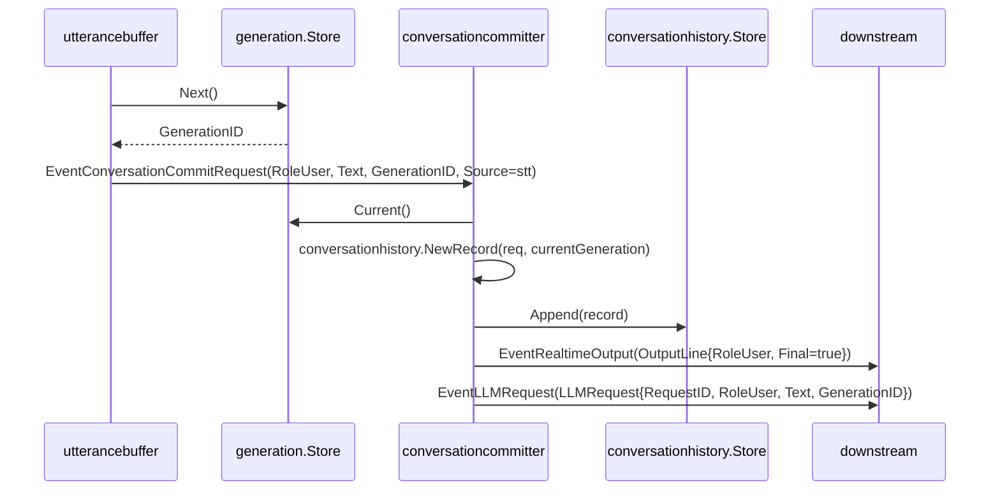
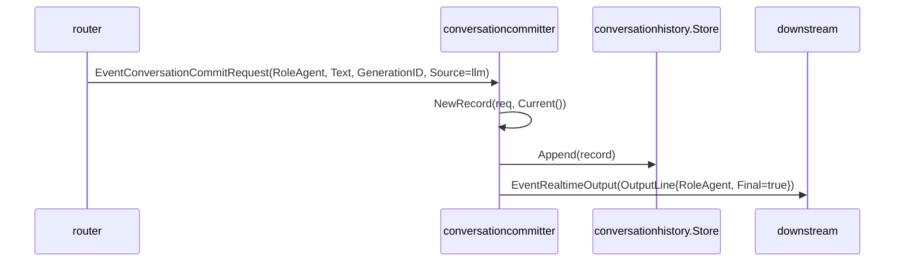
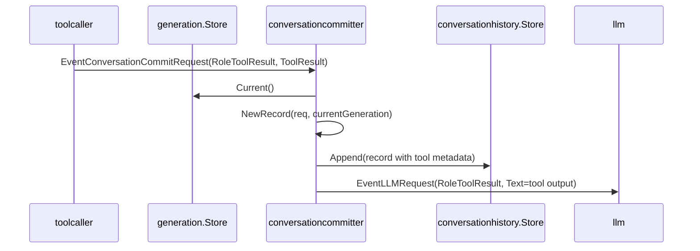

# conversationcommitter 概要理解ドキュメント

## 1. ビジネスコンテキスト

* **解決する課題**: ユーザー発話、agent 発話、tool 呼び出し、tool 実行結果を、LLM が次回推論で参照できる会話履歴へ一元的に保存する。
* **提供価値**: 会話履歴への保存を先に行ってから、UI 表示用の `EventRealtimeOutput` や LLM 起動用の `EventLLMRequest` を発行するため、下流の LLM component は `conversationhistory.Store.Snapshot()` から正本の履歴を読める。
* **対象データ**: `types.ConversationCommitRequest` を入力とし、`types.ConversationRecord` として `conversationhistory.Store` に保存する。tool 実行結果も `types.ToolResultRecord` を含む `EventConversationCommitRequest` として受け取る。
* **世代管理の位置づけ**: `generation.Store.Current()` を参照し、tool result が現在世代と一致するかを `stale` metadata として記録する。ユーザー発話の新規世代採番は `utterancebuffer` 側の `generation.Store.Next()` が行う。
* **不明点**: 永続DBへの保存、会話履歴の上限、古い tool result を LLM に再投入するかどうかの業務判断は、この component の実装からは確認できない。

根拠: `internal/components/conversationcommitter/`, `internal/states/conversationhistory/`, `internal/states/generation/`, `internal/types/conversation_record.go`, `internal/types/event.go`

## 2. 論理構造・機能俯瞰

**主要なモデル・コンポーネント**

- **conversationcommitter stage**
  - `NewStage(Config)` が `graph.Stage` を生成する。
  - `Upstream` は `EventConversationCommitRequest` を受け取る。
  - `Downstream` は保存後に必要な `EventRealtimeOutput` / `EventLLMRequest` を流す。
  - `EventConversationCommitRequest` 以外、または payload が `types.ConversationCommitRequest` でない event は無視する。

- **committer**
  - `Commit(ctx, req)` が commit request を `conversationhistory.NewRecord(req, currentGeneration)` で `ConversationRecord` に変換する。
  - `conversationhistory.Store.Append(record)` で会話履歴へ保存する。
  - `record.Role` に応じて、下流 event を発行する。
  - `history` が nil の場合はログ出力して処理を終了する。
  - `record.Text` が空文字の場合は保存も event 発行もしない。

- **conversationhistory.Store**
  - `ConversationRecord` の正本をメモリ上に保持する。
  - `Append` と `Snapshot` は mutex で保護され、`Snapshot` は slice と metadata map を clone して返す。
  - `ToChatMessages(records)` は LLM に渡す `[]types.ChatMessage` に変換する。role は `user` / `agent` / `tool_call` / `tool_result` を保持し、content は構造化 JSON 文字列になる。

- **generation.Store**
  - 現在の `types.GenerationID` を保持するメモリストア。
  - `Next()` は現在世代をインクリメントして返す。
  - `Current()` は現在世代を返す。
  - `IsCurrent(id)` は指定世代が現在世代かを判定する。

- **関連する上流・下流 component**
  - `utterancebuffer`: `EventHumanUtterance` を一定時間まとめ、`RoleUser` の `ConversationCommitRequest` を発行する。
  - `router`: `PlayableSpeech` を受け、音声再生 event と `RoleAgent` の `ConversationCommitRequest` を発行する。
  - `toolcaller`: `ToolRequest` を実行し、`EventConversationCommitRequest` で tool result を返す。
  - `llm`: `EventLLMRequest` を受け、履歴ストアの `Snapshot()` があればそれを `ToChatMessages` で変換して Responses API へ渡す。

## 3. 主要なデータフロー

### シナリオ: ユーザー発話が履歴へ保存され、LLM request が発行される

1. `utterancebuffer` が `EventHumanUtterance` の text を buffer に蓄積する。
2. timer 発火または upstream close 時、`generation.Store.Next()` で新しい `GenerationID` を採番する。
3. `utterancebuffer` が `EventConversationCommitRequest` を発行する。payload は `Role: "user"`, `Text: 発話テキスト`, `GenerationID: 採番値`, `Source: "stt"`。
4. `conversationcommitter.stage.consume` が event kind と payload 型を検証し、`committer.Commit` に渡す。
5. `committer.Commit` が `generation.Store.Current()` を読み、`conversationhistory.NewRecord` で `ConversationRecord` を作る。
6. `record.Text` が空でなければ `conversationhistory.Store.Append(record)` で保存する。
7. role が `user` のため、`EventRealtimeOutput` を `Final: true` で発行する。
8. 続けて `EventLLMRequest` を発行する。`RequestID` は保存 record の `ID`、`Role` は `user`、`Text` は保存済み text、`GenerationID` は保存 record の世代。

### シナリオ: agent 発話が履歴へ保存され、UI 表示へ流れる

1. `router` が `types.PlayableSpeech` を受ける。
2. `router` は `EventRealtimeAudio` を発行した後、`Role: "agent"`, `Source: "llm"` の `EventConversationCommitRequest` を発行する。
3. `conversationcommitter` が request を `ConversationRecord` に変換して保存する。
4. role が `agent` のため、`EventRealtimeOutput` のみを発行する。
5. agent commit からは `EventLLMRequest` は発行されない。

### シナリオ: tool 呼び出しが履歴へ保存される

1. `router` が `types.ToolRequest` を受ける。
2. `router` は `Role: "tool_call"`、`ToolCall: {ToolCallID, Name, Arguments, GenerationID}` の `EventConversationCommitRequest` を発行する。
3. `conversationhistory.NewRecord` が `ToolCall.Arguments` を `record.Text` にし、`Role` を `tool_call`、`Source` を tool 名にする。
4. metadata に `tool_call_id`, `tool_name` を保存する。
5. `committer.emitToolCall` が `EventRealtimeOutput` を発行し、UI へ `role: "tool_call"` の message として流す。
6. tool call commit からは `EventLLMRequest` は発行されない。

### シナリオ: tool 実行結果が履歴へ保存され、LLM request が発行される

1. `toolcaller` が `types.ToolRequest` を実行し、`types.ToolResultRecord` を作る。
2. read 系 tool の成功結果、write 系 tool のエラー結果について、`toolcaller` は `ToolResult` を含む `ConversationCommitRequest` を `EventConversationCommitRequest` として downstream に送る。write 系 tool の成功結果は送らない。
3. graph は `toolcaller -> conversationcommitter` の edge でその event を転送する。
4. `conversationcommitter.stage.consume` が event kind と payload 型を検証し、`committer.Commit` に渡す。
5. `conversationhistory.NewRecord` が `ToolResult.Output` を `record.Text` にし、`Role` を `tool_result`、`Source` を tool 名、`GenerationID` を tool result の世代にする。
6. metadata に `tool_call_id`, `tool_name`, `current_generation_id`, `stale` を保存する。
7. `committer.emitToolResult` が `EventRealtimeOutput` を発行し、UI へ `role: "tool_result"` の message として流す。
8. 続けて `EventLLMRequest` を `Role: "tool_result"` で発行する。
9. `llm.messages` は履歴がある場合、request 本体ではなく `conversationhistory.Store.Snapshot()` 全体を `ToChatMessages` で変換して使う。`tool_call` / `tool_result` record はそれぞれ同じ role のまま JSON content に変換される。

## 4. 詳細設計

### クラス設計

- internal/
  - components/
    - conversationcommitter/
      - `stage.go`: graph stage としての channel、起動、停止、event 消費を定義する。
        - `NewStage`: `Config{History, Generation}` から `*graph.Stage` を生成する。
        - `run`: parent context から cancel 可能な context を作り、`consume` goroutine を起動する。
        - `consume`: `EventConversationCommitRequest` だけを受け付け、payload を `types.ConversationCommitRequest` として `committer.Commit` に渡す。
        - `emit`: `downstream` へ event を送る。buffer が満杯の場合も同じ送信を行うため、空きが出るまで待つ。
        - `close`: cancel を呼び、`upstream` を一度だけ close する。
      - `committer.go`: commit request を履歴 record に変換し、保存後に role 別 event を発行する中核処理。
        - `Commit`: history nil と空 text を除外し、履歴保存後に `emitUser` / `emitAgent` / `emitToolCall` / `emitToolResult` へ分岐する。
        - `emitUser`: `EventRealtimeOutput` と `EventLLMRequest` を順に発行する。
        - `emitAgent`: `EventRealtimeOutput` のみを発行する。
        - `emitToolCall`: `EventRealtimeOutput` のみを発行する。
        - `emitToolResult`: `EventRealtimeOutput` と `EventLLMRequest` を順に発行する。
      - `stage_test.go`: user commit と tool result commit の主要挙動を検証する。
        - `TestStageCommitsUserBeforeLLMRequest`: user commit 後、`EventRealtimeOutput`、`EventLLMRequest` の順に流れ、履歴が1件保存されることを確認する。
        - `TestStageCommitsToolResultEventAsStale`: 現在世代より古い tool result event が `stale=true` metadata で保存されることを確認する。
  - states/
    - conversationhistory/
      - `record.go`: commit request と履歴 record、LLM 用 chat message の変換を定義する。
        - `NewRecord`: role の default、text/source trim、record ID 生成、tool metadata 付与を行う。
        - `ToChatMessages`: 空 role/text を除外し、正規 role と JSON content の `ChatMessage` に変換する。
        - `formatMessageContent` / `formatToolCallContent` / `formatToolResultContent`: LLM に渡す JSON content を組み立てる。marshal に失敗した場合は元の text を返す。
      - `store.go`: 会話履歴のメモリストア。
        - `NewStore`: 空の store を作る。
        - `Append`: record を clone して追加する。
        - `Snapshot`: 保存済み record の clone を返す。
        - `Reset`: 保存済み record を空にする。
  - states/
    - generation/
      - `store.go`: 現在世代 ID のメモリストア。
        - `NewStore`: generation store を作る。
        - `Next`: 世代を1つ進めて返す。
        - `Current`: 現在世代を返す。
        - `IsCurrent`: 指定世代が現在世代か返す。
        - `Reset`: 現在世代を0に戻す。
  - types/
    - `conversation_record.go`: conversationcommitter の主要入出力型を定義する。
      - `ConversationRecord`: 履歴1件。`ID`, `Role`, `Text`, `GenerationID`, `Source`, `Metadata`, `CreatedAt` を持つ。
      - `ToolCallRecord`: tool 呼び出し。`ToolCallID`, `Name`, `Arguments`, `GenerationID` を持つ。
      - `ToolResultRecord`: tool 実行結果。`ToolCallID`, `Name`, `Output`, `GenerationID` を持つ。
      - `ConversationCommitRequest`: 履歴保存要求。通常発話は `Role/Text/GenerationID/Source`、tool call は `ToolCall`、tool result は `ToolResult` を使う。
      - `LLMRequest`: LLM component への推論要求。`RequestID`, `Role`, `Text`, `GenerationID` を持つ。

### 入出力 event 設計

- `EventConversationCommitRequest`
  - 入力 event。
  - payload は `types.ConversationCommitRequest`。
  - `stage.consume` はこの event kind 以外を無視する。

- `EventRealtimeOutput`
  - user / agent / tool_call / tool_result commit 後の出力 event。
  - payload は `types.OutputLine`。
  - `Role`, `Text`, `Source`, `GenerationID` は保存 record 由来。
  - `Final` は常に `true`。
  - tool call / tool result も WebSocket では `type: "message"` として送られる。

- `EventLLMRequest`
  - user / tool_result commit 後の出力 event。
  - payload は `types.LLMRequest`。
  - user の `RequestID` は保存 record の `ID`。
  - tool result の `Text` は trim 済みの tool output。
  - agent commit では発行されない。

### 履歴 record 変換ルール

- 通常 request
  - `Role` は trim され、空なら `user` になる。
  - `Text` と `Source` は trim される。
  - `ID` は `UnixNano-role-generationID` 形式の文字列。
  - `Metadata` は空 map。
  - `CreatedAt` は `NewRecord` 実行時刻。

- tool call request
  - `Role` は強制的に `tool_call` になる。
  - `Text` は `string(req.ToolCall.Arguments)` になる。
  - `GenerationID` は `req.ToolCall.GenerationID` になる。
  - `Source` は `req.ToolCall.Name` になる。
  - `Metadata["tool_call_id"]` は `ToolCallID`。
  - `Metadata["tool_name"]` は `Name`。

- tool result request
  - `Role` は強制的に `tool_result` になる。
  - `Text` は `string(req.ToolResult.Output)` になる。
  - `GenerationID` は `req.ToolResult.GenerationID` になる。
  - `Source` は `req.ToolResult.Name` になる。
  - `Metadata["tool_call_id"]` は `ToolCallID`。
  - `Metadata["tool_name"]` は `Name`。
  - `Metadata["current_generation_id"]` は `uint64(currentGeneration)`。
  - `Metadata["stale"]` は `req.ToolResult.GenerationID != currentGeneration`。

### API設計

- 外部 HTTP API は持たない。
- 内部 API として tool result 専用の API は持たず、graph の `EventConversationCommitRequest` を入力にする。
- tool result の payload は `types.ConversationCommitRequest{Role: types.RoleToolResult, GenerationID: result.GenerationID, Source: result.Name, ToolResult: &result}`。

### 注意点

- `Commit` の `ctx` は現状 `_ = ctx` で明示的に未使用化されており、role 別 emit 処理では cancellation を見ていない。
- `committer.emit` は `stage.emit` を通じて `downstream` に送信するため、downstream が詰まると送信で待つ。
- `generationfilter` は `ConversationCommitRequest` の `GenerationID` を見て最新世代のみ通す実装を持つが、`conversationcommitter` 自体は user / agent request の世代が current かどうかを検証しない。
- `ToolResultRecord` は tool 実行時点の `GenerationID` のみを持ち、`current_generation_id` と `stale` は `conversationhistory.NewRecord` が現在世代との比較で metadata に記録する。
- API endpoint やDBテーブルは、この component の実コード上は存在しない。
