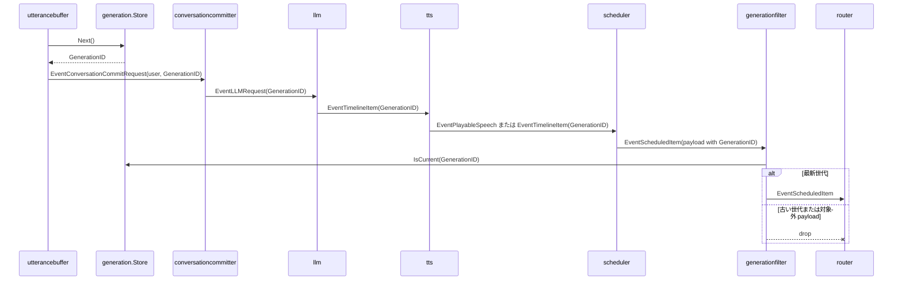

# generationfilter 概要理解ドキュメント

## 1. ビジネスコンテキスト

* **解決する課題**: ユーザーの新しい発話で会話世代が進んだあとに、古い世代の LLM 応答・TTS 音声・tool 実行要求が後続処理へ流れることを防ぐ。
* **ターゲットユーザー**: smart-speaker の会話パイプラインを利用するユーザー、および会話処理・音声再生・tool 実行を保守する開発者。
* **提供価値**: 最新の会話世代に属する event だけを通すことで、古い応答の再生や古い tool request の実行を抑止し、会話の割り込み後も出力の整合性を保つ。
* **実装上の位置づけ**: `generationfilter` は `internal/states/generation.Store` の現在値と event payload の `GenerationID` を比較し、最新世代に属する event だけを後続 component へ通す。
* **参照する状態**: 世代の正本は `internal/states/generation.Store` にあり、event 側の世代 id は `internal/types.GenerationID` として各 payload に保持される。

## 2. 論理構造・機能俯瞰

**主要なモデル・コンポーネント**

- **generationfilter stage**
  - `internal/components/generationfilter/stage.go` に実装される `graph.Stage`。
  - `Upstream` から受け取った `types.Event` を `allow` で判定し、許可された event だけを `Downstream` へ送る。
  - `context.Context` のキャンセル、`Upstream` の close、`CloseFn` による明示 close に対応する。

- **generation.Store**
  - `internal/states/generation/store.go` に実装される現在世代 ID の正本。
  - `Next()` で世代を 1 つ進め、`Current()` で現在値を返し、`IsCurrent(id)` で指定 ID が現在世代かを判定する。
  - `sync.RWMutex` で保護されており、複数 goroutine からの参照・更新に対応する。

- **GenerationID**
  - `internal/types/generation.go` の `type GenerationID uint64`。
  - 会話の世代を表す識別子で、LLM request、timeline item、TTS 済み音声、tool request、会話履歴 commit などに引き継がれる。

- **通過対象 payload**
  - `eventGenerationID` が `GenerationID` を取り出せる payload だけが、store 有効時の判定対象になる。
  - 対象は `types.TimelineItem`、`types.PlayableSpeech`、`types.ToolRequest`、`types.OutputAudio`、`types.ConversationCommitRequest`。
  - `types.LLMRequest` や `types.OutputLine` は `GenerationID` を持つ型だが、現行の `generationfilter` では `eventGenerationID` の対象外である。

- **graph.Stage**
  - `internal/graph/stage.go` の共通 stage 構造。
  - `generationfilter` は `Upstream` / `Downstream` に `graph.DefaultChannelBufferSize` の buffered channel を使う。

## 3. 主要なデータフロー

### シナリオ: 最新世代の timeline / speech / tool event だけを後続へ流す

1. 世代の採番: `utterancebuffer` が STT の確定テキストをまとめ、flush 時に `generation.Store.Next()` を呼んで新しい `GenerationID` を採番する。
2. LLM request の作成: `conversationcommitter` が user の `ConversationCommitRequest` を履歴へ保存し、同じ `GenerationID` を持つ `EventLLMRequest` を発行する。
3. timeline item の生成: `llm` が Responses API の NDJSON 出力を `types.TimelineItem` に変換し、request と同じ `GenerationID` を設定する。
4. TTS 変換: `tts` は `speech` の `TimelineItem` を `types.PlayableSpeech` に変換し、元の `GenerationID` を引き継ぐ。`speech` 以外の timeline item はそのまま後続へ流す。
5. スケジューリング: `scheduler` は `PlayableSpeech` と `TimelineItem` を世代ごとに worker へ enqueue し、再生可能音声や tool item を `EventScheduledItem` として出力する。
6. 世代フィルタ: `generationfilter` は event payload から `GenerationID` を取り出し、`generation.Store.IsCurrent(id)` が true の event だけを `Downstream` へ送る。
7. 後続 routing: `router` は通過した `EventScheduledItem` を `EventRealtimeAudio`、assistant の `EventConversationCommitRequest`、または `EventToolRequest` に変換する。



### シナリオ: 古い世代の event を破棄する

1. `generation.Store` の現在値が `2` の状態で、`GenerationID: 1` の `TimelineItem` が `generationfilter` に入る。
2. `eventGenerationID` が payload から `1` を取り出す。
3. `generation.Store.IsCurrent(1)` が false を返す。
4. `consume` は `Downstream` へ送らず `continue` する。
5. `internal/components/generationfilter/stage_test.go` では、世代 `1` の `"old"` は流れず、世代 `2` の `"current"` だけが受信されることを確認している。

### シナリオ: generation.Store が未設定の場合

1. `NewStage(Config{Generation: nil})` または未指定で stage が作られる。
2. `allow` は `s.generation == nil` の場合に true を返す。
3. payload の型や `GenerationID` の有無に関係なく event は通過する。
4. この挙動は実装から確認できるが、テストで直接検証されているかは不明。

## 4. 詳細設計

### クラス設計

- internal/
  - components/
    - generationfilter/
      - stage.go: 最新世代の event だけを通す stage を定義する。
        - `NewStage`: `Config.Generation` を保持し、buffered channel を持つ `graph.Stage` を生成する。
        - `run`: 親 context から cancel 可能な子 context を作り、`consume` を goroutine で開始する。
        - `consume`: `Upstream` から event を読み、`allow` が true の event だけを `Downstream` へ送る。context cancel または upstream close で終了し、終了時に `Downstream` を close する。
        - `allow`: generation store が nil なら全通過し、store がある場合は event から `GenerationID` を取り出して `IsCurrent` で判定する。`GenerationID` を取り出せない event は false にする。
        - `eventGenerationID`: `TimelineItem`、`PlayableSpeech`、`ToolRequest`、`OutputAudio`、`ConversationCommitRequest` から `GenerationID` を取り出す。
        - `close`: `sync.Once` で多重 close を防ぎ、cancel 済みでなければ cancel してから `Upstream` を close する。
      - stage_test.go: 現在世代だけが通過することを検証する。
        - `TestStagePassesOnlyCurrentGeneration`: store を 2 世代目まで進め、世代 1 の item が落ち、世代 2 の item が通ることを確認する。
  - states/
    - generation/
      - store.go: 現在の会話世代 ID を保持する共有 store を定義する。
        - `NewStore`: `current == 0` の store を生成する。
        - `Next`: write lock を取り、`current` をインクリメントして返す。
        - `Current`: read lock を取り、現在の `GenerationID` を返す。
        - `IsCurrent`: read lock を取り、引数の ID と現在値が等しいかを返す。
        - `Reset`: write lock を取り、現在値を `0` に戻す。
      - store_test.go: `Next`、`Current`、`IsCurrent`、`Reset` の基本挙動を検証する。
  - types/
    - generation.go: `GenerationID` 型を定義する。
    - event.go: `types.Event` と `EventKind`、および `ToolRequest` を定義する。
      - `EventKind.String`: event kind をログや表示用の文字列へ変換する。
    - timeline_item.go: `TimelineItem` と `PlayableSpeech` を定義する。
    - conversation_record.go: `ConversationCommitRequest`、`LLMRequest`、`ToolResultRecord`、`ConversationRecord` を定義する。

### 入出力設計

- 入力: `types.Event`
  - `Kind` は `generationfilter` の判定では直接使われない。
  - 判定に使うのは `Payload` の具象型と、その中の `GenerationID`。

- 出力: `types.Event`
  - 許可された event は payload を変更せず、そのまま `Downstream` へ送る。
  - 不許可の event は破棄され、代替 event やエラー event は発行されない。

- 許可条件
  - `Generation` store が nil: すべて許可。
  - `Generation` store が非 nil かつ payload が対応型: `payload.GenerationID == generation.Current()` の場合だけ許可。
  - `Generation` store が非 nil かつ payload が非対応型: 不許可。

### generation store 連携

```mermaid
flowchart TD
    A[types.Event] --> B{Generation store は nil?}
    B -->|yes| C[通過]
    B -->|no| D{payload から GenerationID を取得できる?}
    D -->|no| E[破棄]
    D -->|yes| F[Store.IsCurrent(id)]
    F -->|true| C
    F -->|false| E
```

`generationfilter` は `Store.Current()` を直接呼ばず、判定用の `Store.IsCurrent(id)` だけを使う。`IsCurrent` 内部で read lock を取るため、`utterancebuffer` などが `Next()` で世代を進める処理と並行しても、比較は store のロック下で行われる。

### API設計

外部 HTTP API や RPC API は存在しない。`generationfilter` の公開入口は Go package の `NewStage(Config)` であり、実行時の入出力は `graph.Stage` の channel で行われる。

### 注意点

- `eventGenerationID` は payload 型だけを見ており、`Event.Kind` と payload の整合性は検証しない。
- store が非 nil の場合、`GenerationID` を持たない event は落ちる。現行パイプライン上で `generationfilter` の前に置く event 種別を増やす場合は、`eventGenerationID` の対応型追加が必要か確認する必要がある。
- `types.LLMRequest` と `types.OutputLine` は `GenerationID` を持つが、現行実装では通過対象に含まれていない。これが意図的かどうかはコード上からは不明。
- 古い世代を破棄した際のログ出力やメトリクス送信は実装されていない。
