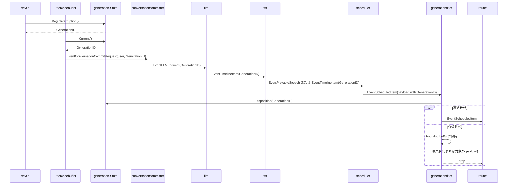

# generationfilter 概要理解ドキュメント

## 1. ビジネスコンテキスト

* **解決する課題**: ユーザーの新しい発話で会話世代が進んだあとに、古い世代の LLM 応答・TTS 音声・tool 実行要求が後続処理へ流れることを防ぐ。VAD や interim transcript が誤検知だった場合は、判定確定まで旧世代の event を一時保留し、LLM が空 timeline を返したら再開できるようにする。
* **ターゲットユーザー**: smart-speaker の会話パイプラインを利用するユーザー、および会話処理・音声再生・tool 実行を保守する開発者。
* **提供価値**: 最新の会話世代に属する event だけを通すことで、古い応答の再生や古い tool request の実行を抑止し、会話の割り込み後も出力の整合性を保つ。
* **実装上の位置づけ**: `generationfilter` は `internal/states/generation.Store` の `Disposition` を参照し、event payload の `GenerationID` ごとに通過、保留、破棄を決める。
* **参照する状態**: 世代の正本は `internal/states/generation.Store` にあり、event 側の世代 id は `internal/types.GenerationID` として各 payload に保持される。

## 2. 論理構造・機能俯瞰

**主要なモデル・コンポーネント**

- **generationfilter stage**
  - `internal/components/generationfilter/stage.go` に実装される `graph.Stage`。
  - `Upstream` から受け取った `types.Event` を `disposition` で判定し、通過対象は `Downstream` へ送る。保留対象は stage 内の bounded buffer に保持し、破棄対象は下流へ送らない。
  - `context.Context` のキャンセル、`Upstream` の close、`CloseFn` による明示 close に対応する。

- **generation.Store**
  - `internal/states/generation/store.go` に実装される現在世代 ID の正本。
  - `Next()` で世代を 1 つ進め、`Current()` で現在値を返し、`IsCurrent(id)` で指定 ID が現在世代かを判定する。
  - `BeginInterruption()` で保留中割り込みを開始し、旧世代を paused、新世代を candidate として保持する。
  - `Disposition(id)` は pending がない場合は current のみ通過、pending がある場合は candidate を通過、paused を保留、それ以外を破棄に分類する。
  - `ResumeIfPending(candidateID)` は LLM の空 timeline 判定時に paused 世代へ戻し、`ConfirmIfPending(candidateID)` は非空 timeline 判定時に candidate 世代を正式な current として確定する。
  - `Subscribe()` は状態変更通知を返し、`generationfilter` の保留 event flush / drop を駆動する。
  - `sync.RWMutex` で保護されており、複数 goroutine からの参照・更新に対応する。

- **GenerationID**
  - `internal/types/generation.go` の `type GenerationID uint64`。
  - 会話の世代を表す識別子で、LLM request、timeline item、TTS 済み音声、tool request、会話履歴 commit などに引き継がれる。

- **通過対象 payload**
  - `eventGenerationID` が `GenerationID` を取り出せる payload だけが、store 有効時の判定対象になる。
  - 対象は `types.TimelineItem`、`types.PlayableSpeech`、`types.ToolRequest`、`types.OutputAudio`、`types.ConversationCommitRequest`。
  - `types.LLMRequest` や `types.OutputLine` は `GenerationID` を持つ型だが、現行の `generationfilter` では `eventGenerationID` の対象外である。

- **graph.Stage**
  - `internal/graph/stage.go` の共通 stage 構造。
  - `generationfilter` は `Upstream` / `Downstream` に `graph.DefaultChannelBufferSize` の buffered channel を使う。

## 3. 主要なデータフロー

### シナリオ: 最新世代の timeline / speech / tool event だけを後続へ流す

1. 世代の採番: `rtcvad` が speech start 判定時に `generation.Store.BeginInterruption()` を呼び、新しい candidate `GenerationID` を採番する。STT interim が届く構成では `interimstopper` も同じ API で保留中割り込みを開始する。
2. user commit: `utterancebuffer` が STT の確定テキストをまとめ、flush 時に `generation.Store.Current()` を読んで現在の `GenerationID` を付与する。
3. LLM request の作成: `conversationcommitter` が user の `ConversationCommitRequest` を履歴へ保存し、同じ `GenerationID` を持つ `EventLLMRequest` を発行する。
4. timeline item の生成: `llm` が Responses API の Structured Outputs JSON を `types.TimelineItem` に変換し、request と同じ `GenerationID` を設定する。
5. TTS 変換: `tts` は `speech` の `TimelineItem` を `types.PlayableSpeech` に変換し、元の `GenerationID` を引き継ぐ。`speech` 以外の timeline item はそのまま後続へ流す。
6. スケジューリング: `scheduler` は `PlayableSpeech` と `TimelineItem` を世代ごとに worker へ enqueue し、再生可能音声や tool item を `EventScheduledItem` として出力する。
7. 世代フィルタ: `generationfilter` は event payload から `GenerationID` を取り出し、`generation.Store.Disposition(id)` が allow の event だけを `Downstream` へ送る。hold の event は判定確定まで保持し、drop の event は破棄する。
8. 後続 routing: `router` は通過した `EventScheduledItem` を `EventRealtimeAudio`、agent の `EventConversationCommitRequest`、または `EventToolRequest` に変換する。



### シナリオ: VAD 誤検知時に旧世代 event を再開する

1. current が `1` の状態で `rtcvad` または `interimstopper` が `BeginInterruption()` を呼ぶ。
2. `generation.Store` は paused `1`、candidate `2` の pending 状態になる。
3. pending 中に `GenerationID: 1` の old response event が `generationfilter` に入る。
4. `Disposition(1)` は hold を返すため、`generationfilter` は event を bounded buffer に保持する。
5. candidate `2` の LLM が空 timeline を返すと、`llm` が `ResumeIfPending(2)` を呼ぶ。
6. store は current を paused `1` に戻して pending を解除し、購読者へ通知する。
7. `generationfilter` は通知を受けて held event を再判定し、`Disposition(1)` が allow になった event を下流へ flush する。

### シナリオ: 追加発話時に旧世代 event を破棄する

1. pending 中に paused 世代の event が `generationfilter` に入り、bounded buffer に保持される。
2. candidate 世代の LLM が非空 timeline を返すと、`llm` が `ConfirmIfPending(candidateID)` を呼ぶ。
3. store は candidate 世代を正式な current にし、pending を解除して購読者へ通知する。
4. `generationfilter` は held event を再判定し、paused 世代が drop になるため破棄する。
5. candidate 世代の timeline / speech / tool event は allow として下流へ流れる。

### シナリオ: pending ではない古い世代の event を破棄する

1. `generation.Store` の現在値が `2` で pending がない状態で、`GenerationID: 1` の `TimelineItem` が `generationfilter` に入る。
2. `eventGenerationID` が payload から `1` を取り出す。
3. `generation.Store.Disposition(1)` が drop を返す。
4. `consume` は `Downstream` へ送らず `continue` する。
5. `internal/components/generationfilter/stage_test.go` では、古い世代の event が落ち、現在世代だけが通ることを確認している。

### シナリオ: generation.Store が未設定の場合

1. `NewStage(Config{Generation: nil})` または未指定で stage が作られる。
2. `allow` は `s.generation == nil` の場合に true を返す。
3. payload の型や `GenerationID` の有無に関係なく event は通過する。
4. この挙動は実装から確認できるが、テストで直接検証されているかは不明。

## 4. 詳細設計

### クラス設計

- internal/
  - components/
    - generationfilter/
      - stage.go: 最新世代の event だけを通す stage を定義する。
        - `NewStage`: `Config.Generation` と `MaxHeldEvents` を保持し、buffered channel を持つ `graph.Stage` を生成する。`MaxHeldEvents` が 0 以下の場合は既定値 256 を使う。
        - `run`: 親 context から cancel 可能な子 context を作り、`consume` を goroutine で開始する。
        - `consume`: `Upstream` から event を読み、allow は `Downstream` へ送り、hold は held buffer に保持し、drop は破棄する。store の状態変更通知を受けると held buffer を再判定する。
        - `disposition`: generation store が nil なら allow、store がある場合は event から `GenerationID` を取り出して `Store.Disposition` で判定する。`GenerationID` を取り出せない event は drop にする。
        - `appendHeld`: held buffer が上限に達した場合は最古の held event を破棄し、新しい event を保持する。
        - `flushHeld`: held event を再判定し、allow は下流へ送信、hold は buffer に残し、drop は破棄する。
        - `emit`: context cancel を見ながら downstream へ event を送信する。
        - `eventGenerationID`: `TimelineItem`、`PlayableSpeech`、`ToolRequest`、`OutputAudio`、`ConversationCommitRequest` から `GenerationID` を取り出す。
        - `close`: `sync.Once` で多重 close を防ぎ、cancel 済みでなければ cancel してから `Upstream` を close する。
      - stage_test.go: 現在世代の通過、pending 中の保留、誤検知時の flush、追加発話時の drop、held buffer 上限を検証する。
  - states/
    - generation/
      - store.go: 現在の会話世代 ID を保持する共有 store を定義する。
        - `NewStore`: `current == 0` の store を生成する。
        - `Next`: write lock を取り、pending を解除してから `current` をインクリメントして返す。
        - `BeginInterruption`: pending がなければ現在世代を paused、新しい世代を candidate として記録する。pending がある場合は既存 candidate を返す。
        - `Current`: read lock を取り、現在の `GenerationID` を返す。
        - `Pending`: paused / candidate と pending 有無を返す。
        - `IsCurrent`: read lock を取り、引数の ID と現在値が等しいかを返す。
        - `Disposition`: event の通過、保留、破棄を判定する。
        - `ResumeIfPending`: candidate が一致する場合だけ paused 世代へ戻す。
        - `ConfirmIfPending`: candidate が一致する場合だけ candidate 世代を current として確定する。
        - `Reset`: write lock を取り、pending を解除して現在値を `0` に戻す。
        - `Subscribe`: 状態変更通知 channel と unsubscribe 関数を返す。
      - store_test.go: `Next`、`BeginInterruption`、`Disposition`、`ResumeIfPending`、`ConfirmIfPending`、`Reset`、`Subscribe` の基本挙動を検証する。
  - types/
    - generation.go: `GenerationID` 型を定義する。
    - event.go: `types.Event` と `EventKind`、および `ToolRequest` を定義する。
      - `EventKind.String`: event kind をログや表示用の文字列へ変換する。
    - timeline_item.go: `TimelineItem` と `PlayableSpeech` を定義する。
    - conversation_record.go: `ConversationCommitRequest`、`LLMRequest`、`ToolResultRecord`、`ConversationRecord` を定義する。

### 入出力設計

- 入力: `types.Event`
  - `Kind` は `generationfilter` の判定では直接使われない。
  - 判定に使うのは `Payload` の具象型と、その中の `GenerationID`。

- 出力: `types.Event`
  - allow の event は payload を変更せず、そのまま `Downstream` へ送る。
  - hold の event は `generationfilter` 内に保持され、store 更新後に allow または drop として再判定される。
  - drop の event は破棄され、代替 event やエラー event は発行されない。

- 許可条件
  - `Generation` store が nil: すべて許可。
  - `Generation` store が非 nil かつ payload が対応型: `generation.Store.Disposition(payload.GenerationID)` に従う。
  - `Generation` store が非 nil かつ payload が非対応型: 破棄。

### generation store 連携

```mermaid
flowchart TD
    A[types.Event] --> B{Generation store は nil?}
    B -->|yes| C[通過]
    B -->|no| D{payload から GenerationID を取得できる?}
    D -->|no| E[破棄]
    D -->|yes| F[Store.Disposition(id)]
    F -->|allow| C
    F -->|hold| H[保留]
    F -->|drop| E
```

`generationfilter` は `Store.Current()` を直接呼ばず、判定用の `Store.Disposition(id)` を使う。`Disposition` 内部で read lock を取るため、`rtcvad` や `interimstopper` などが `BeginInterruption()` で pending を開始する処理や、`llm` が `ResumeIfPending` / `ConfirmIfPending` で pending を解決する処理と並行しても、比較は store のロック下で行われる。

### API設計

外部 HTTP API や RPC API は存在しない。`generationfilter` の公開入口は Go package の `NewStage(Config)` であり、実行時の入出力は `graph.Stage` の channel で行われる。

### 注意点

- `eventGenerationID` は payload 型だけを見ており、`Event.Kind` と payload の整合性は検証しない。
- store が非 nil の場合、`GenerationID` を持たない event は落ちる。現行パイプライン上で `generationfilter` の前に置く event 種別を増やす場合は、`eventGenerationID` の対応型追加が必要か確認する必要がある。
- `types.LLMRequest` と `types.OutputLine` は `GenerationID` を持つが、現行実装では通過対象に含まれていない。これが意図的かどうかはコード上からは不明。
- held buffer は既定で 256 event まで保持する。上限を超えた場合は最古の held event を破棄し、ログを出す。
- 既に出力済みの音声を巻き戻す機能はない。誤検知時に再開されるのは、pending 中に `generationfilter` が保持できた未通過 event だけである。
