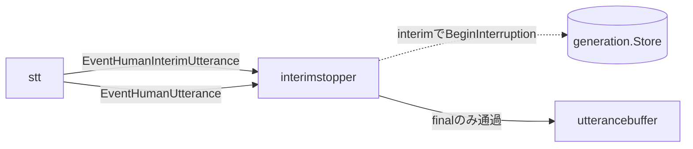

# interimstopper component

> [!CAUTION]
> この component は STT が interim transcript（`isFinal=false`）を返すことを前提にしているが、現在の STT モデル `chirp_3`（`internal/components/stt/stage.go`）は、`InterimResults: true` を指定してもストリーミングで interim を返さず final transcript（`isFinal=true`）しか返さない（Chirp 3 の仕様）。
> そのため `stt` は `EventHumanInterimUtterance` を発行せず、この component の早期保留（`generation.Store.BeginInterruption()`）は実質的に発火しない。
> 現在のAI出力保留は、`rtcvad` の speech start 判定時に保留中割り込みが始まることで、final transcript 到達前に始まる。
> interim による早期保留を実際に効かせるには、interim を返すモデルへ変更する必要がある。

`interimstopper` は、STT の interim transcript をユーザー発話として保存せず、AI出力保留の早期シグナルとして扱う component。
final transcript は従来どおり `utterancebuffer` へ渡す。

## 責務

- `EventHumanInterimUtterance` を受け取ったら、同一発話中の初回だけ `generation.Store.BeginInterruption()` を呼ぶ。
- generation を pending 状態にし、既存の `generationfilter` に古い LLM/TTS/scheduler 出力を一時保留させる。
- interim event は下流へ流さず、会話履歴、LLM入力、UI表示に混ぜない。
- `EventHumanUtterance` を受け取ったら停止済みフラグを解除し、event をそのまま `utterancebuffer` へ渡す。
- `generation.Store` が未設定の場合でも final transcript は通過させる。

## 主な event

- 入力: `EventHumanInterimUtterance`、`EventHumanUtterance`
- 出力: `EventHumanUtterance`

## 接続

## 動作

1. AI発話中にユーザーの音声が入り、Google STT が interim transcript を返す。
2. `stt` が `EventHumanInterimUtterance` を発行する。
3. `interimstopper` が `generation.Store.BeginInterruption()` を呼び、現在進行中のAI出力を paused generation、新しい発話判定を candidate generation にする。
4. 同じ発話内で追加のinterimが届いても、finalが届くまではgenerationを追加で進めない。
5. final transcript が届いたら、`EventHumanUtterance` として `utterancebuffer` に渡す。
6. `utterancebuffer` はfinal transcriptをbufferし、flush時に現在のgenerationをユーザー発話へ付与する。

RTC出力済みバッファはこの component では破棄しない。
generation が pending の間、後続へ流れてくる paused generation の出力は `generationfilter` で保留される。LLM が candidate generation に対して空 timeline を返した場合は保留分を再開し、非空 timeline を返した場合は保留分を破棄する。
