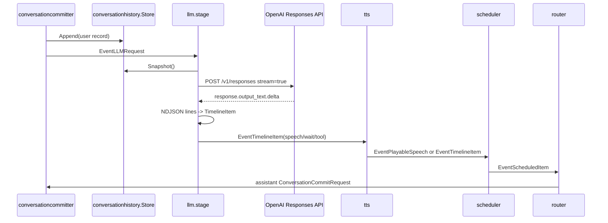
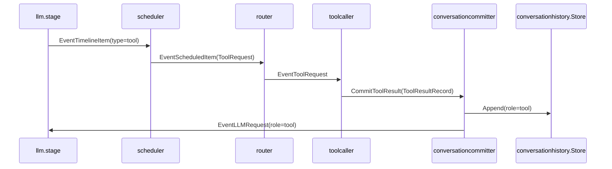

# llm component 概要理解ドキュメント

## 1. ビジネスコンテキスト

* **解決する課題**: ユーザーの発話と tool 実行結果を含む会話履歴から、スマートスピーカーが次に行う発話・待機・tool 呼び出しを順序付き timeline として決定する。
* **ターゲットユーザー**: 音声でスマートスピーカーに話しかける利用者、および pipeline を保守する開発者。
* **提供価値**: OpenAI Responses API の自然言語出力を直接下流へ流さず、`speech` / `wait` / `tool` の NDJSON 契約に検証してから `TimelineItem` に変換することで、TTS・scheduler・toolcaller が同じ順序制御で扱える。
* **安全性の考え方**: 契約違反の LLM 応答は最大5回 retry し、それでも失敗した場合はログを出して応答を捨てる。壊れた timeline を下流へ流さないことを優先している。
* **tool 連携の考え方**: 通常起動では `cmd/smart-speaker/main.go` が local tool registry を構築し、`llm.Config.ToolSchemas` と `toolcaller.NewStage` の handler map に同じ registry 由来の定義・handler を渡す。これにより LLM は system prompt 内の tool schema を参照し、NDJSON の `tool` item として local tool 呼び出しを表現できる。

## 2. 論理構造・機能俯瞰

**主要なモデル・コンポーネント**

- **`llm.stage`**
  - `EventLLMRequest` だけを受け取り、`types.LLMRequest` に変換できたものを非同期に処理する。
  - OpenAI Responses API の streaming 呼び出し、NDJSON 行の収集、timeline 契約検証、`EventTimelineItem` の発行を担当する。
  - `EventLLMRequest` 以外の event、または payload 型が異なる event は無視する。
- **`responseClient` / `Client`**
  - `CreateResponseStream` で `POST https://api.openai.com/v1/responses` を呼び出す。
  - request body は `model`、`input`、`stream: true` のみを設定する。
  - OpenAI の function calling 用 `tools`、`tool_choice`、`function_call_output` は送信しない。tool 呼び出しは LLM のテキスト出力内の NDJSON 行で表現する。
- **system prompt builder**
  - `cfg.Instructions`、NDJSON 契約文、任意の `cfg.ToolSchemas` を結合して system prompt を作る。
  - 各 API 呼び出し直前に `現在日時` と `現在時刻` を追記する。
  - retry 時は契約違反理由を追記した system prompt で再実行する。
- **NDJSON parser**
  - stream された output text を改行単位で受け取り、`parseTimeline` で `types.TimelineItem` に変換する。
  - 空行は無視する。未知の `type`、必須値不足、負の wait 秒数、tool 後続 item はエラーにする。
- **`conversationhistory.Store`**
  - LLM に渡す会話履歴の正本。
  - `Snapshot()` は record を clone して返すため、LLM 側は履歴を直接変更しない。
- **`generation.Store` / `generationfilter`**
  - LLM が付与した `GenerationID` は下流の `generationfilter` で最新世代か判定される。
  - 古い世代の `TimelineItem` は LLM の外側で落とされる。
- **下流 component**
  - `tts` は `speech` item を音声化し、`wait` / `tool` item は順序維持のためそのまま流す。
  - `scheduler` は speech の再生時間、wait 秒数、tool 呼び出し順を同じ generation 内で制御する。
  - `router` は音声再生、assistant 履歴 commit、toolcaller への `EventToolRequest` に振り分ける。

## 3. 主要なデータフロー

### シナリオ: ユーザー発話から assistant 発話が再生・保存されるまで

1. ユーザー発話の保存: `conversationcommitter` が user の `ConversationCommitRequest` を `conversationhistory.Store` に保存し、`EventLLMRequest` を発行する。
2. 履歴 snapshot の取得: `llm.stage` は `history.Snapshot()` が1件以上あれば、それを `conversationhistory.ToChatMessages` で `[]types.ChatMessage` に変換する。
3. Responses API 呼び出し: `Client.CreateResponseStream` が system prompt と chat messages を `input` 配列にして、Responses API を `stream: true` で呼び出す。
4. stream の読解: SSE の `data:` 行を JSON として読み、`response.output_text.delta` の `delta` だけをテキスト buffer に追加する。
5. NDJSON 行の切り出し: buffer 内に改行が現れるたびに1行として `onLine` へ渡す。stream 終了時に残った末尾テキストも1行として扱う。
6. timeline 変換: `parseTimeline` が NDJSON 行を `TimelineItem` に変換し、各 item に `GenerationID` と `SequenceID` を付与する。
7. 下流への発行: `llm.stage` が `EventTimelineItem` を順番に下流へ送る。
8. 再生と保存: `speech` は `tts` で `PlayableSpeech` になり、`scheduler` と `router` を経て `EventRealtimeAudio` と assistant の `ConversationCommitRequest` になる。



### シナリオ: tool item が出力され、結果が再度 LLM に渡るまで

1. LLM の tool 表現: LLM は `{"type":"tool","name":"...","args":{...}}` を NDJSON の末尾行として出す。tool は1応答につき最大1件で、後続 item は禁止される。
2. `TimelineItem` 化: `parseTimeline` は `name` を `ToolName`、`args` を `ToolArgs` に入れる。`args` が空の場合は `{}` を設定する。
3. scheduler 変換: `scheduler` は tool item を `types.ToolRequest` に変換し、`ToolCallID` と `SequenceID` に timeline の `SequenceID` を入れる。
4. router 振り分け: `router` は `ToolRequest` を `EventToolRequest` として `toolcaller` へ送る。
5. tool 実行結果 commit: `toolcaller` は handler を名前で探して実行し、結果を `ToolResultRecord` として `conversationcommitter.ResultAPI.CommitToolResult` へ渡す。handler がない場合は `{"error":"unknown function: <name>"}` を結果にする。
6. 履歴への保存: `conversationcommitter` は tool result を role `tool` の record として保存する。
7. LLM への再投入: tool result 保存後、`conversationcommitter` は role `tool` の `EventLLMRequest` を発行する。`llm.messages` は履歴がある場合 request の `Role` / `Text` ではなく履歴 snapshot 全体を使う。



### シナリオ: NDJSON 契約違反時の retry

1. `llm.stage` は1回の Responses API stream から得た行を `parseTimeline` に渡す。
2. `parseTimeline` がエラーを返した場合、`llm.stage` は `llm: invalid ndjson response generation=... request_id=... attempt=... err=... raw_line_preview=...` をログ出力する。`raw_line_preview` は問題になった行だけを対象にし、長文や機密情報の露出を抑えるため一定文字数で truncate する。
3. 次回 attempt では元の system prompt に「直前の応答はNDJSON契約違反でした」と違反理由を追記して再度 Responses API を呼ぶ。
4. retry は最大5回。途中で valid な timeline が得られればそれを採用する。
5. 5回すべて失敗した場合は `llm: drop response ...` をログ出力し、その LLM 応答からは下流 event を発行しない。

## 4. 詳細設計

### クラス設計

- `internal/`
  - `components/`
    - `llm/`
      - `stage.go`: graph stage としての入出力、履歴取得、retry、`EventTimelineItem` 発行を担当する。
        - `NewStage`: `Config` から client と system prompt を構築し、`graph.Stage` を返す。
        - `run`: parent context から cancel 可能な context を作り、consume goroutine を開始する。
        - `consume`: upstream から `EventLLMRequest` を読み、request ごとに `handleRequest` を goroutine で実行する。
        - `handleRequest`: `requestTimeline` の結果を `EventTimelineItem` として順番に下流へ送る。
        - `requestTimeline`: Responses API 呼び出し、NDJSON 行収集、`parseTimeline`、最大5回 retry を行う。
        - `messages`: 履歴 snapshot があれば履歴全体を chat messages にする。履歴がない場合だけ request の role/text から1 message を作る。
        - `close`: cancel を呼び、upstream channel を閉じる。
      - `contract.go`: NDJSON 契約を `TimelineItem` へ変換する。
        - `parseTimeline`: `speech` / `wait` / `tool` の検証と変換を行う。
      - `prompt_tools.go`: system prompt に NDJSON 契約と tool schema を埋め込む。
        - `buildSystemPrompt`: base instruction、NDJSON 契約、tool schemas JSON を結合する。
        - `ndjsonInstruction`: LLM に要求する NDJSON 形式を返す。
        - `appendRetryInstruction`: retry 用の契約違反理由を prompt に追記する。
      - `responses_client.go`: OpenAI Responses API との HTTP 通信と SSE stream 読み取りを担当する。
        - `NewClient`: API key と model を検証し、endpoint `https://api.openai.com/v1/responses` を持つ client を作る。
        - `CreateResponseStream`: `model`、`input`、`stream: true` で Responses API を呼ぶ。
        - `readResponseStream`: SSE の `data:` 行を読み、stream event を処理する。
        - `handleStreamEvent`: `response.output_text.delta` と `response.failed` を処理する。
        - `appendStreamDelta`: delta 文字列を改行単位に分割して `onLine` へ渡す。
        - `appendCurrentTimestamp`: system prompt 末尾に現在日付・時刻を追記する。
  - `states/`
    - `conversationhistory/`
      - `store.go`: LLM に渡す会話履歴の正本を保持する。
        - `Append`: record を clone して追加する。
        - `Snapshot`: 全 record の clone を返す。
        - `Reset`: 履歴を空にする。
      - `record.go`: commit request と conversation record の変換を担当する。
        - `NewRecord`: user / assistant / tool result の record を作る。
        - `ToChatMessages`: record 群を Responses API 入力向けの chat messages に変換する。
  - `types/`
    - `conversation_record.go`: `ConversationRecord`、`ConversationCommitRequest`、`LLMRequest`、`ToolResultRecord` を定義する。
    - `timeline_item.go`: `TimelineItem`、`PlayableSpeech`、timeline kind 定数を定義する。
    - `event.go`: `EventLLMRequest`、`EventTimelineItem`、`EventToolRequest` などの event kind を定義する。

### NDJSON契約

- `speech`: `{"type":"speech","text":"..."}`。`text` は trim 後に空であってはいけない。
- `wait`: `{"type":"wait","sec":0.5}`。`sec` は必須で、0以上でなければならない。
- `tool`: `{"type":"tool","name":"tool_name","args":{...}}`。`name` は trim 後に空であってはいけない。`args` がない場合は `{}` として扱う。
- timeline は1行以上必要。空行だけの応答は `timeline is empty` で契約違反になる。
- `tool` は末尾に最大1件だけ許可される。`tool` の後に `speech` / `wait` / `tool` が続くと `tool must be the last item` で契約違反になる。
- 各 item の `SequenceID` は入力行 index を基に `1`、`2`、`3` ... の文字列として付与される。空行は item にならないが、現在の実装では元の行 index を使うため、空行が混じると `SequenceID` が連番に見えない可能性がある。

### OpenAI Responses API 呼び出し

- endpoint: `POST https://api.openai.com/v1/responses`
- headers: `Content-Type: application/json`、`Authorization: Bearer <OPENAI_API_KEY>`
- request body:

```json
{
  "model": "<OPENAI_RESPONSES_MODEL>",
  "input": [
    {"role": "system", "content": "<system prompt + NDJSON契約 + 現在日時>"},
    {"role": "user", "content": "..."}
  ],
  "stream": true
}
```

- `model` は `llm.Config.Model` から渡る。通常起動では `OPENAI_RESPONSES_MODEL` が未設定の場合、`internal/app/config.go` の default により `gpt-5.4-mini` になる。
- `input` は system prompt を先頭に追加し、その後に履歴由来の message を追加する。role が空なら `user` になる。content が空の message は送らない。
- HTTP status が 300 以上の場合、body を読んで `llm: <status>: <body>` としてエラーにする。この場合は NDJSON retry ではなく、その request 自体を失敗として捨てる。
- stream event は `response.output_text.delta` のみを通常出力として扱う。`response.failed` はエラーにする。それ以外の event type は無視する。

### tool形式と履歴への戻し方

- LLM component は OpenAI function calling を使わず、tool call を NDJSON の `tool` item として扱う。
- `prompt_tools.go` の system prompt も「OpenAI function callingは使わず、tool呼び出しもNDJSON行として表現」と明記している。
- 通常起動では `buildToolRegistry` が返す `registry.Definitions()` が `ToolSchemas` に渡され、`利用可能なlocal tool schema:` に続けて JSON 化される。ただし JSON marshal に失敗した場合は schema 部分は追加されない。
- `web_search` は local handler 未実装のため registry から除外されており、通常起動の `ToolSchemas` にも含まれない。
- `conversationhistory.ToChatMessages` は role `tool` の record を OpenAI の `tool` role ではなく、role `user` の JSON 文字列に変換する。形式は `{"type":"tool_result","tool_name":"...","generation_id":...,"output":...}` に metadata を加えたもの。
- `ToolResultRecord` には `CurrentGenerationID` と `Stale` がある。`ResultAPI.CommitToolResult` は現在世代と tool result の世代が違う場合に stale 情報を設定する。

### 参照元

- 実装: `internal/components/llm/stage.go`
- 実装: `internal/components/llm/contract.go`
- 実装: `internal/components/llm/prompt_tools.go`
- 実装: `internal/components/llm/responses_client.go`
- 実装: `internal/states/conversationhistory/store.go`
- 実装: `internal/states/conversationhistory/record.go`
- 実装: `internal/states/generation/store.go`
- 実装: `internal/components/conversationcommitter/committer.go`
- 実装: `internal/components/toolcaller/toolcaller.go`
- 実装: `internal/components/scheduler/stage.go`
- 実装: `internal/components/router/stage.go`
- 実装: `cmd/smart-speaker/main.go`
- OpenAI 公式: [Responses API reference](https://platform.openai.com/docs/api-reference/responses)
- OpenAI 公式: [Streaming API responses](https://platform.openai.com/docs/guides/streaming-responses)
