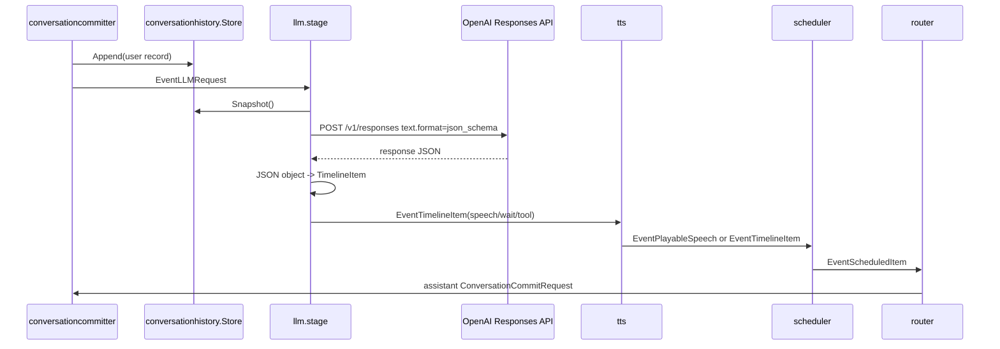
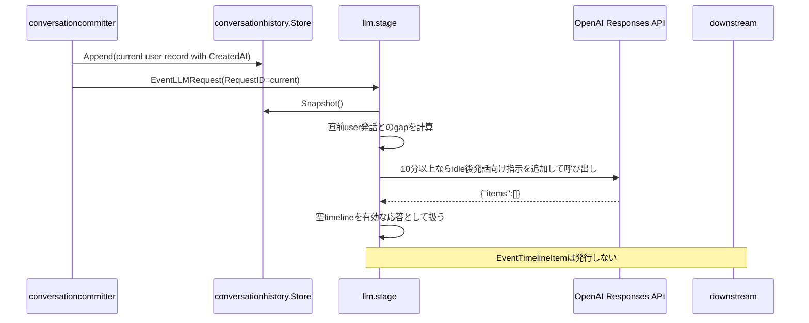
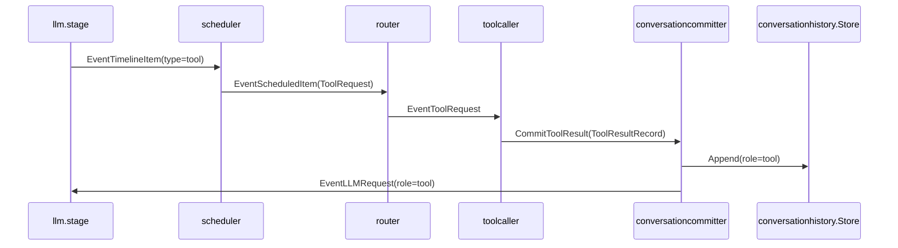

# llm component 概要理解ドキュメント

## 1. ビジネスコンテキスト

* **解決する課題**: ユーザー発話と tool 実行結果を含む会話履歴から、スマートスピーカーが次に行う発話・待機・tool 呼び出しを順序付き timeline として決定する。
* **ターゲットユーザー**: 音声でスマートスピーカーに話しかける利用者、および会話 pipeline を保守する開発者。
* **提供価値**: OpenAI Responses API の出力を Structured Outputs の JSON schema で `speech` / `wait` / `tool` の timeline object に制約し、Go 側でも検証してから `TimelineItem` に変換する。
* **安全性の考え方**: 契約違反の LLM 応答は最大10回 retry し、それでも失敗した場合はログを出して応答を捨てる。壊れた timeline を下流へ流さないことを優先する。
* **無応答の考え方**: ユーザー発話に対して応答しない方が自然な場合は、LLM が `{"items":[]}` を出力できる。空 timeline は有効な応答として扱われ、下流 event は発行されない。
* **tool 連携の考え方**: OpenAI function calling は使わない。通常起動では local tool registry 由来の schema を LLM の Structured Outputs schema と system prompt に渡し、LLM は JSON timeline の末尾 item として tool 呼び出しを表現する。

## 2. 論理構造・機能俯瞰

**主要なモデル・コンポーネント**

- **`llm.stage`**
  - `EventLLMRequest` だけを受け取り、`types.LLMRequest` に変換できたものを非同期に処理する。
  - OpenAI Responses API の非stream呼び出し、JSON timeline 契約検証、`EventTimelineItem` の発行を担当する。
  - `EventLLMRequest` 以外の event、または payload 型が異なる event は無視する。
- **`responseClient` / `Client`**
  - `CreateResponse` で `POST https://api.openai.com/v1/responses` を呼び出す。
  - request body は `model`、`input`、`text.format` を設定する。
  - 非streamの最終response JSONから `output[].content[].text` を取り出し、JSON object 文字列として返す。
  - OpenAI function calling 用の `tools`、`tool_choice`、`function_call_output` は送信しない。
- **Structured Outputs schema**
  - `schema.go` が `{"items":[...]}` を root とする JSON schema を生成する。
  - `speech` / `wait` は固定 schema として定義する。
  - `tool` は登録済み local tool ごとに `name` と `args` schema を固定した variant として追加する。
  - OpenAI の strict schema に合わせ、object は `additionalProperties: false` にし、optional 引数は required nullable として扱う。
- **system prompt builder**
  - `cfg.Instructions`、JSON timeline 契約文、任意の `cfg.ToolSchemas` を結合して system prompt を作る。
  - 各 API 呼び出し直前に `現在日時` と `現在時刻` を追記する。
  - 現在のユーザー発話が直前のユーザー発話から10分以上空いている場合は、ひとりごと・感嘆・意味不明な短文の可能性と `{"items":[]}` による無応答を追加で指示する。
  - retry 時は契約違反理由と raw preview を追記した system prompt で再実行する。
- **JSON timeline parser**
  - response body から取り出した output text 全体を `parseTimelineJSON` で `types.TimelineItem` に変換する。
  - 未知の `type`、必須値不足、負の wait 秒数、tool 後続 item はエラーにする。
- **`conversationhistory.Store`**
  - LLM に渡す会話履歴の正本。
  - `Snapshot()` は record を clone して返すため、LLM 側は履歴を直接変更しない。
- **`generation.Store` / `generationfilter`**
  - LLM が付与した `GenerationID` は下流の `generationfilter` で最新世代か判定される。
  - 古い世代の `TimelineItem` は LLM の外側で落とされる。
- **下流 component**
  - `tts` は `speech` item を音声化し、`wait` / `tool` item は順序維持のためそのまま流す。
  - `scheduler` は speech の再生時間、wait 秒数、tool 呼び出し順を同じ generation 内で制御する。
  - `router` は音声再生、assistant 履歴 commit、toolcaller への `EventToolRequest` に振り分ける。

## 3. 主要なデータフロー

### シナリオ: ユーザー発話から assistant 発話が再生・保存されるまで

1. ユーザー発話の保存: `conversationcommitter` が user の `ConversationCommitRequest` を `conversationhistory.Store` に保存し、`EventLLMRequest` を発行する。
2. 履歴 snapshot の取得: `llm.stage` は `history.Snapshot()` が1件以上あれば、それを `conversationhistory.ToChatMessages` で `[]types.ChatMessage` に変換する。
3. Responses API 呼び出し: `Client.CreateResponse` が system prompt と chat messages を `input` 配列にして、Responses API を `text.format: json_schema` で呼び出す。
4. response body の読解: 非streamの最終response JSONから `output[].content[].text` を取り出す。
5. timeline 変換: `parseTimelineJSON` が `{"items":[...]}` を `TimelineItem` に変換し、各 item に `GenerationID` と `SequenceID` を付与する。
6. 下流への発行: `llm.stage` が `EventTimelineItem` を順番に下流へ送る。
7. 再生と保存: `speech` は `tts` で `PlayableSpeech` になり、`scheduler` と `router` を経て `EventRealtimeAudio` と assistant の `ConversationCommitRequest` になる。



### シナリオ: 長い無音後のひとりごと候補を無応答にする

1. `conversationcommitter` が user record を保存し、`EventLLMRequest` を発行する。user record には `CreatedAt` が入る。
2. `llm.stage` は履歴 snapshot から現在の user record を `RequestID` 優先で特定し、その直前の user record との `CreatedAt` 差分を計算する。
3. 差分が10分未満、現在または直前の `CreatedAt` がない、または現在発話を特定できない場合は、通常の system prompt のまま Responses API を呼び出す。
4. 差分が10分以上の場合は、前回ユーザー発話からの経過時間、短い発話・意味不明な発話・感嘆・独り言の可能性、応答しない場合の `{"items":[]}` 出力を system prompt に追加する。
5. LLM が `{"items":[]}` を返した場合、`parseTimelineJSON` は空 slice を正常結果として返す。
6. `llm.stage` は発行対象の `EventTimelineItem` がないため、下流へ何も流さず処理を終える。



### シナリオ: tool item が出力され、結果が再度 LLM に渡るまで

1. LLM の tool 表現: LLM は `{"type":"tool","name":"...","args":{...}}` を `items` 配列の末尾 item として出す。tool は1応答につき最大1件で、後続 item は禁止される。
2. `TimelineItem` 化: `parseTimelineJSON` は `name` を `ToolName`、`args` を `ToolArgs` に入れる。`args` が空の場合は `{}` を設定する。
3. scheduler 変換: `scheduler` は tool item を `types.ToolRequest` に変換し、`ToolCallID` と `SequenceID` に timeline の `SequenceID` を入れる。
4. router 振り分け: `router` は tool 実行前に `ToolCall` を含む `ConversationCommitRequest` を発行し、tool call を role `tool_call` の履歴 record として保存する。その後、`ToolRequest` を `EventToolRequest` として `toolcaller` へ送る。
5. tool 実行結果 commit: `toolcaller` は handler を名前で探して実行し、結果を `ToolResultRecord` として `conversationcommitter.ResultAPI.CommitToolResult` へ渡す。handler がない場合は `{"error":"unknown function: <name>"}` を結果にする。
6. 履歴への保存: `conversationcommitter` は tool result を role `tool` の record として保存する。
7. LLM への再投入: tool result 保存後、`conversationcommitter` は role `tool` の `EventLLMRequest` を発行する。`llm.messages` は履歴がある場合 request の `Role` / `Text` ではなく履歴 snapshot 全体を使う。



### シナリオ: JSON timeline 契約違反時の retry

1. `llm.stage` は1回の Responses API stream から得た JSON object 文字列を `parseTimelineJSON` に渡す。
2. `parseTimelineJSON` がエラーを返した場合、`llm.stage` は `llm: invalid timeline response generation=... request_id=... attempt=... err=... raw_preview=...` をログ出力する。
3. `raw_preview` は応答全体を一定文字数で truncate したもので、契約違反 retry prompt にも含める。
4. 次回 attempt では元の system prompt に「直前の応答はJSON timeline契約違反でした」と違反理由、禁止事項、正しい例を追記して再度 Responses API を呼ぶ。
5. retry は最大10回。途中で valid な timeline が得られればそれを採用する。
6. 10回すべて失敗した場合は `llm: drop response ...` をログ出力し、その LLM 応答からは下流 event を発行しない。

## 4. 詳細設計

### クラス設計

- `internal/`
  - `components/`
    - `llm/`
      - `stage.go`: graph stage としての入出力、履歴取得、retry、`EventTimelineItem` 発行を担当する。
        - `NewStage`: `Config` から client と system prompt を構築し、`graph.Stage` を返す。
        - `run`: parent context から cancel 可能な context を作り、consume goroutine を開始する。
        - `consume`: upstream から `EventLLMRequest` を読み、request ごとに `handleRequest` を goroutine で実行する。
        - `handleRequest`: `requestTimeline` の結果を `EventTimelineItem` として順番に下流へ送る。
        - `requestTimeline`: Responses API 呼び出し、`parseTimelineJSON`、最大10回 retry を行う。
        - `idleGapBefore`: 現在 user 発話と直前 user 発話の時刻差が10分以上か判定する。
        - `idleGapBeforeRequest`: 履歴 snapshot と `LLMRequest` から現在発話を特定し、直前 user 発話との時刻差を返す。
        - `messages`: 履歴 snapshot があれば履歴全体を chat messages にする。履歴がない場合だけ request の role/text から1 message を作る。
        - `close`: cancel を呼び、upstream channel を閉じる。
      - `contract.go`: JSON timeline 契約を `TimelineItem` へ変換する。
        - `parseTimelineJSON`: `speech` / `wait` / `tool` の検証と変換を行う。
      - `schema.go`: Structured Outputs 用の JSON schema を生成する。
        - `timelineTextFormat`: Responses API の `text.format` に渡す `json_schema` 設定を返す。
        - `timelineItemVariants`: 固定 item と登録済み tool item の `anyOf` を構築する。
        - `strictToolArgsSchema`: tool 引数 schema を strict mode 向けに補正する。
      - `prompt_tools.go`: system prompt に JSON timeline 契約と tool schema を埋め込む。
        - `buildSystemPrompt`: base instruction、JSON timeline 契約、tool schemas JSON を結合する。
        - `timelineJSONInstruction`: LLM に要求する JSON object 形式を返す。
        - `appendIdleFollowupInstruction`: 10分以上空いた後のユーザー発話に、ひとりごと候補なら `{"items":[]}` を返せることを追加指示する。
        - `appendRetryInstruction`: retry 用の契約違反理由と raw preview を prompt に追記する。
      - `responses_client.go`: OpenAI Responses API との HTTP 通信と非stream response body の読み取りを担当する。
        - `NewClient`: API key と model を検証し、endpoint `https://api.openai.com/v1/responses` を持つ client を作る。
        - `CreateResponse`: `model`、`input`、`text.format` で Responses API を呼ぶ。
        - `readResponseBody`: response JSON を decode し、出力テキストを抽出する。
        - `extractResponseText`: `output[].content[]` の `output_text` を集約する。
        - `appendCurrentTimestamp`: system prompt 末尾に現在日付・時刻を追記する。
  - `states/`
    - `conversationhistory/`
      - `store.go`: LLM に渡す会話履歴の正本を保持する。
        - `Append`: record を clone して追加する。
        - `Snapshot`: 全 record の clone を返す。
        - `Reset`: 履歴を空にする。
      - `record.go`: commit request と conversation record の変換を担当する。
        - `NewRecord`: user / assistant / tool result の record を作る。
        - `ToChatMessages`: record 群を Responses API 入力向けの chat messages に変換する。
  - `types/`
    - `conversation_record.go`: `ConversationRecord`、`ConversationCommitRequest`、`LLMRequest`、`ToolResultRecord` を定義する。
    - `timeline_item.go`: `TimelineItem`、`PlayableSpeech`、timeline kind 定数を定義する。
    - `event.go`: `EventLLMRequest`、`EventTimelineItem`、`EventToolRequest` などの event kind を定義する。

### JSON timeline契約

- root は `{"items":[...]}` の JSON object である。
- `speech`: `{"type":"speech","text":"..."}`。`text` は trim 後に空であってはいけない。
- `wait`: `{"type":"wait","sec":0.5}`。`sec` は必須で、0以上でなければならない。
- `tool`: `{"type":"tool","name":"tool_name","args":{...}}`。`name` は trim 後に空であってはいけない。`args` がない場合は `{}` として扱う。
- ユーザー発話に対して応答しないべき場合だけ、空の `items` を持つ `{"items":[]}` を有効な timeline として扱う。この場合、下流へ `EventTimelineItem` は発行されない。
- `tool` は末尾に最大1件だけ許可される。`tool` の後に `speech` / `wait` / `tool` が続くと `tool must be the last item` で契約違反になる。
- 各 item の `SequenceID` は `items` 配列 index を基に `1`、`2`、`3` ... の文字列として付与される。

### OpenAI Responses API 呼び出し

- endpoint: `POST https://api.openai.com/v1/responses`
- headers: `Content-Type: application/json`、`Authorization: Bearer <OPENAI_API_KEY>`
- request body:

```json
{
  "model": "<OPENAI_RESPONSES_MODEL>",
  "input": [
    {"role": "system", "content": "<system prompt + JSON timeline契約 + 現在日時>"},
    {"role": "user", "content": "..."}
  ],
  "text": {
    "format": {
      "type": "json_schema",
      "name": "conversation_timeline",
      "strict": true,
      "schema": {
        "type": "object",
        "additionalProperties": false,
        "required": ["items"],
        "properties": {
          "items": {"type": "array", "items": {"anyOf": []}}
        }
      }
    }
  }
}
```

- `model` は `llm.Config.Model` から渡る。通常起動では `OPENAI_RESPONSES_MODEL` が未設定の場合、`internal/app/config.go` の default により `gpt-5.4-mini` になる。
- `input` は system prompt を先頭に追加し、その後に履歴由来の message を追加する。role が空なら `user` になる。content が空の message は送らない。
- HTTP status が 300 以上の場合、body を読んで `llm: <status>: <body>` としてエラーにする。この場合は JSON timeline retry ではなく、その request 自体を失敗として捨てる。
- response body は `output[].content[]` のうち `type: "output_text"` の `text` を通常出力として扱う。text が空の場合はエラーにする。
- Structured Outputs により通常は schema 違反の出力が抑制されるが、Go 側の parser validation は防御線として残す。

### tool形式と履歴への戻し方

- LLM component は OpenAI function calling を使わず、tool call を JSON timeline の `tool` item として扱う。
- `prompt_tools.go` の system prompt も「OpenAI function calling は使わず、tool 呼び出しも `items` 配列内の tool item として表現」と明記している。
- 通常起動では `buildToolRegistry` が返す `registry.Definitions()` が `ToolSchemas` に渡され、Structured Outputs schema と `利用可能なlocal tool schema:` の両方に反映される。ただし JSON marshal に失敗した場合は prompt 用 schema 部分は追加されない。
- `web_search` は OpenAI 設定がある通常起動で registry に登録される。LLM は `{"type":"tool","name":"web_search","args":{"query":"..."}}` の形で local tool として呼び出し、handler 内部だけが Responses API hosted `web_search` を別 request で利用する。
- `web_search` の引数は `query` のみで、tool result は `{"result":"..."}` のみを返す。追加引数や citation/source などの補助情報は LLM 側の混乱を避けるため公開しない。
- `conversationhistory.ToChatMessages` は履歴本文に役割が残るよう、`user` record を `ユーザー: ...`、`assistant` record を `あなた: ...` の content に変換する。
- `conversationhistory.ToChatMessages` は role `tool_call` の record を role `assistant` の `ツール呼び出し: {...}` content に変換する。JSON payload は `{"type":"tool_call","tool_name":"...","generation_id":...,"args":...}` に metadata を加えたもので、`tool_name` は metadata の非空値を優先し、なければ record の `Source` を使う。
- `conversationhistory.ToChatMessages` は role `tool` の record を OpenAI の `tool` role ではなく、role `user` の `ツール結果: {...}` content に変換する。JSON payload は `{"type":"tool_result","tool_name":"...","generation_id":...,"output":...}` に metadata を加えたもので、`tool_name` は metadata の非空値を優先し、なければ record の `Source` を使う。
- `ToolResultRecord` には `CurrentGenerationID` と `Stale` がある。`ResultAPI.CommitToolResult` は現在世代と tool result の世代が違う場合に stale 情報を設定する。

### 参照元

- 実装: `internal/components/llm/stage.go`
- 実装: `internal/components/llm/contract.go`
- 実装: `internal/components/llm/schema.go`
- 実装: `internal/components/llm/prompt_tools.go`
- 実装: `internal/components/llm/responses_client.go`
- 実装: `internal/states/conversationhistory/store.go`
- 実装: `internal/states/conversationhistory/record.go`
- 実装: `internal/states/generation/store.go`
- 実装: `internal/components/conversationcommitter/committer.go`
- 実装: `internal/components/toolcaller/toolcaller.go`
- 実装: `internal/components/scheduler/stage.go`
- 実装: `internal/components/router/stage.go`
- 実装: `cmd/smart-speaker/main.go`
- OpenAI 公式: [Responses API reference](https://platform.openai.com/docs/api-reference/responses)
- OpenAI 公式: [Structured model outputs](https://platform.openai.com/docs/guides/structured-outputs)
- OpenAI 公式: [Streaming API responses](https://platform.openai.com/docs/guides/streaming-responses)
