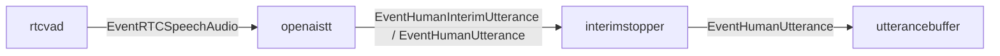

# openaistt component

`openaistt` は server-side Speech-to-Text を担当する OpenAI Realtime transcription component。
`rtcvad` が検出した発話区間の PCM audio を OpenAI Realtime API に WebSocket で送り、transcript delta と completed transcript を会話 pipeline へ渡す。

STT provider は `STT_PROVIDER` で切り替える。
`STT_PROVIDER=openai` の場合はこの component を使い、未指定または `google` の場合は Google Speech-to-Text 用の `stt` component を graph 上の同じ位置に接続する。

## 責務

- `EventRTCSpeechAudio` の start で OpenAI Realtime API への WebSocket 接続を開始する。
- 接続時に transcription session を `session.update` で設定する。
- start 時の prebuffer と audio event の PCM を 24 kHz mono PCM16 に正規化する。
- 正規化した PCM を base64 encode し、`input_audio_buffer.append` として送る。
- end event で `input_audio_buffer.commit` を送る。
- OpenAI の transcript delta を `EventHumanInterimUtterance` として `interimstopper` へ出す。
- OpenAI の completed transcript を `EventHumanUtterance` として `interimstopper` へ出す。
- OpenAI API key、STT model、phrase keywords、Realtime endpoint の設定を扱う。

## 設定

- `OPENAI_API_KEY`
  - OpenAI Realtime API の認証に使う。
  - `STT_PROVIDER=openai` の場合は必須。
- `OPENAI_STT_MODEL`
  - OpenAI transcription model を指定する。
  - 未指定時は `gpt-realtime-whisper` を使う。
- `stt_phrases.txt`
  - 空行を除いた phrase を OpenAI transcription の `keywords` として渡す。
  - `<`、`>`、改行を含む phrase は送信対象から除外する。

## 主な event

- 入力: `EventRTCSpeechAudio`
- 出力: `EventHumanInterimUtterance`
- 出力: `EventHumanUtterance`

## 接続

## 発話処理

1. `rtcvad` が speech start を検出し、`EventRTCSpeechAudio{Type: "start"}` を出す。
2. `openaistt` は既存 session を閉じ、新しい WebSocket 接続を開く。
3. `openaistt` は `session.update` で transcription session を設定する。
   - `audio.input.format.type` は `audio/pcm`。
   - `audio.input.format.rate` は `24000`。
   - `audio.input.transcription.model` は `OPENAI_STT_MODEL` または `gpt-realtime-whisper`。
   - `audio.input.transcription.keywords` には `stt_phrases.txt` 由来の phrase を渡す。
   - `audio.input.turn_detection` は `null` にし、発話境界は既存 `rtcvad` の start/end に従う。
4. start event に prebuffer が含まれる場合、24 kHz mono PCM16 へ正規化して `input_audio_buffer.append` で送る。
5. speech audio frame は同じく正規化し、25,600 bytes 単位で `input_audio_buffer.append` として送る。
6. speech end で `input_audio_buffer.commit` を送る。
7. OpenAI から `conversation.item.input_audio_transcription.delta` が届いたら、同じ item の delta を結合して interim transcript として出力する。
8. OpenAI から `conversation.item.input_audio_transcription.completed` が届いたら、final transcript として出力し、session を閉じる。

## 音声形式

入力 PCM は little-endian PCM16 として扱う。
入力 channel 数が 2 以上の場合は、frame ごとに平均して mono にする。
入力 sample rate が 24 kHz 以外の場合は、線形補間で 24 kHz に resampling する。

OpenAI 側へ送る PCM は 24 kHz、mono、PCM16。
chunk 境界で sample が壊れないよう、送信 chunk は偶数 byte 長にそろえる。

## エラー処理

- WebSocket 接続または session 設定に失敗した場合、その発話の OpenAI STT session は開始しない。
- audio append または commit に失敗した場合、現在の session を閉じる。
- `conversation.item.input_audio_transcription.failed` と `error` event はログに記録する。
- OpenAI から返る error payload は、改行、制御文字、長すぎる内容を抑制してログに出す。
- API key などの機密値はログに出さない。

## 参照元

- `cmd/smart-speaker/main.go`
- `internal/components/openaistt/stage.go`
- `internal/components/openaistt/realtime.go`
- `internal/components/openaistt/audio.go`
- `docs/components/stt.md`
