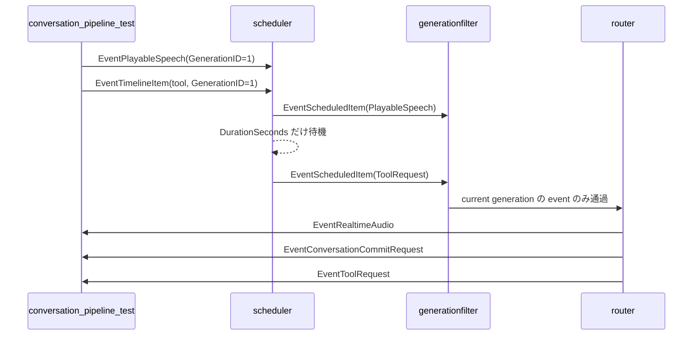

# pipeline 概要理解ドキュメント

## 1. ビジネスコンテキスト

- **解決する課題**: 会話応答の生成後に、音声再生、会話履歴への保存、tool 実行を正しい順序で連携できることを確認する。
- **対象範囲**: `internal/components/pipeline/` は、現時点では主に pipeline 統合テスト用 package であり、production 用の pipeline 実行本体は含まれていない。
- **提供価値**: `scheduler`、`generationfilter`、`router` を実際の channel 接続に近い形で組み合わせ、発話が tool 実行より先に処理されることや、interim transcript で古いAI出力を止められることを検証する。
- **根拠**: 本ドキュメントは `internal/components/pipeline/conversation_pipeline_test.go`、`internal/components/interimstopper/stage.go`、`internal/components/utterancebuffer/stage.go`、`internal/components/scheduler/stage.go`、`internal/components/generationfilter/stage.go`、`internal/components/router/stage.go`、`internal/types/`、`internal/states/generation/store.go` の実コードに基づく。外部 URL は参照していない。

## 2. 論理構造・機能俯瞰

**主要なモデル・コンポーネント**

- **pipeline package**
  - `internal/components/pipeline/conversation_pipeline_test.go` のみで構成される。
  - `TestSchedulerRouterKeepsSpeechBeforeTool` により、複数 component を接続したときの event 順序を検証する。
  - `TestInterimStopsOldGenerationAndFinalCommitsUserUtterance` により、interim transcript で古いgenerationのscheduled itemが落ち、final transcript が従来どおりuser commitになることを検証する。
  - package 内に production 用の `NewStage`、runtime、設定構造体は定義されていない。

- **interimstopper**
  - `EventHumanInterimUtterance` を受け取ったら、同一発話中の初回だけ `generation.Store.Next()` を呼ぶ。
  - interim event は下流へ流さず、final の `EventHumanUtterance` だけを通す。
  - final を通すと停止済みフラグを解除し、次の発話のinterimで再度停止できるようにする。

- **utterancebuffer**
  - `EventHumanUtterance` を短時間bufferし、flush時に user の `EventConversationCommitRequest` を発行する。
  - final transcript の commit 時に `generation.Store.Next()` を呼び、ユーザー発話用の新しいgenerationを採番する。

- **scheduler**
  - `PlayableSpeech` と `TimelineItem` を受け取り、実行タイミングを調整した `EventScheduledItem` を下流へ流す。
  - `GenerationID` ごとに worker channel を作り、同じ generation 内の event を投入順に処理する。
  - `PlayableSpeech` は即座に scheduled item として出力し、その後 `DurationSeconds` だけ待機する。
  - `TimelineKindTool` は `ToolRequest` に変換して scheduled item として出力する。
  - `TimelineKindWait` は待機のみを行い、event は出力しない。

- **generationfilter**
  - `generation.Store` がある場合、event payload の `GenerationID` が現在世代と一致するものだけを通す。
  - 対象 payload は `TimelineItem`、`PlayableSpeech`、`ToolRequest`、`OutputAudio`、`ConversationCommitRequest`。
  - `generation.Store` が `nil` の場合は全 event を許可する。
  - `GenerationID` を取り出せない event は通さない。

- **router**
  - `EventScheduledItem` だけを処理対象にする。
  - scheduled item の payload が `PlayableSpeech` の場合、再生用の `EventRealtimeAudio` と履歴保存用の `EventConversationCommitRequest` をこの順序で出力する。
  - scheduled item の payload が `ToolRequest` の場合、`EventToolRequest` として出力する。
  - `EventScheduledItem` 以外の event は無視する。

- **generation.Store**
  - 現在の会話世代 ID の正本。
  - `Next()` で世代を進め、`IsCurrent(id)` で最新世代かどうかを判定する。
  - pipeline 統合テストでは `store.Next()` により current generation を `1` にした上で、`GenerationID: 1` の event を流している。

- **production graph 上の補足**
  - production 実行本体は `cmd/smart-speaker/main.go` で組み立てられる。
  - LLM 出力直後の経路は `llm -> sessionactivate -> generationfilter-llm -> tts` で、`sessionactivate` が speech 通過時に `agentstatus.Store` を `active` に戻す。
  - この package の統合テストは `scheduler -> generationfilter -> router` の順序保証に絞っており、`sessionactivate` は直接テスト対象に含めていない。

### シナリオ: interim transcript で古いAI出力を止める

1. **テスト初期化**: `generation.NewStore()` で世代 Store を作り、`store.Next()` で current generation を `1` にする。
2. **Stage 構築**: `interimstopper.NewStage`、`utterancebuffer.NewStage`、`generationfilter.NewStage` を生成し、それぞれ `Run(ctx)` で非同期処理を開始する。
3. **Stage 接続**: `pump` goroutine により、`interimstopper.Downstream -> utterancebuffer.Upstream` を channel で接続する。
4. **interim event 投入**: `interimstopper.Upstream` に `EventHumanInterimUtterance` を投入する。
5. **generation 更新**: `interimstopper` が `generation.Store.Next()` を呼び、current generation が `2` になる。
6. **旧generation event 投入**: `generationfilter.Upstream` に `GenerationID: 1` の `EventScheduledItem` を投入する。
7. **generationfilter 処理**: event payload の generation が current ではないため、下流へ流さない。
8. **final event 投入**: `interimstopper.Upstream` に `EventHumanUtterance` を投入する。
9. **user commit**: `interimstopper` が final を `utterancebuffer` へ通し、`utterancebuffer` が user の `EventConversationCommitRequest` を発行する。

## 3. 主要なデータフロー

### シナリオ: TTS 済み発話が tool 実行より先に処理される

1. **テスト初期化**: `generation.NewStore()` で世代 Store を作り、`store.Next()` で current generation を `1` にする。
2. **Stage 構築**: `scheduler.NewStage`、`generationfilter.NewStage`、`router.NewStage` を生成し、それぞれ `Run(ctx)` で非同期処理を開始する。
3. **Stage 接続**: `pump` goroutine により、`scheduler.Downstream -> generationfilter.Upstream -> generationfilter.Downstream -> router.Upstream` を channel で接続する。
4. **発話 event 投入**: `scheduler.Upstream` に `EventPlayableSpeech` を投入する。payload は `PlayableSpeech{GenerationID: 1, Text: "確認するね", Audio: "abc", DurationSeconds: 0.01}`。
5. **tool event 投入**: 続けて `scheduler.Upstream` に `EventTimelineItem` を投入する。payload は `TimelineItem{Kind: TimelineKindTool, GenerationID: 1, SequenceID: "2", ToolName: "get_temp"}`。
6. **scheduler 処理**: 発話を `EventScheduledItem` として出力し、`DurationSeconds` だけ待機する。その後、tool timeline item を `ToolRequest` に変換して `EventScheduledItem` として出力する。
7. **generationfilter 処理**: どちらの scheduled item も `GenerationID: 1` で current generation と一致するため通過する。
8. **router 処理**: 発話 scheduled item から `EventRealtimeAudio`、`EventConversationCommitRequest` を順に出力し、tool scheduled item から `EventToolRequest` を出力する。
9. **期待結果**: `router.Downstream` から `EventRealtimeAudio`、`EventConversationCommitRequest`、`EventToolRequest` の順で取得できることを検証する。

## 4. 詳細設計

### クラス設計

- internal/
  - components/
    - pipeline/
      - conversation_pipeline_test.go: `scheduler`、`generationfilter`、`router` の統合順序を検証するテスト。
        - `TestSchedulerRouterKeepsSpeechBeforeTool`: 発話 event と tool timeline event を投入し、下流 event が `EventRealtimeAudio`、`EventConversationCommitRequest`、`EventToolRequest` の順になることを検証する。
        - `pump`: 入力 channel から出力 channel へ event を転送するテスト補助関数。context cancel または入力 channel close で終了する。
        - `expect`: 指定 channel から 1 秒以内に event を受け取るテスト補助関数。timeout 時は test を失敗させる。
    - scheduler/
      - stage.go: generation ごとの順序制御と、発話・wait・tool timeline item の scheduling を行う Stage。
        - `NewStage`: upstream/downstream channel と `Run`/`CloseFn` を持つ `graph.Stage` を構築する。
        - `run`: 親 context から cancel 可能な context を作り、consume goroutine を起動する。
        - `consume`: upstream から event を受け取り、payload から `GenerationID` を取り出せる event だけを generation 別 worker に投入する。
        - `enqueue`: generation ごとの worker channel を作成または再利用し、event を投入する。
        - `runGeneration`: 1 generation の event を channel 受信順に `handle` へ渡す。
        - `handle`: `PlayableSpeech` を scheduled item として出力して再生時間分待機し、tool timeline item を `ToolRequest` に変換する。
        - `wait`: 秒数指定に応じて timer で待機する。
        - `emit`: downstream へ event を送信する。
        - `close`: cancel と upstream close を一度だけ実行する。
    - generationfilter/
      - stage.go: current generation に属する event のみを下流に通す Stage。
        - `NewStage`: `generation.Store` を設定した `graph.Stage` を構築する。
        - `run`: consume goroutine を起動する。
        - `consume`: upstream から event を受け取り、`allow` が true の event だけを downstream へ送信する。
        - `allow`: `generation.Store` が nil なら通過、nil でなければ event の `GenerationID` が current generation かどうかを判定する。
        - `close`: cancel と upstream close を一度だけ実行する。
    - router/
      - stage.go: scheduled item を再生、会話履歴保存要求、tool 実行要求へ変換する Stage。
        - `NewStage`: upstream/downstream channel と `Run`/`CloseFn` を持つ `graph.Stage` を構築する。
        - `run`: consume goroutine を起動する。
        - `consume`: `EventScheduledItem` のみを処理し、それ以外の event を無視する。
        - `route`: `PlayableSpeech` を `EventRealtimeAudio` と `EventConversationCommitRequest` に変換し、`ToolRequest` を `EventToolRequest` に変換する。
        - `emit`: downstream へ event を送信する。
        - `close`: cancel と upstream close を一度だけ実行する。
  - states/
    - generation/
      - store.go: current generation ID を保持する共有 Store。
        - `NewStore`: 初期値 `0` の Store を作る。
        - `Next`: current generation を 1 つ進めて返す。
        - `Current`: current generation を返す。
        - `IsCurrent`: 指定 generation が current generation と一致するかを返す。
        - `Reset`: current generation を `0` に戻す。
  - types/
    - event.go: component 間を流れる `Event`、`EventKind`、`ToolRequest` を定義する。
    - timeline_item.go: LLM timeline item と TTS 済み発話である `PlayableSpeech` を定義する。
    - conversation_record.go: 会話履歴保存要求である `ConversationCommitRequest` を定義する。
    - types.go: 再生用 payload である `OutputAudio` などを定義する。
    - generation.go: `GenerationID` を定義する。

### テーブル設計

この package と関連 Stage の実コード上、DB テーブルは定義されていない。

### API設計

この package と関連 Stage の実コード上、HTTP API や外部公開 API endpoint は定義されていない。component 間の接続は `graph.Stage` の `Upstream` / `Downstream` channel と `types.Event` によって行われる。

### 現時点で不明な点

- `internal/components/pipeline/` が将来的に production pipeline 構築責務を持つ予定かどうかは、現時点の実コードからは不明。
