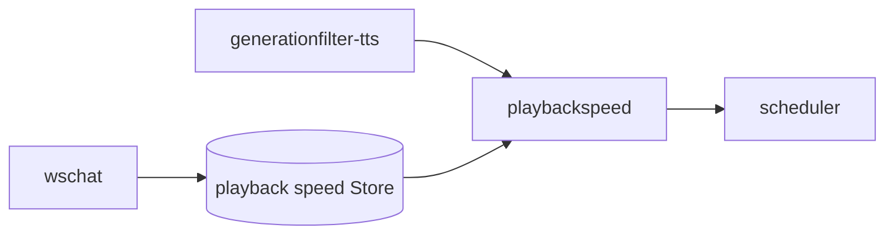

# playbackspeed 概要理解ドキュメント

## 1. ビジネスコンテキスト

- **解決する課題**: エージェント発話の体感テンポを、ユーザーが 1 / 1.5 / 2 / 3 倍の 4 段階で調整できるようにする。
- **責務の境界**: `playbackspeed` stage は pipeline 上の `PlayableSpeech` と `wait` item を、共有 Store の倍率に合わせて加工する。WebSocket 境界や Store 更新は `wschat` が担当する。
- **参照元**: `internal/components/playbackspeed/`, `internal/states/playbackspeed/`, `internal/components/wschat/wschat.go`, `cmd/smart-speaker/main.go`。

## 2. 論理構造

- **`internal/states/playbackspeed.Store`**: プロセス内 in-memory。プリセット `1, 1.5, 2, 3` のみ有効。永続化なし。
- **`playbackspeed` stage**: `generationfilter-tts` の直後、`scheduler` の直前に挿入される。
- **適用タイミング**: event を受け取った時点の `Store.Speed()`。UI で速度を変えた場合は **次の item から** 反映される。

## 3. 加工内容

| 入力 | 加工 |
|------|------|
| `EventPlayableSpeech` | `DurationSeconds` を ÷ speed。PCM（24 kHz / 16-bit / mono）を線形間引き＋線形補間で時間圧縮し base64 再エンコード |
| `EventTimelineItem`（`kind=wait`） | `Sec` を ÷ speed |
| その他（`AgentTimelineEnd` 等） | 透過 |

PCM 加工はピッチも上がる早送り聴感である（ピッチ保持タイムストレッチは対象外）。

## 4. データフロー

