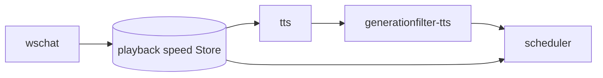

# playbackspeed 概要理解ドキュメント

## 1. ビジネスコンテキスト

- **解決する課題**: エージェント発話の体感テンポを、ユーザーが 1 / 1.5 / 2 / 3 倍の 4 段階で調整できるようにする。
- **責務の境界**: `playbackspeed` package は現在 Store のみを提供する。WebSocket 境界や Store 更新は `wschat`、音声速度への反映は `tts`、wait 秒数の調整は `scheduler` が担当する。
- **参照元**: `internal/states/playbackspeed/`, `internal/components/tts/elevenlabs.go`, `internal/components/scheduler/stage.go`, `internal/components/wschat/wschat.go`, `cmd/smart-speaker/main.go`。

## 2. 論理構造

- **`internal/states/playbackspeed.Store`**: プロセス内 in-memory。プリセット `1, 1.5, 2, 3` のみ有効。永続化なし。
- **`tts` での利用**: `speech` を ElevenLabs API に送る直前に `Store.Speed()` を読み、`voice_settings.speed` に合成する。
- **`scheduler` での利用**: `TimelineKindWait` の処理時に `Store.Speed()` を読み、待機秒数を `Sec / speed` にする。
- **適用タイミング**: `tts` または `scheduler` が処理する時点の `Store.Speed()`。UI で速度を変えた場合は以後の speech / wait から反映される。

## 3. 適用内容

| 入力 | 加工 |
|------|------|
| `TimelineItem`（`kind=speech`） | `tts` が `voice_settings.speed = base speed * Store.Speed()` として ElevenLabs API に渡す |
| `EventPlayableSpeech` | PCM と `DurationSeconds` は加工しない。ElevenLabs から返った音声長を scheduler がそのまま使う |
| `EventTimelineItem`（`kind=wait`） | `scheduler` が sleep 秒数を `Sec / Store.Speed()` にする |
| その他（`tool`, `AgentTimelineEnd` 等） | 速度倍率では加工しない |

旧方式で行っていた PCM のサーバー側時間圧縮は廃止済みである。

## 4. データフロー

