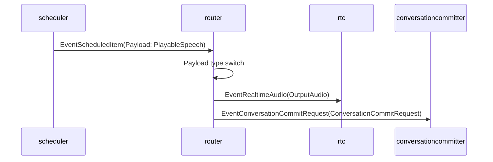
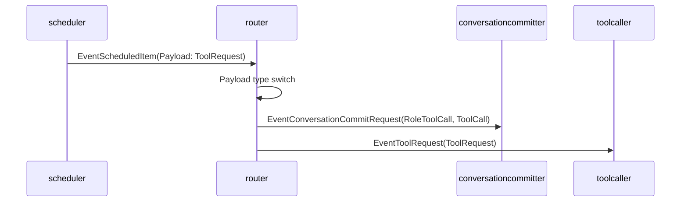
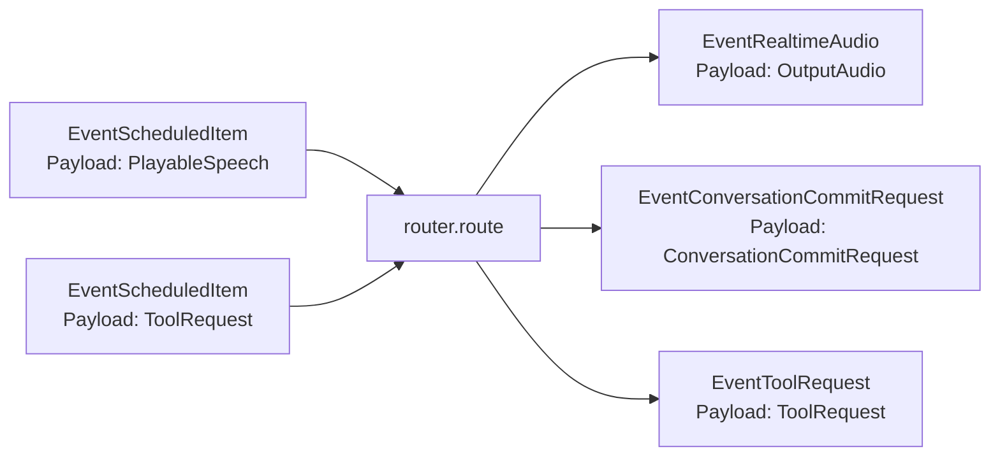

# Router 概要理解ドキュメント

## 1. ビジネスコンテキスト

- **解決する課題**: `router` は、スケジューリング済みの会話応答 item を、後続コンポーネントが処理できるイベントへ分配する。具体的には、TTS 済み音声はリアルタイム音声出力と会話履歴保存要求へ、ツール呼び出しはツール実行要求へ変換する。
- **ターゲットユーザー**: コード上で明示されていないため不明。実装上は、スマートスピーカーの会話パイプライン内で、アシスタント応答の再生・保存・ツール実行をつなぐ開発者向けコンポーネントとして読める。
- **価値定義**: `scheduler` が順序制御した `EventScheduledItem` を、`rtc`、`conversationcommitter`、`toolcaller` などの責務別コンポーネントへ渡せる形に変換し、会話応答の「再生」「履歴化」「ツール実行」を分離する。
- **根拠となる実装**: `internal/components/router/stage.go`、関連するイベント型は `internal/types/event.go`、`internal/types/timeline_item.go`、`internal/types/types.go`、`internal/types/conversation_record.go` に定義されている。前段の `scheduler` と後段の利用先は `internal/components/scheduler/stage.go`、`internal/components/rtc/rtc.go`、`internal/components/conversationcommitter/stage.go`、`internal/components/toolcaller/toolcaller.go` で確認できる。

## 2. 論理構造・機能俯瞰

**主要なモデル・コンポーネント**

- **router stage**
  - `NewStage(Config{})` で `graph.Stage` を生成する。
  - `Upstream` と `Downstream` はどちらも `chan types.Event` で、バッファサイズは `graph.DefaultChannelBufferSize`。
  - `Run` は親 `context.Context` からキャンセル可能な子 context を作り、`consume` goroutine を起動する。
  - `CloseFn` は内部 cancel を呼び、`upstream` を close する。二重 close 防止には `sync.Once` を使う。

- **入力イベント: `EventScheduledItem`**
  - `consume` は `evt.Kind != types.EventScheduledItem` のイベントを無視する。
  - `EventScheduledItem` の `Payload` 型だけを `route` が判定する。
  - 対応する payload は `types.PlayableSpeech` と `types.ToolRequest` の 2 種類。その他の payload は `switch` に該当せず、何も出力しない。

- **`types.PlayableSpeech`**
  - TTS 済みの speech item を表す。
  - 主なフィールドは `GenerationID`、`SequenceID`、`Text`、`Audio`、`DurationSeconds`、`OriginalTimeline`。
  - `router` では `Audio`、`Text`、`GenerationID` を `types.OutputAudio` に写し、同じ `Text` と `GenerationID` を `types.ConversationCommitRequest` に写す。
  - `SequenceID`、`DurationSeconds`、`OriginalTimeline` は `router` では参照されない。

- **`types.ToolRequest`**
  - 関数呼び出しが必要なときの要求を表す。
  - 主なフィールドは `ResponseID`、`ToolCallID`、`Name`、`Arguments`、`GenerationID`、`SequenceID`。
  - `router` は実行前に `RoleToolCall` の `EventConversationCommitRequest` を発行し、その後 `EventToolRequest` の payload としてそのまま下流へ流す。

- **出力イベント: `EventRealtimeAudio`**
  - `types.PlayableSpeech` から生成される。
  - payload は `types.OutputAudio`。
  - `Role` は常に `types.RoleAgent`。
  - `rtc` コンポーネントは `EventRealtimeAudio` を受け取り、payload が `types.OutputAudio` の場合に TTS 音声を処理する。

- **出力イベント: `EventConversationCommitRequest`**
  - `types.PlayableSpeech` から生成される。
  - payload は `types.ConversationCommitRequest`。
  - `Role` は常に `types.RoleAgent`、`Source` は常に `"llm"`。
  - `conversationcommitter` は `EventConversationCommitRequest` を受け取り、会話履歴保存と後続の LLM request 生成を担う。

- **出力イベント: `EventToolRequest`**
  - `types.ToolRequest` から生成される。
  - payload は入力された `ToolRequest` と同一値。
  - `toolcaller` は `EventToolRequest` を受け取り、`Name` に対応するツールを実行する。

- **出力イベント: tool_call の `EventConversationCommitRequest`**
  - `types.ToolRequest` から生成される。
  - payload は `types.ConversationCommitRequest{Role: types.RoleToolCall, ToolCall: ...}`。
  - `ToolCall` には `ToolCallID`、`Name`、`Arguments`、`GenerationID` を保持し、履歴上で後続の `tool_result` と対応できるようにする。

## 3. 主要なデータフロー

### シナリオ: TTS 済みアシスタント発話を再生し、会話履歴へ保存する

1. 前段がスケジュール済み item を送る: `scheduler` は `types.PlayableSpeech` を受け取ると、`EventScheduledItem` として下流へ出力し、その後 `DurationSeconds` 分だけ待つ。
2. router が入力を選別する: `router.consume` は `EventScheduledItem` 以外を無視し、該当イベントの `Payload` を `route` に渡す。
3. payload 型を判定する: `route` は payload が `types.PlayableSpeech` の場合、音声出力用イベントと会話保存用イベントを順番に emit する。
4. 音声出力イベントを生成する: `EventRealtimeAudio` の payload として `types.OutputAudio{Role: agent, Audio, Text, GenerationID}` を出力する。
5. 会話保存イベントを生成する: `EventConversationCommitRequest` の payload として `types.ConversationCommitRequest{Role: agent, Text, GenerationID, Source: "llm"}` を出力する。
6. 後段が処理する: `rtc` は `EventRealtimeAudio` を処理し、`conversationcommitter` は `EventConversationCommitRequest` を処理する。具体的な接続構成はこのファイル群だけでは断定できないが、`internal/components/pipeline/conversation_pipeline_test.go` では `scheduler -> generationfilter -> router` の順に接続され、音声、commit、tool の順序が検証されている。

### シナリオ: スケジュール済みツール呼び出しをツール実行へ渡す

1. 前段がツール要求を送る: `scheduler` は `TimelineKindTool` の `types.TimelineItem` を受け取ると、`types.ToolRequest` を作り、`EventScheduledItem` として出力する。
2. router が入力を選別する: `router.consume` は `EventScheduledItem` の payload だけを `route` に渡す。
3. payload 型を判定する: `route` は payload が `types.ToolRequest` の場合、まず tool call 保存用の `EventConversationCommitRequest` を emit する。
4. ツール要求を加工せず渡す: 続けて `EventToolRequest` を emit する。`ToolRequest` の `ToolCallID`、`Name`、`Arguments`、`GenerationID`、`SequenceID` は変更されない。
5. 後段が処理する: `conversationcommitter` は tool call を保存し、`toolcaller` は `EventToolRequest` を受け取り、`Name` に対応するツールを非同期に実行する。

## 4. 詳細設計

### クラス設計

- `internal/`
  - `components/`
    - `router/`
      - `stage.go`: スケジュール済み item を後続向けイベントへ変換する stage を実装する。
        - `NewStage`: `upstream`、`downstream`、`Run`、`CloseFn` を持つ `graph.Stage` を生成する。現時点で `Config` に設定項目はない。
        - `run`: 親 context からキャンセル可能な context を作り、`consume` を goroutine として開始する。
        - `consume`: `upstream` からイベントを読み、`EventScheduledItem` だけを `route` へ渡す。終了時に `downstream` を close する。
        - `route`: payload の具象型に応じて出力イベントを作る。`PlayableSpeech` は `EventRealtimeAudio` と `EventConversationCommitRequest`、`ToolRequest` は tool call 保存用の `EventConversationCommitRequest` と `EventToolRequest` へ変換する。
        - `emit`: context がキャンセルされていなければ `downstream` にイベントを送る。
        - `close`: cancel を呼び、`upstream` を close する。
      - `stage_test.go`: `PlayableSpeech` が音声出力と会話保存に分配されること、`ToolRequest` が `EventToolRequest` として出力されることを検証する。

### イベント入出力設計

- **入力: `types.Event{Kind: EventScheduledItem, Payload: types.PlayableSpeech}`**
  - `Payload.Audio` は `OutputAudio.Audio` へコピーされる。
  - `Payload.Text` は `OutputAudio.Text` と `ConversationCommitRequest.Text` へコピーされる。
  - `Payload.GenerationID` は `OutputAudio.GenerationID` と `ConversationCommitRequest.GenerationID` へコピーされる。
  - `OutputAudio.Role` と `ConversationCommitRequest.Role` は `types.RoleAgent` に固定される。
  - `ConversationCommitRequest.Source` は `"llm"` に固定される。

- **入力: `types.Event{Kind: EventScheduledItem, Payload: types.ToolRequest}`**
  - `Payload` から `RoleToolCall` の `ConversationCommitRequest` が作られた後、`types.Event{Kind: EventToolRequest, Payload: item}` として出力される。

- **無視される入力**
  - `EventScheduledItem` 以外の `EventKind` は `consume` で無視される。
  - `EventScheduledItem` であっても、payload が `types.PlayableSpeech` または `types.ToolRequest` でない場合は `route` で何も出力されない。
  - 無視時のログ出力やエラー返却は実装されていない。

### 並行性・終了処理

- `run` は `consume` を 1 goroutine で起動する。
- `consume` は context キャンセルまたは `upstream` close で終了し、`defer close(s.downstream)` により下流チャネルを close する。
- `emit` は context キャンセルと `downstream` 送信を `select` で扱う。キャンセル済みの場合は送信しない。
- `close` は `sync.Once` により一度だけ実行され、`cancel` が設定済みなら呼び出したうえで `upstream` を close する。
- `stage` 内部に payload 変換以外の状態はない。イベント順序は単一 `consume` goroutine と `emit` の呼び出し順に依存する。

### 現時点で明示されていないこと

- `Config` は空 struct で、router 固有の設定値は存在しない。
- 不正 payload や未対応 payload に対するログ・メトリクス・エラー通知は実装されていない。
- `router` 単体では graph 上の接続先を定義しない。接続関係は別の組み立てコードまたはテスト側で決まる。
- `PlayableSpeech.SequenceID`、`DurationSeconds`、`OriginalTimeline` を router で使わない理由はコード上にコメントがなく不明。
