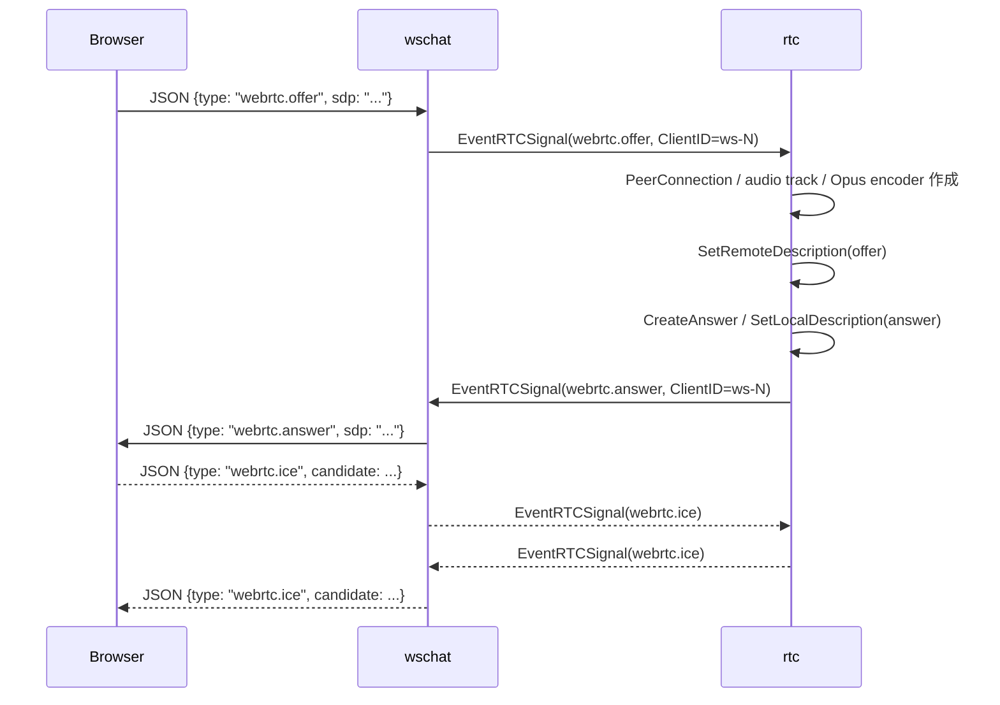
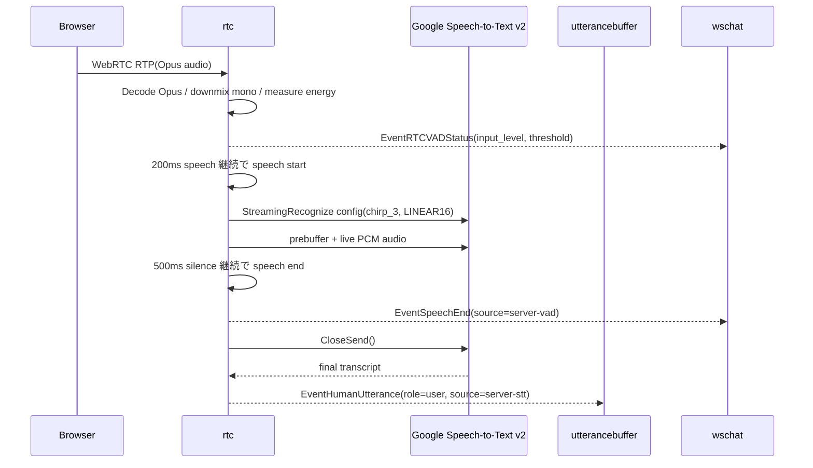
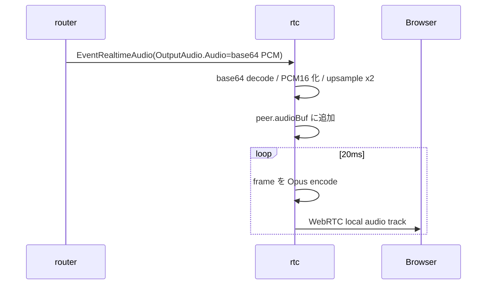

# rtc component 概要理解ドキュメント

## 1. ビジネスコンテキスト

* **解決する課題**: ブラウザで動作するスマートスピーカー UI と Go サーバーの間で、低遅延な双方向音声を扱う。ブラウザのマイク音声を受け取り、サーバー側で VAD と STT を実行し、agent の音声を WebRTC の下り audio track として返す。
* **ターゲットユーザー**: ブラウザ UI から音声で対話する利用者。実装上は `/ws/chat` を担当する `wschat`、発話をまとめる `utterancebuffer`、agent 音声を配送する `router` と接続する。
* **価値定義**: ブラウザ側に STT 処理を持たせず、サーバー側で発話開始・終了、文字起こし、agent 音声返送を一元化することで、会話パイプラインに `EventHumanUtterance` と `EventRealtimeAudio` を接続できる。
* **責務の境界**: `rtc` は WebRTC signaling、RTP 音声入力、server VAD、Google Speech-to-Text v2 への streaming、agent 音声の WebRTC 出力を担当する。agent 応答生成、TTS API 呼び出し、発話バッファ後の会話履歴 commit は担当しない。
* **根拠**: `internal/components/rtc/` の実装、`internal/types/` のイベント定義、`cmd/smart-speaker/main.go` の graph wiring、`internal/components/wschat/wschat.go` の WebSocket 変換、`internal/components/router/stage.go` の agent 音声配送。

## 2. 論理構造・機能俯瞰

**主要なモデル・コンポーネント**

- **stage**
  - `rtc` component の graph stage 本体。
  - upstream から `EventRTCSignal` と `EventRealtimeAudio` を受け取り、downstream へ `EventRTCSignal`、`EventHumanUtterance`、`EventSpeechEnd`、`EventRTCVADStatus` を出す。
  - Speech-to-Text 用の Google Speech client、stream、停止 timer を stage 単位で保持する。

- **peerState**
  - WebRTC peer ごとの状態。
  - `PeerConnection`、下り音声用の local track、Opus encoder、pending ICE、agent 音声の PCM buffer、入力音声の prebuffer、VAD 状態、適応しきい値履歴を保持する。
  - `ClientID` は `wschat` の WebSocket 接続 ID に対応し、空の場合は `default` に正規化される。

- **WebRTC signaling**
  - `webrtc.offer`、`webrtc.answer`、`webrtc.ice` を処理する。
  - offer 受信時に既存 peer を reset し、新しい `PeerConnection` と下り audio track を作成して answer を返す。
  - remote description 設定前に受け取った ICE candidate は `pendingICE` に保存し、offer の remote description 設定後に追加する。

- **音声入力**
  - ブラウザからの remote track を Opus decode し、mono PCM に downmix する。
  - packet ごとに平均絶対振幅を `InputLevel` として測定し、server VAD に利用する。
  - 複数 peer が同時に発話した場合は `activeSpeakerID` により 1 peer の音声だけを STT に流す。

- **server VAD**
  - 直近 1 分の入力 energy の中央値に offset 50 を加えた値をしきい値にし、最低しきい値 50 を下回らないようにする。
  - 200ms 以上 speech frame が続くと speech start、500ms 以上 non-speech frame が続くと speech end と判定する。
  - VAD status は 250ms 間隔で `EventRTCVADStatus` として downstream へ出す。

- **server STT**
  - speech start 時に Google Speech-to-Text v2 の `StreamingRecognize` を開始する。
  - model は `chirp_3`、region は `asia-northeast1`、encoding は `LINEAR16`。
  - final result の transcript のみを `EventHumanUtterance` として出す。interim result は downstream へ出さない。

- **音声出力**
  - `router` から来る `EventRealtimeAudio` の base64 PCM を decode し、2 倍 upsample して peer ごとの再生 buffer に追加する。
  - 20ms ticker で buffer から Opus frame を作り、WebRTC local track に `WriteSample` する。
  - peer の negotiated Opus channels が 2 の場合は mono PCM を stereo に upmix する。

- **関連 events**
  - `EventRTCSignal`: `wschat` と `rtc` 間の WebRTC signaling。WebSocket JSON の `webrtc.*` message と相互変換される。
  - `EventRealtimeAudio`: agent 音声 chunk。`router` から `rtc` へ送られ、WebRTC 下り音声として再生される。
  - `EventHumanUtterance`: Google STT の final transcript。`utterancebuffer` へ送られる。
  - `EventSpeechEnd`: server VAD の発話終了通知。`wschat` へ送られ、UI には `speech_end` として通知される。
  - `EventRTCVADStatus`: server VAD の入力 level としきい値。`wschat` へ送られ、UI には `rtc_vad_status` として通知される。

## 3. 主要なデータフロー

### シナリオ: ブラウザと WebRTC 接続を確立する

1. ブラウザが `/ws/chat` へ WebSocket 接続し、`webrtc.offer` を送る。
2. `wschat` が WebSocket message を `EventRTCSignal` に変換し、`ClientID` に WebSocket 接続 ID を設定して `rtc` へ流す。
3. `rtc` が offer を処理し、peer を作成する。ICE UDP port range は `50000-50100`、`IceHostIPs` があれば NAT 1:1 host IP として設定する。
4. `rtc` が下り audio track を追加し、remote description を設定し、pending ICE を追加した後、answer を作成して `EventRTCSignal` として返す。
5. `wschat` が `EventRTCSignal` を対象 `ClientID` の WebSocket へ JSON 送信する。
6. 以後の ICE candidate は `webrtc.ice` として双方向に流れる。

### シナリオ: ブラウザ音声を server VAD / STT で処理する

1. WebRTC remote track を受け取ると、`rtc` は Opus decoder を作成し、peer の入力 sample rate、3 秒分の prebuffer、VAD 状態を初期化する。
2. RTP packet を decode し、channels が 2 以上なら mono に downmix する。
3. mono PCM を byte 列に変換し、frame energy と packet duration を計算する。
4. `activeSpeakerID` が空、または現在の peer と一致する場合だけ音声処理を続行する。他 peer が active speaker の場合は処理しない。
5. 直近 1 分の energy 履歴から適応しきい値を 1 秒間隔で更新し、250ms 間隔で `EventRTCVADStatus` を emit する。
6. speech frame が 200ms 続いたら speech start とし、active speaker を獲得できた場合に Speech-to-Text stream を開始する。stream 開始時には prebuffer snapshot も STT に送る。
7. 発話中の audio は `sendSpeechAudio` で 25,600 bytes ごとに分割され、Google Speech-to-Text v2 stream へ送られる。
8. non-speech frame が 500ms 続いたら `EventSpeechEnd` を emit し、STT stream の `CloseSend` を schedule する。現行定数では `sttStopDelay` は 0ms。
9. STT response の final transcript が空でなければ、`EventHumanUtterance` として emit する。

### シナリオ: agent 音声を WebRTC で再生する

1. `router` が `PlayableSpeech` を `EventRealtimeAudio` に変換して `rtc` へ流す。
2. `rtc` は `OutputAudio.Audio` を base64 decode し、little endian PCM16 として読み取る。
3. PCM を 2 倍 upsample し、接続中 peer の `audioBuf` に追加する。peer の Opus channels が 2 の場合は stereo に upmix する。
4. `sendLoop` が 20ms 間隔で `audioBuf` から frame を取り出し、Opus encode して WebRTC local track に書き込む。

## 4. 詳細設計

### クラス設計

- internal/
  - components/
    - rtc/
      - rtc.go: `rtc` stage の生成、実行、event dispatch、終了処理を定義する。
        - `NewStage`: `Config` のデフォルトを補完し、graph stage を返す。`SpeechRecognizer` は空なら `_`、`SpeechLanguage` は空なら `ja-JP`。
        - `run`: context を作成し、upstream 消費 goroutine と下り音声送信 goroutine を起動する。
        - `consume`: upstream の `EventRTCSignal` と `EventRealtimeAudio` を型チェックして、それぞれ signaling / TTS 音声処理へ振り分ける。
        - `emit`: downstream へ event を送る。context 終了時は送らない。
        - `close`: stage を閉じ、Speech stream/client と peer を破棄し、upstream を close する。
      - signaling.go: WebRTC signaling と peer lifecycle を管理する。
        - `handleSignal`: `webrtc.offer`、`webrtc.answer`、`webrtc.ice` を dispatch する。
        - `handleOffer`: peer を再作成し、local audio track を追加し、answer を emit する。
        - `newPeerConnection`: Pion WebRTC の codec / interceptor / UDP port range / NAT 1:1 host IP を設定して `PeerConnection` を作る。
        - `handleAnswer`: 既存 peer に remote answer を設定する。
        - `handleICE`: ICE candidate を peer に追加する。peer 未作成時は `pendingICE` に保存する。
        - `parseOpusChannels`: SDP の `opus/48000/{channels}` から 1 または 2 channels を読み取る。読めない場合は 1。
        - `normalizeClientID`: 空の client ID を `default` にする。
        - `getPeer`: peer map から指定 ID の peer を取得する。
        - `getOrCreatePeer`: peer がなければ作成する。
        - `canProcessAudio`: active speaker が空または同一 peer かを返す。
        - `isActiveSpeaker`: 指定 peer が active speaker かを返す。
        - `activateSpeaker`: active speaker が空または同一 peer の場合だけ speaker を設定する。
        - `clearActiveSpeaker`: 指定 peer が active speaker の場合に解除し、必要なら STT を停止する。
        - `resetPeer`: peer connection と音声/VAD 状態を破棄する。
        - `resetAllPeersLocked`: 全 peer と active speaker を破棄する。
      - input.go: WebRTC 上り音声、server VAD、Google Speech-to-Text v2 streaming を扱う。
        - `handleIncomingTrack`: RTP/Opus を PCM に変換し、VAD と STT 送信を制御する。
        - `startSpeechStream`: Google Speech-to-Text v2 の streaming recognition を開始し、config と prebuffer を送る。
        - `consumeSpeechResponses`: final transcript を `EventHumanUtterance` として emit する。
        - `isExpectedSpeechStreamClose`: context cancel、EOF、gRPC canceled を想定内の終了として扱う。
        - `sendSpeechAudio`: PCM audio を 25,600 bytes 単位で STT stream へ送る。
        - `scheduleSpeechStop`: `CloseSend` を timer で予約する。現行設定では delay は 0ms。
        - `cancelSpeechStopLocked`: STT 停止 timer を解除する。
        - `stopSpeechLocked`: STT 送信を閉じ、stream context を cancel する。
        - `closeSpeechSendLocked`: STT stream の送信側を閉じる。
        - `downmixToMono`: multi-channel PCM を mono に平均化する。
        - `measureFrameEnergy`: PCM frame の平均絶対振幅を計算する。
        - `appendEnergySample`: energy sample を追加し、1 分より古い履歴を削除する。
        - `pruneEnergySamples`: VAD の履歴 window 外の sample を削除する。
        - `computeAdaptiveSpeechThreshold`: energy 中央値 + 50 をもとに適応しきい値を計算する。
        - `effectiveSpeechThreshold`: VAD しきい値を最低 50 に丸める。
        - `shouldRefreshSpeechThreshold`: しきい値更新タイミングを判定する。
        - `shouldEmitVADStatus`: VAD status emit タイミングを判定する。
        - `isSpeechFrame`: energy がしきい値以上かを判定する。
        - `packetDurationMs`: sample 数と sample rate から packet duration を ms で計算する。
        - `prebufferBytes`: sample rate、channels、seconds から prebuffer byte 数を計算する。
        - `newPCMRingBuffer`: PCM prebuffer 用 ring buffer を作る。
        - `recognizerPath`: Google Speech recognizer の resource path を組み立てる。
      - output.go: agent 音声を WebRTC 下り track に送る。
        - `sendLoop`: 20ms ticker で `sendOpusFrame` を呼ぶ。
        - `sendOpusFrame`: peer の PCM buffer から 20ms frame を取り出し、Opus encode して track に書く。
        - `handleTTSAudio`: `EventRealtimeAudio` の base64 PCM を decode / upsample し、各 peer の再生 buffer に追加する。
        - `bytesToInt16`: little endian byte slice を PCM16 に変換する。
        - `int16ToBytes`: PCM16 を little endian byte slice に変換する。
        - `upsampleBy2`: 隣接 sample の平均を挿入して 2 倍 upsample する。
        - `upmixToStereo`: mono PCM を L/R 同一の stereo PCM にする。
      - input_test.go: VAD energy、適応しきい値、履歴 prune、speech 判定、STT stream 終了判定の単体テスト。

### API設計

- WebSocket `/ws/chat`: WebRTC signaling の入口と UI 通知の出口。HTTP handler は `wschat` が提供し、`rtc` は直接 HTTP endpoint を持たない。
  - ブラウザからの signaling request: `{ "type": "webrtc.offer", "sdp": "..." }`、`{ "type": "webrtc.ice", "candidate": { "candidate": "...", "sdpMid": "...", "sdpMLineIndex": 0 } }`
  - ブラウザへの signaling response: `{ "type": "webrtc.answer", "sdp": "..." }`、`{ "type": "webrtc.ice", "candidate": { ... } }`
  - ブラウザへの VAD 通知: `{ "type": "rtc_vad_status", "input_level": 123, "threshold": 150, "captured_at": "..." }`
  - ブラウザへの発話終了通知: `{ "type": "speech_end", "source": "server-vad", "captured_at": "..." }`

### イベント設計

- `EventRTCSignal`
  - 入力: `wschat` から `rtc` へ `webrtc.offer`、`webrtc.answer`、`webrtc.ice` を渡す。
  - 出力: `rtc` から `wschat` へ `webrtc.answer` と local ICE candidate を渡す。
  - payload: `types.RTCSignal`。`ClientID` は JSON には出ず、WebSocket 接続ごとの routing に使われる。

- `EventRealtimeAudio`
  - 入力: `router` から `rtc` へ agent 音声を渡す。
  - payload: `types.OutputAudio`。`Audio` は base64 文字列。サンプルレートなどの明示フィールドはないため、入力 PCM の元レートは `rtc` 単体のコードからは不明。

- `EventHumanUtterance`
  - 出力: `rtc` から `utterancebuffer` へ STT final transcript を渡す。
  - payload: `types.OutputLine{Role: "user", Text: transcript, Source: "server-stt"}`。

- `EventSpeechEnd`
  - 出力: `rtc` から `wschat` へ server VAD の発話終了を通知する。
  - payload: `types.SpeechEvent{Source: "server-vad", CapturedAt: time.Now()}`。

- `EventRTCVADStatus`
  - 出力: `rtc` から `wschat` へ server VAD の現在値を通知する。
  - payload: `types.RTCVADStatus{InputLevel, Threshold, CapturedAt}`。

### 重要な定数・設定

- WebRTC 下り音声: sample rate `48000`、default channels `1`、Opus frame `20ms`。
- server VAD: prebuffer `3s`、speech start `200ms`、speech end `500ms`、履歴 window `1m`、しきい値更新 `1s`、status emit `250ms`、offset `50`、minimum threshold `50`。
- STT: chunk `25,600 bytes`、model `chirp_3`、region `asia-northeast1`、default recognizer `_`、default language `ja-JP`、stop delay `0ms`。
- ICE: UDP ephemeral port range `50000-50100`。`IceHostIPs` が設定されていれば Pion の NAT 1:1 host IP に使う。

### 不明点

- `OutputAudio.Audio` の元 PCM sample rate は `rtc` の型や event payload には含まれていない。`rtc` は受け取った PCM を常に 2 倍 upsample して 48kHz 用 Opus encoder に渡すが、元 sample rate の仕様は `rtc` の実コードだけからは確定できない。
- ブラウザ側の WebRTC offer 作成、audio track 制約、UI 上の VAD 表示方法は `internal/components/rtc/` には含まれていないため、この文書では未記載。
- Google Speech-to-Text v2 の recognizer `_` がどのリソース設定を参照するかは Google Cloud 側の設定に依存し、この repository の実コードからは不明。
