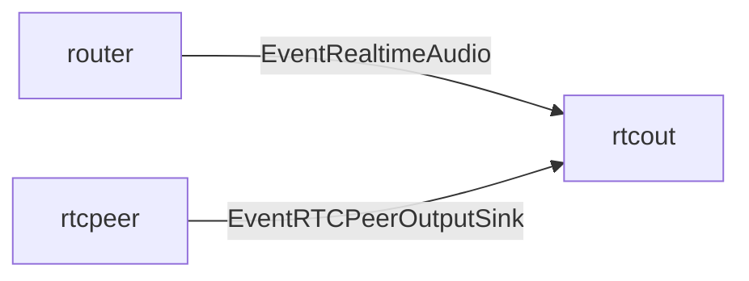

# rtcout component

`rtcout` は assistant の音声を WebRTC の下り audio track へ書き込む component。
signaling や peer 作成は `rtcpeer` が担当し、`rtcout` は接続済み peer の output sink に対して audio frame を投入する。

## 責務

- `router` から `EventRealtimeAudio` を受け取る。
- `OutputAudio.Audio` の base64 PCM を decode し、PCM16 sample に変換する。
- WebRTC 側の 48kHz 音声に合わせて 2 倍 upsample する。
- peer の Opus channels が 2 の場合は stereo に upmix する。
- 20ms ごとに Opus frame を encode し、`rtcpeer` から通知された sink に書き込む。
- `EventRTCPeerOutputSink` により peer の追加・削除を追従する。

## 主な event

- 入力: `EventRealtimeAudio`
- 入力: `EventRTCPeerOutputSink`

## 接続

