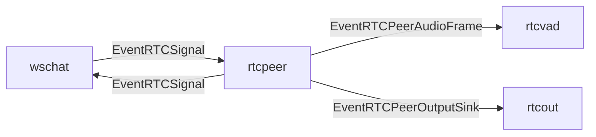

# rtcpeer component

`rtcpeer` は WebRTC signaling と peer lifecycle を担当する component。
ブラウザとの `/ws/chat` WebSocket signaling を `wschat` 経由で受け取り、Pion WebRTC の `PeerConnection` と audio track を管理する。

## 責務

- `EventRTCSignal` の `webrtc.offer` / `webrtc.answer` / `webrtc.ice` を処理する。
- WebSocket `ClientID` と WebRTC peer を対応付ける。
- offer 受信時に `PeerConnection` と下り audio track を作成し、answer と local ICE candidate を `EventRTCSignal` として返す。
- `RTC_ICE_ADVERTISE_IPS` で指定された到達可能なIPv4アドレスを、PionのAddress Rewrite Rulesでlocal ICE candidateへ追加する。
- ICE connection stateと選択されたcandidate pairをログへ出力し、LAN経路またはTailscale経路のどちらで接続されたかを確認できるようにする。
- remote audio track の RTP/Opus を decode し、mono PCM frame を `EventRTCPeerAudioFrame` として `rtcvad` へ渡す。
- 下り audio track に書き込める sink を `EventRTCPeerOutputSink` として `rtcout` へ通知する。

## ICE candidate

`rtcpeer` は `RTCIceAdvertiseIPs` 設定を受け取り、`PeerConnection` 作成時に `SetICEAddressRewriteRules` を設定する。
設定値は環境変数 `RTC_ICE_ADVERTISE_IPS` から読み込まれ、カンマ区切りのIPv4アドレスとして扱う。

指定できるアドレスは次の範囲に限定する。

- RFC 1918のプライベートIPv4アドレス
- Tailscaleが使用する `100.64.0.0/10` のIPv4アドレス

グローバルIPv4、IPv6、IPアドレスとして解釈できない値はstage作成時にエラーにする。
これは、WebRTC用UDPポートを意図せず外部インターネットへ広告しないための制限である。

広告IPが指定されている場合、Pionが検出した既存candidateは残しつつ、指定IPをserver reflexive candidateとして追加する。
本番環境では、デプロイスクリプトが `production` Docker contextのSSH接続先で本番サーバー自身のLAN IPとTailscale IPを取得し、`RTC_ICE_ADVERTISE_IPS` としてコンテナへ渡す。
そのため、デプロイ元PCのLAN IPを本番コンテナへ誤って注入しない。

接続確認では、次のログでcandidate生成と選択経路を確認する。

```text
rtcpeer: local ICE candidate client_id=... type=srflx protocol=udp address=<広告IP> port=...
rtcpeer: ICE connection state=connected client_id=...
rtcpeer: selected ICE pair client_id=... local=<広告IP>:.../srflx/udp remote=.../udp
rtcpeer: connection state=connected client_id=...
```

自宅LANではLAN IP、外出先TailscaleではTailscale IPが選択candidate pairのlocal側として記録されることを期待する。

## 主な event

- 入力: `EventRTCSignal`
- 出力: `EventRTCSignal`
- 出力: `EventRTCPeerAudioFrame`
- 出力: `EventRTCPeerOutputSink`

## 接続


