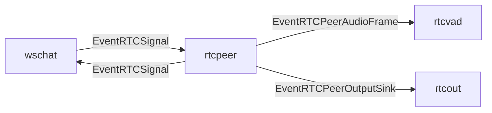

# rtcpeer component

`rtcpeer` は WebRTC signaling と peer lifecycle を担当する component。
ブラウザとの `/ws/chat` WebSocket signaling を `wschat` 経由で受け取り、Pion WebRTC の `PeerConnection` と audio track を管理する。

## 責務

- `EventRTCSignal` の `webrtc.offer` / `webrtc.answer` / `webrtc.ice` を処理する。
- WebSocket `ClientID` と WebRTC peer を対応付ける。
- offer 受信時に `PeerConnection` と下り audio track を作成し、answer と local ICE candidate を `EventRTCSignal` として返す。
- remote audio track の RTP/Opus を decode し、mono PCM frame を `EventRTCPeerAudioFrame` として `rtcvad` へ渡す。
- 下り audio track に書き込める sink を `EventRTCPeerOutputSink` として `rtcout` へ通知する。

## 主な event

- 入力: `EventRTCSignal`
- 出力: `EventRTCSignal`
- 出力: `EventRTCPeerAudioFrame`
- 出力: `EventRTCPeerOutputSink`

## 接続

