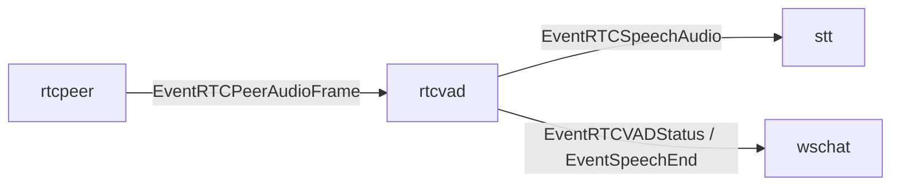

# rtcvad component

`rtcvad` は WebRTC 上り音声の server VAD と UI 向け状態通知を担当する component。
WebRTC や Google STT の API には直接触れず、`rtcpeer` から受け取った decode済み PCM frame を処理する。

## 責務

- `EventRTCPeerAudioFrame` の PCM sample から入力 energy を測定する。
- 直近 energy 履歴から適応しきい値を計算し、speech start / speech end を判定する。
- STT に送る発話開始、音声 frame、発話終了を `EventRTCSpeechAudio` として出す。
- `EventRTCVADStatus` を UI 表示用に `wschat` へ出す。
- 発話終了時に `EventSpeechEnd` を `wschat` へ出す。
- `activeSpeakerID` により、同時に STT へ流す peer を1つに保つ。

## 主な event

- 入力: `EventRTCPeerAudioFrame`
- 出力: `EventRTCSpeechAudio`
- 出力: `EventRTCVADStatus`
- 出力: `EventSpeechEnd`

## 接続

