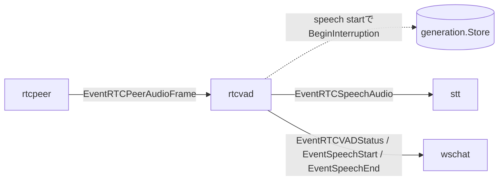

# rtcvad component

`rtcvad` は WebRTC 上り音声の server VAD と UI 向け状態通知を担当する component。
WebRTC や Google STT の API には直接触れず、`rtcpeer` から受け取った decode済み PCM frame を処理する。

## 責務

- `EventRTCPeerAudioFrame` の PCM sample から入力 energy を測定する。
- 直近 energy 履歴から適応しきい値を計算し、speech start / speech end を判定する。
- speech start 判定時に `generation.Store.BeginInterruption()` を呼び、古い LLM / TTS / scheduler 出力を即破棄せず pending 中の paused 世代として扱う。
- 後段の LLM が空 timeline を返した場合は paused 世代が再開され、非空 timeline を返した場合は新しい candidate 世代が確定される。
- STT に送る発話開始、音声 frame、発話終了を `EventRTCSpeechAudio` として出す。
- `EventRTCVADStatus` を UI 表示用に `wschat` へ出す。
- 発話開始時に `EventSpeechStart` を `wschat` へ出す。
- 発話終了時に `EventSpeechEnd` を `wschat` へ出す。
- `activeSpeakerID` により、同時に STT へ流す peer を1つに保つ。

## 主な event

- 入力: `EventRTCPeerAudioFrame`
- 出力: `EventRTCSpeechAudio`
- 出力: `EventRTCVADStatus`
- 出力: `EventSpeechStart`
- 出力: `EventSpeechEnd`

## speech start 判定

- `frameEnergy >= currentThreshold` の frame を speech frame とみなす。
- speech inactive 中に speech frame の `durationMs` を `voicedMs` へ累積する。
- `voicedMs >= 200ms` になった時点で speech start として発火する。
- speech inactive 中にしきい値未満の frame が来た場合、`voicedMs` は 0 に戻る。
- そのため、一瞬だけしきい値を超えた frame では speech start にならない。
- しきい値は直近 energy 履歴から 1 秒ごとに更新され、実効値は下限 50 を持つ。
- speech start 前の PCM は最大 10 秒ぶん prebuffer に保持し、speech start event と一緒に STT へ渡す。
- speech start ログには `prebuffer_ms`、`prebuffer_limit_ms`、`prebuffer_full`、`voiced_ms` を出し、開始判定時に prebuffer 上限へ到達していたかを確認できる。

## 接続

