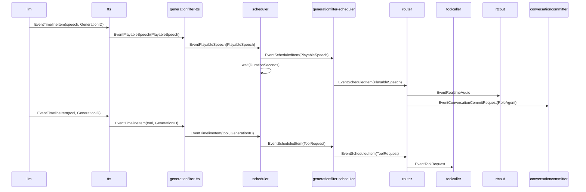
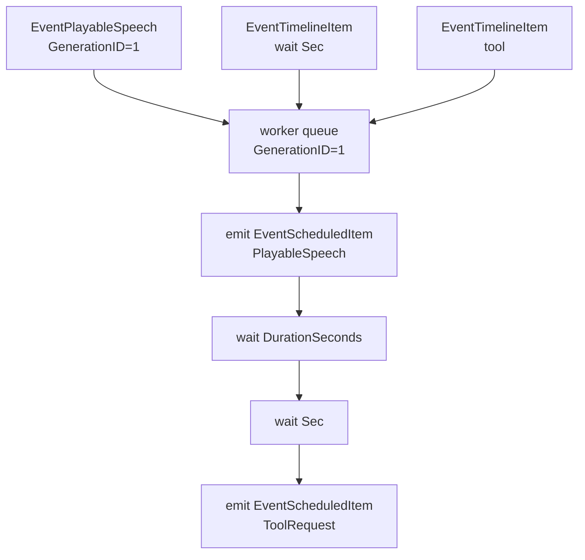

# scheduler 概要理解ドキュメント

## 1. ビジネスコンテキスト

- **解決する課題**: LLM が生成した `speech` / `wait` / `tool` の timeline を、そのまま下流へ流すと、音声再生中に tool 実行が先行するなど、会話体験上不自然な順序になる。scheduler は TTS 済み音声の再生時間と wait 秒数を使い、実行タイミングに到達した item だけを下流へ出す。
- **ターゲットユーザー**: スマートスピーカー利用者、会話 pipeline を保守する開発者、tool 実行や音声出力の順序を調整する開発者。
- **価値定義**: agent の発話を先に再生・履歴化し、その後に必要な tool を実行する順序を保つことで、会話応答の聞こえ方と tool 呼び出しのタイミングを一致させる。
- **根拠**: `internal/components/scheduler/stage.go`、`internal/components/scheduler/stage_test.go`、`internal/components/pipeline/conversation_pipeline_test.go`、`internal/types/event.go`、`internal/types/timeline_item.go`、`cmd/smart-speaker/main.go` に基づく。外部 URL は参照していない。

## 2. 論理構造・機能俯瞰

**主要なモデル・コンポーネント**

- **scheduler stage**
  - `graph.Stage` として `Upstream` / `Downstream` channel、`Run`、`CloseFn` を提供する。
  - 入力は実装上、payload が `types.PlayableSpeech` または `types.TimelineItem` の event である。`generationID` は event kind ではなく payload 型だけを見ている。
  - 出力は `EventScheduledItem` で、payload は `types.PlayableSpeech` または `types.ToolRequest` になる。
  - production の graph では `tts -> generationfilter-tts -> scheduler -> generationfilter-scheduler -> router` の順に接続される。

- **世代別 worker**
  - `workers map[types.GenerationID]chan types.Event` により、`GenerationID` ごとに専用 queue と goroutine を持つ。
  - 同じ世代の event は同じ channel に enqueue され、`runGeneration` が 1 件ずつ `handle` するため、同一世代内では投入順に処理される。
  - 世代が異なる event は別 worker で処理されるため、世代間のグローバルな順序保証は scheduler 単体にはない。
  - 古い世代の除外は scheduler の前後に配置された `generationfilter` の責務であり、scheduler 自体は「最新世代かどうか」を判定しない。

- **speech 制御**
  - `types.PlayableSpeech` を受けると、即座に `EventScheduledItem` として下流へ出す。
  - 出力後、`DurationSeconds` 秒だけ待ってから同じ世代 worker の次 event を処理する。
  - `PlayableSpeech` は TTS が `TimelineKindSpeech` を音声化した結果で、`Audio` と `DurationSeconds` を持つ。

- **wait 制御**
  - `types.TimelineItem{Kind: TimelineKindWait}` を受けると、`Sec` 秒だけ待つ。
  - wait item 自体は下流へ出力しない。
  - `Sec <= 0` の場合、`wait` は何もせず即時に戻る。

- **tool 制御**
  - `types.TimelineItem{Kind: TimelineKindTool}` を受けると、`types.ToolRequest` に変換して `EventScheduledItem` として下流へ出す。
  - `ToolCallID` と `SequenceID` には timeline item の `SequenceID` が入る。
  - `Name` には `ToolName`、`Arguments` には `ToolArgs`、`GenerationID` には timeline item の `GenerationID` が入る。
  - tool 出力後に scheduler 内で追加 wait は行わない。

- **関連 event**
  - `EventTimelineItem`: LLM が出力し、TTS が speech 以外をそのまま通す timeline item。
  - `EventPlayableSpeech`: TTS が speech item を音声化して作る再生可能な発話。
  - `EventScheduledItem`: scheduler が実行タイミングに到達した item として発行する event。
  - `EventToolRequest`: router が `EventScheduledItem` payload の `ToolRequest` を受けて発行する event。
  - `EventRealtimeAudio` / `EventConversationCommitRequest`: router が `PlayableSpeech` を受け、音声再生と agent 履歴保存用に発行する event。

## 3. 主要なデータフロー

### シナリオ: speech の後に tool を実行する

1. LLM が `speech` / `tool` などの JSON timeline を生成し、`llm` が `EventTimelineItem` を順番に発行する。
2. `tts` は `TimelineKindSpeech` を音声化し、`types.PlayableSpeech` を `EventPlayableSpeech` として発行する。`wait` / `tool` は `EventTimelineItem` のまま通す。
3. `generationfilter-tts` は現在世代の `EventPlayableSpeech` / `EventTimelineItem` だけを scheduler へ通す。
4. scheduler は payload の `GenerationID` を取り出し、該当世代の worker channel へ enqueue する。worker が未作成なら新規 channel と goroutine を作る。
5. worker は `PlayableSpeech` を受け、`EventScheduledItem(Payload: PlayableSpeech)` を発行する。
6. scheduler は `PlayableSpeech.DurationSeconds` 秒だけ待つ。この間、同じ世代の次 item は処理されない。
7. router は `EventScheduledItem(Payload: PlayableSpeech)` を受け、`EventRealtimeAudio` と agent の `EventConversationCommitRequest` を順に発行する。
8. scheduler の同じ世代 worker は待機完了後、次の `TimelineKindTool` を `ToolRequest` に変換し、`EventScheduledItem(Payload: ToolRequest)` を発行する。
9. `generationfilter-scheduler` が現在世代の scheduled item だけを router へ通す。
10. router は `ToolRequest` を `EventToolRequest` として toolcaller へ渡す。

### シナリオ: speech / wait / tool を同一世代で順序制御する

1. scheduler は `EventPlayableSpeech` を受け、同じ `GenerationID` の worker queue に入れる。
2. 続けて `EventTimelineItem(TimelineKindWait)` と `EventTimelineItem(TimelineKindTool)` を同じ worker queue に入れる。
3. worker は speech を `EventScheduledItem` として出力し、`DurationSeconds` 分待つ。
4. worker は wait item を処理し、`Sec` 分待つ。wait item は下流へ出さない。
5. worker は tool item を `ToolRequest` に変換し、`EventScheduledItem` として出力する。
6. `internal/components/scheduler/stage_test.go` は、この順序で speech が先、tool が後に出ることを検証している。

## 4. 詳細設計

### クラス設計

- internal/
  - components/
    - scheduler/
      - `stage.go`: scheduler の graph stage 実装。世代別 queue、speech / wait / tool の順序制御、`EventScheduledItem` の発行を担当する。
        - `NewStage`: buffer 付き `upstream` / `downstream` channel と `workers` map を初期化し、`graph.Stage` を返す。
        - `run`: parent context から cancel 可能な context を作り、`consume` を goroutine で開始する。
        - `consume`: `upstream` から event を読み、payload から `GenerationID` を取り出せる event だけを `enqueue` する。終了時は `downstream` を close する。
        - `enqueue`: `GenerationID` ごとの worker channel を作成または取得し、その channel へ event を送る。
        - `runGeneration`: 世代別 channel から event を順番に読み、`handle` に渡す。
        - `handle`: `PlayableSpeech`、`TimelineKindWait`、`TimelineKindTool` を処理する。raw の `TimelineKindSpeech` は明示的には扱わない。
        - `wait`: 秒数が正の場合だけ `time.NewTimer` で待機する。context cancel 時は待機を中断する。
        - `emit`: `downstream` へ event を送る。context cancel 時は送信しない。
        - `generationID`: `PlayableSpeech` と `TimelineItem` から `GenerationID` を抽出する。それ以外の payload は処理対象外にする。
        - `closeWorkers`: 登録済み worker channel を close し、`workers` map から削除する。
        - `close`: cancel を呼び、`upstream` を close する。`sync.Once` により多重 close を避ける。
      - `stage_test.go`: speech、wait、tool が同一世代で順序通りに scheduled item へ変換されることを検証する。
        - `TestStageSchedulesSpeechWaitAndToolInOrder`: speech を先に scheduled item として受け取り、wait 後に tool request が scheduled item として出ることを確認する。
        - `expectScheduled`: `EventScheduledItem` を待ち受け、想定外の kind または timeout をテスト失敗にする。
  - types/
    - `event.go`: scheduler が受け取る `EventTimelineItem` / `EventPlayableSpeech` と、発行する `EventScheduledItem`、後段で使われる `ToolRequest` を定義する。
    - `timeline_item.go`: `TimelineItem`、`PlayableSpeech`、`TimelineKindSpeech` / `TimelineKindWait` / `TimelineKindTool` を定義する。
    - `generation.go`: `GenerationID` 型を定義する。
  - components/
    - tts/
      - `elevenlabs.go`: `TimelineKindSpeech` を `PlayableSpeech` に変換し、`TimelineKindWait` / `TimelineKindTool` はそのまま scheduler へ通す。
    - generationfilter/
      - `stage.go`: scheduler 前後で現在世代の event だけを通す。scheduler 内部では世代の新旧判定を行わない。
    - router/
      - `stage.go`: `EventScheduledItem` を受け、`PlayableSpeech` は音声再生と agent commit へ、`ToolRequest` は `EventToolRequest` へ変換する。
    - pipeline/
      - `conversation_pipeline_test.go`: scheduler、generationfilter、router を組み合わせ、speech の audio / commit が tool request より先に出ることを検証する。

### 入出力 event 設計

- **入力: `EventPlayableSpeech`**
  - 想定 payload: `types.PlayableSpeech`
  - 主なフィールド: `GenerationID`, `SequenceID`, `Text`, `Audio`, `DurationSeconds`, `OriginalTimeline`
  - 処理: `EventScheduledItem` として出力した後、`DurationSeconds` 秒待つ。

- **入力: `EventTimelineItem` with `TimelineKindWait`**
  - 想定 payload: `types.TimelineItem`
  - 主なフィールド: `GenerationID`, `SequenceID`, `Sec`
  - 処理: `Sec` 秒待つ。出力 event はない。

- **入力: `EventTimelineItem` with `TimelineKindTool`**
  - 想定 payload: `types.TimelineItem`
  - 主なフィールド: `GenerationID`, `SequenceID`, `ToolName`, `ToolArgs`
  - 処理: `types.ToolRequest` に変換し、`EventScheduledItem` として出力する。

- **出力: `EventScheduledItem`**
  - payload が `types.PlayableSpeech` の場合、router が `EventRealtimeAudio` と agent の `EventConversationCommitRequest` に変換する。
  - payload が `types.ToolRequest` の場合、router が `EventToolRequest` に変換する。

### 世代ごとの queue / wait 制御

- scheduler は `GenerationID` ごとに worker channel を分けるため、同一世代では speech、wait、tool が channel 投入順に処理される。
- speech の wait は「scheduled item を出した後」に行われる。そのため下流は音声再生を開始でき、scheduler は同一世代の次 item を `DurationSeconds` 分遅らせる。
- wait item の wait は「出力なし」で行われる。これは timeline 上の無音区間として機能する。
- context が cancel されると、`wait` は timer 完了を待たずに戻る。
- `upstream` close または context cancel で `consume` は `closeWorkers` を呼び、全 worker channel を close する。
- worker channel は `closeWorkers` 以外で削除されないため、長時間稼働時の世代 worker の掃除方針は実コードからは確認できない。

### speech / tool の順序制御

- LLM の契約上、tool は 1 回の LLM 応答の末尾に最大 1 件だけ許可される。これは `internal/components/llm/contract.go` の `parseTimelineJSON` が `seenTool` 後の item をエラーにすることで担保している。
- scheduler は tool が末尾かどうかを再検証しない。入力済み timeline item を、世代別 queue の順序に従って処理する。
- `internal/components/pipeline/conversation_pipeline_test.go` では、`PlayableSpeech` の後に tool item を投入した場合、router の出力が `EventRealtimeAudio`、`EventConversationCommitRequest`、`EventToolRequest` の順になることを確認している。

### 制約・不明点

- scheduler は `Config` を持つが、現在の実装では設定項目はない。
- scheduler は event kind ではなく payload 型で `GenerationID` を抽出する。production graph では `ConnectKinds` により `EventTimelineItem` と `EventPlayableSpeech` だけが scheduler へ接続される。
- `TimelineKindSpeech` の `TimelineItem` が scheduler に直接届いた場合の処理は実装されていない。通常経路では TTS が speech item を `PlayableSpeech` に変換する。
- 世代間の処理順序、worker のライフサイクル上の掃除、遅延中に新世代が来た場合の scheduler 内キャンセルは、scheduler 単体では実装されていない。古い世代の抑止は前後の `generationfilter` が担う。
- `ToolRequest.ResponseID` は scheduler の変換では設定されない。どこで必要になるかは scheduler の実コードからは確認できない。
