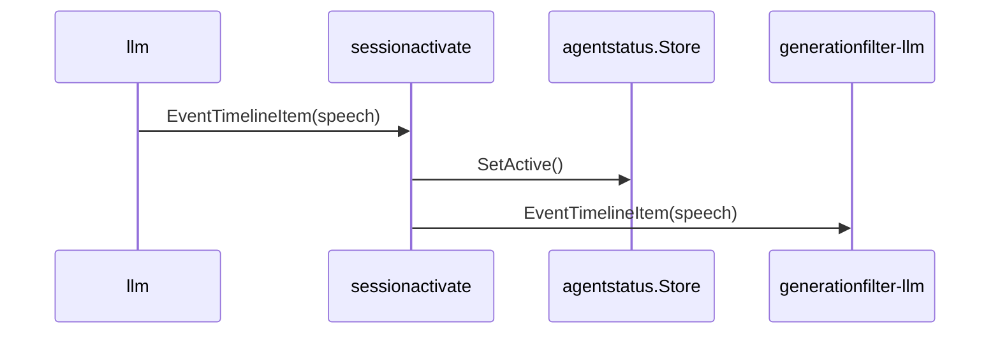
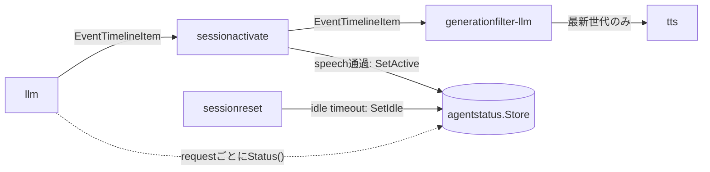

# sessionactivate 概要理解ドキュメント

## 1. ビジネスコンテキスト

- **解決する課題**: idle timeout 後の最初の LLM 応答が実際に speech を返した時点で、セッションが再び active になったことを明示的に保持する。
- **提供価値**: `llm` は `agentstatus.Store` を read only で参照し、`sessionactivate` は speech 通過時だけ `active` を write する。これにより、ひとりごと候補向けの無応答バイアスを、ユーザーへの応答が始まった後に解除できる。
- **対象範囲**: `llm` と `generationfilter-llm` の間で `EventTimelineItem` を通過させ、payload が `TimelineKindSpeech` の場合だけ `agentstatus.Store.SetActive()` を呼ぶ。
- **非対象**: `wait` / `tool` の実行、世代判定、TTS、会話履歴保存、UI 通知は扱わない。

根拠: `internal/components/sessionactivate/stage.go`、`internal/states/agentstatus/store.go`、`cmd/smart-speaker/main.go`

## 2. 論理構造・機能俯瞰

- **sessionactivate stage**
  - `internal/components/sessionactivate/stage.go` に実装される `graph.Stage`。
  - 入力 event は基本的に payload を変更せず downstream へ流す。
  - `EventTimelineItem` かつ payload が `types.TimelineItem` かつ `Kind == TimelineKindSpeech` の場合に、通過前に `agentstatus.Store.SetActive()` を呼ぶ。
- **agentstatus.Store**
  - `idle` / `active` の2値だけを保持する共有 Store。
  - 起動直後は `idle`。
  - `sessionreset` が idle timeout 時に `SetIdle()` を呼び、`sessionactivate` が speech 通過時に `SetActive()` を呼ぶ。
- **配置**
  - production graph では `llm -> sessionactivate -> generationfilter-llm -> tts` の順に接続される。
  - `sessionactivate` は `generationfilter-llm` より前にあるため、speech が LLM から出た時点で active 化する。古い世代の破棄はその後段の `generationfilter` が担当する。

## 3. 主要なデータフロー

### シナリオ: speech item 通過時に active 化する

1. `llm` が `EventTimelineItem` を出力する。
2. `sessionactivate` が payload を `types.TimelineItem` として読み取る。
3. `Kind == speech` の場合、`agentstatus.Store.SetActive()` を呼ぶ。
4. 元の event をそのまま `generationfilter-llm` へ流す。

### シナリオ: wait / tool は状態を変えずに通過する

1. `llm` が `wait` または `tool` の `EventTimelineItem` を出力する。
2. `sessionactivate` は speech ではないため `agentstatus` を更新しない。
3. event は payload を変えずに downstream へ流れる。

### シナリオ: 無応答時は active 化しない

1. `llm` が `{"items":[]}` を採用した場合、`EventTimelineItem` は発行されない。
2. `sessionactivate` には event が届かない。
3. `agentstatus` は `idle` のまま維持される。
4. 直後の user 発話も、`llm` 側では引き続き idle 状態として扱われる。

## 4. 詳細設計

### クラス設計

- `internal/components/sessionactivate/stage.go`
  - `Config`
    - `AgentStatus`: speech 通過時に active 化する `agentstatus.Store`。nil の場合は状態更新をスキップし、event 通過だけを行う。
  - `NewStage`
    - buffered channel を持つ `graph.Stage` を構築する。
  - `consume`
    - upstream から event を読み、`markActiveIfSpeech` を実行してから downstream へ同じ event を送る。
    - context cancel または upstream close で終了し、downstream を close する。
  - `markActiveIfSpeech`
    - `AgentStatus` が nil、event kind が `EventTimelineItem` ではない、payload が `types.TimelineItem` ではない、または kind が speech ではない場合は何もしない。
    - speech の場合のみ `SetActive()` を呼ぶ。
  - `close`
    - `sync.Once` で多重 close を避け、context cancel と upstream close を行う。

### graph 接続

### 注意点

- `sessionactivate` は `speech` の内容や generation id を見ない。状態更新の条件は timeline kind のみである。
- `wait` や `tool` だけの LLM 応答では active 化しない。
- `{"items":[]}` は event が発行されないため、active 化の契機にならない。
- `generationfilter-llm` より前段にあるため、古い世代の speech でも `SetActive()` は呼ばれる。現行構成では「LLM が speech を出した」ことをセッション活性化の契機として扱う設計である。
