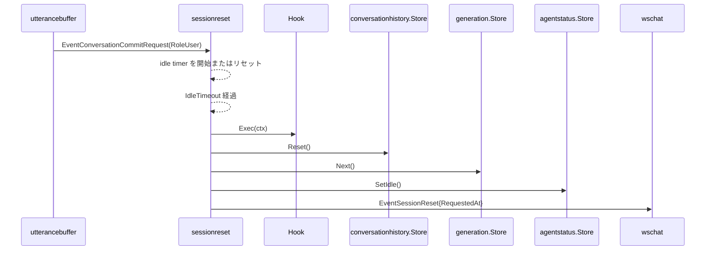
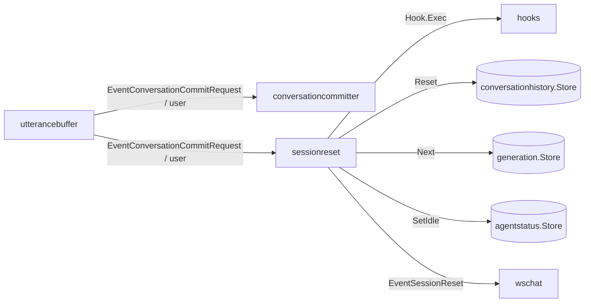

# sessionreset 概要理解ドキュメント

## 1. ビジネスコンテキスト

- **解決する課題**: 長時間 user 発話がないまま会話履歴が残り続けると、次の会話に古い文脈が混ざる。
- **提供価値**: 一定時間の無音後に会話履歴を空にし、世代idを前進させることで、次の会話を前回セッションから切り離す。
- **対象範囲**: user の `EventConversationCommitRequest` を活動として監視し、idle timeout 到達時に hook、会話履歴 reset、世代id前進、agent status の idle 化、UI向け reset 通知を実行する。
- **非対象**: `scheduler` や `utterancebuffer` の内部キューを明示的に破棄する処理は持たない。

根拠: `internal/components/sessionreset/stage.go`、`internal/app/config.go`、`cmd/smart-speaker/main.go`

## 2. 論理構造・機能俯瞰

- **sessionreset stage**
  - `internal/components/sessionreset/stage.go` に実装される `graph.Stage`。
  - 入力は `EventConversationCommitRequest` のうち payload が `types.ConversationCommitRequest` で、`Role` が `types.RoleUser` の event だけを活動として扱う。
  - idle timeout による reset 実行後、downstream へ `EventSessionReset` を流す。
- **idle timer**
  - `Config.IdleTimeout` が 0 以下なら無効化される。
  - user commit を受け取るたびに timer を開始またはリセットする。
  - timer 発火時に 1 回だけ `fireReset` を実行し、次の user commit まで再発火しない。
- **Hook**
  - `Exec(context.Context) error` を持つ interface。
  - `Config.Hooks` の登録順に同期実行される。
  - nil hook は無視する。error はログに出すが、後続 hook とリセット処理は継続する。
- **conversationhistory.Store / generation.Store / agentstatus.Store**
  - `conversationhistory.Store.Reset()` で会話履歴を空にする。
  - `generation.Store.Next()` で世代idを前進させ、reset 前の古い event が `generationfilter` を通らないようにする。
  - `agentstatus.Store.SetIdle()` で、次の LLM request を長時間無音後の発話として扱える状態に戻す。
- **SessionResetEvent**
  - `types.SessionResetEvent` は reset 要求時刻 `RequestedAt` を持つ。
  - `wschat` は `EventSessionReset` を WebSocket の `session_reset` message に変換する。

## 3. 主要なデータフロー

### シナリオ: user 発話後に idle timeout でリセットする

1. `utterancebuffer` が user 発話を `EventConversationCommitRequest` として出力する。
2. `sessionreset` は同じ event を横付けで受け取り、user commit であることを確認する。
3. `IdleTimeout` が正値なら timer を開始する。すでに timer があれば停止して張り直す。
4. timeout 前に次の user commit が来なければ timer が発火する。
5. `fireReset` が現在時刻をログ用に取得する。
6. hook を登録順に `Exec(ctx)` で実行する。
7. `conversationhistory.Store.Reset()` を呼ぶ。
8. `generation.Store.Next()` を呼ぶ。
9. `agentstatus.Store.SetIdle()` を呼ぶ。
10. `SessionResetEvent{RequestedAt}` を payload にした `EventSessionReset` を downstream へ流す。

### シナリオ: user 以外の commit request は無視する

1. `router` や `toolcaller` 経由で agent / tool_call / tool_result の `EventConversationCommitRequest` が流れる。
2. `sessionreset.isUserCommitRequest` は `RoleUser` ではないため false を返す。
3. idle timer は開始もリセットもされない。

## 4. 詳細設計

### クラス設計

- `internal/components/sessionreset/stage.go`
  - `Config`
    - `IdleTimeout`: user 発話後に reset を実行するまでの待機時間。
    - `History`: reset 対象の `conversationhistory.Store`。
    - `Generation`: reset 時に前進させる `generation.Store`。
    - `AgentStatus`: reset 時に idle 化する `agentstatus.Store`。
    - `Hooks`: reset 前に同期実行する hook 一覧。
    - `Now`: ログとテスト用の現在時刻取得関数。未指定なら `time.Now`。
  - `Hook`
    - `Exec(context.Context) error` を持つ。
  - `NewStage`
    - `Config` から `graph.Stage` を構築する。
    - hooks は slice copy して保持する。
  - `consume`
    - upstream から event を読み、user commit の場合だけ timer を開始または再設定する。
    - context cancel または upstream close で終了し、downstream を close する。
  - `fireReset`
    - reset 時刻をログ出力し、hook、history reset、generation next、agent status idle 化を順に実行する。
    - `types.SessionResetEvent{RequestedAt}` を返す。
  - `close`
    - `sync.Once` で多重 close を避け、context cancel と upstream close を行う。

### graph 接続

production graph では `utterancebuffer -> sessionreset` に `EventConversationCommitRequest` を接続し、`sessionreset -> wschat` に `EventSessionReset` を接続する。
`utterancebuffer -> conversationcommitter` の主経路は維持され、`sessionreset` は横付けで監視とリセット副作用、UI向け reset 通知を担当する。

### 設定

- `CONVERSATION_IDLE_TIMEOUT_SECONDS`
  - 秒数で指定する。
  - 未設定時は 600 秒。
  - `0` は idle reset 無効。
  - 不正値または負値は 600 秒として扱う。

### 注意点

- reset 専用の `types.EventKind` として `EventSessionReset`、payload 型として `types.SessionResetEvent` が存在する。
- hook に reset 時刻などの payload は渡されない。reset 時刻はログと `SessionResetEvent.RequestedAt` に使われる。
- `History`、`Generation`、`AgentStatus` が nil の場合、それぞれの処理はスキップされる。
- hook が時間のかかる処理をすると、`sessionreset` の reset 処理全体もその分だけ待つ。
- reset 時には `sessionreset: agent status set requested_at=... status=idle` のログも出る。
