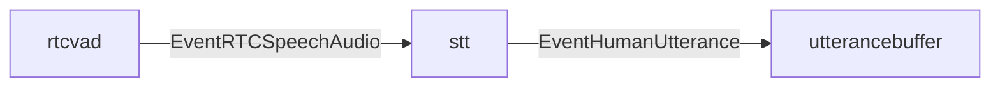

# stt component

`stt` は server-side Speech-to-Text を担当する component。
`rtcvad` が検出した発話区間の PCM audio を Google Speech-to-Text v2 の streaming recognition に送り、final transcript だけを会話 pipeline へ渡す。

## 責務

- `EventRTCSpeechAudio` の start で `StreamingRecognize` を開始する。
- start 時に prebuffer を STT stream へ送る。
- audio event の PCM を 25,600 bytes 単位に分割して STT stream へ送る。
- end event で STT stream の `CloseSend` を予約する。
- final transcript を `EventHumanUtterance` として `utterancebuffer` へ出す。
- Speech project、recognizer、language、credentials、phrases の設定を所有する。

## 主な event

- 入力: `EventRTCSpeechAudio`
- 出力: `EventHumanUtterance`

## 接続

