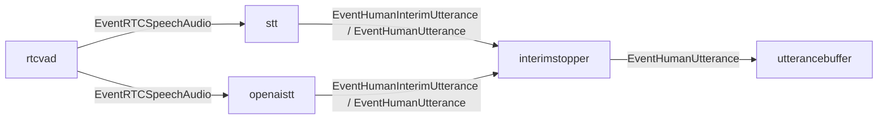

# stt component

`stt` は server-side Speech-to-Text を担当する Google Speech-to-Text component。
`rtcvad` が検出した発話区間の PCM audio を Google Speech-to-Text v2 の streaming recognition に送り、interim transcript と final transcript を会話 pipeline へ渡す。

STT provider は `STT_PROVIDER` で切り替える。未指定または `google` の場合はこの `stt` component を使い、`openai` の場合は OpenAI Realtime transcription 用の `openaistt` component を graph 上の同じ位置に接続する。

## 責務

- `EventRTCSpeechAudio` の start で `StreamingRecognize` を開始する。
- start 時に prebuffer を STT stream へ送る。
- audio event の PCM を 25,600 bytes 単位に分割して STT stream へ送る。
- end event で STT stream の `CloseSend` を予約する。
- streaming recognition では `InterimResults` を有効化する。
- interim transcript を `EventHumanInterimUtterance` として `interimstopper` へ出す。
- final transcript を `EventHumanUtterance` として `interimstopper` へ出す。
- Speech project、recognizer、language、credentials、phrases の設定を所有する。

## provider 切り替え

- `STT_PROVIDER=google` または未指定
  - `internal/components/stt` を使う。
  - `GOOGLE_CLOUD_PROJECT`、`GOOGLE_SPEECH_RECOGNIZER`、`GOOGLE_SPEECH_LANGUAGE`、`GOOGLE_APPLICATION_CREDENTIALS_JSON`、`stt_phrases.txt` を既存どおり使う。
- `STT_PROVIDER=openai`
  - `internal/components/openaistt` を使う。
  - `OPENAI_API_KEY` で OpenAI Realtime API に WebSocket 接続する。
  - `OPENAI_STT_MODEL` 未指定時は `gpt-realtime-whisper` を使う。
  - `stt_phrases.txt` は OpenAI transcription の `keywords` として渡す。
  - OpenAI Realtime transcription 向けに 24 kHz mono PCM16 へ正規化し、turn detection は使わず既存 `rtcvad` の start/end で発話単位を commit する。

## 主な event

- 入力: `EventRTCSpeechAudio`
- 出力: `EventHumanInterimUtterance`、`EventHumanUtterance`

## 接続

