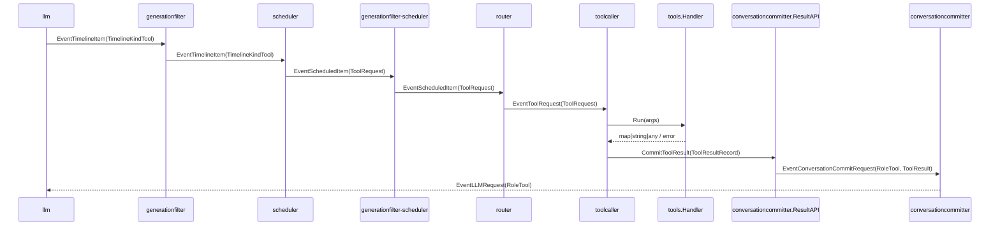
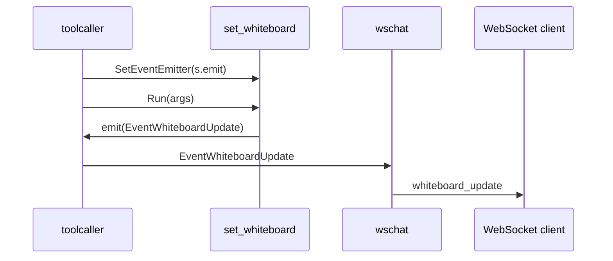

# toolcaller 概要理解ドキュメント

## 1. ビジネスコンテキスト

- **解決する課題**: LLM が生成した `tool` item を、会話生成パイプライン内で local tool 実行へ橋渡しする。
- **提供価値**: tool 実行結果を会話履歴へ戻し、必要に応じて LLM の次の推論へつなげる。UI 副作用を持つ tool は、tool result とは別に graph event として下流へ通知できる。
- **責務の境界**: `toolcaller` は tool の実行と結果 commit API 呼び出しを担う。tool request の生成は `scheduler` / `router`、結果の履歴保存と LLM 再投入は `conversationcommitter` の責務。
- **通常起動での handler 登録**: `cmd/smart-speaker/main.go` は `buildToolRegistry` で local tool registry を構築し、`registry.Handlers()` を `toolcaller.NewStage(toolHandlers, resultCommitter)` に渡す。これにより通常 pipeline でも登録済み local tool が実行対象になる。
- **根拠コード**: `internal/components/toolcaller/toolcaller.go`、`cmd/smart-speaker/main.go`、`internal/tools/registry/registry.go`、`internal/types/event.go`、`internal/types/conversation_record.go`、`internal/components/conversationcommitter/tool_result_api.go`。

## 2. 論理構造・機能俯瞰

**主要なモデル・コンポーネント**

- **`toolcaller.NewStage`**
  - `handlers map[string]tools.Handler` と `ToolResultCommitter` を受け取り、graph stage を作る。
  - `handlers == nil` の場合は空 map に正規化する。
  - stage の `Upstream` / `Downstream` はどちらも `graph.DefaultChannelBufferSize` の channel。

- **`toolCaller`**
  - `EventToolRequest` を購読し、payload が `types.ToolRequest` の場合だけ処理する。
  - `EventToolRequest` 以外の event は無視する。
  - tool 実行は `dispatchTool` で goroutine 化され、複数 request を並行実行できる。
  - stage close 時は context cancel 後、受信 goroutine と実行中 task の終了を待ってから `downstream` を close する。

- **`tools.Handler`**
  - `Name() string` と `Run(args map[string]any) (map[string]any, error)` を持つ local tool の実体。
  - `toolcaller` は `ToolRequest.Name` を key に `tools.Handler` を検索する。
  - handler が存在しない場合も失敗 event は出さず、`{"error":"unknown function: <name>"}` を tool result として commit する。

- **`tools.ContextAware`**
  - handler が実装している場合、`toolcaller.run` の開始時に `SetContext(ctx)` で stage context を渡す。
  - どの tool が実装しているかは、今回確認した範囲では不明。

- **`tools.EventEmitterAware`**
  - handler が実装している場合、`SetEventEmitter(s.emit)` で downstream event emitter を渡す。
  - 確認できる実装例は `internal/tools/functions/whiteboard/tool.go` の `set_whiteboard`。`Run` 内で `EventWhiteboardUpdate` を emit する。

- **`types.ToolRequest`**
  - `EventToolRequest` の payload。
  - フィールドは `ResponseID`、`ToolCallID`、`Name`、`Arguments`、`GenerationID`、`SequenceID`。
  - `scheduler` は `TimelineKindTool` から `ToolRequest` を作る。このとき `ToolCallID` と `SequenceID` には timeline の `SequenceID` が入る。

- **`types.ToolResultRecord`**
  - tool 実行結果を履歴へ保存するための payload。
  - `toolcaller` が設定するのは `ToolCallID`、`Name`、`Output`、`GenerationID`。
  - `CurrentGenerationID` と `Stale` は `conversationcommitter.ResultAPI.CommitToolResult` 側で generation store がある場合に設定される。

- **`ToolResultCommitter`**
  - `toolcaller` 側で定義される interface。
  - 実装として確認できるのは `conversationcommitter.ResultAPI`。
  - `CommitToolResult(context.Context, types.ToolResultRecord) error` により、tool result を `EventConversationCommitRequest` として `conversationcommitter` の upstream に戻す。

## 3. 主要なデータフロー

### シナリオ: LLM の tool item が local tool 実行結果として会話履歴へ戻るまで

1. LLM が tool timeline item を出力する: `llm` は `TimelineKindTool` の `types.TimelineItem` を graph に流す。
2. 世代 filter を通過する: `generationfilter` は `TimelineItem.GenerationID` が現在世代である場合だけ通す。
3. scheduler が実行要求へ変換する: `scheduler` は `TimelineKindTool` を `types.ToolRequest` に変換し、`EventScheduledItem` として出力する。
4. router が toolcaller へ振り分ける: `router` は `EventScheduledItem` の payload が `types.ToolRequest` の場合、同じ payload を `EventToolRequest` として出力する。
5. toolcaller が request を受け取る: `toolcaller` は `EventToolRequest` だけを処理し、payload が `types.ToolRequest` でなければ log 出力して無視する。
6. 引数を decode する: `ToolRequest.Arguments` が空でなければ JSON object として `map[string]any` へ unmarshal する。失敗した場合は log を出し、空 map で処理を続ける。
7. handler を実行する: `ToolRequest.Name` に対応する handler があれば `Run(args)` を呼ぶ。未登録の場合は unknown function error、handler error の場合は error 文字列を map に入れる。
8. 結果を JSON 化する: `map[string]any` を `json.Marshal` し、失敗した場合は `{"error":"result encoding failed"}` に置き換える。
9. tool result を commit する: `types.ToolResultRecord` を作り、`ToolResultCommitter.CommitToolResult` を呼ぶ。committer が nil の場合は log を出して終了し、downstream event は出さない。
10. conversationcommitter が保存要求へ変換する: `ResultAPI.CommitToolResult` は `types.ConversationCommitRequest{Role: RoleTool, ToolResult: &result}` を作り、`EventConversationCommitRequest` として committer stage の upstream へ送る。
11. 会話履歴へ保存される: `conversationcommitter` は `conversationhistory.NewRecord` を経由して tool result を履歴化し、trim 後の text が空でなければ `EventLLMRequest` を `Role: "tool"` で発行する。

### シナリオ: EventEmitterAware tool が UI 副作用 event を出す場合

1. `toolcaller.run` は handler 初期化時、`tools.EventEmitterAware` を実装している tool に `s.emit` を渡す。
2. tool の `Run` 内で event が emit される。確認できる例では `set_whiteboard` が `EventWhiteboardUpdate` を出す。
3. `toolcaller.emit` は stage context がキャンセルされていなければ `toolcaller.Downstream` へ event を送る。
4. 通常 graph では `cmd/smart-speaker/main.go` により `toolcaller` から `wschat` へ `EventWhiteboardUpdate` だけが接続される。
5. `wschat` は `EventWhiteboardUpdate` を websocket message `{ "type": "whiteboard_update", "content": ... }` として接続 client に送る。
6. この UI 副作用 event は tool result commit とは別経路であり、`ToolResultRecord.Output` の代替ではない。

## 4. 詳細設計

### クラス設計

- internal/
  - components/
    - toolcaller/
      - toolcaller.go: `EventToolRequest` を受けて local tool handler を実行し、結果を `ToolResultCommitter` に渡す stage。
        - `NewStage`: handler map と committer から graph stage を生成する。nil handler map は空 map にする。
        - `run`: stage context を作り、`ContextAware` / `EventEmitterAware` handler へ依存を注入したうえで upstream を購読する。
        - `dispatchTool`: 1 request ごとに goroutine を起動し、tool 実行と result commit を行う。
        - `executeTool`: JSON 引数 decode、handler lookup、handler 実行、error 正規化、結果 JSON encode、`ToolResultRecord` 生成を行う。
        - `close`: context cancel、受信 goroutine 待機、upstream close を行う。
        - `emit`: `EventEmitterAware` tool から受けた event を context cancel を尊重して downstream へ流す。
      - toolcaller_test.go: 未登録 tool が空 output ではない `ToolResultRecord` として commit され、downstream event が出ないことを検証する。
  - types/
    - event.go: graph event と `EventToolRequest`、`ToolRequest` を定義する。
    - conversation_record.go: `ToolResultRecord` と `ConversationCommitRequest` を定義する。
  - components/
    - scheduler/
      - stage.go: `TimelineKindTool` を `ToolRequest` に変換し、`EventScheduledItem` として出す。
    - router/
      - stage.go: `EventScheduledItem` の payload が `ToolRequest` の場合、`EventToolRequest` として `toolcaller` へ渡す。
    - conversationcommitter/
      - tool_result_api.go: `ToolResultRecord` を `ConversationCommitRequest` に包み、`EventConversationCommitRequest` として committer stage に投入する。
      - committer.go: tool result を履歴保存し、空でない場合は `EventLLMRequest` を発行する。
    - wschat/
      - wschat.go: `EventWhiteboardUpdate` を websocket の `whiteboard_update` message に変換する。
  - tools/
    - interfaces.go: `Handler`、`ContextAware`、`EventEmitterAware`、`DefinitionProvider` を定義する。
    - registry/
      - registry.go: tool definitions と handler map を構築する。通常起動では `cmd/smart-speaker/main.go` の `buildToolRegistry` 経由で `llm` と `toolcaller` に接続される。
    - functions/
      - whiteboard/
        - tool.go: `EventEmitterAware` の確認済み実装。`set_whiteboard` 実行時に `EventWhiteboardUpdate` を emit する。
- cmd/
  - smart-speaker/
    - main.go: 通常 pipeline の stage 生成と graph 接続を定義する。`toolcaller.NewStage(toolHandlers, resultCommitter)` に registry 由来の handler map を渡す。`router -> toolcaller` は `EventToolRequest`、`toolcaller -> wschat` は `EventWhiteboardUpdate` で接続する。

### Event 設計

- **入力 event: `EventToolRequest`**
  - payload: `types.ToolRequest`
  - 生成元: `router`
  - `toolcaller` での扱い: payload 型が違う場合は log 出力して無視する。

- **副作用 event: `EventWhiteboardUpdate`**
  - payload: `types.WhiteboardUpdate`
  - 生成元: `EventEmitterAware` tool の一例である `set_whiteboard`
  - graph 接続: 通常 pipeline では `toolcaller -> wschat`
  - 注意: tool 実行結果を表す event ではなく、UI 更新用の別経路 event。

- **commit 用 event: `EventConversationCommitRequest`**
  - `toolcaller` の downstream からは出ない。
  - `ToolResultCommitter` 実装である `conversationcommitter.ResultAPI` が、committer stage の upstream へ直接投入する。

- **再推論 event: `EventLLMRequest`**
  - `toolcaller` は直接出さない。
  - `conversationcommitter` が tool result を履歴保存した後、trim 済み text が空でなければ発行する。

### Handler 登録設計

- `toolcaller.NewStage` の第 1 引数が実行可能な handler map である。
- map key は `ToolRequest.Name` と照合される。`registry.Handlers()` は `handler.Name()` を key にした map を返す。
- registry で handler が nil の entry は handler map に含まれない。
- `web_search` は今回の実装では registry definition からも除外されているため、LLM に提示されず handler map にも入らない。
- 通常起動では `cmd/smart-speaker/main.go` の `buildToolRegistry` が registry を作り、`registry.Definitions()` を `llm.Config.ToolSchemas` に、`registry.Handlers()` を `toolcaller.NewStage` に渡す。
- SwitchBot tool は `SWITCHBOT_TOKEN` と `SWITCHBOT_SECRET` が揃う場合だけ登録される。scene 一覧取得に失敗した場合は `switchbot_execute_scene` のみ未登録になり、Hub 2 tool は token/secret が揃っていれば残る。

### エラー処理・副作用

- 引数 JSON decode error: log 出力し、空 map で handler 実行を継続する。
- unknown tool: `{"error":"unknown function: <name>"}` を `ToolResultRecord.Output` に入れる。
- handler error: `{"error":"<err.Error()>"}` を `ToolResultRecord.Output` に入れる。
- result JSON encode error: `{"error":"result encoding failed"}` を `ToolResultRecord.Output` に入れる。
- committer nil: log 出力のみで終了する。tool result は保存されず、downstream event も出ない。
- `CommitToolResult` error: stage context が cancel 済みでなければ log 出力する。
- `ResultAPI.CommitToolResult` の副作用: generation store がある場合、`CurrentGenerationID` と `Stale` を設定し、`EventConversationCommitRequest` を committer stage に投入する。
- `conversationcommitter` 側の副作用: tool result は会話履歴に保存され、空でなければ `EventLLMRequest` として LLM に戻る。

### テーブル設計

該当なし。確認した実装範囲では、`toolcaller` が直接参照・更新する DB テーブルはない。

### API設計

外部 HTTP API は該当なし。内部 API として `ToolResultCommitter.CommitToolResult(ctx, result)` を使う。

- `CommitToolResult(ctx, result)`: tool 実行結果を会話履歴 commit request に変換して `conversationcommitter` に戻す。
  - 入力: `types.ToolResultRecord{ToolCallID, Name, Output, GenerationID}`
  - 内部生成: `types.ConversationCommitRequest{Role: types.RoleTool, GenerationID: result.GenerationID, Source: result.Name, ToolResult: &result}`
  - 成功時: `EventConversationCommitRequest` を committer stage の upstream に送信する。
  - context canceled 時: `ctx.Err()` を返す。
