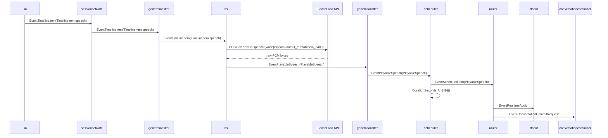
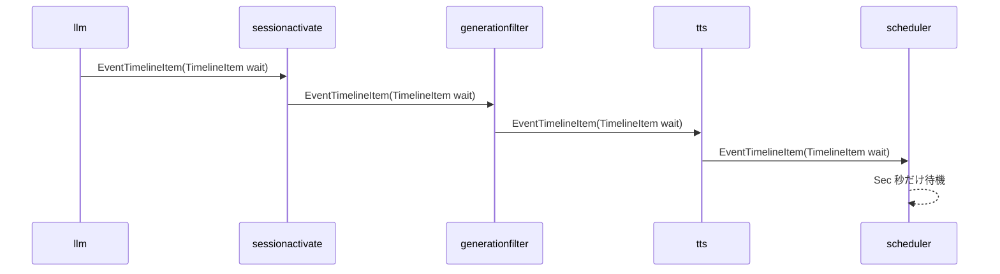
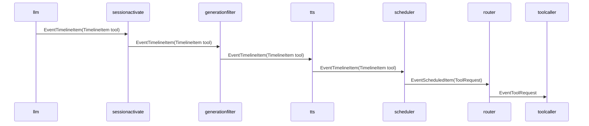

# tts 概要理解ドキュメント

## 1. ビジネスコンテキスト

* **解決する課題**: LLM が生成した会話 timeline の `speech` item を、スマートスピーカーで再生できる音声データへ変換する。
* **提供価値**: LLM の応答をテキスト表示ではなく音声としてユーザーへ届けつつ、`wait` や `tool` を含む timeline の順序を後段の `scheduler` へ渡せる。
* **会話体験上の責務**: `speech` の音声化に加えて、音声の推定再生時間を `DurationSeconds` として付与する。後段の `scheduler` はこの値を使い、次の item へ進むタイミングを制御する。
* **外部依存**: 音声合成は ElevenLabs API に依存する。API key と voice id は必須で、未設定の場合は stage 初期化時にエラーになる。
* **対象外**: `tts` は `tool` を実行しない。`wait` の待機もしない。音声再生、会話履歴保存、tool 実行への振り分けも後段の責務である。

## 2. 論理構造・機能俯瞰

**主要なモデル・コンポーネント**

- **`tts.NewStage`**
  - ElevenLabs 用の `streamTTS` を `graph.Stage` として構築する。
  - `Config.APIKey` と `Config.Voice` が空の場合はエラーを返す。
  - `Config.Model` が空の場合は `eleven_v3` を使う。

- **`streamTTS`**
  - `EventTimelineItem` だけを処理対象にする。
  - payload が `types.TimelineItem` でない event は捨てる。
  - `TimelineKindSpeech` 以外、つまり `wait` と `tool` は変換せず、そのまま下流へ送る。
  - 空白だけの `speech.Text` は ElevenLabs に送らず、下流にも送らない。

- **`types.TimelineItem`**
  - LLM が出力した順序付き item を表す。
  - `Kind` は `speech`、`wait`、`tool` のいずれか。
  - `speech` では `Text`、`wait` では `Sec`、`tool` では `ToolName` と `ToolArgs` が使われる。

- **`types.PlayableSpeech`**
  - TTS 済みの `speech` item を表す。
  - `GenerationID`、`SequenceID`、`Text`、base64 化された PCM 音声 `Audio`、推定再生時間 `DurationSeconds`、元の `TimelineItem` を持つ。

- **関連 event**
  - `EventTimelineItem`: LLM から `tts` へ入力される timeline item。`tts` は `wait` / `tool` の場合、この event のまま出力する。
  - `EventPlayableSpeech`: `speech` を ElevenLabs で音声化した後に `tts` が出力する event。
  - `EventScheduledItem`: 後段の `scheduler` が `EventPlayableSpeech` や `tool` item を実行タイミング付きで出力する event。
  - `EventRealtimeAudio`: 後段の `router` が `PlayableSpeech.Audio` から生成し、RTC 音声再生へ渡す event。
  - `EventConversationCommitRequest`: 後段の `router` が `PlayableSpeech.Text` から生成し、agent 発話として会話履歴保存へ渡す event。
  - `EventTTSEnd`: 型定義は存在するが、現行コード上で `tts` から発行されている箇所は確認できない。

## 3. 主要なデータフロー

### シナリオ: `speech` item が音声化され、再生可能な event になるまで

1. **LLM が timeline item を発行する**: `llm` は Structured Outputs の JSON timeline を検証し、`types.TimelineItem{Kind: "speech"}` として `EventTimelineItem` を出力する。
2. **sessionactivate と generationfilter を通過する**: `sessionactivate` が `speech` 通過時に `agentstatus.Store` を `active` に更新し、その後に最新世代の `EventTimelineItem` だけが `tts` に届く。
3. **tts が speech を判定する**: `tts` は event kind が `EventTimelineItem` で、payload が `types.TimelineItem` であり、`Kind` が `speech` であることを確認する。
4. **ElevenLabs を呼び出す**: `tts` は `POST https://api.elevenlabs.io/v1/text-to-speech/{voice}/stream?output_format=pcm_24000` を呼ぶ。リクエスト body は `text`、`model_id`、`language_code: "ja"`、必要に応じて `voice_settings` を含む。
5. **音声 duration を算出する**: レスポンス body の raw PCM byte 数を `24000 sample/sec * 2 bytes/sample * 1 channel` で割った実音声秒数に、再生後の間を作るための 0.5 秒を加算する。
6. **PlayableSpeech を出力する**: raw PCM を base64 encode し、`GenerationID`、`SequenceID`、`Text`、`DurationSeconds`、`OriginalTimeline` とともに `EventPlayableSpeech` として下流へ送る。
7. **後段が再生順序を制御する**: `scheduler` は `EventPlayableSpeech` を `EventScheduledItem` として出力し、その後 `DurationSeconds` だけ待つ。
8. **router が音声再生と履歴保存へ分配する**: `router` は `PlayableSpeech` から `EventRealtimeAudio` と `EventConversationCommitRequest` を順に出力する。

### シナリオ: `wait` item が順序維持のために通過する

1. **LLM が wait を発行する**: `llm` は `{"type":"wait","sec":...}` を `TimelineItem{Kind: "wait", Sec: ...}` として出力する。
2. **tts が透過する**: `tts` は `Kind` が `speech` ではないため、元の `EventTimelineItem` をそのまま下流へ送る。
3. **scheduler が待機する**: `scheduler` は `TimelineKindWait` を受け取ると `Sec` 秒だけ待ち、`wait` 自体は `EventScheduledItem` としては出力しない。

### シナリオ: `tool` item が音声の後に実行されるまで

1. **LLM が tool item を発行する**: `llm` の timeline 契約では1応答内に複数の tool item を出せる。get 系 tool は末尾配置、tool 前の speech は最小限と system prompt で案内する。
2. **tts が透過する**: `tts` は `tool` item を音声化せず、元の `EventTimelineItem` のまま下流へ送る。
3. **scheduler が ToolRequest に変換する**: `scheduler` は `TimelineKindTool` を受け取ると `types.ToolRequest` を作り、`EventScheduledItem` として出力する。
4. **router が toolcaller へ渡す**: `router` は `ToolRequest` を `EventToolRequest` として出力する。
5. **順序が保たれる**: 直前に `speech` がある場合、`scheduler` はその `DurationSeconds` だけ待ってから後続の `tool` を処理する。

## 4. 詳細設計

### クラス設計

- internal/
  - components/
    - tts/
      - elevenlabs.go: ElevenLabs を使った TTS stage の実装。
        - `NewStage`: 設定を検証し、`graph.Stage` を生成する。API key と voice id は必須。model 未指定時は `eleven_v3`。
        - `(*streamTTS).run`: upstream から event を読み、`EventTimelineItem` のうち `speech` だけを音声化する。`wait` / `tool` はそのまま emit する。
        - `(*streamTTS).emit`: context cancellation を見ながら downstream へ event を送る。
        - `(*streamTTS).handleSpeech`: `synthesize` の結果から `types.PlayableSpeech` を組み立て、`EventPlayableSpeech` を出力する。
        - `(*streamTTS).synthesize`: ElevenLabs API を呼び、raw PCM を base64 化し、byte 数から duration を算出する。
        - `(*streamTTS).close`: upstream channel を一度だけ close する。
        - `(*streamTTS).buildVoiceSettings`: voice settings のデフォルト値と設定値を合成し、API payload 用の map を作る。
        - `ttsDurationSeconds`: PCM byte 数から秒数を算出し、0.5 秒の再生後 padding を加算する。0 byte 以下は 0 秒。
        - `normalizeStability`: `eleven_v3` 系 model の stability を `0`、`0.5`、`1` のいずれかへ丸める。
      - elevenlabs_test.go: duration 算出と `eleven_v3` の stability 丸めを検証する。
        - `TestTTSDurationSeconds`: 24000Hz、16bit、mono の1秒分 byte 数が 1.5 秒になることを検証する。
        - `TestTTSDurationSecondsReturnsZeroForEmptyAudio`: 0 byte の音声は padding を加算せず 0 秒になることを検証する。
        - `TestNormalizeStabilityForV3`: `eleven_v3` で `0.6` が `0.5` に丸められることを検証する。

- internal/
  - types/
    - timeline_item.go: `TimelineItem` と `PlayableSpeech` を定義する。
      - `TimelineItem`: LLM が出力する `speech` / `wait` / `tool` item。
      - `PlayableSpeech`: TTS 済み speech。音声、本文、世代、sequence、duration、元 timeline を保持する。
    - event.go: event kind と `ToolRequest` を定義する。
      - `EventTimelineItem`: `tts` の入力、および `wait` / `tool` 透過時の出力。
      - `EventPlayableSpeech`: `tts` が speech 音声化後に出力する event。
      - `EventTTSEnd`: 定義はあるが、現行実装での発行元は不明。
    - types.go: `OutputAudio`、`TTSEvent` などの関連 payload を定義する。
      - `OutputAudio`: 後段の `router` が `PlayableSpeech` から生成する音声再生用 payload。
      - `TTSEvent`: TTS ストリーム完了を表す型だが、現行実装での使用箇所は確認できない。

- internal/
  - components/
    - scheduler/
      - stage.go: `PlayableSpeech` と `TimelineItem` を世代ごとに順序処理する。
        - `handle`: `PlayableSpeech` を `EventScheduledItem` として出力して `DurationSeconds` 待つ。`wait` は `Sec` 秒待つ。`tool` は `ToolRequest` に変換する。
        - `wait`: 秒数が正の場合だけ timer で待つ。

- internal/
  - components/
    - router/
      - stage.go: scheduled item を再生、履歴保存、tool 実行へ分配する。
        - `route`: `PlayableSpeech` を `EventRealtimeAudio` と `EventConversationCommitRequest` に変換し、`ToolRequest` を `EventToolRequest` に変換する。

### ElevenLabs 呼び出し設計

- **URL**: `https://api.elevenlabs.io/v1/text-to-speech/{voice}/stream?output_format=pcm_24000`
- **HTTP method**: `POST`
- **headers**
  - `Content-Type: application/json`
  - `xi-api-key: {Config.APIKey}`
- **request body**
  - `text`: `TimelineItem.Text`
  - `model_id`: `Config.Model`
  - `language_code`: 固定で `ja`
  - `voice_settings`: `buildVoiceSettings` の結果
- **response**
  - 300 番台以上の status の場合、body を読んで `"{status}: {body}"` 形式の error にする。
  - 成功時は response body 全体を raw PCM byte として読み込む。
  - raw PCM は base64 encode され、`PlayableSpeech.Audio` に入る。

### Voice Settings

- デフォルト値は `stability: 1.0`、`similarity_boost: 0.8`、`speed: 1.2`、`use_speaker_boost: true`。
- `Config.VoiceSettings` が指定されている場合、ゼロ値ではないフィールドだけデフォルトを上書きする。
- `Style` は 0 でない場合だけ `voice_settings.style` に含める。
- `Speed` は 0 でない場合だけ `voice_settings.speed` に含める。
- `UseSpeakerBoost` は nil でない場合だけ設定値を使う。デフォルトでは true が入る。
- `model_id` が `eleven_v3` で始まる場合、`stability` は `0`、`0.5`、`1` の三値に正規化される。閾値は `0.25` 未満が `0`、`0.75` 未満が `0.5`、それ以上が `1`。

### Duration 算出

- ElevenLabs の出力形式は URL query で `pcm_24000` に固定されている。
- 実装上の前提は `sample rate = 24000`、`bytes per sample = 2`、`channels = 1`。
- 算出式は `duration_seconds = raw_pcm_bytes / (24000 * 2 * 1) + 0.5`。
- raw byte 数が 0 以下の場合は 0 秒。
- この duration は `tts` 内では待機に使われず、後段の `scheduler` が `PlayableSpeech.DurationSeconds` として参照する。

### エラー・破棄条件

- `NewStage` は API key が空なら `elevenlabs: API key is required`、voice id が空なら `elevenlabs: voice id is required` を返す。
- `run` は `EventTimelineItem` 以外の event を無視する。
- payload が `types.TimelineItem` でない場合も無視する。
- `speech.Text` が空白だけの場合は ElevenLabs を呼ばず、下流にも event を出さない。
- ElevenLabs 呼び出し、response body 読み込み、JSON marshal、request 作成でエラーになった場合は、context cancellation でなければログに出し、その speech は下流へ出さない。
- `wait` / `tool` の透過時に downstream が詰まった場合のリトライや永続化は実装されていない。context cancellation または channel 送信のどちらかを待つ。

### 接続設計

- 本番起動時は `cmd/smart-speaker/main.go` で `tts.NewStage` が呼ばれ、`ELEVENLABS_API_KEY`、`ELEVENLABS_VOICE_ID`、`ELEVENLABS_MODEL_ID` 由来の設定が渡される。
- graph 接続は `llm -> generationfilter -> tts -> generationfilter -> scheduler` の順。
- `tts` の出力として graph が下流へ接続する event kind は `EventTimelineItem` と `EventPlayableSpeech`。

### 不明点

- `EventTTSEnd` と `types.TTSEvent` は定義されているが、現行コードで `tts` が発行している箇所は確認できない。
- `PlayableSpeech.OriginalTimeline` は `tts` で設定されるが、確認した `scheduler` と `router` では参照されていない。将来用途や設計意図はコード上のコメントからは不明。
- ElevenLabs API の外部仕様そのものは本ドキュメントでは検証していない。URL、payload、PCM 前提は現行実装に基づく。

## 参照元

- [internal/components/tts/elevenlabs.go](/internal/components/tts/elevenlabs.go)
- [internal/components/tts/elevenlabs_test.go](/internal/components/tts/elevenlabs_test.go)
- [internal/types/timeline_item.go](/internal/types/timeline_item.go)
- [internal/types/event.go](/internal/types/event.go)
- [internal/types/types.go](/internal/types/types.go)
- [internal/components/llm/contract.go](/internal/components/llm/contract.go)
- [internal/components/scheduler/stage.go](/internal/components/scheduler/stage.go)
- [internal/components/router/stage.go](/internal/components/router/stage.go)
- [cmd/smart-speaker/main.go](/cmd/smart-speaker/main.go)
