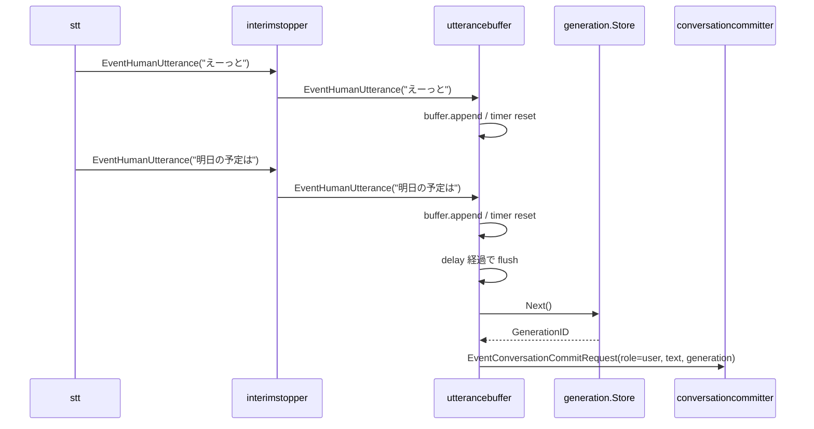

# utterancebuffer 概要理解ドキュメント

## 1. ビジネスコンテキスト

- **解決する課題**: STT の final transcript が短い文字起こし断片として連続して届く場合に、それぞれを個別のユーザー発話として LLM に渡すと会話の単位が細かくなりすぎる。
- **利用者**: 音声入力を受け取る会話 pipeline と、その下流で user 発話を保存・推論する `conversationcommitter` / `llm`。
- **提供価値**: 一定時間入力が途切れた時点で複数の文字起こし断片を 1 つの確定発話にまとめ、会話履歴と LLM request の単位を揃える。

## 2. 論理構造・機能俯瞰

- **stage**
  - `internal/components/utterancebuffer/stage.go` で `graph.Stage` として実装されている。
  - 入力は `interimstopper` を通過した `types.EventHumanUtterance` のみを処理対象にする。
  - 出力は `types.EventConversationCommitRequest` で、`RoleUser`、結合済みテキスト、採番した `GenerationID`、`Source: "stt"` を持つ。
- **buffer**
  - `internal/components/utterancebuffer/buffer.go` で文字列断片の追加・結合・リセットを担当する。
  - 各断片は `strings.TrimSpace` で前後空白を落としてから保持する。
  - 複数断片は半角スペース区切りで結合される。
- **generation.Store**
  - `Config.Generation` として渡される共有 store。
  - flush 時に `Next()` を呼び、新しい確定発話ごとに世代 id を進める。
- **delay**
  - `Config.Delay` が 0 以下の場合は `500ms` が既定値になる。
  - 新しい `EventHumanUtterance` を受け取るたびに timer をリセットする。

## 3. 主要なデータフロー

### シナリオ: 断片的な STT final transcript を 1 つの確定発話にまとめる

1. `stt` から `interimstopper` を経由して、final transcript の `EventHumanUtterance` が届く。
2. `stage.consume` が payload を `types.OutputLine` として取り出し、空文字でなければ `buffer.append` に渡す。
3. `buffer.append` は前後空白を除いたテキストを `parts` に追加する。
4. 新しい断片が届くたびに timer を `Config.Delay` にリセットする。
5. timer が発火すると `flush` が `buffer.text()` で断片を結合する。
6. `generation.Store.Next()` で新しい `GenerationID` を採番する。
7. `EventConversationCommitRequest` を downstream へ送る。

### シナリオ: upstream が閉じられたときの flush

1. `stage.consume` は upstream channel が close された場合にも `flush()` を呼ぶ。
2. buffer が空でなければ、timer 発火時と同じ形で `EventConversationCommitRequest` を出す。
3. `defer close(s.downstream)` により downstream channel を閉じる。

## 4. 詳細設計

### クラス設計

- `internal/`
  - `components/`
    - `utterancebuffer/`
      - `stage.go`: `graph.Stage` としての入出力 channel、timer、flush、generation 採番を管理する。
        - `NewStage`: `Config` から stage を構築し、`Delay` 未指定時は `500ms` を設定する。
        - `run`: parent context から cancel 可能な context を作り、`consume` を goroutine で起動する。
        - `consume`: upstream event を読み、`EventHumanUtterance` を buffer に積み、timer 発火または upstream close で flush する。
        - `emit`: context cancel を見ながら downstream channel へ event を送る。
        - `close`: stage の context を cancel し、upstream channel を閉じる。
      - `buffer.go`: STT 断片の正規化と結合を担当する。
        - `append`: 空白を除いた非空テキストだけを `parts` に追加する。
        - `text`: `parts` を半角スペースで結合する。
        - `reset`: 保持中の断片を捨てる。
        - `empty`: 結合後の文字列が空かどうかを返す。
      - `stage_test.go`: 2つの `EventHumanUtterance` が 1 つの `EventConversationCommitRequest` にまとまり、`GenerationID` が 1 になることを検証する。

### 入出力 event

- **入力**: `types.EventHumanUtterance`
  - `stt` が発行し、`interimstopper` が通過させた final transcript の event。
  - payload は `types.OutputLine` を想定する。
  - `OutputLine.Text` が空の場合は無視する。
- **出力**: `types.EventConversationCommitRequest`
  - `Role`: `types.RoleUser`
  - `Text`: buffer に積まれた文字起こし断片の結合結果
  - `GenerationID`: `generation.Store.Next()` の戻り値
  - `Source`: `"stt"`

### エラー・例外的挙動

- `Config.Generation` が `nil` の場合、`utterancebuffer: generation store is nil` を log に出し、buffer を reset して event は出さない。
- payload が `types.OutputLine` でない場合は無視する。
- `EventHumanUtterance` 以外の event は無視する。`EventHumanInterimUtterance` は `interimstopper` で止まり、ここには流れない。
