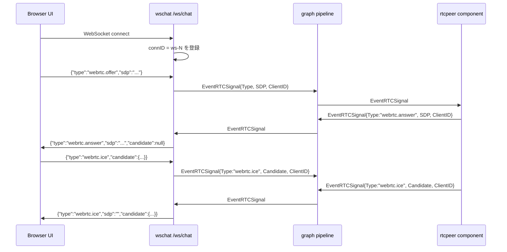
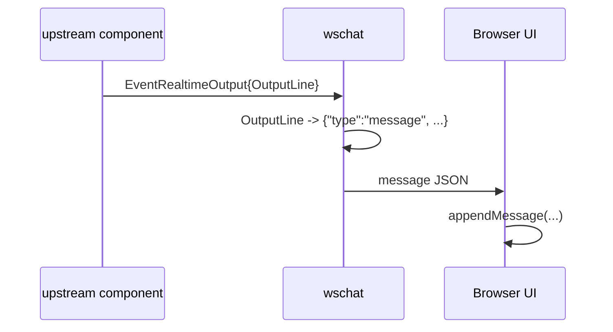
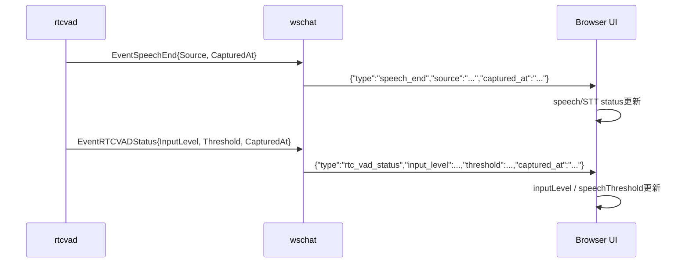
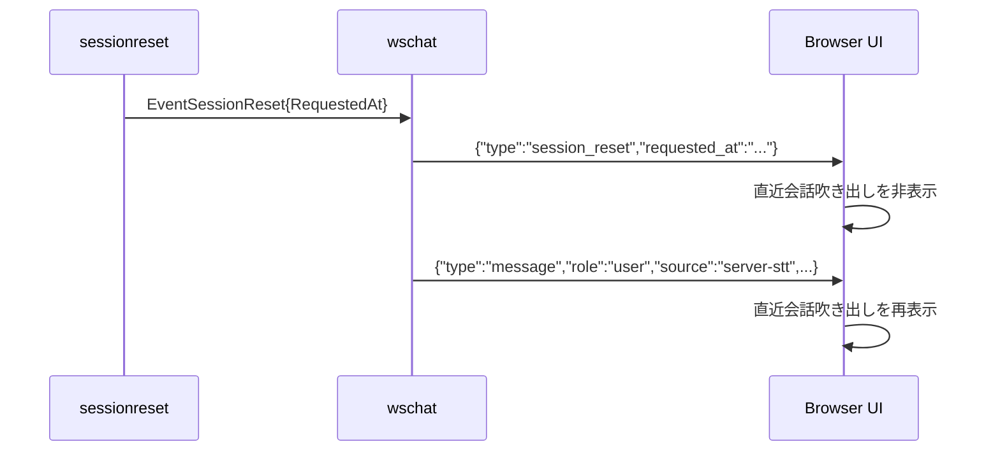
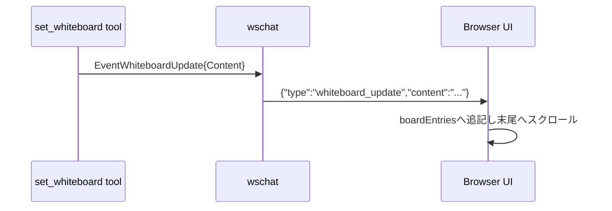

# wschat 概要理解ドキュメント

## 1. ビジネスコンテキスト

- **解決する課題**: ブラウザUIとサーバー内の graph pipeline の間で、チャット表示、WebRTC signaling、発話状態、セッションリセット、ホワイトボード更新を単一の JSON WebSocket 境界でやり取りする。
- **ターゲットユーザー**: 実コードから確認できる直接の利用者は `web/src/main.tsx` のブラウザUI利用者。利用者の業務属性や利用シーンは `internal/components/wschat/` の実装だけからは不明。
- **提供価値**: UIは `/ws/chat` に接続するだけで、会話メッセージ表示、RTC接続確立、VAD状態表示、セッションリセット通知、ホワイトボード表示更新を受け取れる。サーバー側の各 component は `types.Event` を流すだけで、ブラウザ向け JSON 形式を意識しなくてよい。
- **責務の境界**: `wschat` は HTTP WebSocket endpoint とイベント変換を担当する。LLM生成、STT、TTS、RTC media処理、whiteboard content生成は担当しない。
- **参照元**: `internal/components/wschat/wschat.go`, `internal/types/types.go`, `internal/types/event.go`, `web/src/ws.ts`, `web/src/main.tsx`, `internal/components/rtcpeer/signaling.go`, `internal/tools/functions/whiteboard/tool.go`。

## 2. 論理構造・機能俯瞰

**主要なモデル・コンポーネント**

- **`NewStage(mux *http.ServeMux)`**
  - `/ws/chat` を `http.ServeMux` に登録する。
  - `graph.Stage` を返し、`Upstream` から受けた graph event をブラウザへ送信し、ブラウザから受けた WebRTC signaling message を `Downstream` へ流す。
  - `Upstream` / `Downstream` はどちらも `graph.DefaultChannelBufferSize` の channel として作成される。
- **`chatWS`**
  - `upstream` / `downstream` channel、接続管理用の `connHolder`、終了制御用の context / wait group / `sync.Once`、接続ID採番用の counter を持つ。
  - `run` で `consume` goroutine を開始し、`upstream` のイベントを `handleEvent` に渡す。
  - `handleWS` でブラウザからの WebSocket 接続を受け付け、受信JSONを解析する。
- **`connHolder`**
  - `map[string]*websocket.Conn` を `sync.RWMutex` で保護する。
  - 接続追加、削除、単一接続取得、全接続 snapshot、全接続 close を担当する。
  - 接続IDは `ws-1`, `ws-2` のように `chatWS.nextConnID` から採番される。
- **WebSocket 入力**
  - ブラウザからの JSON は `type`, `sdp`, `candidate` だけを読み取る。
  - `type` が `webrtc.` prefix の場合だけ `types.EventRTCSignal` に変換して `downstream` へ送る。
  - `webrtc.` prefix 以外の message は現在の実装では何も処理されない。
- **WebSocket 出力**
  - `EventRealtimeOutput`, `EventRTCSignal`, `EventSpeechEnd`, `EventRTCVADStatus`, `EventWhiteboardUpdate`, `EventSessionReset` をブラウザ向け JSON に変換する。
  - 上記以外の event は無視され、WebSocket には送信されない。
- **チャットUI**
  - `web/src/ws.ts` は WebSocket 接続、JSON parse、JSON stringify送信、close を薄く包む。
  - `web/src/main.tsx` は `message`, `speech_end`, `session_reset`, `rtc_vad_status`, `whiteboard_update`, `webrtc.answer`, `webrtc.ice` を処理する。
  - `tool_call` / `tool_result` は `type: "message"` かつ `role: "tool_call"` / `role: "tool_result"` として UI に流れる。
- **RTC signaling**
  - ブラウザは WebSocket 接続後に `RTCPeerConnection` を作り、`webrtc.offer` と `webrtc.ice` を `/ws/chat` に送る。
  - `wschat` は `ClientID` を付与して `EventRTCSignal` として graph downstream に流す。
  - `internal/components/rtcpeer/signaling.go` は `webrtc.offer`, `webrtc.answer`, `webrtc.ice` を処理し、answerやICE候補を `EventRTCSignal` として emit する。
  - `wschat` は `EventRTCSignal.ClientID` がある場合、その接続IDの WebSocket にだけ signaling 応答を返す。
- **Realtime output**
  - `types.OutputLine` を `type: "message"` の JSON に変換する。
  - `role`, `text`, `response_id`, `final` を常に含め、`source` は空でない場合だけ含める。
  - UIは `role` に応じて user / agent / system message として表示する。`source == "server-stt"` かつ user message の場合は STT状態を完了、発話検知状態を待機中にする。
- **Whiteboard関連events**
  - `internal/tools/functions/whiteboard/tool.go` の `set_whiteboard` tool は `EventWhiteboardUpdate` を emit する。
  - `wschat` は `types.WhiteboardUpdate.Content` を `type: "whiteboard_update", content: ...` に変換する。
  - UIは `content` が空でなければ `boardEntries` の末尾へ追記する。通常画面ではentry間に罫線を表示し、追記時にスクロール位置を末尾へ移動する。
- **Session reset関連events**
  - `sessionreset` は idle timeout による reset 実行後に `EventSessionReset` を emit する。
  - `wschat` は `types.SessionResetEvent.RequestedAt` を `type: "session_reset", requested_at: ...` に変換する。
  - UIは `session_reset` 受信時に通常画面の直近会話吹き出しを非表示にし、次の `source == "server-stt"` かつ user の `message` 受信時に再表示する。

## 3. 主要なデータフロー

### シナリオ: ブラウザが `/ws/chat` に接続し WebRTC signaling を開始する

1. 接続開始: UIの `openConnection` が `createWS(chatWSUrl)` を作り、`/ws/chat` に WebSocket 接続する。
2. 接続受理: `wschat.handleWS` が `websocket.Accept` で接続を受け、`ws-N` 形式の接続IDを採番して `connHolder` に登録する。
3. RTC開始: UIの `startRTC` が `RTCPeerConnection` を作り、マイク音声trackを追加する。
4. offer送信: UIが `peer.createOffer()` と `setLocalDescription` の後、`{ "type": "webrtc.offer", "sdp": ... }` を WebSocket で送る。
5. Event化: `wschat.handleWS` が JSON を parseし、`types.RTCSignal{Type, SDP, Candidate, ClientID}` を `EventRTCSignal` として `downstream` に送る。
6. rtcpeer component処理: `rtc.handleSignal` が `webrtc.offer` を処理し、PeerConnectionを作成して answer を生成する。
7. answer返信: rtcpeer component が `EventRTCSignal{Type: "webrtc.answer", SDP, ClientID}` を emitし、`wschat.handleEvent` が該当 `ClientID` の接続にだけ JSON を返す。
8. ICE交換: ブラウザとrtcpeer componentは `webrtc.ice` を同じ WebSocket message / `EventRTCSignal` 経路で交換する。

### シナリオ: realtime output がチャットUIに表示される

1. 出力発生: upstream側の component が `types.Event{Kind: EventRealtimeOutput, Payload: types.OutputLine{...}}` を `wschat.Upstream` に流す。
2. JSON変換: `wschat.handleEvent` が `OutputLine` を `type: "message"` の JSON に変換する。
3. broadcast: `targetID` は空のため、`connHolder.snapshot()` の全接続に送信される。
4. UI反映: `web/src/main.tsx` の `handleChatMessage` が `message` を受け、roleを user / agent / system に正規化して `appendMessage` する。

### シナリオ: 発話終了とVAD状態がUI状態に反映される

1. 発話終了: upstreamから `EventSpeechEnd` が来ると、`wschat` は `speech_end` JSON を全接続に送る。
2. 発話終了UI: UIは `speechDetectStatus` を `待機中`、`sttStatus` を `最終結果待ち` にする。
3. VAD状態: upstreamから `EventRTCVADStatus` が来ると、`wschat` は `rtc_vad_status` JSON を全接続に送る。
4. VAD状態UI: UIは `input_level` と `threshold` を丸めて state に反映する。

### シナリオ: セッションリセットがUIの吹き出し表示に反映される

1. idle timeout 到達: `sessionreset` が hook、会話履歴 reset、世代id前進を実行する。
2. reset event発行: `sessionreset` が `EventSessionReset{RequestedAt}` を `wschat` へ流す。
3. JSON変換: `wschat.handleEvent` が `session_reset` JSON に変換する。
4. UI反映: UIは通常画面の直近会話吹き出しを非表示にする。
5. 会話再開: 次の `source == "server-stt"` かつ user の `message` 受信時に、UIは吹き出しを再表示する。

### シナリオ: whiteboard tool の更新がUIに表示される

1. tool実行: `set_whiteboard` tool が `content` をtrimし、空でなければ `EventWhiteboardUpdate` を emitする。
2. JSON変換: `wschat.handleEvent` が `types.WhiteboardUpdate.Content` を `whiteboard_update` JSON に変換する。
3. broadcast: `targetID` は空のため、全WebSocket接続に送信される。
4. UI反映: UIは `content` をtrimし、空でなければ `boardEntries` の末尾へ追記する。

## 4. 詳細設計

### クラス設計

- `internal/`
  - `components/`
    - `wschat/`
      - `wschat.go`: `/ws/chat` endpoint と graph stage の境界実装。
        - `NewStage`: WebSocket handlerを登録し、`Upstream`, `Downstream`, `Run`, `CloseFn` を持つ `graph.Stage` を作る。
        - `(*chatWS).run`: contextを保持し、`consume` goroutineを開始する。
        - `(*chatWS).consume`: `upstream` から event を読み続け、`handleEvent` に渡す。
        - `(*chatWS).handleEvent`: graph event をブラウザ向け JSON message に変換する。未対応eventやpayload型不一致は送信せず return する。
        - `(*chatWS).writeMessage`: JSON marshal後、`targetID` があれば該当接続だけに、なければ全接続に送信する。
        - `(*chatWS).handleWS`: WebSocketを受け付け、接続登録、受信JSON parse、`webrtc.*` messageの `EventRTCSignal` 化を行う。
        - `(*chatWS).close`: cancel、goroutine待機、channel close、全WebSocket接続closeを一度だけ実行する。
        - `(*connHolder).add`: 接続IDとWebSocket接続を登録する。
        - `(*connHolder).remove`: 接続をnormal closureで閉じ、mapから削除する。
        - `(*connHolder).get`: 接続IDに対応するWebSocket接続を取得する。
        - `(*connHolder).snapshot`: broadcast用に現在の接続mapをコピーして返す。
        - `(*connHolder).clearAll`: 保持中の全接続をnormal closureで閉じ、mapから削除する。

### API設計

- `GET /ws/chat`: ブラウザUIとの JSON WebSocket endpoint。
  - 接続時の挙動: `websocket.Accept` で接続を受理し、サーバー内部で `ws-N` 形式の `ClientID` を割り当てる。
  - 受信 message: `webrtc.*` prefix の `type` を持つ message だけ downstream に流す。
  - 送信 message: 対応する graph event を JSON に変換して送る。

**ブラウザからサーバーへのmessage**

- `webrtc.offer`: WebRTC offer をrtcpeer componentへ渡す。
  - リクエスト例: `{ "type": "webrtc.offer", "sdp": "..." }`
  - サーバー内部変換: `EventRTCSignal{Type: "webrtc.offer", SDP: "...", ClientID: "ws-N"}`
- `webrtc.ice`: ブラウザ側ICE候補をrtcpeer componentへ渡す。
  - リクエスト例: `{ "type": "webrtc.ice", "candidate": { "candidate": "...", "sdpMid": "0", "sdpMLineIndex": 0 } }`
  - サーバー内部変換: `EventRTCSignal{Type: "webrtc.ice", Candidate: ..., ClientID: "ws-N"}`
- `webrtc.answer`: `wschat` は `webrtc.` prefix として downstream に流せるが、現在のUI実装ではブラウザから送っていない。rtcpeer component側には `handleAnswer` が存在する。

**サーバーからブラウザへのmessage**

- `message`: realtime output をチャットUIへ表示する。
  - 例: `{ "type": "message", "role": "agent", "text": "...", "response_id": "...", "final": true, "source": "..." }`
  - `source` は `OutputLine.Source` が空でない場合だけ含まれる。
- `webrtc.answer`: rtcpeer componentが生成したanswerを、該当 `ClientID` のWebSocketに返す。
  - 例: `{ "type": "webrtc.answer", "sdp": "...", "candidate": null }`
- `webrtc.ice`: rtcpeer componentが生成したICE候補を、該当 `ClientID` のWebSocketに返す。
  - 例: `{ "type": "webrtc.ice", "sdp": "", "candidate": { "candidate": "...", "sdpMid": "0", "sdpMLineIndex": 0 } }`
- `speech_end`: 発話終了をUIへ通知する。
  - 例: `{ "type": "speech_end", "source": "server-vad", "captured_at": "2026-05-22T00:00:00.000000000+09:00" }`
- `rtc_vad_status`: サーバー側VADの入力レベルとしきい値をUIへ通知する。
  - 例: `{ "type": "rtc_vad_status", "input_level": 123, "threshold": 456, "captured_at": "2026-05-22T00:00:00.000000000+09:00" }`
- `whiteboard_update`: ホワイトボード表示内容をUIへ通知する。
  - 例: `{ "type": "whiteboard_update", "content": "..." }`
- `session_reset`: セッションリセット発火をUIへ通知する。
  - 例: `{ "type": "session_reset", "requested_at": "2026-05-27T12:00:00.000000123Z" }`

### イベント変換仕様

| graph event | payload型 | WebSocket type | 宛先 |
| --- | --- | --- | --- |
| `EventRealtimeOutput` | `types.OutputLine` | `message` | 全接続 |
| `EventRTCSignal` | `types.RTCSignal` | `sig.Type` | `sig.ClientID` の接続のみ |
| `EventSpeechEnd` | `types.SpeechEvent` | `speech_end` | 全接続 |
| `EventRTCVADStatus` | `types.RTCVADStatus` | `rtc_vad_status` | 全接続 |
| `EventWhiteboardUpdate` | `types.WhiteboardUpdate` | `whiteboard_update` | 全接続 |
| `EventSessionReset` | `types.SessionResetEvent` | `session_reset` | 全接続 |

### エラー・終了時の挙動

- WebSocket accept に失敗した場合はログを出して終了する。
- WebSocket受信JSONのparseに失敗した場合はログを出し、その接続のread loopは継続する。
- WebSocket read error は normal closure 以外の場合だけログを出し、接続処理を終了する。
- `writeMessage` のJSON marshalに失敗した場合はログを出して送信しない。
- WebSocket write error は現在の実装では戻り値を捨てており、ログや再送は行わない。
- `CloseFn` 実行時は context cancel、`consume` goroutine待機、`upstream` / `downstream` close、全WebSocket接続closeを行う。

### 実装から確認できないこと

- `/ws/chat` の認証・認可、Origin制限、CSRF対策の方針は `wschat.go` からは確認できない。`websocket.AcceptOptions{InsecureSkipVerify: true}` は設定されている。
- message schema のバージョニングや後方互換性ポリシーは確認できない。
- 複数ブラウザ接続時に realtime output / speech / VAD / whiteboard を全接続へbroadcastすることが仕様上の意図か、一時的な実装判断かは不明。
- `tool_call` / `tool_result` は通常 message と同じ経路で扱い、role によって表示ラベルを分ける。
