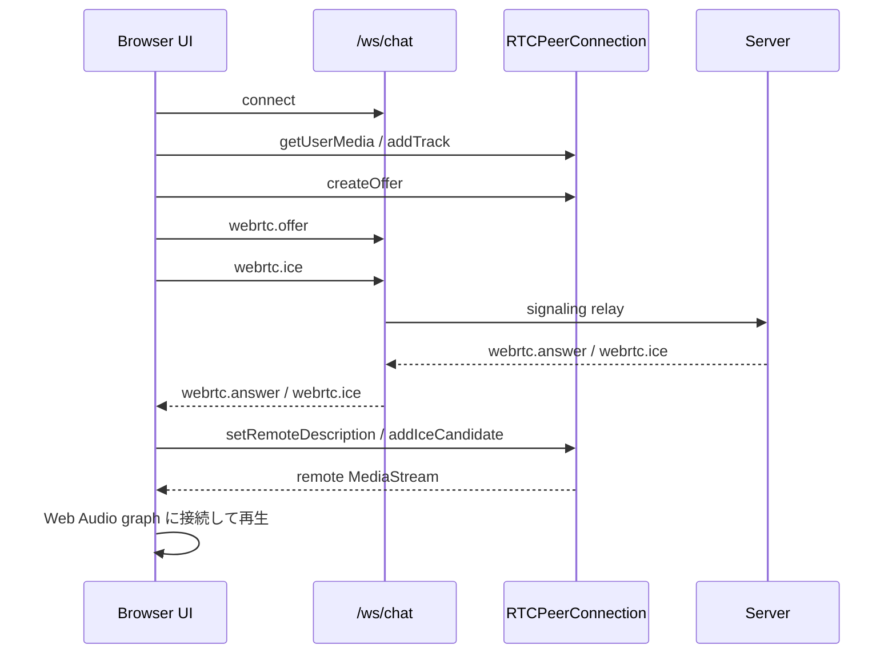

# Web フロントエンド再設計ドキュメント

## 1. 目的と対象範囲
- **目的**: ブラウザからスマートスピーカー体験を扱う Web UI を再設計するために、現行実装で確認できる責務と接続ライフサイクルを整理する。
- **対象範囲**: `web/` 配下の Web UI、通常画面と管理画面、接続開始、WebSocket / WebRTC の接続ライフサイクル、ブラウザ側の主な責務。
- **対象外**: 会話オーケストレーション、TTS / STT の内部処理、サーバー内部の詳細な stage 実装。
- **記述方針**: 確認できた事実のみを書く。不明な点は不明と明記する。

## 2. UI 全体像

### 2.1 配信形態
- Web UI は SPA として配信される。
- ルート配信は `cmd/smart-speaker/main.go` の `registerWebUI` が担当し、`/` は `index.html` を返す。
- `/assets/*` や拡張子付き path は静的ファイルとして扱い、存在しなければ 404 になる。
- `/admin` のような拡張子なし path は SPA fallback で `index.html` を返す。

### 2.2 表示モード
- 現行フロントは 1 つの React アプリで通常画面と管理画面を切り替える構成である。
- 初期モードは URL から決まる。
  - `?ui=admin` または `/admin`: 管理画面
  - それ以外: 通常画面
- 画面切替は `setMode` が `history.pushState` を使って URL を更新し、`popstate` でも復元する。
- 切替時にコンポーネント全体を作り直すのではなく、DOM を残したまま `display` を切り替えている。

### 2.3 通常画面の責務
- 接続トグルを提供する。
- 管理画面への遷移導線を提供する。
- VAD 状態の簡易表示を行う。
  - 入力音量
  - しきい値
- 接続 / マイク / 認識の簡易状態を表示する。
- whiteboard の内容を表示する。
- 直近の user / assistant 発話を表示する。
- 再生音量をスライダーで切り替える。

### 2.4 管理画面の責務
- 接続 / 切断を明示的に操作できる。
- Google OAuth 開始導線を持つ。
- 通常画面への遷移導線を持つ。
- パイプライン状態を詳細表示する。
  - WebRTC 接続
  - マイクストリーム送信
  - サーバー発話検知
  - Google 文字起こし
- 音声エラーと文字起こしエラーを表示する。
- メッセージログを表示する。
  - user / assistant / system
  - function_call
  - function_result

## 3. 接続開始と接続ライフサイクル

### 3.1 接続開始
1. 通常画面または管理画面で接続操作を行う。
2. `connect` が手動切断フラグと再接続カウンタを初期化する。
3. `openConnection(false)` が `/ws/chat` へ WebSocket 接続を開始する。
4. WebSocket 接続成功後、`startRTC` が `RTCPeerConnection` を生成する。
5. ブラウザが `getUserMedia` でマイクを取得し、audio track を PeerConnection に追加する。
6. ブラウザが offer を生成し、WebSocket で `webrtc.offer` を送る。
7. サーバーから `webrtc.answer` を受け、ブラウザが remote description を設定する。
8. 双方向で `webrtc.ice` を交換する。
9. remote track を受けたら、ブラウザは remote stream を Web Audio graph に接続して再生する。

### 3.2 接続中のイベント反映
- `message`
  - `user` / `assistant` / `system` をメッセージ一覧へ追加する。
  - `source: "server-stt"` かつ `role: "user"` の場合は、STT 状態を `完了` に戻す。
- `speech_end`
  - 発話検知を `待機中`、STT を `最終結果待ち` にする。
- `rtc_vad_status`
  - 入力音量としきい値を更新する。
- `whiteboard_update`
  - 空文字でない `content` を whiteboard に反映する。
- `function_call` / `function_result`
  - 管理画面のログ表示に使う。
- `webrtc.answer` / `webrtc.ice`
  - メッセージログには積まず、PeerConnection に反映する。
  - remote description 設定前の ICE は一時キューに保持する。

### 3.3 切断と再接続
- `disconnect` は手動切断として扱われる。
  - 再接続タイマーを止める。
  - RTC 関連リソースを破棄する。
  - WebSocket を閉じる。
- WebSocket が手動切断以外で閉じた場合は自動再接続を試みる。
  - 最大 10 回
  - 初回 1 秒
  - 以後は指数バックオフ
- 再接続時も再度 WebSocket 接続後に `startRTC` をやり直す。

### 3.4 画面切替時の扱い
- 通常画面と管理画面は同じ React state を共有する。
- 画面切替で以下は維持される。
  - WebSocket 接続
  - `RTCPeerConnection`
  - マイク stream
  - remote stream
  - Web Audio graph
  - メッセージ一覧
  - whiteboard
  - 再生音量設定
- このため、現行実装では画面切替は接続ライフサイクルを再開始する契機ではない。

## 4. ブラウザ側の主な責務

### 4.1 接続制御
- `/ws/chat` への接続を開始・終了する。
- WebSocket の open / message / close を扱う。
- `webrtc.offer` / `webrtc.answer` / `webrtc.ice` を送受信する。

### 4.2 音声入出力
- `getUserMedia` でマイクを取得する。
- マイク track を WebRTC uplink としてサーバーへ送る。
- サーバーから来た remote stream を再生する。
- 再生経路は `<audio>` 要素ではなく Web Audio API である。
- `GainNode` で再生音量プリセットを反映する。

### 4.3 UI 状態管理
- 接続状態を保持する。
  - `connected`
  - `busy`
  - `rtcStatus`
  - `audioSendStatus`
- 音声認識関連の状態を保持する。
  - `speechDetectStatus`
  - `sttStatus`
  - `sttError`
  - `inputLevel`
  - `speechThreshold`
- 表示用状態を保持する。
  - `messages`
  - `boardText`
  - `lastUserMessage`
  - `lastAssistantMessage`
  - `playbackVolumeLevel`

### 4.4 URL と表示モード
- URL から表示モードを決定する。
- `pushState` / `popstate` で通常画面と管理画面を切り替える。
- 管理画面表示中のみ `body.admin-mode` を付与する。

### 4.5 PWA 最低限対応
- `manifest.webmanifest` を提供する。
- `serviceWorker` を登録する。
- 現行の service worker は lifecycle 制御のみで、offline cache は持たない。

## 5. 再設計時に崩すと挙動変更になる現行前提
- 通常画面と管理画面は別アプリではなく、同一 state の別表示である。
- 接続制御は WebSocket と WebRTC の二段構えで、WebSocket 接続成功後に WebRTC を開始する。
- whiteboard 更新は通常メッセージとは別イベントで流れる。
- 管理画面は function call / result をそのまま観測できる。
- 再生音量はブラウザ側の `GainNode` で制御している。
- 手動切断と異常切断で再接続ポリシーが異なる。

## 6. 不明点
- 通常画面のキャラクターエリアに最終的に何を表示する想定かは不明。
- 管理画面と通常画面を将来的に完全分離する方針かどうかは不明。
- `audio.ts` を今後も未使用のまま残すのか、削除予定かは不明。
- Google OAuth の認証状態をフロントで常時表示する設計にするかは不明。

## 7. 主な参照元
- `README.md`
- `web/index.html`
- `web/src/main.tsx`
- `web/src/ws.ts`
- `web/src/audio.ts`
- `web/public/manifest.webmanifest`
- `web/public/sw.js`
- `internal/components/wschat/wschat.go`
- `cmd/smart-speaker/main.go`
- `git show HEAD^:docs/4.Webフロントと接続ライフサイクル.md`
