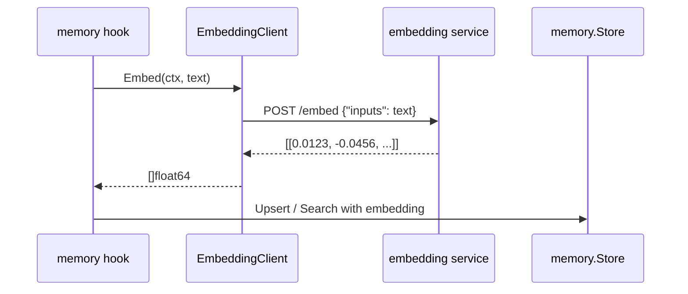

# memory hook 概要理解ドキュメント

## 1. ビジネスコンテキスト

- **解決する課題**: 会話から抽出した長期記憶を、後続の発話や検索に再利用できる土台を用意する
- **ターゲットユーザー**: smart-speaker を利用するユーザーと、メモリ機能を実装・保守する開発者
- **価値定義**: ローカル embedding server と JSON file store を使い、外部 embedding API に依存せずメモリ検索を組み立てられる

## 2. 論理構造・機能俯瞰

**主要なモデル・コンポーネント**

- **`internal/hooks/memory.EmbeddingClient`**
  - Docker Compose 内の `embedding` service に HTTP request を送り、テキストから embedding を取得する
  - 接続先は `http://embedding:80`、モデルは `intfloat/multilingual-e5-small` 固定
  - OpenAI-compatible API ではなく、Hugging Face Text Embeddings Inference のネイティブ `POST /embed` を使う
- **`internal/states/memory.Store`**
  - メモリ本文、タグ、embedding、作成・更新時刻を JSON file に永続化する
  - content 完全一致、タグ集合一致、embedding の cosine similarity で重複を判定する
  - query embedding と保存済み embedding の cosine similarity で検索する
- **`embedding` service**
  - `docker-compose.yml` で起動するローカル embedding server
  - host port は公開せず、Go server から Compose 内部 DNS で接続する

## 3. 主要なデータフロー

### シナリオ: テキストから embedding を取得して Store に保存・検索できる状態にする

1. 入力受付: 後続の memory hook が保存または検索したいテキストを受け取る
2. embedding 生成: `EmbeddingClient` が `POST http://embedding:80/embed` に `{"inputs":"..."}` を送る
3. レスポンス変換: TEI の `number[][]` response の先頭行を `[]float64` として扱う
4. 保存・検索: `memory.Store` が embedding を含む record の upsert、または cosine similarity による search を行う

## 4. 詳細設計

### クラス設計

- `internal/`
  - `hooks/`
    - `memory/`
      - `embedding_client.go`: TEI `/embed` への HTTP 通信と `number[][]` response の変換を担当する
        - `NewEmbeddingClient`: base URL の default 補完と形式検証を行う。生成時の疎通確認はしない
        - `Embed`: 空 text を拒否し、HTTP error や空 embedding を error として返す
  - `states/`
    - `memory/`
      - `store.go`: メモリ record の永続化、重複判定、検索を担当する
        - `Upsert`: content、tags、embedding 類似度で重複を判定して保存する
        - `Search`: query embedding と保存済み embedding の cosine similarity で結果を返す

### API設計

- `POST http://embedding:80/embed`: 単一テキストから embedding vector を取得する
  - リクエスト: `{"inputs":"検索または保存対象のテキスト"}`
  - レスポンス: `[[0.0123, -0.0456, 0.0789]]`

### 現時点の対象外

- メモリ候補生成
- session reset hook での保存
- LLM context への注入
- production graph への接続
